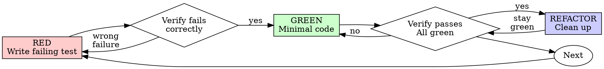

# Test-Driven Development (TDD)

## Overview

Write the test first. Watch it fail. Write minimal code to pass.

**Core principle:** If you didn't watch the test fail, you don't know if it tests the right thing.

**When to use:** Only for complex logic where bugs are likely, or when user explicitly requests tests.

## When to Use

**Use TDD when:**

1. **User explicitly requests tests**
2. **Complex logic where bugs are likely:**
   - Complex algorithms
   - Business logic with edge cases
   - Data transformations
   - Critical paths that could break silently

**Skip TDD for:**

- ❌ UI components (React components, hooks)
- ❌ Simple CRUD operations
- ❌ Straightforward mappings
- ❌ Anything you're 100% certain is correct
- ❌ Throwaway prototypes
- ❌ Configuration files

**Verification alternatives when skipping:**

- Typecheck with `npm run typecheck`
- Lint with `npm run lint`
- Manual testing for UI changes
- Code review confidence

## The Rule (When Using TDD)

```
WHEN WRITING TESTS: NO CODE WITHOUT A FAILING TEST FIRST
```

**When you've decided to use TDD** (complex logic, user request):

Write code before the test? Delete it. Start over.

**No exceptions when using TDD:**

- Don't keep it as "reference"
- Don't "adapt" it while writing tests
- Don't look at it
- Delete means delete

Implement fresh from tests. Period.

**When NOT using TDD** (UI, simple code):

- Write code directly
- Verify with typecheck/lint
- Skip the test

## Red-Green-Refactor



### RED - Write Failing Test

Write one minimal test showing what should happen.

<Good>
```typescript
test('retries failed operations 3 times', async () => {
  let attempts = 0;
  const operation = () => {
    attempts++;
    if (attempts < 3) throw new Error('fail');
    return 'success';
  };

const result = await retryOperation(operation);

expect(result).toBe('success');
expect(attempts).toBe(3);
});

````
Clear name, tests real behavior, one thing
</Good>

<Bad>
```typescript
test('retry works', async () => {
  const mock = jest.fn()
    .mockRejectedValueOnce(new Error())
    .mockRejectedValueOnce(new Error())
    .mockResolvedValueOnce('success');
  await retryOperation(mock);
  expect(mock).toHaveBeenCalledTimes(3);
});
````

Vague name, tests mock not code
</Bad>

**Requirements:**

- One behavior
- Clear name
- Real code (no mocks unless unavoidable)

### Verify RED - Watch It Fail

**MANDATORY. Never skip.**

```bash
npm test path/to/test.test.ts
```

Confirm:

- Test fails (not errors)
- Failure message is expected
- Fails because feature missing (not typos)

**Test passes?** You're testing existing behavior. Fix test.

**Test errors?** Fix error, re-run until it fails correctly.

### GREEN - Minimal Code

Write simplest code to pass the test.

<Good>
```typescript
async function retryOperation<T>(fn: () => Promise<T>): Promise<T> {
  for (let i = 0; i < 3; i++) {
    try {
      return await fn();
    } catch (e) {
      if (i === 2) throw e;
    }
  }
  throw new Error('unreachable');
}
```
Just enough to pass
</Good>

<Bad>
```typescript
async function retryOperation<T>(
  fn: () => Promise<T>,
  options?: {
    maxRetries?: number;
    backoff?: 'linear' | 'exponential';
    onRetry?: (attempt: number) => void;
  }
): Promise<T> {
  // YAGNI
}
```
Over-engineered
</Bad>

Don't add features, refactor other code, or "improve" beyond the test.

### Verify GREEN - Watch It Pass

**MANDATORY.**

```bash
npm test path/to/test.test.ts
```

Confirm:

- Test passes
- Other tests still pass
- Output pristine (no errors, warnings)

**Test fails?** Fix code, not test.

**Other tests fail?** Fix now.

### REFACTOR - Clean Up

After green only:

- Remove duplication
- Improve names
- Extract helpers

Keep tests green. Don't add behavior.

### Repeat

Next failing test for next feature.

## Good Tests

| Quality          | Good                                | Bad                                                 |
| ---------------- | ----------------------------------- | --------------------------------------------------- |
| **Minimal**      | One thing. "and" in name? Split it. | `test('validates email and domain and whitespace')` |
| **Clear**        | Name describes behavior             | `test('test1')`                                     |
| **Shows intent** | Demonstrates desired API            | Obscures what code should do                        |

## Why Order Matters

**"I'll write tests after to verify it works"**

Tests written after code pass immediately. Passing immediately proves nothing:

- Might test wrong thing
- Might test implementation, not behavior
- Might miss edge cases you forgot
- You never saw it catch the bug

Test-first forces you to see the test fail, proving it actually tests something.

**"I already manually tested all the edge cases"**

Manual testing is ad-hoc. You think you tested everything but:

- No record of what you tested
- Can't re-run when code changes
- Easy to forget cases under pressure
- "It worked when I tried it" ≠ comprehensive

Automated tests are systematic. They run the same way every time.

**"Deleting X hours of work is wasteful"**

Sunk cost fallacy. The time is already gone. Your choice now:

- Delete and rewrite with TDD (X more hours, high confidence)
- Keep it and add tests after (30 min, low confidence, likely bugs)

The "waste" is keeping code you can't trust. Working code without real tests is technical debt.

**"TDD is dogmatic, being pragmatic means adapting"**

TDD IS pragmatic:

- Finds bugs before commit (faster than debugging after)
- Prevents regressions (tests catch breaks immediately)
- Documents behavior (tests show how to use code)
- Enables refactoring (change freely, tests catch breaks)

"Pragmatic" shortcuts = debugging in production = slower.

**"Tests after achieve the same goals - it's spirit not ritual"**

No. Tests-after answer "What does this do?" Tests-first answer "What should this do?"

Tests-after are biased by your implementation. You test what you built, not what's required. You verify remembered edge cases, not discovered ones.

Tests-first force edge case discovery before implementing. Tests-after verify you remembered everything (you didn't).

30 minutes of tests after ≠ TDD. You get coverage, lose proof tests work.

## Common Rationalizations (When TDD Applies)

**Valid reasons to skip TDD:**
| Reason | Reality |
| ----------------------------- | ------------------------------------------------------------- |
| "This is a UI component" | ✅ Correct! Verify with typecheck/manual testing, skip tests. |
| "Simple CRUD, 100% confident" | ✅ Correct! Verify with typecheck/lint, skip tests. |
| "Straightforward mapping" | ✅ Correct! If truly simple, skip tests. |

**Invalid rationalizations (for complex logic):**
| Excuse | Reality |
| -------------------------------------- | ----------------------------------------------------------------------- |
| "Too simple to test" | If it's complex logic, test it. If truly simple, skip is fine. |
| "I'll test after" | Tests passing immediately prove nothing. |
| "Tests after achieve same goals" | Tests-after = "what does this do?" Tests-first = "what should this do?" |
| "Already manually tested" | Ad-hoc ≠ systematic. No record, can't re-run. |
| "Deleting X hours is wasteful" | Sunk cost fallacy. Keeping unverified code is technical debt. |
| "Keep as reference, write tests first" | You'll adapt it. That's testing after. Delete means delete. |
| "Need to explore first" | Fine. Throw away exploration, start with TDD. |
| "Test hard = design unclear" | Listen to test. Hard to test = hard to use. |
| "TDD will slow me down" | TDD faster than debugging. Pragmatic = test-first. |
| "Manual test faster" | Manual doesn't prove edge cases. You'll re-test every change. |

## Red Flags - When Using TDD

**These only apply when you've decided to use TDD** (complex logic, user request):

- Code before test
- Test after implementation
- Test passes immediately
- Can't explain why test failed
- Tests added "later"
- "Keep as reference" or "adapt existing code"
- "Already spent X hours, deleting is wasteful"
- "This is different because..."

**All of these mean: Delete code. Start over with TDD.**

**Valid decision to skip TDD:**

- ✅ "This is a UI component" - Skip TDD, verify with typecheck
- ✅ "Simple CRUD, 100% confident" - Skip TDD, verify with lint
- ✅ "Straightforward code" - Skip TDD if truly simple

## Example: Bug Fix

**Bug:** Empty email accepted

**RED**

```typescript
test("rejects empty email", async () => {
  const result = await submitForm({ email: "" });
  expect(result.error).toBe("Email required");
});
```

**Verify RED**

```bash
$ npm test
FAIL: expected 'Email required', got undefined
```

**GREEN**

```typescript
function submitForm(data: FormData) {
  if (!data.email?.trim()) {
    return { error: "Email required" };
  }
  // ...
}
```

**Verify GREEN**

```bash
$ npm test
PASS
```

**REFACTOR**
Extract validation for multiple fields if needed.

## Verification Checklist

**If using TDD** (complex logic, user request):

- [ ] Every new complex function has a test
- [ ] Watched each test fail before implementing
- [ ] Each test failed for expected reason (feature missing, not typo)
- [ ] Wrote minimal code to pass each test
- [ ] All tests pass
- [ ] Output pristine (no errors, warnings)
- [ ] Tests use real code (mocks only if unavoidable)
- [ ] Edge cases and errors covered

Can't check all boxes? You skipped TDD. Start over.

**If NOT using TDD** (UI, simple code):

- [ ] Code is straightforward and you're 100% confident
- [ ] `npm run typecheck` passes
- [ ] `npm run lint` passes
- [ ] Manual testing confirms UI works as expected
- [ ] No complex business logic that needs test coverage

## When Stuck

| Problem                | Solution                                                             |
| ---------------------- | -------------------------------------------------------------------- |
| Don't know how to test | Write wished-for API. Write assertion first. Ask your human partner. |
| Test too complicated   | Design too complicated. Simplify interface.                          |
| Must mock everything   | Code too coupled. Use dependency injection.                          |
| Test setup huge        | Extract helpers. Still complex? Simplify design.                     |

## Debugging Integration

**Bug in complex logic?**
Write failing test reproducing it. Follow TDD cycle. Test proves fix and prevents regression.

**Bug in UI component or simple code?**
Fix directly. Verify with typecheck/lint/manual testing.

**Decision criteria:**

- Complex algorithm/business logic → Write test
- UI component/straightforward fix → Skip test

## Final Rules

**When to use TDD:**

1. **User explicitly requests tests**
2. **Complex logic where bugs are likely** (algorithms, business logic, data transformations)

**When to skip TDD:**

- UI components (React components, hooks)
- Simple CRUD operations
- Straightforward mappings
- Anything you're 100% certain is correct

**If using TDD:**

```
Production code → test exists and failed first
Otherwise → not TDD
```

**If skipping TDD:**

```
Production code → typecheck + lint pass
Manual verification for UI changes
Code review confidence
```

**Only deterministic unit tests** - no integration tests, no complex mocking, no async complexity.
