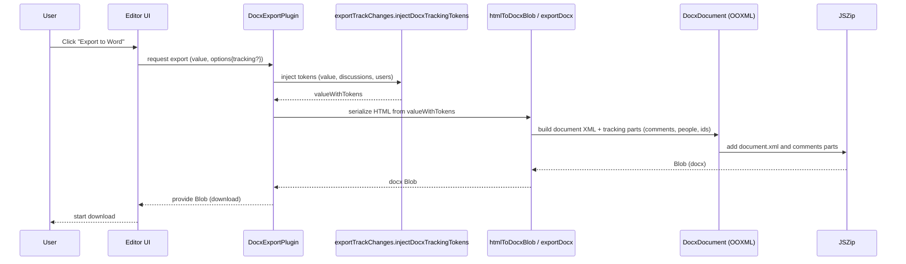

# PR Comments Export

> Exported from [https://github.com/arthrod/plate/pull/114](https://github.com/arthrod/plate/pull/114)  
> 20 of 20 comments selected  
> Generated by [Cicero](https://cicero.im) on 2/21/2026, 10:13:42 PM

---

### coderabbitai[bot] &mdash; 2/21/2026, 9:34:10 PM

> File: `packages/docx-io/ralph.yml`

<details><summary>Code context</summary>

```diff
@@ -0,0 +1,87 @@
+# Research Preset
+#
+# For deep exploration tasks: codebase analysis, architecture review,
+# technology evaluation, competitive analysis.
+#
+# Key behavior: NO code changes, NO commits. Pure information gathering.
+#
+# Usage:
+#   ralph run --config presets/research.yml --prompt "Analyze the authentication flow"
+
```
</details>

_⚠️ Potential issue_ | _🟡 Minor_

**Align the usage path with the actual file location.**

The usage example points to `presets/research.yml`, but this file lives at `packages/docx-io/ralph.yml` in the PR. If the path isn’t intentional (e.g., copied into `presets/` at build time), please update the usage snippet or add a clarifying note.  


<details>
<summary>💡 Suggested clarification</summary>

```diff
-#   ralph run --config presets/research.yml --prompt "Analyze the authentication flow"
+#   ralph run --config packages/docx-io/ralph.yml --prompt "Analyze the authentication flow"
```
</details>

<!-- suggestion_start -->

<details>
<summary>📝 Committable suggestion</summary>

> ‼️ **IMPORTANT**
> Carefully review the code before committing. Ensure that it accurately replaces the highlighted code, contains no missing lines, and has no issues with indentation. Thoroughly test & benchmark the code to ensure it meets the requirements.

```suggestion
# Usage:
#   ralph run --config packages/docx-io/ralph.yml --prompt "Analyze the authentication flow"

```

</details>

<!-- suggestion_end -->

<details>
<summary>🤖 Prompt for AI Agents</summary>

```
Verify each finding against the current code and only fix it if needed.

In `@packages/docx-io/ralph.yml` around lines 8 - 10, The usage example in the
YAML (the "Usage:" snippet referencing presets/research.yml) is incorrect for
this PR; update the usage path in packages/docx-io/ralph.yml so it points to the
actual file location (e.g., packages/docx-io/ralph.yml) or add a short
clarifying note explaining where presets/research.yml is expected to live at
runtime (if it's populated/copied during build). Locate the "Usage:" block in
packages/docx-io/ralph.yml and either replace presets/research.yml with the
correct relative path or append one line explaining the build-time placement.
```

</details>

<!-- fingerprinting:phantom:poseidon:eagle -->

<!-- This is an auto-generated comment by CodeRabbit -->

---

### coderabbitai[bot] &mdash; 2/20/2026, 4:00:33 AM

> File: `packages/docx-io/src/lib/html-to-docx/docx-document.ts`

<details><summary>Code context</summary>

```diff
@@ -957,6 +1067,289 @@ class DocxDocument {
   generateFooterXML(vTree: VTree): Promise<FooterResult> {
     return this.generateSectionXML(vTree, 'footer') as Promise<FooterResult>;
   }
+
+  // ============================================================================
+  // Tracking Support Methods (Comments and Suggestions)
+  // ============================================================================
+
+  /**
+   * Get a revision ID for a suggestion. Creates a new one if needed.
+   * Ensures consistent IDs for the same suggestion across multiple occurrences.
+   */
+  getRevisionId(id?: string): number {
+    if (!id) {
+      this.lastRevisionId += 1;
+      return this.lastRevisionId;
+    }
+
+    const existing = this.revisionIdMap.get(id);
+    if (existing !== undefined) {
+      return existing;
+    }
+
+    this.lastRevisionId += 1;
+    this.revisionIdMap.set(id, this.lastRevisionId);
+    return this.lastRevisionId;
+  }
+
+  /**
+   * Ensure a comment exists in the document and return its numeric ID.
+   * Updates metadata if the comment already exists but had missing fields.
+   */
+  ensureComment(data: Partial<CommentPayload>, parentParaId?: string): number {
+    const { id, authorName, authorInitials, date, text } = data;
+    const commentId =
+      id !== undefined ? id : `comment-${this.lastCommentId + 1}`;
+    let numericId = this.commentIdMap.get(commentId);
+
+    if (numericId === undefined) {
+      this.lastCommentId += 1;
+      numericId = this.lastCommentId;
+      this.commentIdMap.set(commentId, numericId);
+    }
+
+    const existing = this.comments.find((item) => item.id === numericId);
+    if (existing) {
+      // Update missing fields
+      if (!existing.authorName && authorName) {
+        existing.authorName = authorName;
+      }
+      if (!existing.authorInitials && authorInitials) {
+        existing.authorInitials = authorInitials;
+      }
+      if (!existing.date && date) {
+        existing.date = date;
+      }
+      if (!existing.text && text) {
+        existing.text = text;
+      }
+      if (!existing.parentParaId && parentParaId) {
+        existing.parentParaId = parentParaId;
+      }
+      return numericId;
+    }
+
+    // Preserve imported paraId when provided; otherwise generate fresh.
+    // Register in allocatedIds to prevent collisions with generated IDs.
+    let paraId: string;
+    if (data.paraId) {
+      paraId = data.paraId;
+      allocatedIds.add(paraId);
+    } else {
+      paraId = generateHexId();
+    }
+
+    const entry = {
+      id: numericId,
+      authorName: authorName || 'unknown',
+      authorInitials: authorInitials || '',
+      date,
+      durableId: generateHexId(),
+      paraId,
+      parentParaId,
+      text: text || 'Imported comment',
+    };
+    this.comments.push(entry);
+
+    return numericId;
+  }
+
+  /**
+   * Get the numeric ID for a comment, creating it if necessary.
+   */
+  getCommentId(id: string): number {
+    if (id === undefined || id === null) {
+      return this.ensureComment({ id: undefined });
+    }
+    return this.ensureComment({ id });
+  }
+
+  /**
+   * Generate the comments.xml file content.
+   * Matches reference library structure: w14:paraId on paragraphs,
+   * CommentReference style on first run, text runs with formatting.
+   */
+  generateCommentsXML(): string {
+    const w = namespaces.w;
+    const commentsXML = create(COMMENTS_TEMPLATE);
+    const root = commentsXML.root();
+
+    this.comments.forEach((comment) => {
+      const commentElement = root
+        .ele(w, 'comment')
+        .att(w, 'id', String(comment.id))
+        .att(w, 'author', comment.authorName || 'unknown');
+
+      if (comment.authorInitials) {
+        commentElement.att(w, 'initials', comment.authorInitials);
+      }
+      if (comment.date) {
+        commentElement.att(w, 'date', comment.date);
+      }
+
+      // Split multi-line comment text into paragraphs
+      const paragraphs = String(comment.text || '')
+        .split(/\r?\n/)
+        .filter((line, index, arr) => line.length > 0 || arr.length === 1);
+
+      paragraphs.forEach((line, pIdx) => {
+        const pElement = commentElement.ele(w, 'p');
+
+        // Add w14:paraId and w14:textId per OOXML spec
+        pElement.att(namespaces.w14, 'paraId', comment.paraId);
+        pElement.att(namespaces.w14, 'textId', '77777777');
+
+        // Paragraph properties
+        pElement
+          .ele(w, 'pPr')
+          .ele(w, 'pStyle')
+          .att(w, 'val', 'CommentText')
+          .up()
+          .up();
+
+        // First paragraph gets CommentReference run
+        if (pIdx === 0) {
+          const refRun = pElement.ele(w, 'r');
+          refRun
+            .ele(w, 'rPr')
+            .ele(w, 'rStyle')
+            .att(w, 'val', 'CommentReference')
+            .up()
+            .up();
+          refRun.ele(w, 'annotationRef').up();
+          refRun.up();
+        }
+
+        // Text run
+        const textRun = pElement.ele(w, 'r');
+        textRun
+          .ele(w, 'rPr')
+          .ele(w, 'color')
+          .att(w, 'val', '000000')
+          .up()
+          .ele(w, 'sz')
+          .att(w, 'val', '20')
+          .up()
+          .ele(w, 'szCs')
+          .att(w, 'val', '20')
+          .up()
+          .up();
+        textRun
+          .ele(w, 't')
+          .att('http://www.w3.org/XML/1998/namespace', 'space', 'preserve')
+          .txt(line)
+          .up();
+        textRun.up();
+
+        pElement.up();
+      });
+
+      commentElement.up();
+    });
+
+    return commentsXML.end({ prettyPrint: true });
+  }
+
+  /**
+   * Generate word/commentsExtended.xml.
+   * Links comments via paraId and establishes parent-child threading via paraIdParent.
+   */
+  generateCommentsExtendedXML(): string {
+    const doc = create(COMMENTS_EXTENDED_TEMPLATE);
+    const root = doc.root();
+
+    this.comments.forEach((comment) => {
+      const el = root.ele(namespaces.w15, 'commentEx');
+      el.att(namespaces.w15, 'paraId', comment.paraId);
+      el.att(namespaces.w15, 'done', '0');
+      if (comment.parentParaId) {
+        el.att(namespaces.w15, 'paraIdParent', comment.parentParaId);
+      }
+      el.up();
+    });
+
+    return doc.end({ prettyPrint: true });
+  }
+
+  /**
+   * Generate word/commentsIds.xml.
+   * Maps paraId to durableId for each comment.
+   */
+  generateCommentsIdsXML(): string {
+    const doc = create(COMMENTS_IDS_TEMPLATE);
+    const root = doc.root();
+
+    this.comments.forEach((comment) => {
+      const el = root.ele(namespaces.w16cid, 'commentId');
+      el.att(namespaces.w16cid, 'paraId', comment.paraId);
+      el.att(namespaces.w16cid, 'durableId', comment.durableId);
+      el.up();
+    });
+
+    return doc.end({ prettyPrint: true });
+  }
+
+  /**
+   * Generate word/commentsExtensible.xml.
+   * Links durableId to dateUtc for each comment.
+   */
+  generateCommentsExtensibleXML(): string {
+    const doc = create(COMMENTS_EXTENSIBLE_TEMPLATE);
+    const root = doc.root();
+
+    this.comments.forEach((comment) => {
+      const el = root.ele(namespaces.w16cex, 'commentExtensible');
+      el.att(namespaces.w16cex, 'durableId', comment.durableId);
+      if (comment.date) {
+        // comment.date is local time with fake Z (Word convention).
+        // Reverse the fake Z to recover real UTC:
+        //   fakeMs = epoch interpreting local time as UTC
+        //   tzMs   = browser offset (positive = west of UTC)
+        //   real   = fakeMs + tzMs
+        const fakeMs = new Date(comment.date).getTime();
+        const tzMs = new Date().getTimezoneOffset() * 60_000;
+        const realUtc = new Date(fakeMs + tzMs);
+        el.att(
+          namespaces.w16cex,
+          'dateUtc',
+          Number.isNaN(realUtc.getTime()) ? comment.date : realUtc.toISOString()
+        );
```
</details>

_⚠️ Potential issue_ | _🟡 Minor_

**Fix dateUtc conversion to use the comment date’s local offset (DST-safe).**

Using the current timezone offset can shift historical dates when DST differs between comment time and export time. Consider computing the offset based on the comment date itself.  


<details>
<summary>🔧 Suggested adjustment</summary>

```diff
-        const fakeMs = new Date(comment.date).getTime();
-        const tzMs = new Date().getTimezoneOffset() * 60_000;
-        const realUtc = new Date(fakeMs + tzMs);
+        const local = new Date(String(comment.date).replace(/Z$/, ''));
+        const realUtc = new Date(local.getTime());
```
</details>

<details>
<summary>🤖 Prompt for AI Agents</summary>

```
Verify each finding against the current code and only fix it if needed.

In `@packages/docx-io/src/lib/html-to-docx/docx-document.ts` around lines 1304 -
1316, The code uses the current timezone offset (new Date().getTimezoneOffset())
when computing realUtc for comment.date which breaks DST for historical dates;
change tzMs to be based on the comment date's offset by computing const tzMs =
new Date(comment.date).getTimezoneOffset() * 60_000 so fakeMs + tzMs uses the
comment's local offset (keep the existing fakeMs, realUtc and the
el.att(namespaces.w16cex, 'dateUtc', ...) NaN fallback logic intact).
```

</details>

<!-- fingerprinting:phantom:medusa:eagle -->

<!-- This is an auto-generated comment by CodeRabbit -->

---

### coderabbitai[bot] &mdash; 2/20/2026, 4:00:33 AM

> File: `packages/docx-io/src/lib/html-to-docx/schemas/core.ts`

<details><summary>Code context</summary>

```diff
@@ -2,6 +2,17 @@
 import { applicationName } from '../constants';
 import namespaces from '../namespaces';
 
+/** Format a Date as local time with Z suffix (matching Word convention) */
+function toLocalWithZ(d: Date): string {
+  const Y = d.getFullYear();
+  const M = String(d.getMonth() + 1).padStart(2, '0');
+  const D = String(d.getDate()).padStart(2, '0');
+  const h = String(d.getHours()).padStart(2, '0');
+  const m = String(d.getMinutes()).padStart(2, '0');
+  const s = String(d.getSeconds()).padStart(2, '0');
+  return `${Y}-${M}-${D}T${h}:${m}:${s}Z`;
+}
```
</details>

_⚠️ Potential issue_ | _🟠 Major_

**Local time with UTC 'Z' suffix creates timestamp mismatch.**

The function uses local time methods (`getHours()`, `getMinutes()`, etc.) but appends 'Z', which in ISO 8601 signifies UTC. This produces semantically incorrect timestamps—a local time of 10:00 PST would output `...T10:00:00Z`, claiming it's 10:00 UTC (actually 18:00 UTC).

If Word truly expects this non-standard format, add a comment explaining this quirk. Otherwise, either use UTC methods or include a proper timezone offset.


<details>
<summary>🔧 Suggested fix using UTC methods (if standard compliance is intended)</summary>

```diff
 /** Format a Date as local time with Z suffix (matching Word convention) */
-function toLocalWithZ(d: Date): string {
-  const Y = d.getFullYear();
-  const M = String(d.getMonth() + 1).padStart(2, '0');
-  const D = String(d.getDate()).padStart(2, '0');
-  const h = String(d.getHours()).padStart(2, '0');
-  const m = String(d.getMinutes()).padStart(2, '0');
-  const s = String(d.getSeconds()).padStart(2, '0');
+/** Format a Date as UTC time with Z suffix (ISO 8601 compliant) */
+function toUTCWithZ(d: Date): string {
+  const Y = d.getUTCFullYear();
+  const M = String(d.getUTCMonth() + 1).padStart(2, '0');
+  const D = String(d.getUTCDate()).padStart(2, '0');
+  const h = String(d.getUTCHours()).padStart(2, '0');
+  const m = String(d.getUTCMinutes()).padStart(2, '0');
+  const s = String(d.getUTCSeconds()).padStart(2, '0');
   return `${Y}-${M}-${D}T${h}:${m}:${s}Z`;
 }
```

</details>


```web
Does Microsoft Word DOCX dcterms:created expect local time with Z suffix or actual UTC time?
```

<details>
<summary>🤖 Prompt for AI Agents</summary>

```
Verify each finding against the current code and only fix it if needed.

In `@packages/docx-io/src/lib/html-to-docx/schemas/core.ts` around lines 5 - 14,
The toLocalWithZ function builds an ISO timestamp using local getters but
appends 'Z', which falsely claims UTC; fix by replacing local-date getters with
UTC variants (use getUTCFullYear, getUTCMonth+1, getUTCDate, getUTCHours,
getUTCMinutes, getUTCSeconds) inside toLocalWithZ so the rendered string truly
represents UTC, or if the codebase intentionally needs local time with a
trailing 'Z' (Word quirk), add a clear comment in toLocalWithZ explaining this
non‑standard behavior instead of leaving misleading code.
```

</details>

<!-- fingerprinting:phantom:poseidon:ocelot -->

<!-- This is an auto-generated comment by CodeRabbit -->

---

### coderabbitai[bot] &mdash; 2/20/2026, 4:00:32 AM

> File: `apps/www/public/r/import-toolbar-button.json`

<details><summary>Code context</summary>

```diff
@@ -14,7 +14,7 @@
   "files": [
     {
       "path": "src/registry/ui/import-toolbar-button.tsx",
-      "content": "'use client';\n\nimport * as React from 'react';\n\nimport type { DropdownMenuProps } from '@radix-ui/react-dropdown-menu';\n\nimport { importDocx } from '@platejs/docx-io';\nimport { MarkdownPlugin } from '@platejs/markdown';\nimport { ArrowUpToLineIcon } from 'lucide-react';\nimport { getEditorDOMFromHtmlString } from 'platejs/static';\nimport { useEditorRef } from 'platejs/react';\nimport { useFilePicker } from 'use-file-picker';\n\nimport {\n  DropdownMenu,\n  DropdownMenuContent,\n  DropdownMenuGroup,\n  DropdownMenuItem,\n  DropdownMenuTrigger,\n} from '@/components/ui/dropdown-menu';\n\nimport { ToolbarButton } from './toolbar';\n\ntype ImportType = 'html' | 'markdown';\n\nexport function ImportToolbarButton(props: DropdownMenuProps) {\n  const editor = useEditorRef();\n  const [open, setOpen] = React.useState(false);\n\n  const getFileNodes = (text: string, type: ImportType) => {\n    if (type === 'html') {\n      const editorNode = getEditorDOMFromHtmlString(text);\n      const nodes = editor.api.html.deserialize({\n        element: editorNode,\n      });\n\n      return nodes;\n    }\n\n    if (type === 'markdown') {\n      return editor.getApi(MarkdownPlugin).markdown.deserialize(text);\n    }\n\n    return [];\n  };\n\n  const { openFilePicker: openMdFilePicker } = useFilePicker({\n    accept: ['.md', '.mdx'],\n    multiple: false,\n    onFilesSelected: async ({ plainFiles }) => {\n      const text = await plainFiles[0].text();\n\n      const nodes = getFileNodes(text, 'markdown');\n\n      editor.tf.insertNodes(nodes);\n    },\n  });\n\n  const { openFilePicker: openHtmlFilePicker } = useFilePicker({\n    accept: ['text/html'],\n    multiple: false,\n    onFilesSelected: async ({ plainFiles }) => {\n      const text = await plainFiles[0].text();\n\n      const nodes = getFileNodes(text, 'html');\n\n      editor.tf.insertNodes(nodes);\n    },\n  });\n\n  const { openFilePicker: openDocxFilePicker } = useFilePicker({\n    accept: ['.docx'],\n    multiple: false,\n    onFilesSelected: async ({ plainFiles }) => {\n      const arrayBuffer = await plainFiles[0].arrayBuffer();\n      const result = await importDocx(editor, arrayBuffer);\n\n      editor.tf.insertNodes(result.nodes as typeof editor.children);\n    },\n  });\n\n  return (\n    <DropdownMenu open={open} onOpenChange={setOpen} modal={false} {...props}>\n      <DropdownMenuTrigger asChild>\n        <ToolbarButton pressed={open} tooltip=\"Import\" isDropdown>\n          <ArrowUpToLineIcon className=\"size-4\" />\n        </ToolbarButton>\n      </DropdownMenuTrigger>\n\n      <DropdownMenuContent align=\"start\">\n        <DropdownMenuGroup>\n          <DropdownMenuItem\n            onSelect={() => {\n              openHtmlFilePicker();\n            }}\n          >\n            Import from HTML\n          </DropdownMenuItem>\n\n          <DropdownMenuItem\n            onSelect={() => {\n              openMdFilePicker();\n            }}\n          >\n            Import from Markdown\n          </DropdownMenuItem>\n\n          <DropdownMenuItem\n            onSelect={() => {\n              openDocxFilePicker();\n            }}\n          >\n            Import from Word\n          </DropdownMenuItem>\n        </DropdownMenuGroup>\n      </DropdownMenuContent>\n    </DropdownMenu>\n  );\n}\n",
+      "content": "'use client';\n\nimport * as React from 'react';\n\nimport type { DropdownMenuProps } from '@radix-ui/react-dropdown-menu';\n\nimport { getCommentKey } from '@platejs/comment';\nimport { importDocxWithTracking } from '@platejs/docx-io';\nimport { MarkdownPlugin } from '@platejs/markdown';\nimport { getSuggestionKey } from '@platejs/suggestion';\nimport { ArrowUpToLineIcon } from 'lucide-react';\nimport { KEYS, TextApi } from 'platejs';\nimport { useEditorRef } from 'platejs/react';\nimport { getEditorDOMFromHtmlString } from 'platejs/static';\nimport { useFilePicker } from 'use-file-picker';\n\nimport {\n  DropdownMenu,\n  DropdownMenuContent,\n  DropdownMenuGroup,\n  DropdownMenuItem,\n  DropdownMenuTrigger,\n} from '@/components/ui/dropdown-menu';\n\nimport { commentPlugin } from '@/registry/components/editor/plugins/comment-kit';\nimport {\n  discussionPlugin,\n  type TDiscussion,\n} from '@/registry/components/editor/plugins/discussion-kit';\nimport { getDiscussionCounterSeed } from '../lib/discussion-ids';\nimport { ToolbarButton } from './toolbar';\n\ntype ImportType = 'html' | 'markdown';\n\nconst WHITESPACE_REGEX = /\\s+/;\n\nexport function ImportToolbarButton(props: DropdownMenuProps) {\n  const editor = useEditorRef();\n  const [open, setOpen] = React.useState(false);\n\n  const getFileNodes = (text: string, type: ImportType) => {\n    if (type === 'html') {\n      const editorNode = getEditorDOMFromHtmlString(text);\n      const nodes = editor.api.html.deserialize({\n        element: editorNode,\n      });\n\n      return nodes;\n    }\n\n    if (type === 'markdown') {\n      return editor.getApi(MarkdownPlugin).markdown.deserialize(text);\n    }\n\n    return [];\n  };\n\n  const { openFilePicker: openMdFilePicker } = useFilePicker({\n    accept: ['.md', '.mdx'],\n    multiple: false,\n    onFilesSelected: async ({ plainFiles }) => {\n      const text = await plainFiles[0].text();\n\n      const nodes = getFileNodes(text, 'markdown');\n\n      editor.tf.insertNodes(nodes);\n    },\n  });\n\n  const { openFilePicker: openHtmlFilePicker } = useFilePicker({\n    accept: ['text/html'],\n    multiple: false,\n    onFilesSelected: async ({ plainFiles }) => {\n      const text = await plainFiles[0].text();\n\n      const nodes = getFileNodes(text, 'html');\n\n      editor.tf.insertNodes(nodes);\n    },\n  });\n\n  const { openFilePicker: openDocxFilePicker } = useFilePicker({\n    accept: ['.docx'],\n    multiple: false,\n    onFilesSelected: async ({ plainFiles }) => {\n      const arrayBuffer = await plainFiles[0].arrayBuffer();\n\n      // Compute next discussion number to avoid ID collisions\n      const existingDiscussions =\n        editor.getOption(discussionPlugin, 'discussions') ?? [];\n      let discussionCounter = getDiscussionCounterSeed(existingDiscussions);\n\n      // Import with full tracking support (suggestions + comments)\n      const result = await importDocxWithTracking(editor as any, arrayBuffer, {\n        suggestionKey: KEYS.suggestion,\n        getSuggestionKey,\n        commentKey: KEYS.comment,\n        getCommentKey,\n        isText: TextApi.isText,\n        generateId: () => `discussion${++discussionCounter}`,\n      });\n\n      // Register imported users so suggestion/comment UI can resolve them\n      if (result.users.length > 0) {\n        const existingUsers = editor.getOption(discussionPlugin, 'users') ?? {};\n        const updatedUsers = { ...existingUsers };\n\n        for (const user of result.users) {\n          if (!updatedUsers[user.id]) {\n            updatedUsers[user.id] = {\n              id: user.id,\n              name: user.name,\n              avatarUrl: `https://api.dicebear.com/9.x/glass/svg?seed=${encodeURIComponent(user.name)}`,\n            };\n          }\n        }\n\n        editor.setOption(discussionPlugin, 'users', updatedUsers);\n      }\n\n      // Add imported discussions to the discussion plugin\n      if (result.discussions.length > 0) {\n        // Convert imported discussions to TDiscussion format\n        const newDiscussions: TDiscussion[] = result.discussions.map((d) => ({\n          id: d.id,\n          comments: (d.comments ?? []).map((c, index) => ({\n            id: c.id || `comment${index + 1}`,\n            contentRich:\n              c.contentRich as TDiscussion['comments'][number]['contentRich'],\n            createdAt: c.createdAt ?? new Date(),\n            discussionId: d.id,\n            isEdited: false,\n            userId: c.userId ?? c.user?.id ?? 'imported-unknown',\n            authorName: c.user?.name,\n            authorInitials: c.user?.name\n              ? c.user.name\n                  .split(WHITESPACE_REGEX)\n                  .slice(0, 2)\n                  .map((w) => w[0]?.toUpperCase() ?? '')\n                  .join('')\n              : undefined,\n            paraId: c.paraId,\n            parentParaId: c.parentParaId,\n          })),\n          createdAt: d.createdAt ?? new Date(),\n          documentContent: d.documentContent,\n          isResolved: false,\n          userId: d.userId ?? d.user?.id ?? 'imported-unknown',\n          authorName: d.user?.name,\n          authorInitials: d.user?.name\n            ? d.user.name\n                .split(WHITESPACE_REGEX)\n                .slice(0, 2)\n                .map((w) => w[0]?.toUpperCase() ?? '')\n                .join('')\n            : undefined,\n          paraId: d.paraId,\n        }));\n\n        // Replace all discussions (not append) because importDocxWithTracking\n        // replaces the entire editor content, making old discussions stale\n        editor.setOption(discussionPlugin, 'discussions', newDiscussions);\n        editor.setOption(commentPlugin, 'uniquePathMap', new Map());\n      }\n\n      // Log import results in dev only\n      if (\n        result.hasTracking &&\n        result.errors.length > 0 &&\n        process.env.NODE_ENV !== 'production'\n      ) {\n        console.warn('[DOCX Import] Errors:', result.errors);\n      }\n    },\n  });\n\n  return (\n    <DropdownMenu open={open} onOpenChange={setOpen} modal={false} {...props}>\n      <DropdownMenuTrigger asChild>\n        <ToolbarButton pressed={open} tooltip=\"Import\" isDropdown>\n          <ArrowUpToLineIcon className=\"size-4\" />\n        </ToolbarButton>\n      </DropdownMenuTrigger>\n\n      <DropdownMenuContent align=\"start\">\n        <DropdownMenuGroup>\n          <DropdownMenuItem\n            onSelect={() => {\n              openHtmlFilePicker();\n            }}\n          >\n            Import from HTML\n          </DropdownMenuItem>\n\n          <DropdownMenuItem\n            onSelect={() => {\n              openMdFilePicker();\n            }}\n          >\n            Import from Markdown\n          </DropdownMenuItem>\n\n          <DropdownMenuItem\n            onSelect={() => {\n              openDocxFilePicker();\n            }}\n          >\n            Import from Word\n          </DropdownMenuItem>\n        </DropdownMenuGroup>\n      </DropdownMenuContent>\n    </DropdownMenu>\n  );\n}\n",
```
</details>

_⚠️ Potential issue_ | _🟠 Major_

**Clear stale discussions when a DOCX has none.**

`importDocxWithTracking` replaces editor content, but discussions/uniquePathMap are only reset when `result.discussions` has entries. If the imported DOCX has no discussions, previous discussions remain and become orphaned.

<details>
<summary>🛠️ Suggested fix</summary>

```diff
-      if (result.discussions.length > 0) {
-        editor.setOption(discussionPlugin, 'discussions', newDiscussions);
-        editor.setOption(commentPlugin, 'uniquePathMap', new Map());
-      }
+      if (result.discussions.length > 0) {
+        editor.setOption(discussionPlugin, 'discussions', newDiscussions);
+      } else {
+        editor.setOption(discussionPlugin, 'discussions', []);
+      }
+      editor.setOption(commentPlugin, 'uniquePathMap', new Map());
```
</details>

<details>
<summary>🤖 Prompt for AI Agents</summary>

```
Verify each finding against the current code and only fix it if needed.

In `@apps/www/public/r/import-toolbar-button.json` at line 17, In
ImportToolbarButton, the importDocxWithTracking result only clears discussion
state when result.discussions.length > 0, leaving stale discussions when the
import has none; fix by handling the empty case: after receiving result in the
onFilesSelected handler (where result is defined), always call
editor.setOption(discussionPlugin, 'discussions', result.discussions.length ?
mapped TDiscussion[] : []), and also always reset the commentPlugin
uniquePathMap via editor.setOption(commentPlugin, 'uniquePathMap', new Map());
implement this in the same block that currently maps result.discussions to
newDiscussions so stale discussions are cleared even when result.discussions is
empty.
```

</details>

<!-- fingerprinting:phantom:medusa:eagle -->

<!-- This is an auto-generated comment by CodeRabbit -->

---

### coderabbitai[bot] &mdash; 2/20/2026, 4:00:32 AM

> File: `apps/www/src/registry/ui/block-discussion.tsx`

<details><summary>Code context</summary>

```diff
@@ -316,31 +320,45 @@ const useResolvedDiscussion = (
 
   const discussions = usePluginOption(discussionPlugin, 'discussions');
 
+  const getLeafCommentIds = (leaf: TCommentText) =>
+    getCommentKeys(leaf)
+      .map(getCommentKeyId)
+      .filter((id): id is string => Boolean(id) && id !== 'draft');
+
+  const map = getOption('uniquePathMap');
+  const nextMap = new Map(map);
+  let mapChanged = false;
+
   commentNodes.forEach(([node]) => {
-    const id = api.comment.nodeId(node);
-    const map = getOption('uniquePathMap');
+    const ids = getLeafCommentIds(node);
+    if (ids.length === 0) return;
 
-    if (!id) return;
+    ids.forEach((id) => {
+      const previousPath = nextMap.get(id);
 
-    const previousPath = map.get(id);
+      // If there are no comment nodes in the corresponding path in the map, then update it.
+      if (PathApi.isPath(previousPath)) {
+        const nodes = api.comment.node({ id, at: previousPath });
 
-    // If there are no comment nodes in the corresponding path in the map, then update it.
-    if (PathApi.isPath(previousPath)) {
-      const nodes = api.comment.node({ id, at: previousPath });
+        if (!nodes) {
+          nextMap.set(id, blockPath);
+          mapChanged = true;
+        }
 
-      if (!nodes) {
-        setOption('uniquePathMap', new Map(map).set(id, blockPath));
         return;
       }
-
-      return;
-    }
-    // TODO: fix throw error
-    setOption('uniquePathMap', new Map(map).set(id, blockPath));
+      // TODO: fix throw error
+      nextMap.set(id, blockPath);
+      mapChanged = true;
+    });
   });
 
+  if (mapChanged) {
+    setOption('uniquePathMap', nextMap);
+  }
```
</details>

_⚠️ Potential issue_ | _🟠 Major_

**Potential render-loop risk: `setOption` called during render phase.**

Calling `setOption` synchronously inside the component body (not in an effect or callback) can trigger re-renders while rendering, risking infinite loops or React warnings. Although `mapChanged` gates the call, the condition can remain true across renders if the map keeps changing.

Consider moving this state update into a `useEffect` or `useLayoutEffect` to defer the update until after render:

<details>
<summary>Suggested approach</summary>

```diff
+ React.useEffect(() => {
+   if (mapChanged) {
+     setOption('uniquePathMap', nextMap);
+   }
+ }, [mapChanged, nextMap, setOption]);
- if (mapChanged) {
-   setOption('uniquePathMap', nextMap);
- }
```

Note: You'll need to stabilize `nextMap` reference (e.g., via `useMemo`) and ensure `mapChanged` is derived consistently to avoid stale closures.
</details>

<!-- suggestion_start -->

<details>
<summary>📝 Committable suggestion</summary>

> ‼️ **IMPORTANT**
> Carefully review the code before committing. Ensure that it accurately replaces the highlighted code, contains no missing lines, and has no issues with indentation. Thoroughly test & benchmark the code to ensure it meets the requirements.

```suggestion
  React.useEffect(() => {
    if (mapChanged) {
      setOption('uniquePathMap', nextMap);
    }
  }, [mapChanged, nextMap, setOption]);
```

</details>

<!-- suggestion_end -->

<details>
<summary>🤖 Prompt for AI Agents</summary>

```
Verify each finding against the current code and only fix it if needed.

In `@apps/www/src/registry/ui/block-discussion.tsx` around lines 356 - 358, You
are calling setOption('uniquePathMap', nextMap) during render guarded by
mapChanged, which can still cause render-loop warnings; move this update into a
lifecycle hook (useEffect or useLayoutEffect) so it runs after render, derive
mapChanged deterministically, and stabilize nextMap (e.g., compute it with
useMemo or from state) before using it in the effect; update the effect
dependencies to include the stabilized nextMap and mapChanged so the option is
only set when the map truly changes.
```

</details>

<!-- fingerprinting:phantom:medusa:ocelot -->

<!-- This is an auto-generated comment by CodeRabbit -->

---

### coderabbitai[bot] &mdash; 2/20/2026, 4:00:32 AM

> File: `apps/www/src/registry/ui/import-toolbar-button.tsx`

<details><summary>Code context</summary>

```diff
@@ -73,9 +84,93 @@ export function ImportToolbarButton(props: DropdownMenuProps) {
     multiple: false,
     onFilesSelected: async ({ plainFiles }) => {
       const arrayBuffer = await plainFiles[0].arrayBuffer();
-      const result = await importDocx(editor, arrayBuffer);
 
-      editor.tf.insertNodes(result.nodes as typeof editor.children);
+      // Compute next discussion number to avoid ID collisions
+      const existingDiscussions =
+        editor.getOption(discussionPlugin, 'discussions') ?? [];
+      let discussionCounter = getDiscussionCounterSeed(existingDiscussions);
+
+      // Import with full tracking support (suggestions + comments)
+      const result = await importDocxWithTracking(editor as any, arrayBuffer, {
+        suggestionKey: KEYS.suggestion,
+        getSuggestionKey,
+        commentKey: KEYS.comment,
+        getCommentKey,
+        isText: TextApi.isText,
+        generateId: () => `discussion${++discussionCounter}`,
+      });
+
+      // Register imported users so suggestion/comment UI can resolve them
+      if (result.users.length > 0) {
+        const existingUsers = editor.getOption(discussionPlugin, 'users') ?? {};
+        const updatedUsers = { ...existingUsers };
+
+        for (const user of result.users) {
+          if (!updatedUsers[user.id]) {
+            updatedUsers[user.id] = {
+              id: user.id,
+              name: user.name,
+              avatarUrl: `https://api.dicebear.com/9.x/glass/svg?seed=${encodeURIComponent(user.name)}`,
+            };
+          }
+        }
+
+        editor.setOption(discussionPlugin, 'users', updatedUsers);
+      }
+
+      // Add imported discussions to the discussion plugin
+      if (result.discussions.length > 0) {
+        // Convert imported discussions to TDiscussion format
+        const newDiscussions: TDiscussion[] = result.discussions.map((d) => ({
+          id: d.id,
+          comments: (d.comments ?? []).map((c, index) => ({
+            id: c.id || `comment${index + 1}`,
+            contentRich:
+              c.contentRich as TDiscussion['comments'][number]['contentRich'],
+            createdAt: c.createdAt ?? new Date(),
+            discussionId: d.id,
+            isEdited: false,
+            userId: c.userId ?? c.user?.id ?? 'imported-unknown',
+            authorName: c.user?.name,
+            authorInitials: c.user?.name
+              ? c.user.name
+                  .split(WHITESPACE_REGEX)
+                  .slice(0, 2)
+                  .map((w) => w[0]?.toUpperCase() ?? '')
+                  .join('')
+              : undefined,
+            paraId: c.paraId,
+            parentParaId: c.parentParaId,
+          })),
+          createdAt: d.createdAt ?? new Date(),
+          documentContent: d.documentContent,
+          isResolved: false,
+          userId: d.userId ?? d.user?.id ?? 'imported-unknown',
+          authorName: d.user?.name,
+          authorInitials: d.user?.name
+            ? d.user.name
+                .split(WHITESPACE_REGEX)
+                .slice(0, 2)
+                .map((w) => w[0]?.toUpperCase() ?? '')
+                .join('')
+            : undefined,
+          paraId: d.paraId,
+        }));
+
+        // Replace all discussions (not append) because importDocxWithTracking
+        // replaces the entire editor content, making old discussions stale
+        editor.setOption(discussionPlugin, 'discussions', newDiscussions);
+        editor.setOption(commentPlugin, 'uniquePathMap', new Map());
+      }
```
</details>

_⚠️ Potential issue_ | _🟠 Major_

**Clear discussions even when no DOCX discussions are imported.**

Right now the discussion list (and `uniquePathMap`) is only replaced when `result.discussions.length > 0`. If the import replaces editor content (as noted in the comment), importing a DOCX with no discussions will leave stale threads pointing at removed content. Consider always resetting discussions (possibly to `[]`) and `uniquePathMap` after import.


<details>
<summary>🛠️ Suggested fix</summary>

```diff
-      // Add imported discussions to the discussion plugin
-      if (result.discussions.length > 0) {
-        // Convert imported discussions to TDiscussion format
-        const newDiscussions: TDiscussion[] = result.discussions.map((d) => ({
+      // Convert imported discussions to TDiscussion format (empty array if none)
+      const newDiscussions: TDiscussion[] = (result.discussions ?? []).map((d) => ({
           id: d.id,
           comments: (d.comments ?? []).map((c, index) => ({
             id: c.id || `comment${index + 1}`,
             contentRich:
               c.contentRich as TDiscussion['comments'][number]['contentRich'],
             createdAt: c.createdAt ?? new Date(),
             discussionId: d.id,
             isEdited: false,
             userId: c.userId ?? c.user?.id ?? 'imported-unknown',
             authorName: c.user?.name,
             authorInitials: c.user?.name
               ? c.user.name
                   .split(WHITESPACE_REGEX)
                   .slice(0, 2)
                   .map((w) => w[0]?.toUpperCase() ?? '')
                   .join('')
               : undefined,
             paraId: c.paraId,
             parentParaId: c.parentParaId,
           })),
           createdAt: d.createdAt ?? new Date(),
           documentContent: d.documentContent,
           isResolved: false,
           userId: d.userId ?? d.user?.id ?? 'imported-unknown',
           authorName: d.user?.name,
           authorInitials: d.user?.name
             ? d.user.name
                 .split(WHITESPACE_REGEX)
                 .slice(0, 2)
                 .map((w) => w[0]?.toUpperCase() ?? '')
                 .join('')
             : undefined,
           paraId: d.paraId,
-        }));
-
-        // Replace all discussions (not append) because importDocxWithTracking
-        // replaces the entire editor content, making old discussions stale
-        editor.setOption(discussionPlugin, 'discussions', newDiscussions);
-        editor.setOption(commentPlugin, 'uniquePathMap', new Map());
-      }
+        }));
+
+      // Replace all discussions (not append) because importDocxWithTracking
+      // replaces the entire editor content, making old discussions stale
+      editor.setOption(discussionPlugin, 'discussions', newDiscussions);
+      editor.setOption(commentPlugin, 'uniquePathMap', new Map());
```
</details>


```shell
#!/bin/bash
# Locate importDocxWithTracking implementation to confirm replacement semantics
rg -n --glob '*.{ts,tsx}' -C 5 "importDocxWithTracking"
```

<details>
<summary>🤖 Prompt for AI Agents</summary>

```
Verify each finding against the current code and only fix it if needed.

In `@apps/www/src/registry/ui/import-toolbar-button.tsx` around lines 121 - 164,
The code only replaces discussions and uniquePathMap when
result.discussions.length > 0, leaving stale discussions when an import clears
editor content; always reset them after import: after computing newDiscussions
(or when result.discussions is empty) call editor.setOption(discussionPlugin,
'discussions', result.discussions.length ? newDiscussions : []); and always call
editor.setOption(commentPlugin, 'uniquePathMap', new Map()); ensure you
reference the existing symbols (result.discussions, newDiscussions,
editor.setOption, discussionPlugin, commentPlugin, uniquePathMap) so the
discussion list and path map are cleared even when no DOCX discussions are
present.
```

</details>

<!-- fingerprinting:phantom:medusa:eagle -->

<!-- This is an auto-generated comment by CodeRabbit -->

---

### coderabbitai[bot] &mdash; 2/20/2026, 4:00:32 AM

> File: `nixpacks.toml`

<details><summary>Code context</summary>

```diff
@@ -0,0 +1,8 @@
+[phases.install]
+cmds = ['yarn install --mode=skip-build']
+
+[phases.build]
+cmds = ['turbo build', 'turbo deploy']
+
+[start]
+cmd = 'node apps/www/.next/standalone/server.js'
```
</details>

_⚠️ Potential issue_ | _🔴 Critical_

<details>
<summary>🧩 Analysis chain</summary>

🏁 Script executed:

```shell
#!/bin/bash
# Check turbo.json for deploy task and static file handling
echo "=== Checking turbo.json for deploy task ==="
fd -t f "turbo.json" --exec cat {} \;

echo ""
echo "=== Checking apps/www package.json scripts ==="
fd -g "package.json" apps/www --exec cat {} \; 2>/dev/null || echo "Not found with fd, trying direct path"
if [ -f "apps/www/package.json" ]; then
  cat "apps/www/package.json" | jq '.scripts // .build // empty' 2>/dev/null || cat "apps/www/package.json"
fi

echo ""
echo "=== Searching for static file copy or deployment scripts ==="
rg -n 'standalone|static.*copy|cp.*public|cp.*\.next|public.*static' --max-count=20
```

Repository: arthrod/plate

Length of output: 50372

---

🏁 Script executed:

```shell
['NODE_OPTIONS="--max-old-space-size=8192" yarn build', 'mkdir -p apps/www/.next/standalone/apps/www/.next', 'cp -r apps/www/public apps/www/.next/standalone/apps/www/public', 'cp -r apps/www/.next/static apps/www/.next/standalone/apps/www/.next/static']
```

Repository: arthrod/plate

Length of output: 150

---

🏁 Script executed:

```shell
# Let me verify the actual nixpacks.toml file and the correct path structure
echo "=== Current nixpacks.toml ==="
cat nixpacks.toml

echo ""
echo "=== Checking railpack.json for reference on paths ==="
cat railpack.json | grep -A2 "buildCommand"

echo ""
echo "=== Checking if standalone directory structure is apps/www/.next/standalone or nested ==="
# Look for any references to the standalone output path in build scripts
rg "\.next/standalone" --max-count=10
```

Repository: arthrod/plate

Length of output: 1287

---


</details>

**Remove `turbo deploy` command and add static file copying to build phase.**

The `turbo deploy` task does not exist in turbo.json, which will cause the build to fail. Additionally, Next.js standalone mode requires manually copying `public/` and `.next/static/` to the standalone output directory, which is currently missing.

Update the build phase to:

<details>
<summary>nixpacks.toml build configuration</summary>

```toml
[phases.build]
cmds = [
  'NODE_OPTIONS="--max-old-space-size=8192" yarn build',
  'mkdir -p apps/www/.next/standalone/apps/www/.next',
  'cp -r apps/www/public apps/www/.next/standalone/apps/www/public',
  'cp -r apps/www/.next/static apps/www/.next/standalone/apps/www/.next/static'
]
```

Also verify the start command path matches the standalone output structure:

```toml
[start]
cmd = 'node apps/www/.next/standalone/apps/www/server.js'
```

</details>

This aligns with the railpack.json configuration and ensures static assets are served correctly.

<details>
<summary>🤖 Prompt for AI Agents</summary>

```
Verify each finding against the current code and only fix it if needed.

In `@nixpacks.toml` around lines 1 - 8, Remove the non-existent "turbo deploy"
step from the [phases.build] cmds and replace the build commands to run the
actual Next build (use NODE_OPTIONS="--max-old-space-size=8192" yarn build),
then create the standalone directory and copy static assets into the standalone
output (ensure you create apps/www/.next/standalone/apps/www/.next and copy
apps/www/public to apps/www/.next/standalone/apps/www/public and
apps/www/.next/static to apps/www/.next/standalone/apps/www/.next/static). Also
update the [start] cmd to point to the standalone server entry (node
apps/www/.next/standalone/apps/www/server.js) so the runtime uses the standalone
output.
```

</details>

<!-- fingerprinting:phantom:poseidon:ocelot -->

<!-- This is an auto-generated comment by CodeRabbit -->

✅ Addressed in commits a23dde9 to 908dc33

---

### coderabbitai[bot] &mdash; 2/20/2026, 4:00:32 AM

> File: `packages/docx-io/src/lib/applyDocxTracking.spec.ts`

<details><summary>Code context</summary>

```diff
@@ -0,0 +1,1149 @@
+import { describe, expect, it, mock } from 'bun:test';
+
+import {
+  applyAllTracking,
+  applyTrackedComments,
+  applyTrackedCommentsLocal,
+  type DocxImportComment,
+} from './importComments';
+import {
+  applyTrackedChangeSuggestions,
+  type TrackingEditor,
+  type TRange,
+} from './importTrackChanges';
+import type { DocxTrackedChange } from './types';
+
+// Mock editor factory
+function createMockEditor(): TrackingEditor {
+  return {
+    api: {
+      string: mock(() => 'sample text'),
+      rangeRef: (range: TRange) => ({
+        current: range,
+        unref: mock(() => range),
+      }),
+    },
+    tf: {
+      setNodes: mock(() => {}),
+      delete: mock(() => {}),
+      withMerging: mock((fn: () => void) => fn()),
+    },
+    setOption: mock(() => {}),
+  };
+}
+
+// Mock search function that returns predictable ranges
+function createMockSearchRange(
+  tokenMap?: Map<string, TRange | null>
+): (editor: TrackingEditor, search: string) => TRange | null {
+  return (_editor, search) => {
+    if (tokenMap) {
+      return tokenMap.get(search) ?? null;
+    }
+    // Default behavior: return a range for tokens
+    if (search.includes('START') || search.includes('END')) {
+      return {
+        anchor: { path: [0, 0], offset: 0 },
+        focus: { path: [0, 0], offset: search.length },
+      };
+    }
+    return null;
+  };
+}
+
+describe('applyDocxTracking', () => {
+  describe('applyTrackedChangeSuggestions', () => {
+    it('returns zero counts for empty changes', () => {
+      const editor = createMockEditor();
+      const result = applyTrackedChangeSuggestions({
+        editor,
+        changes: [],
+        searchRange: createMockSearchRange(),
+        suggestionKey: 'suggestion',
+        getSuggestionKey: (id) => `suggestion_${id}`,
+        isText: (node) =>
+          typeof (node as Record<string, unknown>).text === 'string',
+      });
+
+      expect(result.insertions).toBe(0);
+      expect(result.deletions).toBe(0);
+      expect(result.total).toBe(0);
+      expect(result.errors).toEqual([]);
+    });
+
+    it('applies insertion suggestion', () => {
+      const editor = createMockEditor();
+      const changes: DocxTrackedChange[] = [
+        {
+          id: 'ins-1',
+          type: 'insert',
+          author: 'John Doe',
+          date: '2024-01-15T12:00:00Z',
+          startToken: '[[START:ins-1]]',
+          endToken: '[[END:ins-1]]',
+        },
+      ];
+
+      const result = applyTrackedChangeSuggestions({
+        editor,
+        changes,
+        searchRange: createMockSearchRange(),
+        suggestionKey: 'suggestion',
+        getSuggestionKey: (id) => `suggestion_${id}`,
+        isText: (node) =>
+          typeof (node as Record<string, unknown>).text === 'string',
+      });
+
+      expect(result.insertions).toBe(1);
+      expect(result.deletions).toBe(0);
+      expect(result.total).toBe(1);
+      expect(editor.tf.setNodes).toHaveBeenCalled();
+    });
+
+    it('applies deletion suggestion', () => {
+      const editor = createMockEditor();
+      const changes: DocxTrackedChange[] = [
+        {
+          id: 'del-1',
+          type: 'remove',
+          author: 'Jane Doe',
+          startToken: '[[START:del-1]]',
+          endToken: '[[END:del-1]]',
+        },
+      ];
+
+      const result = applyTrackedChangeSuggestions({
+        editor,
+        changes,
+        searchRange: createMockSearchRange(),
+        suggestionKey: 'suggestion',
+        getSuggestionKey: (id) => `suggestion_${id}`,
+        isText: (node) =>
+          typeof (node as Record<string, unknown>).text === 'string',
+      });
+
+      expect(result.insertions).toBe(0);
+      expect(result.deletions).toBe(1);
+      expect(result.total).toBe(1);
+    });
+
+    it('handles missing start token', () => {
+      const editor = createMockEditor();
+      const tokenMap = new Map<string, TRange | null>();
+      tokenMap.set('[[START:missing]]', null);
+      tokenMap.set('[[END:missing]]', {
+        anchor: { path: [0, 0], offset: 0 },
+        focus: { path: [0, 0], offset: 10 },
+      });
+
+      const changes: DocxTrackedChange[] = [
+        {
+          id: 'missing',
+          type: 'insert',
+          startToken: '[[START:missing]]',
+          endToken: '[[END:missing]]',
+        },
+      ];
+
+      const result = applyTrackedChangeSuggestions({
+        editor,
+        changes,
+        searchRange: createMockSearchRange(tokenMap),
+        suggestionKey: 'suggestion',
+        getSuggestionKey: (id) => `suggestion_${id}`,
+        isText: (node) =>
+          typeof (node as Record<string, unknown>).text === 'string',
+      });
+
+      expect(result.total).toBe(0);
+      expect(result.errors.length).toBe(1);
+      expect(result.errors[0]).toContain('Missing token');
+    });
+
+    it('handles missing end token', () => {
+      const editor = createMockEditor();
+      const tokenMap = new Map<string, TRange | null>();
+      tokenMap.set('[[START:missing]]', {
+        anchor: { path: [0, 0], offset: 0 },
+        focus: { path: [0, 0], offset: 10 },
+      });
+      tokenMap.set('[[END:missing]]', null);
+
+      const changes: DocxTrackedChange[] = [
+        {
+          id: 'missing',
+          type: 'insert',
+          startToken: '[[START:missing]]',
+          endToken: '[[END:missing]]',
+        },
+      ];
+
+      const result = applyTrackedChangeSuggestions({
+        editor,
+        changes,
+        searchRange: createMockSearchRange(tokenMap),
+        suggestionKey: 'suggestion',
+        getSuggestionKey: (id) => `suggestion_${id}`,
+        isText: (node) =>
+          typeof (node as Record<string, unknown>).text === 'string',
+      });
+
+      expect(result.total).toBe(0);
+      expect(result.errors.length).toBe(1);
+    });
+
+    it('applies multiple changes', () => {
+      const editor = createMockEditor();
+      const changes: DocxTrackedChange[] = [
+        {
+          id: 'change-1',
+          type: 'insert',
+          startToken: '[[START:1]]',
+          endToken: '[[END:1]]',
+        },
+        {
+          id: 'change-2',
+          type: 'remove',
+          startToken: '[[START:2]]',
+          endToken: '[[END:2]]',
+        },
+        {
+          id: 'change-3',
+          type: 'insert',
+          startToken: '[[START:3]]',
+          endToken: '[[END:3]]',
+        },
+      ];
+
+      const result = applyTrackedChangeSuggestions({
+        editor,
+        changes,
+        searchRange: createMockSearchRange(),
+        suggestionKey: 'suggestion',
+        getSuggestionKey: (id) => `suggestion_${id}`,
+        isText: (node) =>
+          typeof (node as Record<string, unknown>).text === 'string',
+      });
+
+      expect(result.insertions).toBe(2);
+      expect(result.deletions).toBe(1);
+      expect(result.total).toBe(3);
+    });
+
+    it('deletes tokens after applying marks', () => {
+      const editor = createMockEditor();
+      const changes: DocxTrackedChange[] = [
+        {
+          id: 'ins-1',
+          type: 'insert',
+          startToken: '[[START:ins-1]]',
+          endToken: '[[END:ins-1]]',
+        },
+      ];
+
+      applyTrackedChangeSuggestions({
+        editor,
+        changes,
+        searchRange: createMockSearchRange(),
+        suggestionKey: 'suggestion',
+        getSuggestionKey: (id) => `suggestion_${id}`,
+        isText: () => true,
+      });
+
+      // Delete should be called twice (start and end tokens)
+      expect(editor.tf.delete).toHaveBeenCalledTimes(2);
+    });
+
+    it('handles invalid rangeRef (null current)', () => {
+      const editor: TrackingEditor = {
+        api: {
+          string: mock(() => 'sample text'),
+          rangeRef: () => ({
+            current: null,
+            unref: mock(() => null),
+          }),
+        },
+        tf: {
+          setNodes: mock(() => {}),
+          delete: mock(() => {}),
+          withMerging: mock((fn: () => void) => fn()),
+        },
+      };
+
+      const changes: DocxTrackedChange[] = [
+        {
+          id: 'change-1',
+          type: 'insert',
+          startToken: '[[START:1]]',
+          endToken: '[[END:1]]',
+        },
+      ];
+
+      const result = applyTrackedChangeSuggestions({
+        editor,
+        changes,
+        searchRange: createMockSearchRange(),
+        suggestionKey: 'suggestion',
+        getSuggestionKey: (id) => `suggestion_${id}`,
+        isText: () => true,
+      });
+
+      expect(result.total).toBe(0);
+      expect(result.errors.length).toBe(1);
+      expect(result.errors[0]).toContain('Invalid range');
+    });
+
+    it('handles exceptions during processing', () => {
+      const editor: TrackingEditor = {
+        api: {
+          string: mock(() => 'sample text'),
+          rangeRef: () => {
+            throw new Error('Test error');
+          },
+        },
+        tf: {
+          setNodes: mock(() => {}),
+          delete: mock(() => {}),
+          withMerging: mock((fn: () => void) => fn()),
+        },
+      };
+
+      const changes: DocxTrackedChange[] = [
+        {
+          id: 'change-1',
+          type: 'insert',
+          startToken: '[[START:1]]',
+          endToken: '[[END:1]]',
+        },
+      ];
+
+      const result = applyTrackedChangeSuggestions({
+        editor,
+        changes,
+        searchRange: createMockSearchRange(),
+        suggestionKey: 'suggestion',
+        getSuggestionKey: (id) => `suggestion_${id}`,
+        isText: () => true,
+      });
+
+      expect(result.total).toBe(0);
+      expect(result.errors.length).toBe(1);
+      expect(result.errors[0]).toContain('Failed to apply change');
+      expect(result.errors[0]).toContain('Test error');
+    });
+
+    it('handles non-Error exceptions', () => {
+      const editor: TrackingEditor = {
+        api: {
+          string: mock(() => 'sample text'),
+          rangeRef: () => {
+            throw new Error('string error');
+          },
+        },
+        tf: {
+          setNodes: mock(() => {}),
+          delete: mock(() => {}),
+          withMerging: mock((fn: () => void) => fn()),
+        },
+      };
+
+      const changes: DocxTrackedChange[] = [
+        {
+          id: 'change-1',
+          type: 'insert',
+          startToken: '[[START:1]]',
+          endToken: '[[END:1]]',
+        },
+      ];
+
+      const result = applyTrackedChangeSuggestions({
+        editor,
+        changes,
+        searchRange: createMockSearchRange(),
+        suggestionKey: 'suggestion',
+        getSuggestionKey: (id) => `suggestion_${id}`,
+        isText: () => true,
+      });
+
+      expect(result.errors[0]).toContain('string error');
+    });
```
</details>

_⚠️ Potential issue_ | _🟡 Minor_

**Test does not exercise non-Error exception path as named.**

The test is named "handles non-Error exceptions" but throws `new Error('string error')`, which is an Error instance. This means the `error instanceof Error ? error.message` branch is taken, not the `String(error)` fallback intended for non-Error exceptions.

To properly test non-Error exceptions, throw a primitive or plain object instead.


<details>
<summary>🐛 Proposed fix</summary>

```diff
       const editor: TrackingEditor = {
         api: {
           string: mock(() => 'sample text'),
           rangeRef: () => {
-            throw new Error('string error');
+            throw 'string error'; // Non-Error exception
           },
         },
         tf: {
           setNodes: mock(() => {}),
           delete: mock(() => {}),
           withMerging: mock((fn: () => void) => fn()),
         },
       };
```
</details>

<!-- suggestion_start -->

<details>
<summary>📝 Committable suggestion</summary>

> ‼️ **IMPORTANT**
> Carefully review the code before committing. Ensure that it accurately replaces the highlighted code, contains no missing lines, and has no issues with indentation. Thoroughly test & benchmark the code to ensure it meets the requirements.

```suggestion
    it('handles non-Error exceptions', () => {
      const editor: TrackingEditor = {
        api: {
          string: mock(() => 'sample text'),
          rangeRef: () => {
            throw 'string error'; // Non-Error exception
          },
        },
        tf: {
          setNodes: mock(() => {}),
          delete: mock(() => {}),
          withMerging: mock((fn: () => void) => fn()),
        },
      };

      const changes: DocxTrackedChange[] = [
        {
          id: 'change-1',
          type: 'insert',
          startToken: '[[START:1]]',
          endToken: '[[END:1]]',
        },
      ];

      const result = applyTrackedChangeSuggestions({
        editor,
        changes,
        searchRange: createMockSearchRange(),
        suggestionKey: 'suggestion',
        getSuggestionKey: (id) => `suggestion_${id}`,
        isText: () => true,
      });

      expect(result.errors[0]).toContain('string error');
    });
```

</details>

<!-- suggestion_end -->

<details>
<summary>🤖 Prompt for AI Agents</summary>

```
Verify each finding against the current code and only fix it if needed.

In `@packages/docx-io/src/lib/applyDocxTracking.spec.ts` around lines 335 - 369,
The test "handles non-Error exceptions" currently throws new Error('string
error') (an Error instance) in the mock rangeRef, so update the mock used in
that test to throw a non-Error value (e.g., throw 'string error' or throw { msg:
'string error' }) so the applyTrackedChangeSuggestions error-handling branch
that falls back to String(error) is exercised; locate the mock rangeRef inside
the test and replace the thrown value accordingly so
expect(result.errors[0]).toContain('string error') still passes.
```

</details>

<!-- fingerprinting:phantom:poseidon:ocelot -->

<!-- This is an auto-generated comment by CodeRabbit -->

---

### coderabbitai[bot] &mdash; 2/20/2026, 4:00:32 AM

> File: `packages/docx-io/src/lib/applyDocxTracking.spec.ts`

<details><summary>Code context</summary>

```diff
@@ -0,0 +1,1149 @@
+import { describe, expect, it, mock } from 'bun:test';
+
+import {
+  applyAllTracking,
+  applyTrackedComments,
+  applyTrackedCommentsLocal,
+  type DocxImportComment,
+} from './importComments';
+import {
+  applyTrackedChangeSuggestions,
+  type TrackingEditor,
+  type TRange,
+} from './importTrackChanges';
+import type { DocxTrackedChange } from './types';
+
+// Mock editor factory
+function createMockEditor(): TrackingEditor {
+  return {
+    api: {
+      string: mock(() => 'sample text'),
+      rangeRef: (range: TRange) => ({
+        current: range,
+        unref: mock(() => range),
+      }),
+    },
+    tf: {
+      setNodes: mock(() => {}),
+      delete: mock(() => {}),
+      withMerging: mock((fn: () => void) => fn()),
+    },
+    setOption: mock(() => {}),
+  };
+}
+
+// Mock search function that returns predictable ranges
+function createMockSearchRange(
+  tokenMap?: Map<string, TRange | null>
+): (editor: TrackingEditor, search: string) => TRange | null {
+  return (_editor, search) => {
+    if (tokenMap) {
+      return tokenMap.get(search) ?? null;
+    }
+    // Default behavior: return a range for tokens
+    if (search.includes('START') || search.includes('END')) {
+      return {
+        anchor: { path: [0, 0], offset: 0 },
+        focus: { path: [0, 0], offset: search.length },
+      };
+    }
+    return null;
+  };
+}
+
+describe('applyDocxTracking', () => {
+  describe('applyTrackedChangeSuggestions', () => {
+    it('returns zero counts for empty changes', () => {
+      const editor = createMockEditor();
+      const result = applyTrackedChangeSuggestions({
+        editor,
+        changes: [],
+        searchRange: createMockSearchRange(),
+        suggestionKey: 'suggestion',
+        getSuggestionKey: (id) => `suggestion_${id}`,
+        isText: (node) =>
+          typeof (node as Record<string, unknown>).text === 'string',
+      });
+
+      expect(result.insertions).toBe(0);
+      expect(result.deletions).toBe(0);
+      expect(result.total).toBe(0);
+      expect(result.errors).toEqual([]);
+    });
+
+    it('applies insertion suggestion', () => {
+      const editor = createMockEditor();
+      const changes: DocxTrackedChange[] = [
+        {
+          id: 'ins-1',
+          type: 'insert',
+          author: 'John Doe',
+          date: '2024-01-15T12:00:00Z',
+          startToken: '[[START:ins-1]]',
+          endToken: '[[END:ins-1]]',
+        },
+      ];
+
+      const result = applyTrackedChangeSuggestions({
+        editor,
+        changes,
+        searchRange: createMockSearchRange(),
+        suggestionKey: 'suggestion',
+        getSuggestionKey: (id) => `suggestion_${id}`,
+        isText: (node) =>
+          typeof (node as Record<string, unknown>).text === 'string',
+      });
+
+      expect(result.insertions).toBe(1);
+      expect(result.deletions).toBe(0);
+      expect(result.total).toBe(1);
+      expect(editor.tf.setNodes).toHaveBeenCalled();
+    });
+
+    it('applies deletion suggestion', () => {
+      const editor = createMockEditor();
+      const changes: DocxTrackedChange[] = [
+        {
+          id: 'del-1',
+          type: 'remove',
+          author: 'Jane Doe',
+          startToken: '[[START:del-1]]',
+          endToken: '[[END:del-1]]',
+        },
+      ];
+
+      const result = applyTrackedChangeSuggestions({
+        editor,
+        changes,
+        searchRange: createMockSearchRange(),
+        suggestionKey: 'suggestion',
+        getSuggestionKey: (id) => `suggestion_${id}`,
+        isText: (node) =>
+          typeof (node as Record<string, unknown>).text === 'string',
+      });
+
+      expect(result.insertions).toBe(0);
+      expect(result.deletions).toBe(1);
+      expect(result.total).toBe(1);
+    });
+
+    it('handles missing start token', () => {
+      const editor = createMockEditor();
+      const tokenMap = new Map<string, TRange | null>();
+      tokenMap.set('[[START:missing]]', null);
+      tokenMap.set('[[END:missing]]', {
+        anchor: { path: [0, 0], offset: 0 },
+        focus: { path: [0, 0], offset: 10 },
+      });
+
+      const changes: DocxTrackedChange[] = [
+        {
+          id: 'missing',
+          type: 'insert',
+          startToken: '[[START:missing]]',
+          endToken: '[[END:missing]]',
+        },
+      ];
+
+      const result = applyTrackedChangeSuggestions({
+        editor,
+        changes,
+        searchRange: createMockSearchRange(tokenMap),
+        suggestionKey: 'suggestion',
+        getSuggestionKey: (id) => `suggestion_${id}`,
+        isText: (node) =>
+          typeof (node as Record<string, unknown>).text === 'string',
+      });
+
+      expect(result.total).toBe(0);
+      expect(result.errors.length).toBe(1);
+      expect(result.errors[0]).toContain('Missing token');
+    });
+
+    it('handles missing end token', () => {
+      const editor = createMockEditor();
+      const tokenMap = new Map<string, TRange | null>();
+      tokenMap.set('[[START:missing]]', {
+        anchor: { path: [0, 0], offset: 0 },
+        focus: { path: [0, 0], offset: 10 },
+      });
+      tokenMap.set('[[END:missing]]', null);
+
+      const changes: DocxTrackedChange[] = [
+        {
+          id: 'missing',
+          type: 'insert',
+          startToken: '[[START:missing]]',
+          endToken: '[[END:missing]]',
+        },
+      ];
+
+      const result = applyTrackedChangeSuggestions({
+        editor,
+        changes,
+        searchRange: createMockSearchRange(tokenMap),
+        suggestionKey: 'suggestion',
+        getSuggestionKey: (id) => `suggestion_${id}`,
+        isText: (node) =>
+          typeof (node as Record<string, unknown>).text === 'string',
+      });
+
+      expect(result.total).toBe(0);
+      expect(result.errors.length).toBe(1);
+    });
+
+    it('applies multiple changes', () => {
+      const editor = createMockEditor();
+      const changes: DocxTrackedChange[] = [
+        {
+          id: 'change-1',
+          type: 'insert',
+          startToken: '[[START:1]]',
+          endToken: '[[END:1]]',
+        },
+        {
+          id: 'change-2',
+          type: 'remove',
+          startToken: '[[START:2]]',
+          endToken: '[[END:2]]',
+        },
+        {
+          id: 'change-3',
+          type: 'insert',
+          startToken: '[[START:3]]',
+          endToken: '[[END:3]]',
+        },
+      ];
+
+      const result = applyTrackedChangeSuggestions({
+        editor,
+        changes,
+        searchRange: createMockSearchRange(),
+        suggestionKey: 'suggestion',
+        getSuggestionKey: (id) => `suggestion_${id}`,
+        isText: (node) =>
+          typeof (node as Record<string, unknown>).text === 'string',
+      });
+
+      expect(result.insertions).toBe(2);
+      expect(result.deletions).toBe(1);
+      expect(result.total).toBe(3);
+    });
+
+    it('deletes tokens after applying marks', () => {
+      const editor = createMockEditor();
+      const changes: DocxTrackedChange[] = [
+        {
+          id: 'ins-1',
+          type: 'insert',
+          startToken: '[[START:ins-1]]',
+          endToken: '[[END:ins-1]]',
+        },
+      ];
+
+      applyTrackedChangeSuggestions({
+        editor,
+        changes,
+        searchRange: createMockSearchRange(),
+        suggestionKey: 'suggestion',
+        getSuggestionKey: (id) => `suggestion_${id}`,
+        isText: () => true,
+      });
+
+      // Delete should be called twice (start and end tokens)
+      expect(editor.tf.delete).toHaveBeenCalledTimes(2);
+    });
+
+    it('handles invalid rangeRef (null current)', () => {
+      const editor: TrackingEditor = {
+        api: {
+          string: mock(() => 'sample text'),
+          rangeRef: () => ({
+            current: null,
+            unref: mock(() => null),
+          }),
+        },
+        tf: {
+          setNodes: mock(() => {}),
+          delete: mock(() => {}),
+          withMerging: mock((fn: () => void) => fn()),
+        },
+      };
+
+      const changes: DocxTrackedChange[] = [
+        {
+          id: 'change-1',
+          type: 'insert',
+          startToken: '[[START:1]]',
+          endToken: '[[END:1]]',
+        },
+      ];
+
+      const result = applyTrackedChangeSuggestions({
+        editor,
+        changes,
+        searchRange: createMockSearchRange(),
+        suggestionKey: 'suggestion',
+        getSuggestionKey: (id) => `suggestion_${id}`,
+        isText: () => true,
+      });
+
+      expect(result.total).toBe(0);
+      expect(result.errors.length).toBe(1);
+      expect(result.errors[0]).toContain('Invalid range');
+    });
+
+    it('handles exceptions during processing', () => {
+      const editor: TrackingEditor = {
+        api: {
+          string: mock(() => 'sample text'),
+          rangeRef: () => {
+            throw new Error('Test error');
+          },
+        },
+        tf: {
+          setNodes: mock(() => {}),
+          delete: mock(() => {}),
+          withMerging: mock((fn: () => void) => fn()),
+        },
+      };
+
+      const changes: DocxTrackedChange[] = [
+        {
+          id: 'change-1',
+          type: 'insert',
+          startToken: '[[START:1]]',
+          endToken: '[[END:1]]',
+        },
+      ];
+
+      const result = applyTrackedChangeSuggestions({
+        editor,
+        changes,
+        searchRange: createMockSearchRange(),
+        suggestionKey: 'suggestion',
+        getSuggestionKey: (id) => `suggestion_${id}`,
+        isText: () => true,
+      });
+
+      expect(result.total).toBe(0);
+      expect(result.errors.length).toBe(1);
+      expect(result.errors[0]).toContain('Failed to apply change');
+      expect(result.errors[0]).toContain('Test error');
+    });
+
+    it('handles non-Error exceptions', () => {
+      const editor: TrackingEditor = {
+        api: {
+          string: mock(() => 'sample text'),
+          rangeRef: () => {
+            throw new Error('string error');
+          },
+        },
+        tf: {
+          setNodes: mock(() => {}),
+          delete: mock(() => {}),
+          withMerging: mock((fn: () => void) => fn()),
+        },
+      };
+
+      const changes: DocxTrackedChange[] = [
+        {
+          id: 'change-1',
+          type: 'insert',
+          startToken: '[[START:1]]',
+          endToken: '[[END:1]]',
+        },
+      ];
+
+      const result = applyTrackedChangeSuggestions({
+        editor,
+        changes,
+        searchRange: createMockSearchRange(),
+        suggestionKey: 'suggestion',
+        getSuggestionKey: (id) => `suggestion_${id}`,
+        isText: () => true,
+      });
+
+      expect(result.errors[0]).toContain('string error');
+    });
+
+    it('handles missing author (uses default)', () => {
+      const editor = createMockEditor();
+      const changes: DocxTrackedChange[] = [
+        {
+          id: 'change-1',
+          type: 'insert',
+          author: undefined,
+          startToken: '[[START:1]]',
+          endToken: '[[END:1]]',
+        },
+      ];
+
+      const result = applyTrackedChangeSuggestions({
+        editor,
+        changes,
+        searchRange: createMockSearchRange(),
+        suggestionKey: 'suggestion',
+        getSuggestionKey: (id) => `suggestion_${id}`,
+        isText: () => true,
+      });
+
+      expect(result.total).toBe(1);
+    });
+
+    it('handles invalid date (uses current time)', () => {
+      const editor = createMockEditor();
+      const changes: DocxTrackedChange[] = [
+        {
+          id: 'change-1',
+          type: 'insert',
+          date: 'invalid-date',
+          startToken: '[[START:1]]',
+          endToken: '[[END:1]]',
+        },
+      ];
+
+      const result = applyTrackedChangeSuggestions({
+        editor,
+        changes,
+        searchRange: createMockSearchRange(),
+        suggestionKey: 'suggestion',
+        getSuggestionKey: (id) => `suggestion_${id}`,
+        isText: () => true,
+      });
+
+      expect(result.total).toBe(1);
+    });
+  });
+
+  describe('applyTrackedComments', () => {
+    it('returns zero counts for empty comments', async () => {
+      const editor = createMockEditor();
+      const result = await applyTrackedComments({
+        editor,
+        comments: [],
+        searchRange: createMockSearchRange(),
+        documentId: 'doc-1',
+        createDiscussionWithComment: {
+          mutateAsync: mock(async () => ({ id: 'disc-1' })),
+        },
+        commentKey: 'comment',
+        getCommentKey: (id) => `comment_${id}`,
+        isText: () => true,
+      });
+
+      expect(result.created).toBe(0);
+      expect(result.skipped).toBe(0);
+      expect(result.errors).toEqual([]);
+    });
+
+    it('creates comment for valid tokens', async () => {
+      const editor = createMockEditor();
+      const createDiscussion = mock(async () => ({ id: 'disc-new' }));
+
+      const comments: DocxImportComment[] = [
+        {
+          id: 'cmt-1',
+          text: 'Test comment',
+          startToken: '[[CMT_START:1]]',
+          endToken: '[[CMT_END:1]]',
+          hasStartToken: true,
+          hasEndToken: true,
+        },
+      ];
+
+      const result = await applyTrackedComments({
+        editor,
+        comments,
+        searchRange: createMockSearchRange(),
+        documentId: 'doc-1',
+        createDiscussionWithComment: { mutateAsync: createDiscussion },
+        commentKey: 'comment',
+        getCommentKey: (id) => `comment_${id}`,
+        isText: () => true,
+      });
+
+      expect(result.created).toBe(1);
+      expect(result.skipped).toBe(0);
+      expect(createDiscussion).toHaveBeenCalledWith(
+        expect.objectContaining({
+          documentId: 'doc-1',
+        })
+      );
+    });
+
+    it('handles null ranges during cleanup', async () => {
+      const refs: Array<{
+        current: TRange | null;
+        unref: () => TRange | null;
+      }> = [];
+      const editor: TrackingEditor = {
+        api: {
+          string: mock(() => 'sample text'),
+          rangeRef: (range: TRange) => {
+            const ref = { current: range, unref: mock(() => range) };
+            refs.push(ref);
+            return ref;
+          },
+        },
+        tf: {
+          setNodes: mock(() => {}),
+          delete: mock(() => {}),
+          withMerging: mock((fn: () => void) => {
+            fn();
+            refs.forEach((ref) => {
+              ref.current = null;
+            });
+          }),
+        },
+        setOption: mock(() => {}),
+      };
+
+      const comments: DocxImportComment[] = [
+        {
+          id: 'cmt-1',
+          text: 'Test comment',
+          startToken: '[[CMT_START:1]]',
+          endToken: '[[CMT_END:1]]',
+          hasStartToken: true,
+          hasEndToken: true,
+        },
+      ];
+
+      const result = await applyTrackedComments({
+        editor,
+        comments,
+        searchRange: createMockSearchRange(),
+        documentId: 'doc-1',
+        createDiscussionWithComment: {
+          mutateAsync: mock(async () => ({ id: 'disc-1' })),
+        },
+        commentKey: 'comment',
+        getCommentKey: (id) => `comment_${id}`,
+        isText: () => true,
+      });
+
+      expect(result.created).toBe(1);
+      expect(result.errors).toEqual([]);
+      expect(editor.tf.setNodes).toHaveBeenCalled();
+      expect(editor.tf.delete).not.toHaveBeenCalled();
+    });
+
+    it('skips comment with no tokens found', async () => {
+      const editor = createMockEditor();
+      const tokenMap = new Map<string, TRange | null>();
+      tokenMap.set('[[CMT_START:1]]', null);
+      tokenMap.set('[[CMT_END:1]]', null);
+
+      const comments: DocxImportComment[] = [
+        {
+          id: 'cmt-1',
+          text: 'Test comment',
+          startToken: '[[CMT_START:1]]',
+          endToken: '[[CMT_END:1]]',
+          hasStartToken: true,
+          hasEndToken: true,
+        },
+      ];
+
+      const result = await applyTrackedComments({
+        editor,
+        comments,
+        searchRange: createMockSearchRange(tokenMap),
+        documentId: 'doc-1',
+        createDiscussionWithComment: {
+          mutateAsync: mock(async () => ({ id: 'disc-1' })),
+        },
+        commentKey: 'comment',
+        getCommentKey: (id) => `comment_${id}`,
+        isText: () => true,
+      });
+
+      expect(result.created).toBe(0);
+      expect(result.skipped).toBe(1);
+    });
+
+    it('creates point comment when only start token found', async () => {
+      const editor = createMockEditor();
+      const tokenMap = new Map<string, TRange | null>();
+      tokenMap.set('[[CMT_START:1]]', {
+        anchor: { path: [0, 0], offset: 0 },
+        focus: { path: [0, 0], offset: 10 },
+      });
+      tokenMap.set('[[CMT_END:1]]', null);
+
+      const comments: DocxImportComment[] = [
+        {
+          id: 'cmt-1',
+          text: 'Point comment',
+          startToken: '[[CMT_START:1]]',
+          endToken: '[[CMT_END:1]]',
+          hasStartToken: true,
+          hasEndToken: false, // Indicates end token not in original HTML
+        },
+      ];
+
+      const createDiscussion = mock(async () => ({ id: 'disc-point' }));
+
+      const result = await applyTrackedComments({
+        editor,
+        comments,
+        searchRange: createMockSearchRange(tokenMap),
+        documentId: 'doc-1',
+        createDiscussionWithComment: { mutateAsync: createDiscussion },
+        commentKey: 'comment',
+        getCommentKey: (id) => `comment_${id}`,
+        isText: () => true,
+      });
+
+      expect(result.created).toBe(1);
+    });
+
+    it('applies transient comment key when provided', async () => {
+      const editor = createMockEditor();
+      const comments: DocxImportComment[] = [
+        {
+          id: 'cmt-1',
+          text: 'Test',
+          startToken: '[[CMT_START:1]]',
+          endToken: '[[CMT_END:1]]',
+          hasStartToken: true,
+          hasEndToken: true,
+        },
+      ];
+
+      await applyTrackedComments({
+        editor,
+        comments,
+        searchRange: createMockSearchRange(),
+        documentId: 'doc-1',
+        createDiscussionWithComment: {
+          mutateAsync: mock(async () => ({ id: 'disc-1' })),
+        },
+        commentKey: 'comment',
+        getCommentKey: (id) => `comment_${id}`,
+        getTransientCommentKey: () => 'transient_comment',
+        isText: () => true,
+      });
+
+      expect(editor.tf.setNodes).toHaveBeenCalledWith(
+        expect.objectContaining({
+          transient_comment: true,
+        }),
+        expect.any(Object)
+      );
+    });
+
+    it('calls onCommentsCreated callback when comments are created', async () => {
+      const editor = createMockEditor();
+      const onCommentsCreated = mock(() => {});
+
+      const comments: DocxImportComment[] = [
+        {
+          id: 'cmt-1',
+          text: 'Test',
+          startToken: '[[CMT_START:1]]',
+          endToken: '[[CMT_END:1]]',
+          hasStartToken: true,
+          hasEndToken: true,
+        },
+      ];
+
+      await applyTrackedComments({
+        editor,
+        comments,
+        searchRange: createMockSearchRange(),
+        documentId: 'doc-1',
+        createDiscussionWithComment: {
+          mutateAsync: mock(async () => ({ id: 'disc-1' })),
+        },
+        commentKey: 'comment',
+        getCommentKey: (id) => `comment_${id}`,
+        isText: () => true,
+        onCommentsCreated,
+      });
+
+      expect(onCommentsCreated).toHaveBeenCalledTimes(1);
+    });
+
+    it('does not call onCommentsCreated when no comments created', async () => {
+      const editor = createMockEditor();
+      const onCommentsCreated = mock(() => {});
+
+      const tokenMap = new Map<string, TRange | null>();
+      tokenMap.set('[[CMT_START:1]]', null);
+      tokenMap.set('[[CMT_END:1]]', null);
+
+      const comments: DocxImportComment[] = [
+        {
+          id: 'cmt-1',
+          text: 'Test',
+          startToken: '[[CMT_START:1]]',
+          endToken: '[[CMT_END:1]]',
+          hasStartToken: true,
+          hasEndToken: true,
+        },
+      ];
+
+      await applyTrackedComments({
+        editor,
+        comments,
+        searchRange: createMockSearchRange(tokenMap),
+        documentId: 'doc-1',
+        createDiscussionWithComment: {
+          mutateAsync: mock(async () => ({ id: 'disc-1' })),
+        },
+        commentKey: 'comment',
+        getCommentKey: (id) => `comment_${id}`,
+        isText: () => true,
+        onCommentsCreated,
+      });
+
+      expect(onCommentsCreated).not.toHaveBeenCalled();
+    });
+
+    it('handles invalid rangeRef (null current) for comments', async () => {
+      const editor: TrackingEditor = {
+        api: {
+          string: mock(() => 'sample text'),
+          rangeRef: () => ({
+            current: null,
+            unref: mock(() => null),
+          }),
+        },
+        tf: {
+          setNodes: mock(() => {}),
+          delete: mock(() => {}),
+          withMerging: mock((fn: () => void) => fn()),
+        },
+      };
+
+      const comments: DocxImportComment[] = [
+        {
+          id: 'cmt-1',
+          text: 'Test',
+          startToken: '[[CMT_START:1]]',
+          endToken: '[[CMT_END:1]]',
+          hasStartToken: true,
+          hasEndToken: true,
+        },
+      ];
+
+      const result = await applyTrackedComments({
+        editor,
+        comments,
+        searchRange: createMockSearchRange(),
+        documentId: 'doc-1',
+        createDiscussionWithComment: {
+          mutateAsync: mock(async () => ({ id: 'disc-1' })),
+        },
+        commentKey: 'comment',
+        getCommentKey: (id) => `comment_${id}`,
+        isText: () => true,
+      });
+
+      expect(result.created).toBe(0);
+      expect(result.skipped).toBe(1);
+    });
+
+    it('handles empty document content (uses default)', async () => {
+      const editor: TrackingEditor = {
+        api: {
+          string: mock(() => ''), // Returns empty string
+          rangeRef: (range: TRange) => ({
+            current: range,
+            unref: mock(() => range),
+          }),
+        },
+        tf: {
+          setNodes: mock(() => {}),
+          delete: mock(() => {}),
+          withMerging: mock((fn: () => void) => fn()),
+        },
+      };
+
+      const createDiscussion = mock(async () => ({ id: 'disc-1' }));
+
+      const comments: DocxImportComment[] = [
+        {
+          id: 'cmt-1',
+          text: 'Test comment',
+          startToken: '[[CMT_START:1]]',
+          endToken: '[[CMT_END:1]]',
+          hasStartToken: true,
+          hasEndToken: true,
+        },
+      ];
+
+      await applyTrackedComments({
+        editor,
+        comments,
+        searchRange: createMockSearchRange(),
+        documentId: 'doc-1',
+        createDiscussionWithComment: { mutateAsync: createDiscussion },
+        commentKey: 'comment',
+        getCommentKey: (id) => `comment_${id}`,
+        isText: () => true,
+      });
+
+      expect(createDiscussion).toHaveBeenCalledWith(
+        expect.objectContaining({
+          documentContent: 'Imported comment',
+        })
+      );
+    });
+
+    it('handles comment with commentPlugin and setOption', async () => {
+      const editor = createMockEditor();
+      const commentPlugin = { key: 'comment' };
+
+      const comments: DocxImportComment[] = [
+        {
+          id: 'cmt-1',
+          text: 'Test',
+          startToken: '[[CMT_START:1]]',
+          endToken: '[[CMT_END:1]]',
+          hasStartToken: true,
+          hasEndToken: true,
+        },
+      ];
+
+      await applyTrackedComments({
+        editor,
+        comments,
+        searchRange: createMockSearchRange(),
+        documentId: 'doc-1',
+        createDiscussionWithComment: {
+          mutateAsync: mock(async () => ({ id: 'disc-1' })),
+        },
+        commentKey: 'comment',
+        getCommentKey: (id) => `comment_${id}`,
+        isText: () => true,
+        commentPlugin,
+      });
+
+      expect(editor.setOption).toHaveBeenCalledWith(
+        commentPlugin,
+        'updateTimestamp',
+        expect.any(Number)
+      );
+    });
+
+    it('handles exceptions during comment processing', async () => {
+      const editor: TrackingEditor = {
+        api: {
+          string: mock(() => 'sample text'),
+          rangeRef: () => {
+            throw new Error('Comment error');
+          },
+        },
+        tf: {
+          setNodes: mock(() => {}),
+          delete: mock(() => {}),
+          withMerging: mock((fn: () => void) => fn()),
+        },
+      };
+
+      const comments: DocxImportComment[] = [
+        {
+          id: 'cmt-1',
+          text: 'Test',
+          startToken: '[[CMT_START:1]]',
+          endToken: '[[CMT_END:1]]',
+          hasStartToken: true,
+          hasEndToken: true,
+        },
+      ];
+
+      const result = await applyTrackedComments({
+        editor,
+        comments,
+        searchRange: createMockSearchRange(),
+        documentId: 'doc-1',
+        createDiscussionWithComment: {
+          mutateAsync: mock(async () => ({ id: 'disc-1' })),
+        },
+        commentKey: 'comment',
+        getCommentKey: (id) => `comment_${id}`,
+        isText: () => true,
+      });
+
+      expect(result.errors.length).toBe(1);
+      expect(result.errors[0]).toContain('Failed to apply comment');
+      expect(result.errors[0]).toContain('Comment error');
+    });
+
+    it('unrefs rangeRefs when create discussion fails', async () => {
+      const startUnref = mock(() => null);
+      const endUnref = mock(() => null);
+      let rangeRefCalls = 0;
+
+      const editor: TrackingEditor = {
+        api: {
+          string: mock(() => 'sample text'),
+          rangeRef: (range: TRange) => {
+            rangeRefCalls += 1;
+            return {
+              current: range,
+              unref: rangeRefCalls === 1 ? startUnref : endUnref,
+            };
+          },
+        },
+        tf: {
+          setNodes: mock(() => {}),
+          delete: mock(() => {}),
+          withMerging: mock((fn: () => void) => fn()),
+        },
+      };
+
+      const comments: DocxImportComment[] = [
+        {
+          id: 'cmt-1',
+          text: 'Test',
+          startToken: '[[CMT_START:1]]',
+          endToken: '[[CMT_END:1]]',
+          hasStartToken: true,
+          hasEndToken: true,
+        },
+      ];
+
+      const result = await applyTrackedComments({
+        editor,
+        comments,
+        searchRange: createMockSearchRange(),
+        documentId: 'doc-1',
+        createDiscussionWithComment: {
+          mutateAsync: mock(async () => {
+            throw new Error('API fail');
+          }),
+        },
+        commentKey: 'comment',
+        getCommentKey: (id) => `comment_${id}`,
+        isText: () => true,
+      });
+
+      expect(result.errors.length).toBe(1);
+      expect(startUnref).toHaveBeenCalledTimes(1);
+      expect(endUnref).toHaveBeenCalledTimes(1);
+    });
+
+    it('handles non-Error exceptions in comments', async () => {
+      const editor: TrackingEditor = {
+        api: {
+          string: mock(() => 'sample text'),
+          rangeRef: () => {
+            throw new Error('string comment error');
+          },
+        },
+        tf: {
+          setNodes: mock(() => {}),
+          delete: mock(() => {}),
+          withMerging: mock((fn: () => void) => fn()),
+        },
+      };
+
+      const comments: DocxImportComment[] = [
+        {
+          id: 'cmt-1',
+          text: 'Test',
+          startToken: '[[CMT_START:1]]',
+          endToken: '[[CMT_END:1]]',
+          hasStartToken: true,
+          hasEndToken: true,
+        },
+      ];
+
+      const result = await applyTrackedComments({
+        editor,
+        comments,
+        searchRange: createMockSearchRange(),
+        documentId: 'doc-1',
+        createDiscussionWithComment: {
+          mutateAsync: mock(async () => ({ id: 'disc-1' })),
+        },
+        commentKey: 'comment',
+        getCommentKey: (id) => `comment_${id}`,
+        isText: () => true,
+      });
+
+      expect(result.errors[0]).toContain('string comment error');
+    });
```
</details>

_⚠️ Potential issue_ | _🟡 Minor_

**Same issue: test throws Error instance instead of non-Error exception.**

Similar to the earlier test at line 335, this test is named "handles non-Error exceptions in comments" but throws `new Error('string comment error')`. To properly test the `String(error)` fallback path, throw a non-Error value.


<details>
<summary>🐛 Proposed fix</summary>

```diff
       const editor: TrackingEditor = {
         api: {
           string: mock(() => 'sample text'),
           rangeRef: () => {
-            throw new Error('string comment error');
+            throw 'string comment error'; // Non-Error exception
           },
         },
```
</details>

<!-- suggestion_start -->

<details>
<summary>📝 Committable suggestion</summary>

> ‼️ **IMPORTANT**
> Carefully review the code before committing. Ensure that it accurately replaces the highlighted code, contains no missing lines, and has no issues with indentation. Thoroughly test & benchmark the code to ensure it meets the requirements.

```suggestion
    it('handles non-Error exceptions in comments', async () => {
      const editor: TrackingEditor = {
        api: {
          string: mock(() => 'sample text'),
          rangeRef: () => {
            throw 'string comment error'; // Non-Error exception
          },
        },
        tf: {
          setNodes: mock(() => {}),
          delete: mock(() => {}),
          withMerging: mock((fn: () => void) => fn()),
        },
      };

      const comments: DocxImportComment[] = [
        {
          id: 'cmt-1',
          text: 'Test',
          startToken: '[[CMT_START:1]]',
          endToken: '[[CMT_END:1]]',
          hasStartToken: true,
          hasEndToken: true,
        },
      ];

      const result = await applyTrackedComments({
        editor,
        comments,
        searchRange: createMockSearchRange(),
        documentId: 'doc-1',
        createDiscussionWithComment: {
          mutateAsync: mock(async () => ({ id: 'disc-1' })),
        },
        commentKey: 'comment',
        getCommentKey: (id) => `comment_${id}`,
        isText: () => true,
      });

      expect(result.errors[0]).toContain('string comment error');
    });
```

</details>

<!-- suggestion_end -->

<details>
<summary>🤖 Prompt for AI Agents</summary>

```
Verify each finding against the current code and only fix it if needed.

In `@packages/docx-io/src/lib/applyDocxTracking.spec.ts` around lines 931 - 971,
The test "handles non-Error exceptions in comments" is currently throwing an
Error object (new Error('string comment error')) but should throw a non-Error
value to exercise the String(error) fallback; update the throw inside the mock
for editor.api.rangeRef in the applyTrackedComments spec to throw a primitive or
non-Error object (e.g., a string or plain object) so the code path in
applyTrackedComments that handles non-Error exceptions is exercised and the
assertion expecting the stringified message still passes.
```

</details>

<!-- fingerprinting:phantom:poseidon:ocelot -->

<!-- This is an auto-generated comment by CodeRabbit -->

---

### coderabbitai[bot] &mdash; 2/20/2026, 4:00:32 AM

> File: `packages/docx-io/src/lib/DocxIOPlugin.tsx`

<details><summary>Code context</summary>

```diff
@@ -0,0 +1,76 @@
+/**
+ * DOCX Import/Export Plugin Kit for Plate.js
+ *
+ * This module provides an easy-to-use plugin kit that combines both
+ * import and export functionality for DOCX files.
+ *
+ * @example
+ * ```tsx
+ * import { DocxIOPlugin, importDocx, exportToDocx } from '@platejs/docx-io';
+ *
+ * // Use the plugin in your editor
+ * const editor = createPlateEditor({
+ *   plugins: [
+ *     ...BaseEditorKit,
+ *     DocxIOPlugin,
+ *   ],
+ * });
+ *
+ * // Import a DOCX file
+ * const { nodes } = await importDocx(editor, arrayBuffer);
+ * editor.tf.insertNodes(nodes);
+ *
+ * // Export to DOCX
+ * const blob = await exportToDocx(editor.children, {
+ *   editorPlugins: editor.plugins,
+ * });
+ * ```
+ *
+ * @packageDocumentation
+ */
+
+'use client';
+
+import { DocxExportPlugin } from './docx-export-plugin';
+
+export { importDocx } from './importDocx';
+export {
+  downloadDocx,
+  exportEditorToDocx,
+  exportToDocx,
+} from './docx-export-plugin';
+export { htmlToDocxBlob } from './exportDocx';
```
</details>

_⚠️ Potential issue_ | _🟠 Major_

<details>
<summary>🧩 Analysis chain</summary>

🏁 Script executed:

```shell
#!/bin/bash
# Find all 'use client' directives and show context
echo "=== Files with 'use client' directive and context (first 25 lines) ==="
rg -l "'use client'" --type tsx | head -10 | while read file; do
  echo "--- $file ---"
  head -25 "$file" | cat -n
  echo ""
done
```

Repository: arthrod/plate

Length of output: 172

---

🏁 Script executed:

```shell
#!/bin/bash
# Check if there are files with JSDoc/comments before 'use client'
echo "=== Files with comments/JSDoc before 'use client' ==="
rg -B3 "^'use client'" --type tsx --type ts | head -50
```

Repository: arthrod/plate

Length of output: 155

---

🌐 Web query:

`Next.js 'use client' directive placement requirements documentation`

💡 Result:

Next.js documents that the `"use client"` directive **must be placed at the very top of the file, before any imports or other code**.

- Next.js API reference: “add the `'use client'` directive at the top of the file, before any imports” [1]  
- Next.js App Router glossary: it “must be placed at the top of a file, before any imports or other code” [2]  
- Next.js “Server and Client Components” guide: add `"use client"` “at the top of the file, above your imports” [3]

**Sources:** [1] [2] [3]

---

🏁 Script executed:

```shell
#!/bin/bash
# Find and display files with 'use client' directive
echo "=== Finding files with 'use client' directive ==="
rg "'use client'" --files-with-matches | head -10

# Display the specific file mentioned in the review
echo -e "\n=== DocxIOPlugin.tsx content (first 45 lines) ==="
find . -name "DocxIOPlugin.tsx" -exec head -45 {} +
```

Repository: arthrod/plate

Length of output: 1793

---

🏁 Script executed:

```shell
#!/bin/bash
# Check general pattern: how many files have 'use client' and what comes before it
echo "=== Pattern of 'use client' placement ==="
rg -B2 "'use client'" | head -100
```

Repository: arthrod/plate

Length of output: 4142

---


</details>

**Move `'use client'` directive to the top of the file, before the JSDoc comment.**

Next.js requires the `'use client'` directive to be placed at the very top of the file, before any imports or other code. Currently on line 32, it comes after the JSDoc documentation block (lines 1-30). Move it to line 1, then place the JSDoc comment after.

<details>
<summary>🤖 Prompt for AI Agents</summary>

```
Verify each finding against the current code and only fix it if needed.

In `@packages/docx-io/src/lib/DocxIOPlugin.tsx` around lines 1 - 42, The 'use
client' directive must be at the very top of the module; move the string literal
'use client' from after the JSDoc to the first line of DocxIOPlugin.tsx (above
the JSDoc block) so Next.js recognizes the file as a client component, keeping
the existing JSDoc and imports (e.g., DocxExportPlugin import and exports like
importDocx, downloadDocx, exportEditorToDocx, exportToDocx, htmlToDocxBlob)
unchanged otherwise.
```

</details>

<!-- fingerprinting:phantom:medusa:ocelot -->

<!-- This is an auto-generated comment by CodeRabbit -->

---

### kiloconnect[bot] &mdash; 2/20/2026, 3:58:29 AM

<!-- kilo-review -->
## Code Review Summary

**Status:** No Issues Found | **Recommendation:** Merge

<details>
<summary><b>Files Reviewed (7 source files)</b></summary>

- `apps/www/src/registry/lib/discussion-ids.ts` - New utility for generating discussion IDs
- `apps/www/src/registry/ui/comment.tsx` - Extended with DOCX author metadata
- `apps/www/src/registry/ui/import-toolbar-button.tsx` - DOCX import with tracking support
- `apps/www/src/registry/ui/export-toolbar-button.tsx` - DOCX export with discussions
- `apps/www/src/registry/ui/block-discussion.tsx` - Fixed multi-comment key handling
- `apps/www/src/registry/ui/table-node-static.tsx` - Added border styles for DOCX export
- `apps/www/src/registry/components/editor/plugins/discussion-kit.tsx` - Extended TDiscussion type

</details>

<details>
<summary><b>Review Notes</b></summary>

### Overview
This PR implements DOCX import/export with full tracking support including:
- Tracked changes (insertions/deletions) as suggestions
- Comments with full metadata (author, dates, threading)
- Round-trip fidelity via OOXML paraId/parentParaId

### Code Quality
- Clean TypeScript types with proper documentation
- Follows existing codebase patterns
- Proper null/undefined handling with fallback chains
- Type assertion (`editor as any`) in import-toolbar-button.tsx:94 is acceptable given complex editor typing

### Testing
- Comprehensive test files added (*.spec.tsx) for new functionality
- Tests cover discussion IDs, comment handling, DOCX export/import

</details>

---

### gemini-code-assist[bot] &mdash; 2/20/2026, 3:56:06 AM

> File: `packages/docx-io/src/lib/html-to-docx/docx-document.ts`

<details><summary>Code context</summary>

```diff
@@ -957,6 +1067,289 @@ class DocxDocument {
   generateFooterXML(vTree: VTree): Promise<FooterResult> {
     return this.generateSectionXML(vTree, 'footer') as Promise<FooterResult>;
   }
+
+  // ============================================================================
+  // Tracking Support Methods (Comments and Suggestions)
+  // ============================================================================
+
+  /**
+   * Get a revision ID for a suggestion. Creates a new one if needed.
+   * Ensures consistent IDs for the same suggestion across multiple occurrences.
+   */
+  getRevisionId(id?: string): number {
+    if (!id) {
+      this.lastRevisionId += 1;
+      return this.lastRevisionId;
+    }
+
+    const existing = this.revisionIdMap.get(id);
+    if (existing !== undefined) {
+      return existing;
+    }
+
+    this.lastRevisionId += 1;
+    this.revisionIdMap.set(id, this.lastRevisionId);
+    return this.lastRevisionId;
+  }
+
+  /**
+   * Ensure a comment exists in the document and return its numeric ID.
+   * Updates metadata if the comment already exists but had missing fields.
+   */
+  ensureComment(data: Partial<CommentPayload>, parentParaId?: string): number {
+    const { id, authorName, authorInitials, date, text } = data;
+    const commentId =
+      id !== undefined ? id : `comment-${this.lastCommentId + 1}`;
+    let numericId = this.commentIdMap.get(commentId);
+
+    if (numericId === undefined) {
+      this.lastCommentId += 1;
+      numericId = this.lastCommentId;
+      this.commentIdMap.set(commentId, numericId);
+    }
+
+    const existing = this.comments.find((item) => item.id === numericId);
+    if (existing) {
+      // Update missing fields
+      if (!existing.authorName && authorName) {
+        existing.authorName = authorName;
+      }
+      if (!existing.authorInitials && authorInitials) {
+        existing.authorInitials = authorInitials;
+      }
+      if (!existing.date && date) {
+        existing.date = date;
+      }
+      if (!existing.text && text) {
+        existing.text = text;
+      }
+      if (!existing.parentParaId && parentParaId) {
+        existing.parentParaId = parentParaId;
+      }
+      return numericId;
+    }
+
+    // Preserve imported paraId when provided; otherwise generate fresh.
+    // Register in allocatedIds to prevent collisions with generated IDs.
+    let paraId: string;
+    if (data.paraId) {
+      paraId = data.paraId;
+      allocatedIds.add(paraId);
+    } else {
+      paraId = generateHexId();
+    }
+
+    const entry = {
+      id: numericId,
+      authorName: authorName || 'unknown',
+      authorInitials: authorInitials || '',
+      date,
+      durableId: generateHexId(),
+      paraId,
+      parentParaId,
+      text: text || 'Imported comment',
+    };
+    this.comments.push(entry);
+
+    return numericId;
+  }
+
+  /**
+   * Get the numeric ID for a comment, creating it if necessary.
+   */
+  getCommentId(id: string): number {
+    if (id === undefined || id === null) {
```
</details>


This filter removes empty lines from multi-line comments. If a user intentionally added empty lines for spacing in their comment, this formatting will be lost during export. Consider removing the filter to preserve fidelity.

```typescript
      const paragraphs = String(comment.text || '')
        .split(/\r?\n/);
```

---

### gemini-code-assist[bot] &mdash; 2/20/2026, 3:56:06 AM

> File: `packages/docx-io/src/lib/html-to-docx/docx-document.ts`

<details><summary>Code context</summary>

```diff
@@ -957,6 +1067,289 @@ class DocxDocument {
   generateFooterXML(vTree: VTree): Promise<FooterResult> {
     return this.generateSectionXML(vTree, 'footer') as Promise<FooterResult>;
   }
+
+  // ============================================================================
+  // Tracking Support Methods (Comments and Suggestions)
+  // ============================================================================
+
+  /**
+   * Get a revision ID for a suggestion. Creates a new one if needed.
+   * Ensures consistent IDs for the same suggestion across multiple occurrences.
+   */
+  getRevisionId(id?: string): number {
+    if (!id) {
+      this.lastRevisionId += 1;
+      return this.lastRevisionId;
+    }
+
+    const existing = this.revisionIdMap.get(id);
+    if (existing !== undefined) {
+      return existing;
+    }
+
+    this.lastRevisionId += 1;
+    this.revisionIdMap.set(id, this.lastRevisionId);
+    return this.lastRevisionId;
+  }
+
+  /**
+   * Ensure a comment exists in the document and return its numeric ID.
+   * Updates metadata if the comment already exists but had missing fields.
+   */
+  ensureComment(data: Partial<CommentPayload>, parentParaId?: string): number {
+    const { id, authorName, authorInitials, date, text } = data;
+    const commentId =
+      id !== undefined ? id : `comment-${this.lastCommentId + 1}`;
+    let numericId = this.commentIdMap.get(commentId);
+
+    if (numericId === undefined) {
+      this.lastCommentId += 1;
+      numericId = this.lastCommentId;
+      this.commentIdMap.set(commentId, numericId);
+    }
+
+    const existing = this.comments.find((item) => item.id === numericId);
+    if (existing) {
+      // Update missing fields
+      if (!existing.authorName && authorName) {
+        existing.authorName = authorName;
+      }
+      if (!existing.authorInitials && authorInitials) {
+        existing.authorInitials = authorInitials;
+      }
+      if (!existing.date && date) {
+        existing.date = date;
+      }
+      if (!existing.text && text) {
+        existing.text = text;
+      }
+      if (!existing.parentParaId && parentParaId) {
+        existing.parentParaId = parentParaId;
+      }
+      return numericId;
+    }
+
+    // Preserve imported paraId when provided; otherwise generate fresh.
+    // Register in allocatedIds to prevent collisions with generated IDs.
+    let paraId: string;
+    if (data.paraId) {
+      paraId = data.paraId;
+      allocatedIds.add(paraId);
+    } else {
+      paraId = generateHexId();
+    }
+
+    const entry = {
+      id: numericId,
+      authorName: authorName || 'unknown',
+      authorInitials: authorInitials || '',
+      date,
+      durableId: generateHexId(),
+      paraId,
+      parentParaId,
+      text: text || 'Imported comment',
+    };
+    this.comments.push(entry);
+
+    return numericId;
+  }
+
+  /**
+   * Get the numeric ID for a comment, creating it if necessary.
+   */
+  getCommentId(id: string): number {
+    if (id === undefined || id === null) {
+      return this.ensureComment({ id: undefined });
+    }
+    return this.ensureComment({ id });
+  }
+
+  /**
+   * Generate the comments.xml file content.
+   * Matches reference library structure: w14:paraId on paragraphs,
+   * CommentReference style on first run, text runs with formatting.
+   */
+  generateCommentsXML(): string {
+    const w = namespaces.w;
+    const commentsXML = create(COMMENTS_TEMPLATE);
+    const root = commentsXML.root();
+
+    this.comments.forEach((comment) => {
+      const commentElement = root
+        .ele(w, 'comment')
+        .att(w, 'id', String(comment.id))
+        .att(w, 'author', comment.authorName || 'unknown');
+
+      if (comment.authorInitials) {
+        commentElement.att(w, 'initials', comment.authorInitials);
+      }
+      if (comment.date) {
+        commentElement.att(w, 'date', comment.date);
+      }
+
+      // Split multi-line comment text into paragraphs
+      const paragraphs = String(comment.text || '')
+        .split(/\r?\n/)
+        .filter((line, index, arr) => line.length > 0 || arr.length === 1);
+
+      paragraphs.forEach((line, pIdx) => {
+        const pElement = commentElement.ele(w, 'p');
+
+        // Add w14:paraId and w14:textId per OOXML spec
+        pElement.att(namespaces.w14, 'paraId', comment.paraId);
+        pElement.att(namespaces.w14, 'textId', '77777777');
+
+        // Paragraph properties
+        pElement
+          .ele(w, 'pPr')
+          .ele(w, 'pStyle')
+          .att(w, 'val', 'CommentText')
+          .up()
+          .up();
+
+        // First paragraph gets CommentReference run
+        if (pIdx === 0) {
+          const refRun = pElement.ele(w, 'r');
+          refRun
+            .ele(w, 'rPr')
+            .ele(w, 'rStyle')
+            .att(w, 'val', 'CommentReference')
+            .up()
+            .up();
+          refRun.ele(w, 'annotationRef').up();
+          refRun.up();
+        }
+
+        // Text run
+        const textRun = pElement.ele(w, 'r');
+        textRun
+          .ele(w, 'rPr')
+          .ele(w, 'color')
+          .att(w, 'val', '000000')
+          .up()
+          .ele(w, 'sz')
+          .att(w, 'val', '20')
+          .up()
+          .ele(w, 'szCs')
+          .att(w, 'val', '20')
+          .up()
+          .up();
+        textRun
+          .ele(w, 't')
+          .att('http://www.w3.org/XML/1998/namespace', 'space', 'preserve')
+          .txt(line)
+          .up();
```
</details>


Using `new Date().getTimezoneOffset()` uses the current system offset, which may differ from the offset at the comment's date due to Daylight Saving Time (DST). This can result in exported UTC timestamps being off by an hour if the comment was created in a different DST period than the current one.

```typescript
        const dateObj = new Date(comment.date);
        const fakeMs = dateObj.getTime();
        const tzMs = dateObj.getTimezoneOffset() * 60_000;
        const realUtc = new Date(fakeMs + tzMs);
```

---

### gemini-code-assist[bot] &mdash; 2/20/2026, 3:51:08 AM

## Summary of Changes

Hello @arthrod, I'm Gemini Code Assist[^1]! I'm currently reviewing this pull request and will post my feedback shortly. In the meantime, here's a summary to help you and other reviewers quickly get up to speed!

This pull request significantly upgrades the document processing capabilities by integrating advanced DOCX import and export features. It enables the editor to seamlessly handle tracked changes and comments, ensuring fidelity with Word documents. The update also includes a substantial internal restructuring and comprehensive testing to support these new functionalities.

### Highlights

* **DOCX Import/Export with Tracking**: Introduced comprehensive support for importing and exporting DOCX files, including tracked changes (suggestions) and comments, by refactoring the logic into a new `@platejs/docx-io` package.
* **Enhanced Comment and Suggestion Handling**: Updated existing components and added new utilities to manage complex Word document features such as threaded comments, author information, and precise positioning of tracked changes within the editor.
* **Internal Cleanup and Testing**: Performed significant internal cleanup by removing outdated Claude AI agent configurations and documentation, alongside adding extensive unit and integration tests for the new DOCX I/O functionalities to ensure robustness.
* **Next.js Standalone Output**: Configured the Next.js application to use `output: 'standalone'`, optimizing deployment for self-hosting environments.

<details>
<summary><b>Changelog</b></summary>

* **.claude/AGENTS.md**
    * Removed internal AI agent documentation.
* **.claude/commands/changeset.md**
    * Removed internal documentation for creating changesets.
* **.claude/commands/docs-plugin.md**
    * Removed internal documentation for plugin documentation.
* **.claude/commands/sync-testing-skill.md**
    * Removed internal documentation for syncing testing skills.
* **.claude/commands/translate.md**
    * Removed internal documentation for translation.
* **.claude/docs/docs-api.md**
    * Removed internal documentation for API docs.
* **.claude/docs/plans/2026-01-23-fix-vercel-caching-costs-plan.md**
    * Removed internal plan document.
* **.claude/prompt.json**
    * Removed internal prompt configuration.
* **.claude/rules/1-app-design-document.mdc**
    * Removed internal rule document.
* **.claude/rules/2-tech-stack.mdc**
    * Removed internal rule document.
* **.claude/rules/3-project-status.mdc**
    * Removed internal rule document.
* **.claude/rules/components.mdc**
    * Removed internal rule document.
* **.claude/rules/react.mdc**
    * Removed internal rule document.
* **.claude/rules/testing.mdc**
    * Removed internal rule document.
* **.claude/rules/vercel-react-best-practices/AGENTS.md**
    * Removed internal rule document.
* **.claude/rules/vercel-react-best-practices/SKILL.md**
    * Removed internal rule document.
* **.claude/rules/vercel-react-best-practices/rules/advanced-event-handler-refs.md**
    * Removed internal rule document.
* **.claude/rules/vercel-react-best-practices/rules/advanced-use-latest.md**
    * Removed internal rule document.
* **.claude/rules/vercel-react-best-practices/rules/async-api-routes.md**
    * Removed internal rule document.
* **.claude/rules/vercel-react-best-practices/rules/async-defer-await.md**
    * Removed internal rule document.
* **.claude/rules/vercel-react-best-practices/rules/async-dependencies.md**
    * Removed internal rule document.
* **.claude/rules/vercel-react-best-practices/rules/async-parallel.md**
    * Removed internal rule document.
* **.claude/rules/vercel-react-best-practices/rules/async-suspense-boundaries.md**
    * Removed internal rule document.
* **.claude/rules/vercel-react-best-practices/rules/bundle-barrel-imports.md**
    * Removed internal rule document.
* **.claude/rules/vercel-react-best-practices/rules/bundle-conditional.md**
    * Removed internal rule document.
* **.claude/rules/vercel-react-best-practices/rules/bundle-defer-third-party.md**
    * Removed internal rule document.
* **.claude/rules/vercel-react-best-practices/rules/bundle-dynamic-imports.md**
    * Removed internal rule document.
* **.claude/rules/vercel-react-best-practices/rules/bundle-preload.md**
    * Removed internal rule document.
* **.claude/rules/vercel-react-best-practices/rules/client-event-listeners.md**
    * Removed internal rule document.
* **.claude/rules/vercel-react-best-practices/rules/client-localstorage-schema.md**
    * Removed internal rule document.
* **.claude/rules/vercel-react-best-practices/rules/client-passive-event-listeners.md**
    * Removed internal rule document.
* **.claude/rules/vercel-react-best-practices/rules/client-swr-dedup.md**
    * Removed internal rule document.
* **.claude/rules/vercel-react-best-practices/rules/js-batch-dom-css.md**
    * Removed internal rule document.
* **.claude/rules/vercel-react-best-practices/rules/js-cache-function-results.md**
    * Removed internal rule document.
* **.claude/rules/vercel-react-best-practices/rules/js-cache-property-access.md**
    * Removed internal rule document.
* **.claude/rules/vercel-react-best-practices/rules/js-cache-storage.md**
    * Removed internal rule document.
* **.claude/rules/vercel-react-best-practices/rules/js-combine-iterations.md**
    * Removed internal rule document.
* **.claude/rules/vercel-react-best-practices/rules/js-early-exit.md**
    * Removed internal rule document.
* **.claude/rules/vercel-react-best-practices/rules/js-hoist-regexp.md**
    * Removed internal rule document.
* **.claude/rules/vercel-react-best-practices/rules/js-index-maps.md**
    * Removed internal rule document.
* **.claude/rules/vercel-react-best-practices/rules/js-length-check-first.md**
    * Removed internal rule document.
* **.claude/rules/vercel-react-best-practices/rules/js-min-max-loop.md**
    * Removed internal rule document.
* **.claude/rules/vercel-react-best-practices/rules/js-set-map-lookups.md**
    * Removed internal rule document.
* **.claude/rules/vercel-react-best-practices/rules/js-tosorted-immutable.md**
    * Removed internal rule document.
* **.claude/rules/vercel-react-best-practices/rules/rendering-activity.md**
    * Removed internal rule document.
* **.claude/rules/vercel-react-best-practices/rules/rendering-animate-svg-wrapper.md**
    * Removed internal rule document.
* **.claude/rules/vercel-react-best-practices/rules/rendering-conditional-render.md**
    * Removed internal rule document.
* **.claude/rules/vercel-react-best-practices/rules/rendering-content-visibility.md**
    * Removed internal rule document.
* **.claude/rules/vercel-react-best-practices/rules/rendering-hoist-jsx.md**
    * Removed internal rule document.
* **.claude/rules/vercel-react-best-practices/rules/rendering-hydration-no-flicker.md**
    * Removed internal rule document.
* **.claude/rules/vercel-react-best-practices/rules/rendering-svg-precision.md**
    * Removed internal rule document.
* **.claude/rules/vercel-react-best-practices/rules/rendering-usetransition-loading.md**
    * Removed internal rule document.
* **.claude/rules/vercel-react-best-practices/rules/rerender-defer-reads.md**
    * Removed internal rule document.
* **.claude/rules/vercel-react-best-practices/rules/rerender-dependencies.md**
    * Removed internal rule document.
* **.claude/rules/vercel-react-best-practices/rules/rerender-derived-state.md**
    * Removed internal rule document.
* **.claude/rules/vercel-react-best-practices/rules/rerender-functional-setstate.md**
    * Removed internal rule document.
* **.claude/rules/vercel-react-best-practices/rules/rerender-lazy-state-init.md**
    * Removed internal rule document.
* **.claude/rules/vercel-react-best-practices/rules/rerender-memo-with-default-value.md**
    * Removed internal rule document.
* **.claude/rules/vercel-react-best-practices/rules/rerender-memo.md**
    * Removed internal rule document.
* **.claude/rules/vercel-react-best-practices/rules/rerender-simple-expression-in-memo.md**
    * Removed internal rule document.
* **.claude/rules/vercel-react-best-practices/rules/rerender-transitions.md**
    * Removed internal rule document.
* **.claude/rules/writing-changesets.mdc**
    * Removed internal rule document.
* **.claude/scripts/post-compact.sh**
    * Removed internal script.
* **.claude/scripts/session-start.sh**
    * Removed internal script.
* **.claude/scripts/user-prompt-submit.sh**
    * Removed internal script.
* **.claude/settings.json**
    * Removed internal settings.
* **.claude/skiller.toml**
    * Modified to disable `generate_from_rules`.
* **.gitignore**
    * Updated to ignore new Skiller-related files.
* **apps/www/next.config.ts**
    * Added `output: 'standalone'` configuration.
* **apps/www/public/r/block-discussion.json**
    * Updated `block-discussion.tsx` to use new comment key retrieval functions and improved discussion resolution logic.
* **apps/www/public/r/comment.json**
    * Updated `comment.tsx` to include `authorName`, `authorInitials`, `paraId`, and `parentParaId` in `TComment` type and use them for display.
* **apps/www/public/r/discussion-kit.json**
    * Updated `discussion-kit.tsx` to include `authorName`, `authorInitials`, and `paraId` in `TDiscussion` type.
* **apps/www/public/r/docx-export-kit.json**
    * Updated `docx-export-kit.tsx` to include `SuggestionLeafDocx` for `KEYS.suggestion` override.
* **apps/www/public/r/export-toolbar-button.json**
    * Updated `export-toolbar-button.tsx` to pass `tracking` options to `exportToDocx`, including discussion and user resolution.
* **apps/www/public/r/import-toolbar-button.json**
    * Updated `import-toolbar-button.tsx` to use `importDocxWithTracking`, handle imported users and discussions, and convert them to `TDiscussion` format.
* **apps/www/public/r/table-node.json**
    * Updated `table-node-static.tsx` to include `cellBorderStyles` for inline border styling in DOCX export.
* **apps/www/src/registry/components/editor/plugins/discussion-kit.spec.tsx**
    * Added new test file for `discussion-kit.tsx`.
* **apps/www/src/registry/components/editor/plugins/discussion-kit.tsx**
    * Updated `TDiscussion` type.
* **apps/www/src/registry/components/editor/plugins/docx-export-kit.spec.tsx**
    * Added new test file for `docx-export-kit.tsx`.
* **apps/www/src/registry/components/editor/plugins/docx-export-kit.tsx**
    * Added `SuggestionLeafDocx` import and override.
* **apps/www/src/registry/examples/playground-demo.tsx**
    * Removed `PlaywrightPlugin` import and usage.
* **apps/www/src/registry/lib/discussion-ids.spec.ts**
    * Added new test file for `discussion-ids.ts`.
* **apps/www/src/registry/lib/discussion-ids.ts**
    * Added new utility file for generating discussion IDs.
* **apps/www/src/registry/ui/comment.spec.ts**
    * Added new test file for `comment.tsx`.
* **apps/www/src/registry/ui/comment.tsx**
    * Updated `TComment` type and display logic.
* **apps/www/src/registry/ui/export-toolbar-button.tsx**
    * Updated `exportToWord` to include tracking data.
* **apps/www/src/registry/ui/import-toolbar-button.tsx**
    * Updated `openDocxFilePicker` to use `importDocxWithTracking` and process tracking data.
* **apps/www/src/registry/ui/suggestion-node-docx.spec.tsx**
    * Added new test file for `suggestion-node-docx.tsx`.
* **apps/www/src/registry/ui/suggestion-node-docx.tsx**
    * Added new component for DOCX export of suggestions.
* **apps/www/src/registry/ui/table-node-static.spec.tsx**
    * Added new test file for `table-node-static.tsx`.
* **apps/www/src/registry/ui/table-node-static.tsx**
    * Added `cellBorderStyles` function and applied it to `TableCellElementStatic`.
* **biome.jsonc**
    * Updated `files.ignore` to include `mammoth.js` and `.claude`.
* **nixpacks.toml**
    * Added new Nixpacks configuration file.
* **packages/docx-io/package.json**
    * Removed `mammoth` dependency, added new dev dependencies for Plate plugins, and added `@platejs/comment` to peer dependencies.
* **packages/docx-io/src/lib/DocxIOPlugin.spec.tsx**
    * Added new test file for `DocxIOPlugin.tsx`.
* **packages/docx-io/src/lib/DocxIOPlugin.tsx**
    * Added new plugin file, re-exporting DOCX import/export functionality.
* **packages/docx-io/src/lib/__tests__/complex-tracking-export.spec.ts**
    * Added new test file for complex tracking export.
* **packages/docx-io/src/lib/__tests__/docx-io-demo.spec.ts**
    * Added new test file for DOCX I/O demo.
* **packages/docx-io/src/lib/__tests__/export-comment-ids.spec.ts**
    * Added new test file for comment ID export.
* **packages/docx-io/src/lib/__tests__/export-ooxml-comments.spec.ts**
    * Added new test file for OOXML comment export.
* **packages/docx-io/src/lib/__tests__/export-replies-id.spec.ts**
    * Added new test file for reply ID export.
* **packages/docx-io/src/lib/__tests__/export-replies.spec.ts**
    * Added new test file for reply export.
* **packages/docx-io/src/lib/__tests__/lists.spec.tsx**
    * Updated list import test to reflect flattened structure.
* **packages/docx-io/src/lib/__tests__/preprocessMammothHtml.spec.ts**
    * Added new test file for `preprocessMammothHtml`.
* **packages/docx-io/src/lib/__tests__/roundtrip-audit.spec.ts**
    * Added new test file for round-trip audit.
* **packages/docx-io/src/lib/__tests__/roundtrip.spec.tsx**
    * Updated round-trip tests to use new plugin structure and added comment/tracking tests.
* **packages/docx-io/src/lib/__tests__/xml-builder-falsy-ids.spec.ts**
    * Added new test file for XML builder.
* **packages/docx-io/src/lib/applyDocxTracking.spec.ts**
    * Added new test file for `applyDocxTracking`.
* **packages/docx-io/src/lib/comment-templates.ts**
    * Added new file with XML templates for comments.
* **packages/docx-io/src/lib/docx-export-plugin.tsx**
    * Modified to integrate tracking options into `exportToDocxInternal` and re-export tracking types/utilities.
* **packages/docx-io/src/lib/exportComments.ts**
    * Added new file for DOCX comments export.
* **packages/docx-io/src/lib/exportDocx.ts**
    * Renamed from `html-to-docx.ts`, updated to use `jszip` and `addFilesToContainer`.
* **packages/docx-io/src/lib/exportTrackChanges.ts**
    * Added new file for injecting DOCX tracking tokens.
* **packages/docx-io/src/lib/html-to-docx/constants.ts**
    * Added new constants for comment-related XML parts and relationships.
* **packages/docx-io/src/lib/html-to-docx/docx-document.ts**
    * Modified `DocxDocument` class to support comments and revisions, including new methods for generating comment-related XML files.
* **packages/docx-io/src/lib/html-to-docx/helpers/index.ts**
    * Updated barrel export to include new XML builder helpers.
* **packages/docx-io/src/lib/html-to-docx/helpers/render-document-file.ts**
    * Modified `buildList` to handle `<li>` elements correctly and `convertVTreeToXML` to handle empty text nodes.
* **packages/docx-io/src/lib/html-to-docx/helpers/xml-builder.ts**
    * Modified `buildRun` and `buildRunsFromTextWithTokens` to process DOCX tracking tokens and generate appropriate XML.
* **packages/docx-io/src/lib/html-to-docx/index.ts**
    * Updated barrel export to include new types and tracking utilities.
* **packages/docx-io/src/lib/html-to-docx/namespaces.ts**
    * Added new namespaces for Word 2010, 2012, 2016, and 2018 WordML.
* **packages/docx-io/src/lib/html-to-docx/schemas/core.ts**
    * Modified `generateCoreXML` to use `toLocalWithZ` for date formatting.
* **packages/docx-io/src/lib/html-to-docx/schemas/index.ts**
    * Updated barrel export.
* **packages/docx-io/src/lib/html-to-docx/schemas/styles.ts**
    * Added new styles for `CommentText`, `CommentTextChar`, `CommentReference`, `CommentSubject`, and `CommentSubjectChar`.
* **packages/docx-io/src/lib/html-to-docx/tracking.ts**
    * Added new file for DOCX tracking token definitions and parsing.
* **packages/docx-io/src/lib/importComments.ts**
    * Added new file for applying tracked comments.
* **packages/docx-io/src/lib/importDocx.ts**
    * Added new file for DOCX import logic, including `importDocxWithTracking` and `preprocessMammothHtml`.
* **packages/docx-io/src/lib/importTrackChanges.ts**
    * Added new file for applying tracked changes.
* **packages/docx-io/src/lib/searchRange.ts**
    * Added new file for searching ranges.
* **packages/docx-io/src/lib/types.ts**
    * Added new file for DOCX IO types.
* **packages/docx-io/src/lib/utils.ts**
    * Added new utility file.
</details>

<details>
<summary><b>Activity</b></summary>

* The author `arthrod` has marked all items in the pull request checklist as complete, including type checking, linting, testing, and changelog updates.
</details>

<details>
<summary><b>Using Gemini Code Assist</b></summary>
<br>

The full guide for Gemini Code Assist can be found on our [documentation page](https://developers.google.com/gemini-code-assist/docs/review-github-code), here are some quick tips.

<b>Invoking Gemini</b>

You can request assistance from Gemini at any point by creating a comment using either `/gemini <command>` or `@gemini-code-assist <command>`. Below is a summary of the supported commands on the current page.

Feature | Command | Description
--- | --- | ---
Code Review | `/gemini review` | Performs a code review for the current pull request in its current state.
Pull Request Summary | `/gemini summary` | Provides a summary of the current pull request in its current state.
Comment | @gemini-code-assist | Responds in comments when explicitly tagged, both in pull request comments and review comments.
Help | `/gemini help` | Displays a list of available commands.

<b>Customization</b>

To customize Gemini Code Assist for GitHub experience, repository maintainers can create a configuration file and/or provide a custom code review style guide (such as PEP-8 for Python) by creating and adding files to a `.gemini/` folder in the base of the repository. Detailed instructions can be found [here](https://developers.google.com/gemini-code-assist/docs/customize-gemini-behavior-github).

<b>Limitations & Feedback</b>

Gemini Code Assist may make mistakes. Please leave feedback on any instances where its feedback is incorrect or counter productive. You can react with :thumbsup: and :thumbsdown: on @gemini-code-assist comments. If you're interested in giving your feedback about your experience with Gemini Code Assist for Github and other Google products, sign up [here](https://google.qualtrics.com/jfe/form/SV_2cyuGuTWsEw84yG).

<b>You can also get AI-powered code generation, chat, as well as code reviews directly in the IDE at no cost with the [Gemini Code Assist IDE Extension](https://cloud.google.com/products/gemini/code-assist).</b>
</details>


[^1]: Review the [Privacy Notices](https://policies.google.com/privacy), [Generative AI Prohibited Use Policy](https://policies.google.com/terms/generative-ai/use-policy), [Terms of Service](https://policies.google.com/terms), and learn how to configure Gemini Code Assist in GitHub [here](https://developers.google.com/gemini-code-assist/docs/customize-gemini-behavior-github). Gemini can make mistakes, so double check it and [use code with caution](https://support.google.com/legal/answer/13505487).


---

### coderabbitai[bot] &mdash; 2/20/2026, 3:49:15 AM

<!-- This is an auto-generated comment: summarize by coderabbit.ai -->
<!-- walkthrough_start -->

<details>
<summary>📝 Walkthrough</summary>

<!-- This is an auto-generated comment: release notes by coderabbit.ai -->

## Summary by CodeRabbit

* **New Features**
  * Export discussions and suggestions to Word with author metadata preserved.
  * Import Word (DOCX) with tracked discussions/suggestions mapped into the editor.

* **Improvements**
  * Richer DOCX export: suggestion handling and improved table cell border rendering.
  * Discussion UI shows author names/initials when available; exports include discussion tracking.

<!-- end of auto-generated comment: release notes by coderabbit.ai -->
## Walkthrough

Removes extensive .claude configuration/docs and adds end-to-end DOCX tracked-changes/comments support: token injection, OOXML comment parts, DocxDocument serialization, editor discussion/comment type extensions, import/export UI wiring, and extensive tests.

## Changes

|Cohort / File(s)|Summary|
|---|---|
|**Claude config/docs removed** <br> `\.claude/...` (e.g. `.claude/AGENTS.md`, `.claude/commands/*`, `.claude/docs/*`, `.claude/rules/*`, `.claude/scripts/*`, `.claude/prompt.json`, `.claude/settings.json`, `.claude/skiller.toml`)|Deletes the majority of .claude configuration, agent guides, rules, scripts and prompt/hook settings.|
|**DOCX tracking core** <br> `packages/docx-io/src/lib/exportTrackChanges.ts`, `packages/docx-io/src/lib/exportComments.ts`|Adds types and utilities for tracking: DocxExportDiscussion/Comment/User types, buildUserNameMap, toInitials, normalizeDate, createDiscussionsForTransientComments, and injectDocxTrackingTokens (token builders and transient comment processing).|
|**OOXML & docx generation** <br> `packages/docx-io/src/lib/html-to-docx/*`, `packages/docx-io/src/lib/html-to-docx/docx-document.ts`, `packages/docx-io/src/lib/html-to-docx/comment-templates.ts`, `.../constants.ts`, `.../namespaces.ts`, `.../schemas/*`|Extends DocxDocument to accumulate comments/revisions, adds XML templates, new namespaces/content-types/relationships, styles for comments, and conditional generation of comments-related DOCX parts.|
|**Text run/token-aware XML builder** <br> `packages/docx-io/src/lib/html-to-docx/helpers/xml-builder.ts`, `.../helpers/index.ts`, `.../helpers/render-document-file.ts`|Implements token-aware run generation: buildTextRunFragment and buildRunsFromTextWithTokens to render insert/delete/comment ranges and exports helper re-exports; adds guards for list/empty text handling.|
|**Export plugin surface & ZIP flow** <br> `packages/docx-io/src/lib/docx-export-plugin.tsx`, `packages/docx-io/src/lib/exportDocx.ts`, `packages/docx-io/src/lib/DocxIOPlugin.tsx`|Adds DocxTrackingExportOptions and tracking flow that injects tokens before HTML serialization; switches to ZIP-based DOCX generation via JSZip; re-exports tracking utilities/types and exposes DocxIOPlugin/DocxIOKit.|
|**Editor types & UI integration** <br> `apps/www/src/registry/components/editor/plugins/discussion-kit.tsx`, `apps/www/src/registry/ui/comment.tsx`, `apps/www/src/registry/ui/block-discussion.tsx`|Extends TDiscussion/TComment with optional authorName/authorInitials/paraId/parentParaId; updates comment rendering and ID/path resolution to use getCommentKeys/getCommentKeyId and multi-ID handling.|
|**Import/export UI wiring** <br> `apps/www/src/registry/ui/import-toolbar-button.tsx`, `apps/www/src/registry/ui/export-toolbar-button.tsx`, `apps/www/src/registry/ui/suggestion-node-docx.tsx`, `apps/www/src/registry/examples/playground-demo.tsx`|Replaces DOCX import with importDocxWithTracking and discussion/user mapping; adds discussion-aware DOCX export (tracking.discussions); introduces SuggestionLeafDocx and removes Playwright plugin from playground demo.|
|**Registry/manifest updates** <br> `apps/www/public/r/*.json`, `apps/www/public/r/docx-export-kit.json`, `apps/www/public/r/export-toolbar-button.json`, `apps/www/public/r/import-toolbar-button.json`, `apps/www/public/r/table-node.json`|Updates public manifests and registry artifacts: adds suggestion mapping in DocxExportKit, extends JSON samples/types for TDiscussion/TComment, and updates static table rendering metadata.|
|**Tests added/expanded** <br> `packages/docx-io/src/lib/__tests__/*`, `packages/docx-io/src/lib/html-to-docx/*`, `apps/www/src/registry/**/.spec.tsx`, `apps/www/src/registry/lib/*.spec.ts`|Adds large test coverage for token parsing, injectDocxTrackingTokens, OOXML outputs (comments, extended, ids), export/import roundtrips, discussion ID utilities, SuggestionLeafDocx and table static rendering.|
|**Build/deploy & misc** <br> `.gitignore`, `apps/www/next.config.ts`, `biome.jsonc`, `nixpacks.toml`, `packages/docx-io/package.json`|Adds .gitignore rules, sets Next output: 'standalone', updates biome ignores, adds nixpacks.toml start/build steps, modifies docx-io package deps/peerDeps (removes mammoth, adds workspace platejs packages).|

## Sequence Diagram



## Estimated code review effort

🎯 5 (Critical) | ⏱️ ~120 minutes

## Possibly related PRs

- arthrod/potion#83 — Directly related: deletes many of the same .claude configuration files and hook scripts touched here.  
- arthrod/potion_deploy#247 — Related DOCX import/export tracking and token handling changes; strong overlap with docx-io edits.  
- arthrod/potion_deploy#262 — Related modifications to DOCX export/comment tracking, types, and OOXML handling.

## Poem

> "I nibbled tokens, stitched each span,  
> carrots of XML, in a tiny plan.  
> I hopped through comments, threaded each line,  
> stamped every paragraph with a rabbit sign.  
> Now Word can track what editors do — hoppy and fine."

</details>

<!-- walkthrough_end -->


<!-- pre_merge_checks_walkthrough_start -->

<details>
<summary>🚥 Pre-merge checks | ✅ 2 | ❌ 1</summary>

### ❌ Failed checks (1 warning)

|     Check name     | Status     | Explanation                                                                           | Resolution                                                                         |
| :----------------: | :--------- | :------------------------------------------------------------------------------------ | :--------------------------------------------------------------------------------- |
| Docstring Coverage | ⚠️ Warning | Docstring coverage is 64.44% which is insufficient. The required threshold is 80.00%. | Write docstrings for the functions missing them to satisfy the coverage threshold. |

<details>
<summary>✅ Passed checks (2 passed)</summary>

|     Check name    | Status   | Explanation                                                                                                                                                                                      |
| :---------------: | :------- | :----------------------------------------------------------------------------------------------------------------------------------------------------------------------------------------------- |
|    Title check    | ✅ Passed | The title 'Feat/docx import export suggestions comments' clearly summarizes the main feature addition: DOCX import/export functionality for suggestions and comments.                            |
| Description check | ✅ Passed | The description provides a checklist of completed tasks (typecheck, lint, test, brl, changeset, changelog) that are all related to the PR's changes, demonstrating alignment with the changeset. |

</details>

<sub>✏️ Tip: You can configure your own custom pre-merge checks in the settings.</sub>

</details>

<!-- pre_merge_checks_walkthrough_end -->

<!-- finishing_touch_checkbox_start -->

<details>
<summary>✨ Finishing Touches</summary>

<details>
<summary>🧪 Generate unit tests (beta)</summary>

- [ ] <!-- {"checkboxId": "f47ac10b-58cc-4372-a567-0e02b2c3d479", "radioGroupId": "utg-output-choice-group-unknown_comment_id"} -->   Create PR with unit tests
- [ ] <!-- {"checkboxId": "07f1e7d6-8a8e-4e23-9900-8731c2c87f58", "radioGroupId": "utg-output-choice-group-unknown_comment_id"} -->   Post copyable unit tests in a comment
- [ ] <!-- {"checkboxId": "6ba7b810-9dad-11d1-80b4-00c04fd430c8", "radioGroupId": "utg-output-choice-group-unknown_comment_id"} -->   Commit unit tests in branch `feat/docx-import-export-suggestions-comments`

</details>

</details>

<!-- finishing_touch_checkbox_end -->

<!-- tips_start -->

---


<sub>Comment `@coderabbitai help` to get the list of available commands and usage tips.</sub>

<!-- tips_end -->

<!-- internal state start -->


<!-- DwQgtGAEAqAWCWBnSTIEMB26CuAXA9mAOYCmGJATmriQCaQDG+Ats2bgFyQAOFk+AIwBWJBrngA3EsgEBPRvlqU0AgfFwA6NPEgQAfACgjoCEYDEZyAAUASpETZWaCrKPR1AGxJcAYiWoA9LT4DAAeKMzc+BS4kCShUTH22ESkiOL4GMhMrOzIkAYAco4ClFwAjOUALJAFAKo2ADJcsLi43IgcAQFE6rDYAho5Ac64sBSKAdwe1CRT2B4eAZU19Yhl6DHjirUGAMr42BQMJJACVBgMsFwAZv64QSGhYPCR0bhg8YkfDqnSGVkwDk2BhcMhAEmEMGcpFi50wVy4zG0WAKe1w1GwnX43DIuwAwhR7nR0JxIAAmAAMZIAbGAqWBKdAKQAODhVVkAViqAC0jAARaQMCjwbgArhwU62CLTEggsGQG7YS4AtAedTyQkzGj0AiQPkAeTxAA1pe8Al93grosk/ul4JlkJh6MC8pAABSvabwYlyM4XK6QDBoNgASg0MFgpzQeFg1pyMu1kDGpzV6WJV1EAGtU6TZM4sLhZDiMwxMwAaSB5ihYNWgjg3eChCtVgv/Zv5v0edvVxiwTBpEi4CtOyDYbi0WY6yOQOoASV7/ZIHnwRBJkGCDEQAXjmTy277GFIy6IGmYtFC4cK+AVR2TfF4+HW68FwtF9qw1s9Xjl1Hfz/R8AeMgADulCnA+EjwEo9DwAW05SgIiiyBoRj6MY4BQGQ9D4DcOAEMQZDKImLp1jwfCCCIYiSNIZzyEwShUKo6haDoaEmFAcCoKgmB4YQpDkFQxEsHKXBUMByROC4tEKAxKhqJo2i6GAhjoaYBhDDM2BKAEACCADiACihTQHsp60BwBgAETWQYFiQDps4EQJk4SUiUk4Quh7SPyS6DsSyYKoBpwadG2n6UZJlmRWhLMPgkGHig8rsPAhIKKC7CQMBCABrwJCQYciAePIhy4LWxJoPxsIkH2+V8EQ2BQUusE0W6TCXEghGIMghIAI4NTFeQhhWUokbEmIVSQFZ6eoAASAwoOlVBUZkkBsGMiiIBW0yYBgsGrsBfSjhghKIPgHhSPQfX/O+m3oBg9BKFIy7cHKChOPdmXRJmNzLsByAepcHhaXtlb5mAAhoOs9ACA1Hi0AEhbFpGpYBLWsQPictBHDRI6qjQ1a/lI6DcA+aAZogYZGOYlg6R4+O/g6SbXgFSgMDMgk3fwuEWjExLWtwAxqgwcSguo3qIKhkBXuQ1OQAAspg8B3OkkA+EF9lBkVABelBGI0zXZAepDmZAADUFIBGA1IUkYBl2kiQlKJAhKQSQ4kkDcNzvFwjT4MBVk2QYEBgEYIVaXMwJOluVyLusmhnhZ1mWbZNOOfxRHEg4knFbhMdeRLBgSuuSu4TFcU0QFyWpW1NCgsgHkBQ2XiQGH2mR/d0dG9Ig5RZl2WwGReX2piRX2JQF3oI664hI47AM1g9WNVafBCvcINWFq4ETJRsR5wOsRN9I4ZF2XE81xlsFs+H5mSzYJC9OkUl7zRi8Tpc3jOyQfUpbKGW6mOE4aDT03NuFgURyB133IuY8Zlwhez4ISB+uAn5gN3KCTyaQKwHTGIGfANBkBjGoJ/JBT8u6OlShgPBPBBZIEjPQSGgYXo8DJpmCaiAUJQDxF3Y89h0T3WcLQLEsFH7YGWlkJmVpFh+ziKEJA4gErwIdrdDcs90HP1upfIGTtzj+EzHtAIzB4BEA5itSh+CKxIlggBLAUgKCIHfCDNq9i0yXGQkHVW6sgyGISm1KQosHSiVEMJLCxIlCICFCKcQRMvE0TVJmU4ABtbgLCJoAF0wAJOfmARGJBUlmXdPEYMMpkAOADAwpghIwDeOiL3CpJAwDJNwFcXug4GAaEppwshg5ArNxEWIbGXAwkRLfCtBuwFrzrDEcgHEfBD6ABQCAAmjpOWjRVYTFBA7fG7pEDFiVrIEGaBPaiETMk0sbC7rOi7kmIsJAQwXPQPLZwmZgjASwEM18AIOGQCWSshU6zcCbMoPYWQoI0ChC4IUyIvTkGiNwNjSAOYQanNYWke5FSTrgNoI4q5OT/pIiENEAxsFCWNKuHckcr94SnEIbEfwAZD72FjAsZ0mRrH8AwKPXczCzmkC+Vwxc2SbljyRKLTcgyPawTFozeBq00AEooBY4lCr7mkoHtggeXxjmZ1lJgcQm4vlywWOIMAh8DFGvgA0lJpBICUvfqJBYNEZXrGSRzHxZCFq6ixXaZUPSaIzO5SiqMH1/XP2uTiCsmjgYJUhcU58sUsjIN/AlZg5qZS+uQDKtA9g9rN1sAap5Ly3kvkiX+W1JwuCYkoCasmIMVE/gBJ/b+A064RsBlG1cXsGCYnZdQgQQt7JWHnJ6MmQ4zgLC8B8KIVjl6bL2hWLFhIxCQFsQIMAXh6AzEPNgCaFZFHUHkauCgDr/qIThhWeipw+0hEzBTYcH1DHGPnjahqb8TjL1lfKjBR93EGVCEU5u6junnzroE3K6xQVRNOAAIQ9tEOYOkbhbIvfYXaJNByOg+kGCgHMiY0ChbMZAgEgaPyTauWM4lPUz1ejotAei3Wx3nSQXKDB563RHOQcSdwMQnS+XpQiVAPCrSMSYheL6qUQsiH2ZxPaR3vhUNCpjGbrSVrsRItAE5RQSPURWaQuzVSjxlfiuMZCUJFGvIqZUcnBNxkUCmFc8BhbAQYafPmfA8ZgVoAAbnZaPLNda54NtfqcJzyAlATroKZ2WtN6YAgIczacrN2asa5jI74rne39uSuIby7jpYkFlgrXaytYhq2bjpTWsgdYUD1gbL9JtzaW3KAAdg5Lbe2LlkMu29O7T23tIC+39knVCalW4R2ElHR4m4GlA16BgMyicbJ2Qck5DO9As5uRzl+guRcwt+XoAymuyJ/LwRm7BPUVGAt/j0i+yaDz4yEkjFkaiFY8PbRoGAWgwo/HPqXjK/zosErTBSMI8Ms5YiRughZKAfHnKCd4JfEUXgsTAWFAe3hsgvDnsyAwDq5Aup3o3bBOjh6PZgXfuw9xM1/C0CR46EmEwybXDiJJyGqAVp1LiFiggFApinawONUgFYdKDtuomrIijbrqsYNGWL6BEJ4BnPOHcEDYiEjuIScnXy0RHv6alEce62h7S4GW04K1MQgzRIpoXg6+QXYg3+K9pY2PBpOuPEG8Q5Eg2F/OA3FOoBoidAIseYj+AUAYlwfAIzNZvXARlXKrs/pbStacWCXsKwAGl1AzkQDux5GBt2CbqDnwXaUGz1RE1tPnt1vcVmgBcRAEuCdMzOhDOqYn37ecjGgCQ8hZTcCk2zrAvk5S8+B1gNqZejhPpHDGgDtmvkCgAuu4Bqj0QNsafjLILRpGUa7a9DeY/CjBlu971ag5YyCIKVzmpaBuDwA0AAKiGkmevEur/qBqbgG4j/n8jkj7FrBQ6HZUQJWBzYFUFcIGfP9KFU4RAVDHEMEL5fWDAYne5QkLGfhVxY3dvN9XUbxV4eAHWdcMcIWJ9X0WsVA3UYAnHBsYWZJVFQSSMPgQhBefjVUHgfAKxP3SAX9WuexImNXMnE4LEX4NIRMCguLB5A6J2OOFLDcW6ZXPICsPRMEJvb3CnfUWxfTCNVXJjGYTGUPT+WKCeSuUWVKf7NfP8cJQ5L2OGEGGVIHWbDRNtLFBKPpOFYUBKI9JHHTaAtNZDR3G9JvIUR8RANdInRxTIPxWLSLFOeyOmIiTmXUFmUQJLWXDyHmRMfmGhYWLLcWIwPLArRWYrDxMrCrKrGrPHOrLgBrBkJrZkNrcQB2dMWzT+BPOIXrGILgGaIxWAAOZOIOEbNmUKMbd6QRAIRAEFBgbJa6Q8MARAPRRYebfouI5bdOQSTORwDbFLdRNwBLEuZ8cLAhacKuU4YDWIDyUbUBMYrcSYy4GY71IgeYxYjwXuU+A5FfOUYkDGaQJTPgawjAXaQHZPJMf4DDegABUjJMacfBA9MyYWQ+cMfUAQdYCgCQeTM491CHU4U+dghuacQAHAIrAJhhDEBABcAl4UU2hKIXeXgFKBtWXCYgSlhPTWimp1rWojsWpTBKTzaEoCwEalFloOnyIGRBVlhL2nhIrEhLRwCjPEc0Og335P+i5Vn3AiBSVOrF/w+kJG+BBhOiNUQG81xOs1wgCgJIJDFhYw8ApJN3dG8Jxnl13lswhifE1KyArCIEZPYJZK9MEFVGdxgjeCSAF1uSb0rgSCFizzVMgCJOTwpMaQHhN1BywEQFjBiBe2nEPkAEwCaZEkugKfQTCw6fD6EsG9d9GUkGCUw8DQOWPkPETKMCGPcLUeFzWgWIpbBIkTSQlI4Y7slLTI9LAWPtMAvInLKAN0ShcgEMIoorf4Uo04crVUSrXWAwZAmiZ+erC2MAcoBogwO2JojrVorrN2Do+BUkAbFYwYkOdSYY8Oa4kVcYsXQqWYZYobJbNONgxMdbZwTbXYgwO+Yw47U4YshtBlGlMiOKRqHUevLUP8cZCgb6X6e5ILMqP4+WPkE0c41tK+VwogUSM6EC4tKPSeF/TAF87nF7WCp9B0/6Z8zeHzeQPkWcHwHwLaV3NE04A3A9eda8MxT+ei2YZ/GM58g3TmdVM7YAb3MHWUPQM4ZcJ3VtdwzmP7PyCgfAhKGU4kQ+W6NMpcQTcJD5UcYvW7EcQBepLSn7V9EgS8a8ZDbIkc4WU/UoGqe0PgELdALsiLSojcruLcy2KoJrRo14I8p2E8nrc8n2P2K84OUOO87SeQybMI2/e/BOFYj8lbDYtbLY38nYshIwQC8uKcU4U4haE1dWYc/tU/UCv8RQ9BWQr8X+dKehZAOso0AIEyE0TI9hSAPYXZYUxYWQYcRYVLd4Fot4FXcE6EkgFKDLMA+xIgIMDwmiStHUa8DXBiAdecGqlaSZWXZwIi8LWgHCrRI3SWU/Oq0kAAA0yJvEsxWm9zdAAG9exAJPsyAKwYlIAABfLgF6q4N6jXLgO+EdK8JQbzGJLgR+EGb6kMK69xaSvDGPNBa626izEPRG2UZ616uGDXT64/Csf/KzNkptOgF7G5CsdEoGU4X6yAGS5gOGhGwdHSNoYUGGfBLgG6hIS0dGhtb3Fm5BOkvAaQbGgG3Gj6luDQDQB8DoH6rgb3fWdIYkyPCmeGqAb3fUKPLELm74O6jGwdTW2LUWhAcWjACsKW6WiYWW2mhWuRZWjoRm9Wwde27WtGpUfW2cF242wGiWi2mW5AG2wdRW3AF2x2ragPGgTmt2+6rAb3COkgb20282qW/2uWra4O0OtWrau+DwrfSAHWnm92vmwdHOo4LIRO96s2yWy2lWtO22pWq21Wpmz25wY/fGV27mpIXmv8b3KwVutaSgRACuvG6u1OwO2cDOxusOuOgYYO+mqOzug+IunuwdPYWeuRem4eiWmJQmqPVUJPDXUdXqfqMmsNGmv6nGyu4GulXAMGkgCG4/KGwWw8bzF1dgJ+zwogbzHJD+vabzImzIVUAAfi4EQkIswGNK/hPtoBAbOHwHAYwG81hqzpnoEGDoXt1u7oetXvXvSC3qrsj1xFpv+pNqvsgBBrEDvv/pxAwFgbAa8AgZ+unqDrkWRpVwwcLpjvTrkXwax0WFvyhkgAAF4FQAzbscxoAhURGAByF1Nuwe6R8mnEOulhhulW5hieu2xus+zmnJbhtR2WkRkhn2jAa+0G2zbzJgfhjoOgOh+BhhxBhFORSRnEWB6Gl+s+tx5+r+n6lBnBtBjepG1O9w+FAGMqehRCKQclHUpcFyKxfkn0m5AuWcLAdTLnd8LaHIxKWUZAOJalaceJgmQTc+UIWIN0b3PEVleIXAZ/AKHMQVZRpEEmEGN0CRm5aAfAWcWgbU4q5dZwYeQjRaaPBwAQS65AVaiRDaoFAKU/Pa8Spsts0il1C43CXbWUk4sw8CLJ6qu3Sw3ao4G4MmLiiYZgaa31UzK8PWlUQTI9UWNgBFezYWEqexJ2fEkC3Zp9MZlAR0I5MQYkM7PBJg9NaSMYVALFT2YcQjWIU6LwVs2UcuY4rZxyraz4y7FaRLVu/aj6ZMWaqZz+yASMDwGZCnKmTsmLJI+LIivs5LDIxeocrJscguKAQqi6Dhru5e7B2cXhwMY/NO4x02sxyhixnltgX+hKZBhaX1fOq4xK+QsAFKsyLOllugNlperhzG5gblne7Ea5km6BpR27Km7Ac+umvDOGyVhlK6mVkILcOVhVs8JV+F1l/O6Oj2gWtm4Woe/lyu5Omu62+W1RkOqeq6i19WK1+KuYWVm1+Vu/RV9xZVk2Au9l9Vg2rW7lv27R8eye9RkNs7S161kBO12Nh1+Np1lVl1xeq5lez2xu9NlOzNgNzRgx1W0N5ucNzSBKm1pKmN1K2gR1oCxN114u2ceOutv1gOxt7Nh23NrAfNiNpK7t+1vt0tgd1Vqtzl0u6sL1y+kejN2urNrRnN1t04dtkYhdot3t/toqtdrB2O52/utS7dsWn10eht/RoNo9vNsNgt216Npdq951pNtVj2tegJ9ITe71ke7VgBzWA+9gPVn+Y6s+vlndsgQV2+4VyG3hT+1+g60idxnxn+7Dv+nVqzOxhByB0mmB0B+x/wRxiVr9ttn9xd4t5d5lstwdyt298O3B3AblwhrAYh1D0x8hm+qh7EMgcjhxpB81xjk95ji9uN9j1ditzBjlu9ptvjyDiWqxmYGx+gERw5oCcR5xqRyAWRh99uxRs+isA95t2T2d79+dqNqbf9ld69/OvR+uj9wxyAbTkTihjD8GhQaxqGKTuj7zNp1xsVwjm5LxnD3x496V5zrtxTkt9zieSqsAvRjF/smVGZwdZICgQ5t9N0Gyk8CsK6+mq6u9eQQp6PXFT+dXMgAw30AKLL3IxeimJZ0YOQ3ydZkqul+gHZvfNF1Mg5o50zdcw2RcfysAQK1rfc9rR2HEoeU8j2SKyAHoogPooba8uKjtyNrt7aLIAISkGkOkcoBkAAZnKueFsROA8CBEZz2iBEfDBGm0wDfMW1Tkypch/PclznyoMAFCOu+buzAQezIH4PAk3SBNXAsKTE8GJEsjVnCAADVKBHvIA8QXuEooAAASDkCkU2eWVlWAUeTQ5QUgSyZ8Qyukj4xUEamjTMKddBE7iRBsDHrHpcaXAGnxd7mQeQB9V1VcBS1UU4A8Gnewk5yAK6KSORge1TXURM8GSGYkCYPASUiMVbgdqVw7ZqNbY5TmUZWxBPdiwQb8XhWYOUCsTH44Xn0oFWXgWTYQi3qIQRmFrXzIJvPzQcbQZfGgK4Xaa04mUmAMCHM6qAX9ZJe6EGcJQhtTEa8XrwD7JjEJdBHS1tZBRQUREGPEQoZ2EqaQYItUdgeYpeEX1jLXBARDEGFP45lgMeZwK4PuqgZgSQxMseIgOUKa94rwpUJouza0oioPz5dxOoccKEtmb0dBLXtUbLf6StX2EfwAsYFfiXu5KgggbgYykGeX+QRXx9r5O+baHHLwt2VHGiKXdAn+MQQZqWapjQIQbITIMvJvRquUEGa7ikcoT+BdY5OhTOj0AGgjQbggSDXgJQC+8xfqmAU174J308he5LGDYBN5Yo4LfZAlEKBP8X+peIxOgAYAVI8KRUL5JP0AT19+w26a1J9kjyFo0CsTRMHODYauhdQmoYqFgFV6uliQQYSCKKXH7q1aAQgTEGjhQHgQJoBLJ0LWFXCsCy2zfY4LADb7BgpqSgQ5kagkQGRDwqYWAGvwHhZpnUmLU4AXwJYsAxBvKBGoQKYx8I30I4asquDLI5hbowoBYndGXLOIm8ghDXMIVMwpNGUfWE0ilizQpo6YFqQ+DpnujZJCAWEHgJunfRV80cWabAaU2f505uAuZB5iPwkH3QpBfyJvgf2YTt9H2EiTger3oDwC50C0XCpESdjaY8BdgshE3mqbQ9qIoJR4lZSpQdkaYXZZLMkQSypFMWJvbmEN0MIdcRY4gRfpLFnJKx5ypWRcuUVXLTdqiZsbcj/3KDBVmiLKMKmtwip9ZLye3WKreUO5TATmooZIZkAWzJwMq6xf7jlUB5bYfIYPAKAACk9g+oQvhPiMRT4wK6sIhFcQfCRBNAL/FaBBRUGG8HkQQ41OkHEG5RskkMTMAqGQojgSmHwKXtkL+GigeqJ8DjmlFrjg4XCKrdxKUHgQkAA8XRMEYHm5zyAGwdiD4AQDOjS4RqboDpsEAADqV/O5FLjTCy1dQtiPZBDzj4AgtooROkqPAWIigJElCdSuwQQrlh7kZAeBG+nRTHJjK4gpWPYD0RoZ2yBI2DISEqYwFI6DyHkcKQbT2DWGEFB8I+g748Aq0BAYIL2CzB0UhUZZW6GjB0xNJ2kSlGFFMkmZKgzgLCYxIcBdwhBfiJfFCjdjQpqYJAnBCEkCVrjQQ3ohieUNaBhhvV9SSobgocnxi6jTkpIQIeSOiDyBRRiwMAJqHwDqZIKmMeFB7w+BIiY8smH3v+AD5Ioq0hYm5kuFLF4VKSstGwdOGPo/xXoMg5cGWP0wcEcR8AfTBqF8jol6qLxElkXBrgTBBMP0aRPHgGajw5R0QTGFwFXizAYAigfAKyPUDUpYRt0PKKqG3RAIZkEQ20W1HSYOgtolARRGVXNEnQpq8YCdFYTXwhjbmZ9J0ajGnQMJb8XoFjH2lMoxNBx9CEai2J+ZIYqmpTB5l1GPjThzinlU6LKn4TflBaS6dTEwRa7UpKWn0RCkuOAgnV20kFBAPJBN7j5KAbKduJfiVC05UsUZUqBOKuhph2ykAKngJi7BnNQ0LmKeCE3QIvZ7GLwDAJGJYwNoRwhohzE+gfAEArGzOUoLQDjFnZ2uxw50hgEnwiYOh8RclozB6FUs0iAw0arzGwj3gGWoscYbll3DGARUUw9IAAH1D4hgQoK8IMgGBgABiYov8EclBQfKM3LyHNw5CLcDyIVFbm0W6xnk+scsOgPAEcAxUhihw2issBjbcA0+C1DAB9l2bwlzhqxT8s5G/I3C/ywPBNjxLf4fCRMTjcgJAEsiqgnMsgRADpBJhFQuAMKEgLTxuCy8riSUq7oBLSlGIMpFhKUnEDVDeIoSEZICVnlqloB6pKUkUYODhI69i4nsXwX9EYoPI1m74b+tOAcDYYAxHYmsbBCxTiSK4CAECAwgCgwsziVTdBCpKQl+V5K16Wyp5U3yExTcsyfTBDFLBnBqo3eNyuDysQTAsYBhW6SBRLjaTosiRPSfhNy40tBhaWUyXNVyIWT8i7iSYSURmEaxlyFRNcrVk3I1Flhaw0Kqt3aIbcopMUuKXsISlnskpZIGYlcHmLohSw2U9Kr9yuEFTs4eVWOAVSxF6Cc0V0jSeVKfQACqIRMDqU3y6nHozudM2AAzJYTZSzmZUTynVIalNTZALUo9MFgYRrMIsEYVAE1FGkIDxpTEkWPJhBgeQeIU0maYBNHguVfp0QbzJgEP5dYCo301ytaCIDlxqwPoeQKCwzQzB9ohwOGLgnEhsCe0Kg6MHTB6qXNAWQKY8GAWtCUAJgfAFESDA8roDQC3lKmFAEuaDl4YIwmGbLnTkNhM5CwvGUsMtjXdCZYU8KpFNJG7DA4+wiWUjgCC3cHwO8WWXCnYTykcplwr8psQ5keR/yJUxuOrCbnSAW5DSbeMcg7mYghpWUBzAPAN7kB6E1vPVJBXbmQjO5HBIWPIEGmLTkJII5eQ8h+gVQlZ00lWdMDVkv5jW9yWkopLOZtzjkaQrtNhgyibzu0boHwAUOlF6g8obYl6BlClzxoxgNswkLRmxSxxn8czaVNaCyhEJVJ+AHeL4OZTS49cTpd0KfgFDpSKwmFYaHznsjyDDxuuW7LblG7256xVgB8dEBFQnAKwKTShOiQBDP44FsQKguqPfRPQQg6od0MAop7yAWeEC/OBWH0JwiPIn0zME5jDy1jxAagBfkNQRT3wyYBYscN8ArCQjZF6oHpmc0ej/zXogEhnAGDdCdpu0K0WCAwpLL0BcFq0cuNWmd4m1HwkeWAPIt4VwsGGT4BgLIDZi3ZgQSodUB9i+xkAwwUsczOp3YL2UEEg/V4HZl6Cdc5EPoEgLIEyAPQPmAILaZiUXDDSCCS1E6WCz6E4ZwIZ0BzLvKylUxViXQ2XPpOfDUt0icMsagjJGGMtJYhROIoVjsklZ1YS5bWPMNxl+V8ZFcm2Et0PLVythtci8tFUpk3kx50cVBJNWZnvlWZfc7KgPKB5cyAKWI0wuIHMIpL3wExYsFKzvkfFAuzA9BC3wQBj94UxiwRuzlQQ54QJw4CwV1GFFXSJqShCoadTcLG9GYD1B5fYg0WFhIWXCN6hWCzGPgpUVdPkNQCzTusha5iX+Q2F2gAEOJZvbrMNDOiyBYoFAfvEgGYDAq4M1gTwjjmKQVh46TeFxkfEWnayWU6UG6XiPoAIAdua6P+YJlQoGxeSm+W6E73RhLQ9UIY5DHARFAIFAyMAG5HsGGSsKhUapcZoI11BEZhBGxOnv1PuShkUsTAsZsNUyD7RDo+eNgJr2QCSrZRkZTANQHzH5CKoVAfvFHOvCCBUS6JECYjJRbqJNgKeKFN6Gwh3hqScEXXnFDxJmlTpqLchakxiBKwR04M8pRS20V5LYZxkrImZORaNKrJMsHGVUTLm1FygP/PciFPWEyRiZEU0mXXPGUNyqZ95JKWArEBzKfu9kPKatlci5VB5wPIuKVR2qOdm4Pw+diWpvrwlMoWs/rjrMxF69kJLXMBJDEEb3ZqoTQomEcvSAY4DkH0U5UQuWpWUmoeOEiR2OgXiIVoRy2xPYmuWRBfwfy+QGTAmBdQA05yXGCTFujolhQLso5e6X+iVN0opTCsAZF+aqE9QkK1WL9BwWUBqI9AeOlAr7C0AGAWAVVTMoygm5a8AfA6B9AkA1A7i6IcIGYhDGAI0A8xZcLEDMqQr5WrNGFbAULCoj90ypCsEcqzFBQ+Ayq2iu6Ej7Jp4WhBGSYUpxyOp+YyeZABIB6qAStwwETjc/j2BMZ+hCUAyNEQzSy9n1dwe/k+pfU8FBNjGAJWtk/FtD34WOVgCtFvW+8hMj6AEAEH8FBZEJXFdWEvO4GzxdV2amRP+hohKB40JGNHFTSgj3JYI1m+gCpqqVIA/wyCEgIxr4AMQf1q804Fuu7QbdABDQ0puOqIr083wRMNdfXCwDkYJEAk55bHhbTGD8AQRe5EwNvU6b+AKJceBiTPJKjUAAUfwebIRTQhvF7AATIQQ14OpJsq+J9IfAhp2VWiccp5hEruaXofptUf6bur+b0Alw6wLKGBArDs1tFuzYkCyqqJQE+87MPMlBQ7F2kZURy5VYiLASkaPUygL0QdVwQPMvI94V3KCFDW6TxElSguUZNznDDzJYwlGVADRnTCOlcw6rEmt8qzc+lO5a7mSCqBVyWimwkmZ0TGWDZC1kyttZLNsHlqLhCy/Kf3O2J1rVlRcBlFMoRizETw8pLtXqs2ajxKVoOLlUPAKijx9NK80dY9hh6PJEKdAoLPwDwC1h14DFWwcwj5JbtMoh0KDEqBXXx9BwY4LHKlEc1kBII6yV6O8PLzzwLE16ZUdaks33xxYRGm+olvLK2DK8Y+WUdfmYLw7qd7KpvEoBhipBU5X0IiZapkSiA8A2W8Jc7EiX3NGtSOweOBlxHQkwWuzNJV+iMIIszmja7ZdcupXoaPo6gZAMmVKVktIZB26GZGpqXRr6Wca5GeOWCWJq7IrS9GTdqxndLk1vS8uVbGZBkh3tGwnNet2+1RVftAxRuQDubkPclwxYm+uDH+CTzXe488KMZFMhpV5llav7uzIh0rL843MvXhsp/j2RDIle/JE2t9RYJ+4M6SgNjtZRHZcdkPMdU9ikAWJzU8xT5VgEC4BBEhAImQCXpd5URhCi6pMAHzgz7ZrQDkdAJVCmoy4WALkaUVrvS0MpsS9CVJiiUTRLo3mi64cEVooDWp0QdqweddPlBS5mQH6OMLMA9nCgWoBkEabBChLMjZgxXfTLdAZ1ZDTgewcrRxLfCGItY/O3quPCrSwGnYlC4rtQqpTAqy+oIMAOgdOAQr0QqsVpAgEPDi7C990IFIbQIJIGBRonag/i0wN7oFNkAR4d3jQCiqjKLB7A2wZ0i0ApxBhPujTqyDRN6A2qygC7KUBL5Niq6CjWVw0AVdnw6ufFmgCczu7GMNDJQK4jV6CM5GiwJqPQYyb4qWAHULQCNVDLErMQNDJ8CLt6AhibVQKOseIkmRHB1QRGvYA2RlpjxhQqoWjQwcC5DBGcpwKw+gEQyUA3Q3G5kTYGEUhBVQaIaIBNACBbqHEFBuINEScYuIgURNRA8gbYCxQAjf4FfTytuiVo685FMFRWCcWfYn09hsXfckvUDNjNkqoJXOPf2QVIIcYxoePqukyFTNzhRUUulY3hghj6MAjVu3vFYHJR78aUCOmdikYhVHg3CT1VB6DgvcHeyKGeEyUGycYI1a1VlrtXgaTNMBJY6Tk8Ebkh9oI26TSRKWktOh+2nsr0OqXHahhDlTLCHqZZh78sLSrySrAxmdKVyd20ufHtqJkgms5QAAJwp7jNNcvNaSGilYoKZf2g7tTMln56nupaj4JytL2r7x5ewdPBPUaDfcQdtetmeDtrWN60gzeoqg7s2aQB7e2PI5TBhVjEky9JSF4v6r2bNqYDhJxoMSbPDpbKV2IuPM7JHi7yJUR8rNB1zUWejlq9ATMJQmAjrprUowYNUugOUJQs0eO4LaJxHTz6cB0yKhTMbfRBYmdh4CyO4minohkNKFNgkWWIoNo79LYr5MyMexqZVZi68MW6HCRkB+mj4d9CjjFjpHwq5QtXCOmiAgw59C+5Idmo6TkMHU0uGgH/vFjSR4ckZwsHTpwRZoX9zcJpnfkBxXrUcqZ3UMdJTMhjh0YmlVGrkbDfooAAARQahfTljsxiLVkbRzUFQCwsCjUqE2p0pF5v+k1YoeUOAGslIBsA0ZyAgVgoDNOGA3AdoN5GGDPGzihQAINLxeDJp27HiDwMfBCDb6kg34CaTkGiAlBvFvAaaJFH6xd8Jg+vGNM0LbsHB9EtwciTWA7zOB+yIIapT0ARD7K+MykyxRdGC8hu5uKVtTOTlj8U1XKFz2kB3JM0YibLZ7vVqxkZoO+a8EXhIAUk11jE5ECDGi0yCyxDpYFt2OpRFhpJxTd/fXG5iM5gLum5uGV0NVLUTDl8aIIugeBjGTjRKkU6U3jM6RYyPgcdDjyW3L5SFq+Cki2dwLXgK9WxzUUhdqOIZsOsKC5daCzQUbhZFIg1aZqlbiXv0ZmddtHmQyJkTxu05OZIPKHWhbmQ/bEQuPhHSJQI7OnbRbpSJg9mifhgypfBTyxAPKAsUOU2r20+6njBk/oV8tqUmTTtwe87aHuaUgnHtCe8oGSGCnLcPtae7Yfmqz3DZ/tiU9Ezz0xNF6cTJRhzOPKSnqYhDdAT4NETAAoiq0auLuTfBr1rFFlNa24f+R2wHFtZiLKVrDoxOF6R0xe9ILidKOabJZxVr82VfL6VXVz1Vt4k61rRO64INJYtE7yV3Kl306QSMwlCOV/z0E41h/tVbUwA0/51vO1SM1C0xFFpizZCRfuDzpFUmApS4CxaVHulqSuheYgMHp6LWVof8qSHiwf3sXHr5uLU01wkSxgg5AUca0qqn5AIs8K0MGzUNxipMuyjFomP9dXCVoRNxyATRlEzSHXm4OYfjOjs6PQVhVOIZ85pmQz6rZVlm93NRf0Wliyks63BEAggqo2X1GN9BDhHVxTwvFmAIFKfhlWiSkt+TFMARliDjW/L/ZQ7f7tePwywrHxiK18ZzlDd5gyLI7YzDsunAi5rqqbj0piu1EgpMJzrCMvhOZ74pGVtE3nuyvdWxAvVydNyoKtbgirn59+LQDACVo10wtkk7lLr0Ummr9a/YstLat0nNl7zMhdyalatrMr5th3jlZ6t5XbbwhQa83OGtO2Xb6wN27CTMjpbzrHRy6zmeR5G8Q8KgEqHv00rrA0bYgVmwfGtDqKAMH0lhE1zYwLHrmIWsVSYZsHjIWjfhJHFwB4jMXX5S6R6xBUqS3M9VL60LDfM9Tp9qDriLbPcm1P3X+7ExotBZsTRo5mbom3ABXYjFRjreAGZcDtOv4m1Tg8SJjLWkns6GGNyAfAkiFeJe6Hj/liRL2UMnBXA99Ss7WLFD1Xb/j0erpcCe1sBSnt13aE4MtClJXwp6ezboidinMATbqJ4tVlajuW3sTy+uO4VaGt3FpiKVYscXxqs9zQd1agHkVKh1Zl1YizDyn5lmvMJqBC13C6hcHiZGnM+MScwuGESStT88AnGB9CcNuYpk+Nw+eVCut/gu8m1ClDgVNypl0QQahKIdLPsZRCG/ZV4GwCxSzBR4ZXb7KqP4rqHtA2oZhYdEQjZnbrv1xe9sigbJR2Cmj93eIYh593xjoh7ZBI7Rx/COoeq5wL5g+jI3TDhidYBYY8DP4gcU8RDZ/BIgdjSgNO+ViNRlRvj4gz4bQy1zoh9gQc+87O7SqJvEixVHdgYygEWByqxp04W9fQOa5O3f5MT3Q1BhKHWBW6hhtUMYcyDhhaYppS3aFgofISpM303EGjtvs6T77Etl48/ZO3vHRynxiYb8bnJf2yiMe3+3Hp1vLCM1iV1PWA5Ss/aYHBws2+PK6tYnrb/Vu2wnfHmQwpiafdXPKw0PxxarFa+q2DqWUN67hhcXoWDwZSLNyHIdmiomZiT0BLIAodXPZCOczhRYgmbAXQDoC0955AYJgLYlCTnG1DXzuR90OvBwhLgkYECDhOmqyBpGeufpOOOMo6ywcdPCJPfPy3zwJe7FbuM1QqHz3XdLKax+k9OOZPiMK9kGIETpdta3KH/ZJzxH8AUAiohe3OqR0XN/g1SmdxMx5TLORmdYLVLbrOD0gzQ5jS6KXOiCICOh0Hw4I51jn5HE1uXl5qulAW2igizR73cBO7gSC6nlMgJUQL8VyrmP5QLGVJpGJs30vNK+eEda0UMti3oXEanp+upCsxr7V8at0ArfhlK3+0Kt8RJuXaSf32lYzn+35MWG1FmQAyzNUTPmejLjbEy2B9pCSlrPcryD9k9s63C7P7iSgYpxfY9u9zznjVwh03rWUt6NmQdrkzVvVianVwAoAt7IDAClPBGigyp+q/S3ISVxWOp2dNpG2iPYhYKOg0igqewtsVkrKF7LilzLMxxDpgt6mfccBRhx3HMWacxCf4wwn3EqjauF7usXl0r/Cl8qslV3pnpCTSDGHwMVqo+gRd6plQGicZ8L7qm7S5VMzD42So4TJa7Tr62pRpHxT1hceOQVBzIRSQBhGy98zTIhRdqkcGmT9jEg8LEyOU/CjagvzD6CoMgy1BUzKv3+kFQ+Fv3Wo+izsBh2FjoOM38q0M8oczQ6FpfMkCm1KuMfOLpFETZRxlk1ISFgImP2oNZDpxDPFt+63XlFl+zLYGdy3JYk5OymQhnLDO2lC5TGRG/u3+TjYT2jkKsOAdZqDbX2zbvXOz1FrU38Dx7og42f5X47RV9B5ai4lLgi3eDrKqW85nlvodJDrEdxEJ3PI/YbyCh3fhNdcmqy04StClmVqeObKK7pjRZ6qcgw/3GfdDeg4k7dl8bPb8U9iOH0PIhHQKIBf71tNugxhmOKV6OllfddcYAjj64aslS0f+ZJwUUOadXA927rFL9YFdFFjsEYyBXwx6F44vNx3HAX8w8ONYE+i7gR59C8qj6+t9BeTeIb7AF1G980oqH9gEVDZK519S0gQ0qRQtnYZppdPJD+gRyGnNOvXj/TEKf668ugD2S44qgDtIjh3d1L7Jxe4CIKUb0zripfx6fvuuhP/TpGaJ9RnSeo94boE5G5TXbkyQMzoZaA7hMZ75Y5M6B8m+WdwPI7Bn9Z7Hazeme9nDgYAlkHqTy5+E/+nByzLJMNWCHdn6kxW9pMswKH4FPsLEDvmZwV7ou4WMj9sOXo9p/TdzXqY1Pvqxv2vHbD2qpU4jsLoIhDxi96o2Hoe9P3s4z8kLd5t7tr6QdOBRyASgUc4Sr1Djpo1f93j1n9yBVZ9kG6Xt39q6VXoI2V3ElTCl6r8Ohr0UfqdmXxqOOXygYPvG+VchpNSa+BeLyuuF8l4+I2ow9OWmwPDTL9MAb9iTQer5IOOOnwh60IqtFTRz5nfiBdxKKr9NXqEXuIfiv/CfDtdF7XyCo0oDADs2l9uAUCLiEOZpg+AkqcQOwWST/jg0eCUx4JhmCJKFcaZJWNH6xc47w/wQ/wq0X1VuhCRcGEYBEYoCWOs09KmWV4CejFxwkmIbdR+Fwh9aCw14a2T7Nydp+ePYaqGa66e+Ce+nsa2W+/flu7gnpHXc0EMMDcgQmyGt0+mk1PrmWOOpmCPX8bDezDxnv30E9uUhNAO43wyzT2TKRMQ+UTUPvTzD4L1w+mbnib22ksjDDQGavK/JPcnoO8BY+dVlWo2eePpDrluaxomCt6Wyo85fCzcMCILWJ0qcCWQOkNa70ApTpAGyes4MGRggtPA6SZ2WIgOrFeR8llD8KzgJqDmgoIC4ANInBDdLkB5CJLzOAzAEzwSIOis9B6KH0MmJByMyKwa0KDYoBA+eRCK3iagwLJa6fwnwJWzrQ40B3ApY6Asejno0YP76rglIBSCAAyAQxuFIJaLQBSQEwDpAU1IVBwefAKIGCI+NiC4eYfcD7Lse8xH2CoEOELXDS4gJFQgJiRiDuIBQSAA4C3YEEITYoehIEAj6qHkHu5KiRigJZqgcIFJBmBYIJY7sWboGpamgMQIJ4TMmgUjh3IYRqIT/AxIDGa4CaahoAcgpPLkbquy6GOK1C2MJag8o9SMkFCquNoTiJBqZsCCZAvmC+qYu6GkBDrU5xrhKX6MiC9KCYapl4rICvRGqA7cWRJlpok2WuIF8Gb6KUDkADYPKBruxcPu7NB93uGqP2QVs94b+XroM4JqPxtFb/2CehyCv+szrCaG2oPpA7ImOnqbbQ+qzhbaABfVsZ6oOzcmAGzmb3Cq6AMrxNXqnO8AdcLLKVzsPJVubegrBE6bnnoYVazcIjz1usZPeq3i0eHLC58zcL7DqYkpBSQOezcPF6FQEpvCr8OM0OK4zQLwJ1qq4iZjKjgSFAk/qB+WaNaC5BNEF0HyA0/sfL3A8KNxAiyk4JV53QbXqbi4QMwFrDNuNIVqa7QDsH+AdSEFrPZYAewHsA2AhepvD0A9UEHiZeNyB5BQaLyJAAgAQjDIy9mkpnQDSM+HnQ4ZQ3wdkJyk6IWI5nMXDuloHG8wXarnEcyFl63YlZrEBrQ6mJCovYFUMoiOmzQmuq+EmlhejuC+Ll4BzILTqUBtOnPmyQOAwQlI6eqdulTQpY+Wg6hpCWGPkpY4MhPASDggWidzGqUkIho7BK/nsH9ktLNLaveowtv5NK14LnL+uIntwpH+jZKlCn+mop97Xa33tjJnBSngnrXcqnm/7A+twRA7g+Szp1avBGbu8EoOIAV8G9mqfCoLWiCAGHjmehYFZ44+JbogFUmOWC1bLSfEmcxQhrnq8gdWuei8EIObwTbYI+oAdOH1Is4auagsC4cszIQZ4DphHeUJHaTos4LiDBTkQIMWah8N4c7Z3hTjO0E0QZ2AkKGmAQIya88RykiLUB/ah0Z8OK8oRaqUqhjOrLkeqFuA0A34IOBSQCQVQCY+W9ja63euFrIC1GDBju58hMQUugiUZPg8zqYyAICYoR4BFcDrIvbrPYKAFLjGTuOtACCjBgYBMkFZmA8HKF2AXqBiRrUVEfQi9+BLIRFaSwSsZqOqCcqEC66uZtEpgE62gQCiIdCP/Qco8/sHbVamASnihYnPoWG+6q/vsHr+bxpv51hlkpdqthozvf7yenYeWy1EVQFcFA+cziD5aeBao8EpucwGm6jhMdkAEDWSUmaGXhnEYYjTE2wYCGkmZzvg6FS+PhuE3Oe2FpbrKCWBQ6laB6rEAjhx4WOGnhwAdm4BAgUR9jBRDmOSHfANVr3oLy2LmzT8O8EdaApyCUF3g94VviBCHQHEV4jcRXAXF5imBISoagi7oRl7OhEaBSH9R2Ylgot29Ynl6WOsHsBAsY0qu3Zk2ndtIDd2BjqS5fuc1rCAXhrVIAxMABkPLq8RZzJYjj4/QCgSqahjrY7uO5AKUxBABUcLC6gQoSKHtiZPEGCbR20VLj8Ro/kJFQRtJshKOBm3i+FYAbIddFoAwoWuh3RI4Hz6f8f8AliXRmQawpWqCBnAbQA0APOAjgjQHiBWABkQFZVKa/gOSmRRwe97Zy1kgp5RuywglbORNwR/6pWw4YeFbg6br5HjhZ4VOHgBuUOBLLhkUQgHRRSAQT4oB/DruF0ChFojwvOY6AzEli6mPkjYBb1vw6jaXFPzBCxHYnVH8Ka0b6JXK/OKiQrau2mdY0BSTrhT8OfUTl5n4Npp6H3IufvVpOw5Nlk6U2hZm2JYhCUNDaeyAQJcoZGroItp/B0eIzHtiqcu6ZZoXGAuonyu7sjpvRprChLXgOdgzaDcWrvDxPWZzDkgahh0tIg6heodQZEhtANIx2iX0vHiugL0WaEzqpQgWRr6XDgLGzm2aDrBPSBurexhK7qD14taDzDEpOqZuuwDqRqOhQ4eUbZGjEP2zxpjGlhdSsJ5velYR943+Iznf5yeP3gTF/elsMTz62x5AOE7C7kelaeROUdTFW28PtlFJSM/OXybWHwLjYCQsAUCFe2FzpSZXOnMb0yO6GAbVQdGMqG84FkQEjuJ6Q3pIJib2wdPxjsItPH2q0mWFhT4ryA9hMh9gqUH6QQwgmKvHtm98QQJHql9hH5xaKNAtCQi5OMXYo26wHsAxGoHCdbvgDgayhUAbEqRHK+SojTbUWavnEDUWl1OAlWCq3EgiD0iUPXD7h68ZQCkec9hS6YJAYEzbrAU8EyGMqI/grC78yREtBwi1pB4DiKRpnwDxIB6vTa6BzcN/HsE5CXwAioE0PQCQQWaJWiwJNgPAkjRc2Ik6sRc0StIa8ouoX6OItdk7iSsAUCwk9osYElrWKg/OegOMPnrKCjgu/GbgYAsUMYnMRgiacDCJ1fnEoCQ4cV6iqoFcLP4jUiCHEqbenCdwn42l1jGTIYWNpWjp4CSohACIewOmRNICuAYlwiBXsrQHYoGughUeCaKLwt+4gGmhxJJSJ/FmyVUqIlFxrRI6rraYGBfDxh4LDcB1xmkTW7GiHRo3FX+S/o8YtxgViWEeuQelv4WRBQFZH9xgJh2F/2XYbURNYb2mp7xurkZPFpW+3L/5eR+ngAGZRmziZ6Syy8fgYp8q1lQCkA8xBmBIgzMcCH16u8UPKJRJVPSbd6pPvNZixU8I9YyoqRpkCZxQmOKGEE9fPEYeAiRmsn0h70WfAdGX0fiJIWdpFhYrQaTB8RXJHAjWbhA10Y8nPJ4gnwm6U3OHkmjwV9uwTFycMEKo1Rq4OEiRgSIGpqxeP6HNGCeZEbEAjGLEfu5hGO7hZC1AUAKyKASDydaTgp1qFO6cwPpoOD00PQAylmsOiWwHiStCdeCVWJLotQf4RwpIA7i6AiGJ9QeCFmhBBxrLdDWggkSBKyaSRmYKkp8sMJg1ayFBsESAf/NyJkg9pOyQJQqqVRTkUiiFWTXgEgBqmxa7gtNbapf/HwmUw8qc8kwpLEtAyBQS4JfgbBucRigOgLUFfb3JbhNzihIkKvGYGQLONJi7UmyVmh5QZ0N7w2ItQYClhm2cZT6ypsBOVq+8hAVSgpY4GPYgXun4EMzsEyGl8gwYqwRd6tBXAICmZwwafOjvqHqdU4augYmPx/gFUGKTQs0KcyQC2p3IOizgWtpM7nBgyb2HXBGnrmqg+2ntPFTJs8T5HzxfkVs5LxO5paiPKUgKNbLJziYPTbJ28bZ7sxsUaDL+2Pau1ZuQe4e55HxK0Ayjh2KzlTHDpSDrTGLxiyROnJIU6fUirx4RNkZ2IU1sYQgwP0SbIjkwJJen/xG8StYhEiwE2LTG95m8ktELuuVF0k5UEpIgwL1Bekw86sjfLfUD9ocB029AH1q88f8aIm6U5GP8zoJwxj1TsWx7tilN4rQfYAnAWGPaDoUf0deB+eyloQHMIb6ShmFJrzM1qWWJusUn2WRLrgBVJNSfBTOYDSVnLfGbaQ9odp25OyBjxn2r2luREyTnoR2R4bD5zJHwZOHjySyT8Ao4afFjDcAC6eSY7xPtkQ60WwUJTEpGR6UZ4ThOUfJnzEimdBBjg+SB5Ro6/sfiGjwoQXGLd6r8GYn8+HkLInvoh+hKHCwpmRfENoZ2BBHJJr6iRFRBuELinLog9N2jYZJlNUamWUjqwB66dqraZS4laGQEpoCkbIlN47jjIkxGhqKHaGYeuqdbtGgGU4hxK2ELhCbyYBHypZhtKNinMRL7hQQSIsiWkK+WUkc+LBg7mZXHxyZkU5SFcDYWrY1xNKmcyIkjSV06PexkVjFlhHWRWGWSvrh3Hlh3WSf6KAGcgjJNxobrJ69JsenxkDJ25ByDUgQmclaJu/WFPGTJ6UVJk0xWUf5GSyL/GrxHmmUswBAgCEuFGe2amUunrhBcPvH68VxlKYuePMYmbOhrzgQHb2jQNNJF2cACgnHmgLodBywBkMxR1AcsDl5Y4PIglB2kuoOL42ahTAwzxQKKXhrBYV/FNQ1+RdmAqCIA2tQD88+0NjmGE+OWUa6BOPHKGMAMwF1AhiI4BtbYp7Uf25zOOeFS5nYZKiTYPARyhTY0edgktH4pwWXk4jg2lt1pBaRTJ/CnQRwF4KicxhI15Phhsn6rd6hFrjAjUF3pKp1axmrbLta3ED0EthUWMv6GRxYVGqHBDSscETkU5LcjLZAJrdqP+Uzo1gUgQVCMnv+ImeMkUxEmYekZRJ2fMmfB48hdksYGYCajqchejGGIE92cW5RRoIf+SvZxPjuk8mriTgHOgePCTg4gLkNxycJD/I+ZcGYqgEBBGasdBGAZXwDMCgi7joEKWhTCbzx6JpZiEaS5S3jKi6kRIPtjqcC0ALCUe7hhfxMGpHpKqWmUACkzHRm+CtILeGBG/DOkkQLll/gPpqdg3AdEPpjoZLzOra348Zob4q+RjqXnWKWMKnzD+vPAHnTgk+cDjT5uPBmD9+fPHQiZQ5qv6itQIRrQB7AU+bIDGh8YMLQ4JAYL4pXQLeQrgsh7KJIHJgWAISCVoXyL+iaWWNvYlgARrFxTN5f1pTll5G+fUhb5xTDXlNG2Wh6CIAvsH8C0AKTIfmRg7IodAexzeUgAoFxsCkxRG4cVEACwm8O1Y75VoVSIqwnCcxHccmQDpAxg/KF5BEFpZgwzMESEiEa8Yg7sn5RgjyLvzie6GpLp3IqEjvka6iFA/zz82/jpiZG21k3gfheCReiu+TXEIQpgROGphD44udHjjBXgKZi4hXqomH6ywBorm4aHWMnnLRt0ISz+oYMQGpnGQTsSDKqMhgHwksA6XjEywtQOUyG5nfDkQH+0tkf5cAlCNmiLU3GNfxNkm5IYTn+7ZFJ52Rc3DG47ZCbkbZg+X/u7kHpumV7kjpJ6WdnNy/uSEaTycjoWDysPyqpm4+bMc9k0mJhElFx5UrKLE4uwFN9IZFBVjRbVSGBZKBW01EvIA6QPypKy+wKtBoCPxcUUJCF5dAemBmFHkBRAPWrRTEDyAy4ElpjgD/LGCxA0xVyIDBQMqtyp54hPAyZgsxbyHVe7FjGRAKICQ8wzFstMIhLwWaIsXMR7FggXoIEFLGBFZD8hMWZmZMKSSz2q3lMVkARADgjPMS8HUzwM3AJmS4gv+dKocFGYJIlnigEU9hOwPxZHi0Z6SvnCGEJcdX6PM1cQDK58mMGxn5aTrD6oNOsqNCH7hnuvcadOfHkZGtJL3uNnxqrhT8a9xMnjbkP+Q8U/6WwAPnEVjJ5MZD5HZsyd7kyZOUdkWB5qyRNBFFq4SUVXOm4aXBlsOvkckk+6sNyWRgDMnGm9wQLgPDWZEpmLG46ZhfYaUi1oM0W9U3OOIKn4oZO+5k6hvD3nkMIYR/Ap81Kbdj0JE/uaUq6WUkwBJa3oNXHoO2wJQjdomrsFreYhQSrCwQVSPCxPwyeV8h95S0e6SBIlsR2iy8vJTSlD4tiDPlLEBvkGWL2FaJAV8FsIUnkZgdjnGnNFxoQUacERBDCAb8TydqWqmbjhDaC2J+VaFxw+ZdaUiwO0polplTADhLvwvGNfFh8pBPupbiZhTQne+TKEHI/yXxU7C+ZUfkvziAC/A0Z/x21kvkbFDpaIUWmDyPoLyq3pdmV+laZa1CTlJAJmWICtpauWkeN0QtBiw/hhWkBlokv4bkCu1FT4OGWIFymNCEuY6rkEziQam8IcafbF1wjRs5r7qM9nzb2aO4nGBsFZZbOI9imJb/EK5exgZRHAmvHHzRoDFsliLaxsVVmMiIqmk7kegqlvyURqSSLrFU7imYUyZtmkeVqgJ5TWCPMzcd05txbSa/bhW3cRSXW539oPHRFT2k1ixu3aePFkxizqyU6Zc8cemnZY6edlhEOQGoDkALwI8b8lkeZc77JlblpH1oDuLd7voyYc3CWQuorxWnAhqK35lYrxaaz+WtPIiF8+6BKIjq2BxUwFreh4v2S+gOqrNi7uoILP7ZoAfocUqZFKgcSGF2Sr0xYWKXsqg9R76h6ADRG+nK7CUkFU6a+qOJA6hN4ejgPCBBGGWUxjA7HtkzdkqQUtFugXKAZXzwdyLNEDGhFcNkklpuW/adJUVv0n2RywsnrO5/YUxVcA9wd/4eRg6d5FpF7FT7myZW4Bdngezbh7jHOuDiuFCVeycVI8yn2W57sZymuILVFFUb0yWQBkC47yAm7LOyy8/FjHSIAtPO6Rn6dbgaG9MKHpYLKuiaKgnBZK5QDg3yPxI8pamYkay7GWdyL5qHu+7m6ARBZdBECKOY4mhHsCgUNSJxAu1dKDoRNhU3i2ZxIJzlpOiVezmmxfOaVKsBTHgiIiBjLtaAyotVTIju6yVcSUm52MWbm4xUkWlXK2ktqrZzZ4LK6pk5TnnBBgsYMnbn8ZI8fRUkxPaeA6f+UDskXPBnucdnpFHFQslZFYRLcV9WiCF8CCVrMVHmtVolZ1Xx5PVcBm9MKFqwx3wRADHw48YCg2hUBiToBmKlPPlKaEBUZvfA8124t5kQlq3J3k2gYhPB6cErQngSWhBGYnyMhNGlrCpyh0JWjRSsUBbxdGxIIFkkuFLpOSnkXNTzWfWE4kwZRVptdmXlaCMlTXaOQuqBIwQLLl2rVgByOgrJZ2WpvIp4C8M2UW1CQDtG05uAP+bxAoNcbkB6MNR0kXa3xhjUbZAVMTEgOLkRPEslP/myXR2pNZVVclYRNI7PATTJvERROyd7ZluBPhz63OjnnrwPO2kcUbdVKFYnljoKYnGFKA4QIXUSIVQUQQN5LkNMWbFHQO1EsZA7lBDJpMgmfyrFjeZVJsucguTA7RvMpZVOIcpsSAsJaiuRgzqJtfu76gk5OSie+1NvTbsWm9eUDb14fAPC+g+dSDAqYQvNNSzUs4HyA9UWLn3gD4Irk3V2EpXrKiWJsxm6Cb1GACGCWO7jgvW6o2SFEqHFfdehT9myQJlr1e6Gj8qUJGhYGFDq+LOUAUgSDaHgMQU1Ig3INF9e6DlAMObSmMwWlQYRI56CmSDp4wDbMWUwBJbx4uuUdVLbTZZJccFTZoVjNlw14iD1nNhvGYp7ZVFck7l9hqdQVX7ZYmbp7TJ//lnUVVnJUlIXZXgIeBjAQIMjCZg5VNSJ01IIcJW+2h1PFFJJoKKCI114lStCEWP2dVIDV7LvICNA7xTghcIWYO+g6QKlVmL9Mp0FkDqV1DmKFquFaVpjwNUYK8WX1VBbvCyNZibNSSNHxbABsYYtRBW2GzQrg3iIPpu8DlCBKCV5EA7Iu6Z+NYwKFglwlAAPXm66GexaLaFLm9WcWg/tMGtAMgYIUJNi8rI3eBvgjEBAgKUF2iTSLuH/FKg5AKSS5UX9ZXGBgdyGE2S4h0CJgS8cuLe6ewDmLPweKFiL6XyAYRiOA+1EkkmmNlZ1omYBkVqgaVHyAUCsESoiYlRaGNAlCdXosyTRcZTUGJaqBgACFMB6EZ/pn3BNkWeICiqYZ2PMXU6ATZHWtxI2e3GMNdDVDXNKVJV942R1FVlVzcjkUyVp1CJkOEsVHuakUk1ojQZniNYRN4hVIYKEDHQl4edZ5KNLVasq8Wm6V9nwhuzEjylQKPOhb7ZkeO+hywsEAEAKw4QCkxpgZYs5nvAgLpxkDs01XiEdRqOo3XSmb5u/AmoM8IIwSx3dkE0do46PKwqVp0JI7SCVqgIBso3iJ5LhAoBUKrCINAGWJr59iVRm5MvxUgkaNR8sFn6qdCZnCWgMqjobiA0+UVqwkhNHDBtghhIFXBEyCZDCoBaKTtH71W9RZVek9SBBl3VTVNyboU8Kh2J1Mwtrq1hIo6COCBV/AHq3pAAQBxjzkw+HkD42MzaP5dodOcMHuYBMBe6dlUCY8hjAp4Hi0Kw8bUiDhAUuCxhSA1AI6DoK7MKqbuN9yDsj45MXnmFOMCYtXz553qoBVjmxhRWGpQDpNsUjU2TT4TYWjFneJy66yVNE8BWQkigOW6Gf1lBQsRHjEv2tYR5nMNx/k2HzZxci2E0VCeknrfNfDf2mHZrFXpkLxmRX7lhEccBC2pSvdbMWKNuyRpnlu4IWJVjcUrBdkbtTTFC0gNcpX3qvxsbTxoPAeiTKgH1dyNu3915be8mAZQcdrEuVJBm5XZiXoZ5VN4dpLznpJOxUtFf1R9Ve6xtljVQDIQ2JAfoEpSok+2XuXvre09wUmOqoJQabfdY7ISSlUKXo2vjc0tJ4NWNk4x3cZcyOquoDHVgEDYTIZaoLYS81thbzX0ntpidQyDDJPDaTGu5pIkVWE1f/pJnsl2dWI1cVEQjy3ag5IT7UgSu7aXUxRL2Zz5DalRQygXZBAKJ2lWCjrFk6F2xvKVAZ98u45qdCkZsAwdRbbLhnYWeVzm55HaoLXc+xVvEaJgupPoTheGUmPUEKMHTXQEAOSBoCidO0dB3TSrnXgg3IGgAQAHAoVkjmUZYzd20q0ExJ+KPVEwIbVu1lxQdVKijbSGJF5RqgHp6dKgNIGZmyQcmk+ZN9ANoTAf0ECgOAJMJaCIaDdpObiK76MAJAonOilCZAvfKpo5gKWDHJF+MWfp16VwvOfgbQMJTPayRxUY2FRgeuWxnd69SZS2DZRJdQ29OENelVx1DDdqDDtGMSNmsNE7ZraUV7YWtkcNgUtw0MVwmXjXcdfzRnVLt5Vfpl0xhViEif0BRVEjqgUnepll1K6UtIilQFGKXVuxyY543mcxLJiQQS4Q+F9wZUTe3uOgXNIw0RIstwp4JKvBxThacmiOAGgMORE5+ZxxPAorg1rTUG/KmXchD+xl1md702OGZpYTRNDhRjXgFvnyGaovRpfRW+7oDHzBa0UvnhYFOCB0VXdmZiF3b2JPQTpD253VYFyae9s4VlKTSURV3NJFZ3ETZs3dWGK2+cqO0Dd6+QtnsNhMQyXbZeVbw1cdzFYd0AtbFSd2npzcniyvcisM0TzEEgE8QW+MyDd1PZQpf0XaUVdbSZaNx7bo2URxVh1CX6oUmvV7A6PHpBn5svh5qSA+CdThJh04E70u9gbdcXVhQYHaqfxtAJIpRgFgl4CSRWLje3BVGTTvWGK2vTk4wGzvZsHHIRUJY4BQcfcfXugBvY5m+9krH5ge9cNg72v1BvZQBtG04HaSfJOoKRah8vpkRkBmboHiDU5olNQrbN9eGCq5M8APEhkU4uNQq70NaP8q99FFBaWr8RfJ+KWOT1dDDai9SE6DysYkeVkCq6GO+gDl8WvKAyqH1fKoBQekFYB1ABRY9zVqU1eN1UNtzalXTdZFRlX4xDHdZEDxzHetmcN83Nt041jFYr1JuyvSkWq9K7ZxUa953a9w3iYKrs14sRvWuF7xcnbHm11u6W92eacxP/3XMVBgxAixlEcLWdmk7WcyEWlkJi0x8xssiEADgmNebQDRAO1LWgYEXgMS6LJrEBsmwAfy4tqghnb2xtReX02sKCTDhHitXvR5CNa7BDpCFAfIO6AAAZLwNxNAJb/1xh7BnsAmgTPTZqa9CiAGTyAorU4w99FIIYRH4hQAEnJO+qnj1xh4WeIJYdg/JAD8DkAMAA7ImAHJSZNhKSZTmtAYrEByUig0AwGDRgxgByU/heOiMYS+I5l2htqs3BSDq4CVA5ATPkwC6Dcg26CKD+KRyDkNVYUO2Q19YeL3LdiNb2p+qvEqKXrSFDsOqDgmuSMLqE2fA+JHMEqcwRJM1cZG0lyHzU9pVA2NSnWcde3Ur0lVmdYZ5f95NWd3vdTxOcQgFr5Wj3ADgpdHlgDFRRAMs1DdcqWxtzfXsAim+BpBCo9cit3Z4AzMDDEXmXdcIMdo1oMuAJQDgv+lc+ZSZrEmwiObP6emTQyMMM8cimijvZIks/T2I0xPYhEE10awyHiHfA/oDDKGEv2V2fAKeCmu6yZcMP6c+p1T8hn8A0MPI0Ul1ATQwdDtHgiiOB5Y5MqmosGbmNOdoCnMEFDKjoNig2wC/DmCGcznAfsMrHjIKCqKK78uOXgBTAyIPcPdNCuC/6KD7NhsnseApHhiOCi3rGGmVx8ia1AoxfnO6fDCA8f0PeYNdHXn9sdR/bdJK2bbl0l9uWADXcgPmUO41CzoVUHdVQ0d1Atavau322swxVZK1HwC/wXgMLU1X01yjasox5XQ9o3x5Xg3KNyIYAIqP5I+oewWnAJA8z5VQzvBOE0WGIv+UF53Pje1O18fJYTCwzwl1T3V6/bP6UZlSFLVMWLhPq4ZO0QSFWap3o9GhujzjgGB4sttYdWAlHxNCJO1RtW6N3IjmmV09oYI/ebvoObSYVryvvUKram3ePcDhxxGkJZAoigYfq6jKsKVnOjYg8c1D4QfeuiEdi3Wf0kdkQ50lrdTHRt0y983HL0cdwo3tkLt4mR/3Lto6XUMyjDQxVYSR88GACUIJqELDxIFAG0MM1mmQ90rSz3W3rIShWtzEdVdzud1jjREe+CTjhAD9AOYs4/kilAC3pS2LSDKIogD6xSiHb8O78SaFbW44w2ieODsDPX64M40Cin1GADvAfETpYxHdosEIrInW4cdbIdBE6fPneaBSEoYaA/xaGDfSRIuJG7j9YgFlVZAY+xYvRRKYGNViO4xVKHjpYBQkGxSEktGdlbyfLlVtwFdp0a8JpRmGDcGTp36As69Rgmlk8ZaIa3ooYsPWzGhdgrikZLZdUlB8sALtBXQkLI2QjUAEhgCdd/iJP78+HbV3099yYPcwEAqQEjiGEKmIPAFOMuZczpDhXDZgyE/UsEXcB4RuvaZw7ltiXOe3eikNVQp9kdT1jDYfc2euzY3HWtjt/e2PDxYALO3y95QyKP8NvHUI38dIjVKPf99QwQO69TxMxjOaNTsqMsxcLfu0cxnQ4ckvdEpZ4OyjiAHr2TyIBBP5Xtf3Y3Wd1FuCn12lYeEYVbw6Uy5rLF2lVKynDNlBj3JOT6fg3dtxUytBcC2EBGluwUGPgDhAFUwGFUuaE9FWD+g8DjgT+e1aFkJdS6EdV7S/kFapVSrMCFRw4+hLci9UKfV3zIavvKkwTDEoUV6aW7jr736g7oBgDcA7U3r3XgEAGFMT+QjH/wQAgI7a0OYNTilOxNPXfMNIljqj1mlJoIGxkFaqzE07v6Nk+L12T7SeZEoyPrhJ6xwEiDWFi9AnlEVFDCeoyUeTPYwkV9jgjUOnHdtQ77kjjwU5WjPkYKkDGhl842qMHtbVRuP7hr3VgG9DNRVKri1I6ED0YuFRk9gNoeBEarWoooRjkEYXbh8nGtqCSKhAWDM5BPiJpAK9AJZ6wFTNppPo5UKaDxE8xNZNrRGzmcWIMVMG9EiYIs1rBJSKpHLeq07+B0EWEI6OzAOmMZaS50gbhIDa80kCiupvRnjg5jKs2vKFMR6KKDbgVKPww+VVouBXSCHfadZYuIbVP0PINWWoWVK5Rk7N/gvlsyO7Bp/cR20NpHZf3h6lgJHqMdzkxM739c3C1hztr/d5P/NA44jNDjyM5ppk4DEPs5VW1OEXUPZxRQuPIBcU8zVh2aURKMCdwLad0yjeLFnMTWOc5lMBgMfZX1hizULGTvOQKPHR6ml+LqBF44glYAcBmgDiE2jH0TBGzVaA99kej29sdY4u95c1FcRNPnJo+mSswwgyJbLq3z909cHwBmlhZXNNshH+fjnheuIhBN+JLCHfW4iaw2gn95/JOHFTzFUWL6QSq8woLrzM9o7FLViYFnhS4VCSvm2Og9jnOmqSvJFpxo53jLV3YWiTKJr5HUtIADwoAjxqnKigqYEJo7QotLqDaGTfC95IVYmXn1MCQ/NwLffFqkk4U/n0BAR9IlwksI2ge443zJaCv5H8SGCZhxl1jiGXOtC/gUJbIr4Y+TgJ3xdOBg2UiQ8gcYM4E0AwL8gjgtugmoX7AaA4vJ8jrApyncjit75sjkdiegq9YKJX0wJ6jZwcw5ORWgM3CWUdovVkxH+1/uHO3+3I7SXTttRIA7xzFQ2/3ijKvYOP1Fw4+nPVz+bo+7iw2M/C32epvfth6a72fw7d6WFno2WQR+LtLiQZdrECNuTi9ID2Nb1gy4Wj7Jiv0S6a9kqKOLU9oW7+xKXd1GSoiBgt7FiaYtJDuO8OH4FEwiS+fYNGbs8FmmDiXe36wVqFZ9X+a9/H1wLusSN32hGysaxoYuc41BBaKmPYO6qUMmpBO+gD+Wjh9lpZTUtkusbVmj0MdHGnw9LhS7E6UaiAGiGyKtyE9IIlxmvdNVxj0yc3fVKxd1rGcavuiWajx7chKjdRVMovEVpJSHNx14ntOROTq2dHObdxQ8nXqeL/RYuJFBNUnNE1gLeXMBTdi4SAOL36hdAdyNlJFMl1t3TJ33C8UeANajVRcTO9V4DZEuNpz4D0vjLPEH7WTMMaUoFnmEC/V4eKyw0MNnzWiPw7ziJrd9K5+bmjdaMTWEvH0Dwi8yiTTz8KzXCwQ2AC7LSEOCKAVkLlOWz1MGAC1bU8AtZsUxdwx+Vn2QdboGvlIrRaD0sbBgQjFJZoB/EEpYuz02FKIVy/VUvpJsfSxMD5xFgh0L2J0UmVnV0q8axSQcSScv89Zy+osFwc3XQALds2eO2xD9HQYt9xRi7ZEQzYJk5FCjTy15NwzTwXx3E1ny0jNVV9i9uMIl0+mCCfiLizFM5Yr2Zb0BqOJVulSsH7jE1nM5GbhDLLccB3NaUD/HnlPx77XaON18XeGBC5i9uhSVkXqTuKNTKYx1F9M1NGxiCGNnfYWU5yy2mtFCLsG/Logu9o+DYwuCysXELlXYuh81N0NF0s5U3hEF9GtE1S4yoXraUtizZg9oM616wLjyLAlXSOAyJIa/7EhtZAIZouQ8sxd4+m+ncfOKUG2pCKtr+9rdB3Adlg+5JLDRieufjKQPl4fQT6TxN+e9ayWUsaQ06n1Loaaxh2aq2ZsHH4jsQIWORAy2p3XV8/s0WGBzbI02MzdGi4momL25EMnmLXkzx1vLXqx8v+TvqzlE/L24zdEArIksxBAri6SAPNWQ8xPD4z8ec35ZoJOqkthxO5Siv0j+5U+hS4gPVKrEiy69H2N1S7lmShKgmFpSzI1CrhFZxWS4CT6uITUTA0bVTsQkfW0ZYyMEThK8tWBj+1ZqtjQ5g1h2XAQ65S5SzgYrF1emtWCtA8Tc/kVrChu5SX5VOT6G6CyxBm3O7laqmHkzpCCRtvOfw1EQNqwwHYvnUhiMPXZuCIg03Yjdo9iDARkQBBJBgJ+qUI3DN5j4qgB1NJrr8MuARq42NqLEGzv4RDsWxL1sN1yzyPQbI8YKOPLu3fBtijA6dUMnhOde2rVz2ZXs19A+zhHIfAoBaGt3d22O4v7KdLZptVS2hZLF8ARyvbXONgG58gpLdAQj2eW7sWfiFGT9XgktOWaB+F5LYsETAwcpfpZype2BSoZlbFazfLDmMEwZ3TSu6OpyE0wgMcjP4rW58w8QLPN9IsYfnrwugF+CVSgGTUtXzBD41Fmeb64AfMRzkRfUP4aZmTopKzZlURtQF2FHi+EB5aIvTfqsKvQqoJ0w82/7VI5aUBAkjLfnhBT/1Jyu1bhyagtQspNPBFVkTRF82qtXz2CX7wA7uIorLccqAD2sT14m5QDW1DEEdGo7PYOjtSw+oPqBWAoO3wjg4ekQnGk6YIBwugJKuEqqCM50v9tzbFW6Urq0nhc0kNjQcw83nLOWHlh7+WTH10dxVq8DuAy2lYtko12JRUnugmfVcjOeb00kMKdQUOQ2pb/I+lujJPzaKNJFiG75PerKG6nN+r6G0wY+lsUJVugr1zqo2JgW49XXFzKUfo2lM3KhIh61OZcSAgqk1LTys198tKZGOMqDlPrWEul8y+gd7rJjBNupj/JWI14K1vjUa/XfPIUQNcdVbsOKxda0qRpbxa0kJFHfoOkFM66HugEOVDlywGfd6Gap31n1v4A0pOsCe7u9NMPxVXBRxNvoFG45m5r5KwpsTQJKboBK+YxluJgIWvFqaMKzgDtG618LOwuQl0vufnFjfmfQLzefvvEgTooyBpHhGWyJn2D73JihDypy+ccgQobu1HtVe1ew7XZ4lAAQGQqK8HPsi5sw4lClRQidugFTiw67HFrkNvGFv0aiHPsSD0YvU2muKCGPlb7cZTBUZOwHUn1Jg7dp2XzRBgPKnlYne8h3UWZoneY6+BrqT39LNFIoph4DEuwPP7jMzQDb7ve7xaCrKHSq0MJmtemCkM5PW6ADe5+xI7H5nMyqFSKIMvkLsAShQE5cT6MJX4Ne5Fv+uR9TjXRvumf63fg8HesrWOn0npWjjsz7BNtvPja3vSRhbDTZFvAbRuaBs0NQu6atDO1/T0kpbTqwJnsdO3btmwzB2f2PvLn/WbtobGc82KNUygWBgT+Iklbv4ANu8ukFwh7TW1HtUaycnk+OAVPAq5tA5AWik4ra73NMbhI1S+b+S1ekJAL4pzBnY4+9bsUqcnQfKjz0ldSjI8g0SOjhk3of2sabYy//qlwJpaoPnzWaJZCBl1jrTwxkGgyTkUpfvsEeirfrSUCUAkXfixfAER6YpKxJAJ7s7R0y9PY36xOKpqyVpLiUcqJZR9aG8sjR78THx/+6Eh38zErxFF20R/YeKH6MbZMC95YeSVSRFHSL3gbF/QWJ6Ty1HpFj8mchocOr7zSx0P913A8t67fDQhvv9xhzYtk1acxbuZz6MzES4bj2fhsqNCYWb10WuW9JkgtksvcfWiPsw6BmQCVV4vJKlRQ5mv1ia2aPD9nfRIjH2u/EwJGzBOljD4sH4UcCVQFieZSnzbytfC6xHoT+3axReyXuzg0OSkdiAw0R8gmGY0QbEzRFSwMYLRsB5L4YnO4tYWh2TNk+sEZC4h4ALIPaNyuGUZ0NxLNeS0R+GMnllOQv2OAs2CoSIRPSmtfpXJ+GAssjmQyh2VBGNiVY9vTMOpcKcTJv2vSWuQR3zH/O4scmrsW+ENUdI7SosxDUvclvGL2hwFSlDGW/od9phh/DNlVko6htJSXDvP2buU5JL4OHpRSDxydju8PORAUPKT3d6ZuJTklB0EpEawW1oMKf4RVsTMjJYZ2LnEuG9tsXyZCs5nemWdGUI3M4kJpYgJvhmHV9C8bD0qWALeOHaj63QJS4GNlLS6El0WFMszMHcCmQODDxnYvEj36IRqkVB0R6IAsQKEwkOGdnE6vP9BdnsgD2fsJ5QqFBZ4x4CZWfUeCF2asY2gWmV2ax5cgZc2+eKwnHiHS+QG6owcSOe9+RBdrl/Su6QHztr6c2pZsYTUtJJvl3Iv6bdokZ1tT5eCw5+u6CyhRcavuUW4Lv2Txp+4iXLVubyOY1YAE1iVy0M26u9jTp56vG7yGzUOmH7p6garmMuDLKpnvpyb1aZvhrYjysMYJd03Q5mRS3HLVmTS03jq+Nqgvy3CrNrKWMYMlDiSzOiuYECsuHEHjVO0ZZB+eXDpZDCUAaZ6lS+RCIhdUXFinhDpk1QSmgqw9JGWRz5S8GA0uGXeahNBZNZ5Ou5aMBFqPOEreRWvD1DBgV6i5j/EkK4CG4Pt5g8me+fMpdLbc94NK3NPvYpp8F3Rd9rZHhVnI68og52jB/F8nHJasEMpefl6+AWvPugwbMYUEd07MgcbM9j1puwiLutqHS0ktqCfnYGzFsX9wvVBs2nYAJCZdjeh/EV3B2W4u3WLKc7YtpzHpxQVroR6Chf/kynET4Qh6Ad0OlncIqfEEgoRGAB3wrErECNANgHUA48yefY2uDPiEAmF6tVyfna1OCPVd1AzRdsUpOXOXa2QrapLXviC9ff6a3QyYytCmjPgEDA2aWYo/ktLiaCiHsEXDgxK1d3Oq8rqXXl2+g+X8RIJhphOp9hTWXdw0Kp2kElPGFItm4+rA9Z7ThQ187fPdFuqHP5xRVcjNJY6vHHnzV2nP9mW+BcCNkFwjOunsF5LLZXORVib5XwPBqPxTbeoTMceK5s9yB5EN5p3XtjdZeLH085J5mkEDaAD0dqFBW9tvtAGdz7V9LteYWdTsaIMcZNbujWdP6q+BmfZCUuIBMtzYxVWaGXUatFpBG+N/kH0JjKPpjSIUDI9vqlK8DXlnKt0E+kQZC3upNM+LN+hq03DXcxGRnMAiAS0E362wfoeR5sfsHl/sXGvzNtfewR+eMk+6DIaXAnLz6rDRqZuoHiKohdOXx6+rCTEaYKcwq0c5xlJjek8FMQESmYFoooe+KwhkzbHsygQSInNzXnyEPXTJH0ZQDSbpPTDljolK5JcK9MAV3va4eh25xBFcqH359FcaL8W5scC707gjWWn711RV39dywnpNYiV79cOnomT5NA3PqyDfNyHp55m5F/dc8f5zOM7FMPC+yycqlz6V8DeZXfq/XfnxjdyVG/dOUIReUTyoV0sUZUYrWgkEYV/DfmbzjT5leGkFK+2ZrRNxlAUbx2EQhyJeIOCDyZvhvPdPouSspnY33shlpIKL7owTTMB4EDvDgPh98R3mVZK/jYG11jxI7m2aEoAZHhNsbUd7wWXqX+xjhUFASGRQQ9Dnx2Nw7j/VtgbvLvqejNuuf0CSKkifUtRxQDwPB7mffHI8D5Y5rrOqi5BtN4cXttY3YVxPnBjq4LwvaWLGrUGdBgajB0BAMt0Z03Qsq30GoSgSSok3e16IRjanaOBDCX6yofAwOaHlzKEyI5Xg2isH6ChLcJQnmhPDxZ7pq32Si3mXqrIHBOtaCRms2FmnvqSABgDZksQOQD/OTU6/ez8mgPqdPXX579Ndxoc5SV2r1JYXcuT9JVbBnHLuc8serM8S6c13vdzlEenxHgXps+NZM3cClBcwT7OHcNwnl9DHj0WQa+R5g51Qny5rYiCWg5TUFz2UfsjSCzNTtmcpJo83oIz6ItTRcYXEEww5ZDiwIMY+3KO8omaW5O3r7oARzlPBOV6twGBd+tbTftZohBq3hGtrAbSMwQnljNuXzZO4i5U46mM4YfQjT6Puu3RHmO6881+0wZTeoFTN7o9Ls/0G9ZiYBbII2Op2vkA5tfu09frz7BrjL3e1ggAHWIT+uBhPxOaROVtuxu1bHGJ7o0b9MyWPKvaUylvtbo5pqpU77PJBl49S+mvDtyJPYKqndTdGxxyNfGAM1csF363bcsdjzICBfdjYFwYcA3TjzMmm7rj3BcI3qJAfefIPj81VhrsnWDyBPHp4i+0byLwhmo3fQ+Wm1o76ti9GbEkr+sS6UT3Ufbm+j+6Db3dyOj4TgmPszODFocZvd/bpwNvdwMIvlJAkv5Wo6D7GG2/3YPFqZnHvEch4HqrMAikspJYAM0NAC/IiJxw7ZUEDcazoInLxjeWB1Ro2f5Nr9UXtdV1qKBCyz9yOBJI88I8G133fD5tXeDq+wimX4I6AXijwEzG1xISb9yOBuz3eUU/7uMbRBS8vOsPy+CYxPA6mIpJO9QmUr189+r7lzIavtz1yPRMw2vXzwcHsjf05yMHHH10ccxzADrrv2P7qxBfQvzckGYHoMjbHDoYwOnnO+Prd+GtFzgT/m9/9XSGHmAaw9wPC5nHt8x4iOjUOGIROva/Rj5w3SDpTvoG8DuKag/gPQm8OCR0RP2WCOLGgxVDWyHgroZsOyjOq2Yt5qvQ/qDDCGGNTGNfWoSIv9DEPLcIBgPAD+Pkg6U3mBYSjujQVtjeY1bwoiSpXbGMxQIXkDAhngoQFooPg5EjCcAwDl/ISKaCYmfgIjIYlKC57sWAw8iw664mCWkeqOwQ2AWgQzbyYQt2oCgZyaEqhjokQOhQc4HRxfbugAAAJvYJAC/wTEm8BWBYfm8Lh91IleLMAv80i7Ozi+5ELhCqoJZ1NEsYHYoClIfHQDA2CPlgpKG3PcKOwQCKXb6ihugRmH3742j5Dg9VSyKFCJAooQsaVYo4QEwJTqdFp6CJERMNa6SBu4OERVSq7xOjoU3m/4T1CtydNP8hbE9LM7ceTUJBKaWAJ47og8SFiduzWaEwX7wMABNo7iUuPqoyoF1Lp88fdQgxj3IcQn+BldMulPB3w9AHNcV7WFgV52fbYquBkCKp26Bc1ciFJDhf3XAbh5HhT1mg2AIYdUHQA2Wh5BOKUQMmDgfv8aEBhtNEPilgKciiTvBnY+gTqyEdavaJFCd5vBN4qIzAmJo4e79aP8y3Ph5SnE9cXHlMtRX77c4IARfEDyR+urZiE0czY5m9im3iakzo+6JOf3oiqYFgT3K8LW+MAva38kxMJCMM1Pr8byZE/PSbzv5hzeeJY9AvCdQ/36BcG3tmXHVi2ewnWW4NhPxgIammSNVUU3u1VbexKuklZ5GN1AJ3d+qVQw687Ld9TA73G9wUhHnbADhgxJJjrimmZKgAnWRpRvymtW8IgoJLkx0Oaw7VI/zvTeKSaj8uAGfbk5qSpwhwLUA4P+4izgNHwT+AiGhXIgnickV2jzPwStULjY2LAMFDiH0Abh8hGYpQDWNS6P6HP18i9GuFo4RD30lQyl3IA97veeSxWx0T9mmc/FANz+0orAc4tQHve+SmBHq4GA1YWRC7K7GOYiAF0VQVqb3u0G/wWuLNfHxE5V4H0fKb+ONRLXKacwoX1PAaf8UTmAW/PBFb9H7TIvuJX8OPLI1NdabbI2IQckehQ2ij4P/nWEOIL0zcUfMHgDKXMqM8KvC0irsPXdP6M1/8Ocf4XyBEiXvGtxJfVMrcOY+oNH/cTh0HEkV2R+PcyWQPGo8qZAJIrgC08gpw+pcfgmPCPmDJEZXBh/5UL34PfdZ+/qE0q+6qKy/nf7gD2SIv9xMMIH4X3hLhMfkFCggBmAHwXb+Qk+CJy0QKLjum9VcSBYdTsBSDeCqZNEn/FGWjarZaR55f568SAAws3JMj94hVevfvL/4JOuLLgbBaIovrNHIO7Fr0Aaf5LqM7Mf8pYoGlfxgDV/T5aOhS4CbaCYJyoBAcVq3/G6AIwPcR/EWdDpGALJh/B5JVxGDxT/WlDazZFI7fVRYvXDO5mrXfzQ1HRaw1c05NkCIpskAdiE0MRIrdUJDj2eLCoABlAbSGpxWnT67pvEu4/XV1Z/XBIpXfHLYA/MVS3EUY4tnEDyaAJ77Y+F77SdRw5grRH5jwH/6yyGIBg/d/4nWeU5YiBErcKM0Sj3cCTlQD6DriB3i9MZGzPEIjAgQTXQIiaFg8AqMqugbdajAVnS15VAQ05NlyKabMQV9fQrFpIyiwRWcqYSUdCygKV61rV7hQSXFaz1NCSAIfMST6YIQMyJjBubA2CGwLMBNdRERfhdggUaGVB2ae0puEGcT42WQjQ0JdCukAeAwcf6CyET4CMrHlY4gQ5iAQKBTepA+KSvOgBxiFsReAohYIFO5T7DNJKwoVQFxANv6v/F4SF8ZJAY4O6JLyM34bFHP40EPP4F/AwEh4P6JETQYpFZdLQtA416XWUGwbFEv68sN0AV/K0r2OfvwaFWMToZHPhAyaWrKUWqK0OFi4zibYoaFCaSjoFRRY8dXg8EI0DQAGwAGQCHKNABZBgAWcBywKwD6gGwDQALgbQAMq7MRAB7L4aERGzDsSySEIBnQdLTATb244nCPZu/M5hv/UYF3RVUS0BO4pQEYMwvnYzSb/HXi/uZAABFGKA4WCCrDfO1SH/ciDjZQpglcR1Cy8X2Rh2MSK0AubCGPFKrGPUiq/PKsKxXL65PaNNS6Hcu7JXTbjbcXbhXHbSCA/FTC5Ff4QvWAQAJiMH7PfYFbG9ESpFXaDCQwb3xpOfdL3kdkGokTkGigbkG8gtMjEFQi5GlMn4PIUEFqSKVhugWwD6gW4HQAeyQ+ACegGQO5Ae4NiStoSMTxIegB30WMwq8ZwAp+acBv/fXDP3RKAeocypOIQpTmUbCC9Ar5DK0Ukj+QduxtmDYJPCJoGgMGfp//T1oz9LMThYcMA+ABOTUWXn5Z4R7JZoYjZC/XDS3/bGDQwW7zi/c8xWYAljU4ZwzsvJmCWJXyqFeEkHQHLACFHGoFTIWnhNdCR7aUfEHbSGfSF7CsH7UV4ou/XiyWQD34HiIBBmNUsA5gexrirOsEceMRAUzYP7kIQzpGKZ+7zPUIGlgAP5M+Wp5MbUYAOyEpDBHHL6PYOJjkjd9BzgiMF+QHiypARBD/cDJ6BEQZjP/PmQf/OvzeMd0A+Ae4FywHSDwxSHL2SfUB1AaAC79aACT9TwhvzAx695Gj42g+wiz/JDj2ISRpTHfqRb6G6pJyOiguAa2Ya3Zz7/CGfJHmP8y4QS8E2Aa8G3gvkD3gx8HPg03Rj/aCE6YFP4ryN/5l9S/YKtRzLF/aIil/U4CUHVEgBeUUCgcBMR4/KMCgZa5j3qGgBwSKXAIQpCHQAO8EPgp8GPgo6CbUbP6wCBgD5/doB4Af/KyIRMDr/U4CKDPcEYHX4j9rLZYbaYf7g4IsEP/fZQ2afijGgi4h8AViE3g9iEoQziHoQzr7QQ3Qp+qP74cbbhThhUlbvHLzDTUREEbaZ859PPtykkM2RKQ9UFv/BOSeOCfyJ3SXRK3boGVjeP5gg4WKkg1kZp3Ex5C9SDanBOK7oNC74JFZkFV3OOAHodhCU/fkF4bdoaM1YUEuHLwGXEAH7zSPaAJQ2xo6YF9TUQWlrviAGy86T4SShdWDYBBOKK+TnQ7RPECNAHSB1APkAGQeyR4gfUBNQvUEGg+yRnAnSAoQ68FGgVCFcQ3UHQAfUDp4IyB7AYFT1QxqHNQ1qHtQvqEDQ58H2SYaGjQwoDjQ+5BzQ6AAkhQoCEmQoB6QRaEjQsaHuIGZDuQlSjKWKRCgQehBeiN0CtubQQ8ELnDEqF4gVgZkQkAAQCHmK4CPQ56ECLMlDuIP0wgSOpzK0HeBywBgDcASl7K8JHpeAdxDZJd9ADeSiG4AaiHVNX9SGAv/4ciQlgGUNJyxA6i4Ogb6EiHWgAH4JwjtmHhQHFYIAAQNFCHcaIRj4CmDfQg/bp4JUwYAXcKDgMeqNRHBCGxSADTQXABzQVdBS5DQHRremGzTbAHGaE3TmWI3TtfayzMeNGqsWWFLkAqyEf5VSREuN9CFaUqG4Tb4Ru6C1wUWCXpLZB6689MkGRXTAGUgqyRZ3DpISmAgHWrfO4pvKx7AvVyZ0VKKGOnKF6DpFsQpNAgDMADwBJQl44pQ1ZTOHBWFKpU+TkmRyQnMeyQ9mcZ4BQBJBQSVJDFg/KHr2QqG7yJACmyV+qYgp0GMeQwz9fJlBuhCdqYCbwbuqOKE5Qwwg7SMCodiRrToAn6YUg/b5ieS3LgzGkGxWK2GDhQ3YZ1XoDiARahwYZ2Et3VxYE+AQSX4ICG1tY9DvoXhZqWSMzzRXd6HCKCQBAc2jSiVzTjyJvAaAATD94AIC8RRg5KGMWB1wwkCu+JST+ORRT81ceZHQNuG8FFAZgEQ+BcAEABXEO2FzjB2HcSaHjt5Li5/bagHqwPLTsJMFw7IQ8TWhUCp7ScLzzwsQSsTL5CcSYcTDLffax8VuHPwvh6JNaszdwTigEICc5XvNzAb6OkLfkF4iz7AWR86HSL5wpY6PNMjr4xExZVAS2B2nc44JzdgGTJdjQBATjTAQP1pP8XnQBdToCCAgUGvHVZQtwqP5CQ0kBA9PhATgBYYkAJOKVKBfT3qMvBoPJdBARc9S4IzjQEIpIREI/zKbLPPh++OhGqgLlAKQ9fJNbM5gPnOwJPSFrptZJrRWWH6rSIdRBsZaMA98Y9p36D2FOmQV4GPDWFDZIKHfPKK66wt64mLcoBoIiuH41B4IDpHBF4I4dqaaXKK3eD7BIAMNoZTRKGkI5KF+PUPRkBXWgjgPhKjgYcrb+d9CjQW4gpAMQicwdbQa4Y/DwwNRFfEG+DypKDC3ePkDOI8fx/gQ7bSIZoI2oQcATedgBhJWQBdMT0hZI4JCggXJFnGaxAe6QcB8gKgCIYbJHFIhJSapM/h1TfKDdoGECVIjMQ1I3AC5I0m63qCvqw/WvjygaLQ31AyY1g7h5v1cP5BIopEfATUAuQbNLuIKwC6LYl4beU4DQAdpGpYJ0D4ieVI+CRADHAdOabfAIANQB8jMHMEBNgGAArIvw7iIXhZAAwN6CIcYbrQCgCkQ4cAxgaIApMPcpTmU1T5IlVB4cEOit0LpiISPWRBadQLtcLJijQZDjV5bDCRwz16PIsRLped9TQ9Q0BGgRUJxMDVoZyO9JxlXIDoILwbByAgSdBTE56gOFH8XDWp6xdECZgouArIvBJnYUaDEI8ICVoJA5LA+gDLIiZFXIyQhuJGvz4ou5HH4EYCQo55GGbBPxWuAPgYkcMgfxaRCcGCRwjAEfYUAHwCgLLFHRAYgRuIKAAJI69AV5REpVxLSjCRLlK8LUaATEUJHXQFaD5mHKGZgnwSBEJxFj+H/6Uo6cy3edpGMQjKAarKZGJgStB3wGFgXQJJHGojyEm6XuyJAHcS8LBhg3AF4D0AXVHapWoIwgdpElIplK4AINEJKH5G6yb74lcbnDIAaLTAoyhBhIauInQM6ATwXGBdQTU5iQmbaBEYaj9Sbq5BVXzwllGCBIoo0SpIgJGL8F352o6QApougBOolxG+faRDUozJG4AYxqHIdpFdMWNFLgf1Clmfk5KiQZFpZdk4v5Y1giGWAB6JJ4rSonNDyKUpJokRxDtXDP7IpYVC6oBzAIub4TBAN8Cv1XhY31ASj/6RMKWFedLuIeVGlgNei2gdy44IedEqopPiKqKXAbongaSFRfj6orACGosQ6IJI5GDRGALVmIMSWvK5rjMQtGorTlCsEUNETI3JFdMENFho+qRhCGsoC8J7AuIDxQ7RAKDXokYK22P5KhvCIFVXOdFRZE8C5YQzQuyHEFHMBGCkWLUyCCYQSTeGWi1pRmzbAFICLyeHrEogtHug+1T0otFHiqZRg/7R5SfiBLoVneRaEY9ICTeclHw9cOJOIWeAnIhlFXQ27xHosJGZAXHhSKa/ZKhVb5Egc0Bc4Gyx/QYSi1jA5CQo3E62mZlFreWFHGgBFEO7b0CIpGO6nAOcBa4QUruDbLTLLdRD6ovkABAPxESPGrQ2YBjEhI49GRHb77Sicab8+Xha7ovy7jVF35zI5FjAovRh/I2lGz1VTFaY+FE2os3qOpE8TKYrwgLyOXzzgLwYu/EDSxPa7aqY79pZoNkKcGQCDZaVXKXow6BwY08ibov1HtnKuIdvVDGSVMh4u/d+ENtZBJKIkOQ6oFhzebLLF8AN0AkFT2T+KaiAPoySpeoOtGZAZ/CDaW0zJooGAnogJrefCo7FYpSKpQc9GVKeDG3opX5xEA3KawgxEJvPb6mPOOrEGPQSLIwIpLUeFAqo3RhCoejFygGdhSsK6hbIhgA7IuL6yAPZHwAA5G7aI5Hw0eVL6gOGBcAZX7ypIDjIcA7EZQIxgoAE2AEcSxjv6GwALyLgDo8MEqWMPmp0AFmhcAYgz30UNopIzIBdMGLjeYJABbRQ8QmwUVbeYFTDw4sV4+Mb6ieYe7G97bATAQHvavY26h6MD7HoIL7FQQBHG4rAHEIgBkwg4mTGTgCHH7maHHdY2HEYATHG/Y75jI47UA0cCjitLDnHeMB2SQo0iHxcEjiIXJ5EIqOdyIAUXEeMORhdMGXE+Md/ZfIqgDy4qnE44+GizI9KrDNcwbqYIQRcYvIDUYpFj9oUnErIpUzYnRNGXIg0DGgDlG3InTERY/TFugcXFsoiwFO4rlFS4yxyU7I0DyvdM42vf6By4pDhK4xQRdMZ/CuhA5AjUEGZZMHDFr6RbSxPfjEX/QTEMY/RZHfV5pRzU771YMkAMlCxGkiGKGQ+GxE8I/fw84VnESAlQiE/BuFlvJuGh6XgghIXpj7+EyCkKd7G1otnHSQf5K0ecKoXIveiLiPTHXI1lH3I1lFu4gMiPVb5FIcMBofzQgRDqcSYOdRWTBI35GX2cgHtWaACN4n/5bY4Ipbec3G2pb7FfvV5TnbWgAs0CNCIAe1HVopDgY4pDhmUXZiWogPoBxUjjG/Orh4iHvEE0PvGS4gfEfIlXHsSTEQqwO/S2mWLS2aeUDkaerHxhNnLQ4i6SaWIvET+RADrYowhikBSy64dFyCkfL6TwX7ADgwMCnkX3HfSM2Qd420JaELxJCw12R2yIvzjMOFyzcNj6aYSHaz5VTCKBM3FPVcIqdFZMAh+eiHZgy5Ey0aiRzY86iPXLWHBQwuGrY0PRRfHnEpOHO5/gK6gL45JE//I7EnY7ZHeJR+CXY294xSbnCj4JwhBAIQk2HEvF3Y5X5QASH5NIrEAvY3vYCExfET+ENi+4zmhQQGrj50YJFGEq6jb4lmimEpAAH486B0AUwnH40wkWEc/G4AIBh447ORuwInFaEwQnOo98B6ErvHa0QwmVcEwmBEsHE743ACWE/fFVomwl9sSrj2EyriOE9/QuE/z6aE17FO4kXExcENhYdBjHJErQmu4x/FAQBXEZEw6CjQbIlQAK6j+4gokWDLIlWmQxapvIu5RuMxE7kLPG/NKuElVPPH4IgvGTYZ4CZEMAAl4txFwBDxHlvL4wCGS/BW4rqiVsFQgiwA8AnAfsQTIFRSWgJ9EfWUMYpkFYHaVQjDkBFLCiY7VEYAFtE3AUhSQEe9ACMSACjQhZCmQBYkz+AXxOYzIA7EvYnTwrAB7EmPjvATPC4ACmaeyYUBKAIYDw9XwjfwxzL+9XeDCCMwzONGVCjE6NQ9UbglmaG1iorH6BKiYrqYMKuxaou0CMwH0yx8FMr03PaAUfdAB0EoEQi9T3Ahje1rc9XnaLYw06mnUKFfGMEkOaBliVse4mL0J4nd2JSTEgY4mnE+EnSHNX51ZJknvga4lPASfam4WxBvEmyhjMB2R0k8lyfA8LzrEmVCbEhEnbE/wC7Ep4DeYMgBTE0JAfTBzESIL/j7MS4muGOYlSAtPE1EBonMA+06MgyxHFVaxFcI2xEdE7om0iEharmdmgEAObB9EreIuwzxFDEpeHJAErpd0CXa8tGHE//B/jMiaVFcmS+oolIGQfEEAl7jTRypQNGjIURg7ekqRS3URMgz4j1Ay7NfQRBbdFYlIMmMwRdaokITRN8QvreE5TR84aMLVopJo7IFlExIW6Dt1FMmGRLNBUk74A6Ej8SpgwkCD4unIneYBEsIIl4kGSpTAk6Mn5kBCRqxd/FFg26jpA90CyvFZDDQPkBsUOmhIgEvDEbO5AogqI4EEgKSSsTEGmYNBYrEtfQZIv7AKEvcbhYpvIx0QW4GxIVCHyTvrMuZMwbEZeHiQMskokknEgI1cCJkOqTOgh3SyIVoRmkwgAbgVNp6A0RaSwKvEAok4iL0CIR7NH0km6PmyaxeMTsAeQnZkt5BqPeMKPZCwi8hVSaDY8NKICJADbQeQDFk0bEskjyB44Uz6vQWLTc9b3QTdZQ6GInWFFwvWFrHa0LbHdtYYA+bqmrcMAAzJAnuwPAH9oW9gbzOrB6WZfE7HZEqCI4GSo1JJqewENwAXAZI6kpondEXohLONol2InnDJBCIQt4ZwDgwPADWk0vHuI+0mDE7mQMwsETpLdgjeI94AdMSSkUABnRtAbTYzbT2L1BYUABgK4p/bbi5Okro6vcH6HL4SMn0AN0CjE6RbrE0RHivJeCDk1ZAjgYjZyA6UTIAYEnzoiVbZoHzY8RGVTkBPYnMiPoAVGMs6wA9imYLPp4PQdclAiS8l0KHgZsyDj7u9UClCqIrFQxCY5pU/YZKkypTSE6IBpCerhrXRZE9UYYlrE74CANe5gwUyIlwU3GBioyeDpSW3ikUUCCiTV/iiSQeh/gaILkBLKk9Y8RCivSuDy6NIReE3qkzfTQCPIKxCQE9SEgwJgTMeQbRfAKOB9tVPg8RO/A4gRWRUEDUnQsNkmpk5iYOY0jyPQLPyr7Gc72ET8DrExf5ZnFJjLkmiDMiEkLsQvYBWAHSB4gZqFnAwyAmgTNCqYkTZCqfpY4wP5CQLD0keQ/waLQBWJz/KaniPOKlZAdLSuU/FoFoDqqGWASjIgK+q2BCB5joXQh+ePQSfxEbSDgGYR30DtFEsaZjXgMJDhvUTa4reBFGnLAHhDYikR47O7pSfSb/gOjpJ4iOY39G5Zaks2D8U0C6sA0Hw54n/wiUjokKRfcbvE20nF1AYkV45JipMY0n547wo84XmkJomyiU/Xf7vDCsYb6B0Jz7cCgYkPmn1ICsaUowJwzUCeBFU7iRj/IYSMZMuI29CTQYomDx4abXi8WXha60nMG405VCPcDwCtTMPCUANEAY4CsxHg+MluYuwILQRWSIQJ2n/ETHJB/fXT6UDEQYkPED6UQAz2tCOhgEM3ExI10AXeJm5VSOT40QX0AFtPBaMAfSiO0hiAu0pHBlcBMbVA1a6DUXiYfEcRT+iXsyVMZcDuUFf5ujDQAl0nOHg8eVatoDEkohfnYg01cA3DSoHKTEcDMrSjFpJXEalU+wDX2IsiKk3mYASQUndNXDDTgDzGdovGmUTEhLUITFSPgSqZFwEYTccammsU6cn84WcnGwSxjuodbTvCeZqBxTNIGUc2lP7RAGzqVJhj0zzEYuaGBE7b9TcebjLkdMuLrHOpQLdLLBbHIIo7HaXopqVmngvdmmV3XPFi0/BGnY87ESE64hJ7OTEf4HnCOEYRAgU3qk9E5iDUESlFl41F5vfAwBlUiHgVffHTNCFkgOAO+H5cfYigU+BnowfBTpBMGlEMjzrFgSlHc3EGBQGFoRjUouCwkV/i2IRXzvOObbQMj8Ba0ABHgYOWG4QC+rzoMGmfUyZ6ggAbxegrJiqTT/GbYj0BIcbVjCo5wB1AdlxxPYuAnAUoDOAeMza4RSypQDyBlk18QTI/6BQQTfEJacwmjoKwmREi6C17SgDB4vlAMolAlSMxarsAGnE3Qoxn8M0CnvIpHFc4U+jH4+Mz4DO+n85GBFlQ3dLWgA9GZgaskrQI6rndcekkAbGlqM3yBiAJf5BIoRm4AAbxs7T8Z1cJDgkRM9EoEGmGtLbgghMjABPE6NTLeKh5redoGv1dhmz2G84TIXKBlifqm5OKvDLbWVEwAXJnIcGEk80JR4d4xlE3I9Mi943IkvIqs5D43igh2JwlfINHisUtcnZU0hmgU8oDOM3qlkgWnoaoA1xiAGljj4XRl2M0EDhkKJSQiZD4L4D2BzbJUCDYieAorTNAjUbRkGxDZnogSIAqXLnBxOWr5w9BzEk04knxqR+lAzbRZ+uUGaYxWjpdaemk1Es2HM002DxWZkDmItmkV3A0nCUwBkTEMQnqJZBCSE+HoQMmQnsM21hkMpQmIAcFDyUxuFovc6jmU8YBuaK/HOxYV4eJO8nS2YalN4ojipE+/E9M7lGD4l/HDUazDtMgjiMonTRPgXhYoEnowOVHVCioZhCtAklq4QLMkjU0FFSQDIJO4haBiUXdKy8YEk8RArz+499Ce435BhVPBZPSCywR3JEo2Yb6qLiZChMZaXaolOgA26f5LNgrZg+WSWzjbN/ZZMdzqBQybrLYoxGEUjiBCoNek7YwtGc0IlnCEyVhXUESnAM8QlQssBko0LcD5UqBlV4WBls48hl3YyACQgCIqZg51nC44/AFElQn50cllS4yNmvY8onpE35nUgQFm/04Fn7dFolGkjoDcIoBkQs3ZFSE+XSyEmBnPkqw7vAchmIMo5HIM1UbC0owAXUj2knk9eFMDFWB7pMFmusyFngQ/NmQMwtmncYtndEkvHls5FnvoSsmPE5iCLSRhkhZYUDT5FhlPAB4kxAfJndUDn4qVD+ZWtPEJ84dPy1M2XQWgHm5ZoeyT2SLRGShZvLdiIhAXeN2ZfMRQIiXMqTl4byhQATiRvEnQwNRc3HDrMq40TSerPsuDRgoPhiOAKuhWMT9l6QTXh/FOIAPbYiIcoZqAGQQDkmGThIlQISQMAJvBnE13zh4hZmmfNfqQASFLVxeVa3yWaprs7kmJyRqCMbZilfMJ1CfWdgiQpYIjUSeGl4JFDn7MvCQisbSjN5MZgL4adnUkrPBs4WGJP1IEl4o26iM3YDmJ0gOlN4Sqx6qUMaNofqDx8PTCCYHynoY90AXoIJkfs5gBV0AW4MGCDl4AKDlqKLanf1LXD8Q8npkPauJuXctjikgEAcksIArWFTlGkVeRgEYEl4JZClw9bRDa+d0CVMJQBBMiOlygPYm4qJQDrkBznsAJzmCWJQB7AEFDwafTlPvaTnhNcumfstzmggDzlBcmTm/sw4DcAELm4APYlaKOTl0pUDnnid8AxcjzkpMMqBJc+eCpcp4AhgbzBzrZcB4AbLkGciJx83PADGcjpgMAIrlwIa0DDQvECkCHm4Mk1fHYfXAQyCKW7k9V4k4c2ex05LIJn0f6AMUlayEc6zA8knDlhDHnr6Is1m7fC1mcEg77hQsuGmwZrDJsukACUl5ZWI7BEts3NkXYj1mTUWFkkoX1k9s78lIslFn9EhSnVshGhj0lpmuk/4gqc4aR4kyVjtkxej6o9YnOZFTl+cl34fkuMQBQIdmzsrPB4JDrmQlQ+mAU4bankIrFcABJAMkjzoqckOFm4yjmSEXTnskqUl7E0gQ/o7vT+Y+PbJQFaBw81Mn8SDanxje1pznNHBZ4RtFZoQwax8OSisDLlkGDYRB6AAIDAAMLByUL/ZHQJzDEubiiSkU1l4U81kEU6bmSwXzEGwlim2s90FcAHwTNsrNm2I1tl5smFnesrtm/sMIAls8pqHc3f5fcjpFQ2YbnvEr5gZUs3FwdDn6Yk6PApRTMFg8gyAnEiHlqkkOGQgTHmSkw5B7E35nXcFNlJXZkrNE15Zc09blnYt1ngQyVS84aaSl08IRUeJBmos8vHosjLi1Fft6yAIMwzBFbTqaB3ASmYqFS+Bd6WgDyBB8kPmtAXGGwQYgFQUV+r68w3mIUhPm4AEOF/c+KYuAU1IPpBKDx84UAzBJPkjVJvjtcOplNdIjw1+T3nO2b3lHI2MnKnatqwDbMHF82WZ246fpuyNzDKw6ZD4KAMEnYD3k5wgUCxQMeBwoFTJs8ojraw9O7GIscm60Nsic0dvml8vnB6E2XhXUQj5kfO741+LPkiEl1kbc0Blu8xCl18tPjW7ZQnXslXn8yTSSfMePSLMK6jp80yCZ8kvmtAVJAhsF3YD8k9i58jQBWU2wnsIi3RXUIPl18kfn4ALOg88sAi6lcwZlyW/lL8xPkr81fEBQMolV4ENgddJ1kAC4fnwsDXHa7Ox75VTBGpXfYR7853ltsy7EJBP1kSAqCDsIftmVs6KaoM2tmas+tk4MhqBAIbi5O8kBnus4gVnksgUUM0QDEIqSqV9CpFg0ypiD8Z2luaLcm6/UdlgkBQDMM98nQQt/KxAfZCRYyAA2wKAAEtZIC9NVNpFE1lAfCF2SDIqCbKGMslTMv6nvgWZnVE9qbYAVQU7ReQoaC+qBaC2+o6CpbZ6C6Zls467gzkXvLzw98ItnV8bHmOmg2Cy5ZGokalQWWswUwpQW1mQnCWBQJC50dqyD+ecgeC98KGaeaimCrniU4cTlaMsGmKDBhD2aTVLhChQXOChkyE7R/TWoSQxGUlQXQWf6DlcJbYv+coWQmbIXaCqXAMMDsRVYRvqlChwU//X/hBsyACINKoWuChKDkAPgTNCbVSlAOxCMYHHDX2XSinIbyC95GwXOfA/agkOCSy/M5h9CoFCLbJoUT+DkCR7bIWwGSyqboia7x+WwVLC98BVADVKQgfYXZC3FpyRUySbUDyCDI9xB8gGe7HSLwUSwThBHA1NJjbdUAR4VfbRC82Jc8czhlkpOKtMGwIdtbIWQ/LngHU0eCbovxwIYrNDpCzdGLCgwXrfWKmgU0IbJ/UUAFic8GXC3naHXdwVE5TwWoiqWBoAQvgOAMwUGkSOSz2IsTKDIoWNgAjJx+YjLvfOhnffP9FNo3JkCCxaA8aWsHiyEgU2HMgUXPXCo7iFSwZKDIi0ATd7Dne5ASia+zS4Hm6UdLIDIeJaKR7AuwHE8ICW3Tqm4QAoVxC1QU6WBJCyuEOELY8bns8ybmc8kklUg2bmMA+blVAVBFLcoFn6k9NkO81onMCl3lECukhsivcYcCsECUC17627GgUrFetkjCPRiLrMtE+ya8AuoJ8Blku4UGqX7Y8LWIU0+YQVwCtFK1OJeGK+UAVXRG5CQ4sGldMfWA99JdnStOlk2vb7Fegr7A7iKHakgMsldMH8xXzWmYa3bQV36R8SWQMslPUeYUUAb6iWQURnIsW9jG4PgWgUxkX4wZkW0ACZm9UrEC5M5MWNLDB5ODYoHVYDZExYZkLRPFy4K4DrrDgK864BZaLAzaixQQF34qg3MQa3agF7SZVy2IdfocFUUBpgm1B/stTCBgJB5Li5+FIgjEXhPK2J8AUkWitF37DVDdLDuFNCnMJUXCwY7ZewXsykAhQUoARUVcoDwUXMTRaoobRY4k1cCxw0oCJKNQGmXRzK8LL0Vs/dTiyk1AHic1ABAGVALXgeg4diD8LvC1cDaCkcCki3xAdUxmDInIfKwoRBKT8vgn4UmfmWsx/i0U74AtSIVC9i2gApi04AU4n7GC4n6gF9a0WECv8QCAe0UtnR0X3CiiXRqAfYJoekX8CywZCCugBditnE9ipMV0S/sWpIEMCDi/oWsSkXk8IsXmbctgVkMniX0AtN7F3ebkAs00Wps80X281bl4CtiW7I/ZGGossk+847los1Bm95dYk7SXEGr4jfk0AYj4Mo+anUGE2DC1D/ItIqpEAYhjGdIjyjJBLVmYowNGAY8NEjIkKV+ShJQGTCIqeUDVQQTbyVtI0KUNMgnE20/1B5lKUltowRDieJQAUfS6nCRGsEKKQ5BAU9BDaCvyleoxRkRSuUAlIu0y+SqqVhS3dCAQfGBmyBXBGcSYhA7KajSMOSzPEw8qXUj0XE/TdoFmDtDKpezGvQQZGZghWATUlhxA80ph6JYZGRiwbiAS9eFXQYdGjo+mxNMcL77Yf2Qu/aMF8AMBrlS6Wk6EDOBQsXJhSku4XeYQGoLipDjPbdMz3gYn6SsM6K4AVaV4vc/BX3QgHVwbDqYoNwWJo+BRIDYn5Lir8W4IRNHqQtcAyw9QlXNaUjsnB6UsJBJBQQEOGVKLH6wgW7zDo0bHiFN+obS/6V0OAZjIy1AAaOcpxjACGU4oqGW34d9A2aUZpPIS+y34dGVXC84zfo8gSv1RxJLSodHE/PRKRKMYJiRDaqQFEajS0y86Xyd8LVMPRJshdaX3SK+HGsE/hBIcY6v8BzHto2Nr5Y8SDpS1tETI6WWuohNBsDXCAZUz2SAy/FnS0n5FncvXHygSjm0AXJkZoRqU+M39GXVAKDnowdEkAFaW34TME50bdGOoFKDpAIJnIyjYJWym2W78GPFv0KFiY/BJllXZGXcLYdGNSe/AC3ICAu/MJJUkD/InMiCjAyxg7es+5BZQRenfY/6TLMqWW2vWdQUIKhAGyg1CIfASRmOTjEAoFgSzEl0n5g3haAja4E8DedHqoIux7wfVwOXYCUJKJJRXNSXJhpcfhjc3ClT89gmC9FY7qUpIA2sybF2s9fKJmJyU4faZQMYzFEZInVnZgky79dSqU5IsKU1S0DF6Mi+nN03UAJS6pFJS2CyIErCK/kL+mgma7gmi8oDbZABlKSnNkEC0yXXYilEUC33koM23boMoHkUYecjC8jjTKS/fnus/ZFXyyhlbi+BTiCxuDP3dpFQ4vSzpaegV3wxtFQGYcHzkU/BLs6CxrYeqRI0SyzjaY4BOOPphXqLzaHNePyK+XFr54fBA/kjMUTglpiNC6qQcgZgCWQCsCWQEwKkKohWQmEhXZClCxHAUalo4aEWWQa7iwAShWWQMkAsKti68hOgACirdmxAa2C3JT1j3IV7TGCI4C8SiFTNuUtYs8hKBMK8oC0ANi4GxAE6GRJnihPIBDs/GVBkgUngTgeqR76fADuIfizHMncTSKuYbkQPVoeaaL5ywOWABAPkBWYhZB2KhZAh430ZuEdTk4o6EXncW7gUgWkCINCsDncCkA7kWmTxWHxVUgKoB0gAJWQmbcpp0+oWBC26G8KpnyFIMQCjwARXeIIRVQEEdCjwV7QBAdkCiKuxD6KvADwocyiokmRV0swkU1MdxD28CcSEZcnzRfAAnT6G8QPdFQrRK+9TOIWuAwYssiuZZdmB+cPpAJT+BrFYYr5PakVjsw0TFQXoHmFegZ/oHn7ngjwVfie+BROApW+4cMiOiWRra6B8CrA4+LVCXem/udimZyTUUdykiUc8siVc8k4KaSuonf0uio28hkF28g3aWizNkvys+UsC8CEfyiZGWSu0nWS23aqE+ZEkGWLRcAd7nPVFZFS4V8XkQdpmjEzvkdMu/Eu4zlF5EvplUs5/HsAIPEyWRXCSbT+jy0eqlE88Nn3MI5lMDR9Sz2CFW9MnPqHQCronzGM7GjdAD1UglVfSE67k84rKfwIqDx8Qih0i1SYvtBfAIUosmP0GJ6vQKp5m4iaKOgNFVkQtkJT9Cj7EtKlWWyUmYl2WOQbFMcDUc4ZmSoxrTIqi/YSo+dZ12M3E1gwZi4qiVY4qilnTUFaa3I0iFpCTxoKKGnT/FFo4UAVMK8sPVUToLZAASIrQqwZNGaktBZT4iZG/kLgBkk4qXygHjH/cprheAN9aU5AVmqYr6gbBYEkZY9EhZYyTodOAUAqLAuGv083IJ4/sRCoThGny8FnnyzbmPKxPFHIqNnDE8tikstgAK4tNWCkzpkS43pnZq6A65qt5HUcLHE5qyHBMHUEBwq7NXdJX5lQmAKjLcrBHGS+NUqS0Bn7Ix8laU6Sm6UubAVsm+VVs/3ktwghCxq0UnWgRXlNMjYIjy3D7Fs+0ABlLgIwijABl81fFnkkvGk/LAAzs3ACaUi0k6U2SnfAvRgyoGyn8SqNkg0S/AnMtMnEJd/nzqsmGzYHFkU4DZFbK774OokgBJM2ma78Y/EHijTFIU3lil5HlWGECgoQkdMku/AWZv4E5mivMdVg0lB4AwYWZXkqtDAo1Sap4Q1K1BSjkDeA36qElIbtWc/49UiSXQkN56vnSCWXkjQAnMzMVxyxegdMG4mcJESGLSzIikazkk0FDXl4idDX4ak5n+Q21ZdJHCkn9TuWkSkKE9yxynFqvRhga0CmOS5rnS854D2gUn48aitVlkxdUbBaRgYfe5XQswco7cn1nkwriUZSFQjSMPWEr05vL9y8ErYlBlA9ZRZjKWQUmd4ODy2IXf7KqOybUagzkUEtDVa8gulkUCKkngE5kwcbwH8a3qkoPZjVfM+1a1E6x462a7hNYRrCNq3AVqQfAVyaq7GgA8gISUi0ldq2Sm9qqyV+8myWicMeprYYI5is9YkyuS8mfAbGFQxBTGZg9NUwUZslzETclQxPRnBUp4ChUsYDhU7o5No0DEFI2GEqc3JEZ4A3mrQ6ADVMYOX9+dNE44FyCzYlqAwgbnHRAGHpfyFgAzQAFAFlfFgliDGFV0a6mzgW6n3Ux6ldQgyAvUlDVK+PKXzqvZHpksPkiYLgAibPl7rSYSWCC2ZCy8VunzqsW59yfAnwAV/KlS2M6nkbRlN4A6AnQeWpbEm7GxAFDlnqhBA1UhtCQwmpkx8zUnypN0y4gZIIgwUYkeEqADoWcqnvAEKlhUy8k7RFRX2ajwKcMxeZqkhrVNos3lI60aBI6ueW1I+RRIAFrVYq8kyWMzQmfgzKn/q4hLqQwZp0hRFinML7Wc4SBkNZMGlXqqI7rappiz1eqmgCW9W1AXvb3qTcVTUDJGBSuEXdi28kDUmnXIAB1keQg3C8hdXnAPF1WMwgeB9o1lGi4M5lFIIVRzSwVkfUvA7ypU/i8wwOxt6ar5BZbql86rDVxy7aICFMPjqzQ8B3ILGBUc5CR2dI5jUYJGldUqsllayHUFak8z0COODtWd2XMy4mW3M3vhq63vYoFJskOakCFxMs7CPQEWBc6erpx08n4sZHNIM4TaiTyzhybY3XHCCNzFjopTQFK2WWw6yylZaniItvMCQuQeFkSciZFEM3YUtnFQgZ9P0W6kdbR18n+QyoedGQ04jbZa2GmFZFxBTHKXCjEpPE7K9jV7KnUUHKvUV6wymlVUQrjaasdqwlY2BUU3uUbq+xit4bdU6NP/EZoDjajwIAn3MTIhsZa2mxw3GBj05oKgIPxkVSHrL+k2XY8UkxYv+BtVmiy5VbcISkny25UJq0LX7Is4lq0zKRhATgVtIWLUvK+LWui+9U8LU8ggKtRXWgM3l+c90Aham0Vhau/XS0h/UXgftlPvYBXiCoZWIqhlzd8+5CubL/H4MmAwvchHk0avzKK+bxmqYS1X2DG7k86d7KOZN2ZMQj8E8ECUX3agIosOSVK88PLxJo87pr/XrZnElAKShf2T10hyyykjSQbiGiC4GvUqzIiHq+UExjlA+MJ4sKhGt5L5AzQSQQ0Qcf50QDoy+gU2n2AWPg7RKQ3TCkg190BsnYaw4DvPZwDyQbCJQPEgz7oD1gICe/7aMSpTCGtbAKG6EX2+EfqMqQ5Dnof4mnMfQ04aCmC6FcQXrafN5eBdxxgBDgAskKXAYfWwThERIKXYrEykeWKApxbRgBZeXTCKKUlw6OCQ++HEAOiMZEMIEyAqcnHU1MKA2WBalWXVA/iOZVzZIkzABKURjA+OLrmokWUjVMJwmz2bDTs0HGBj4x/ZekNxB6I3ZVEkxN6HKwdoU0uinUdcXofM8K51q+tV6S23n67FbmGktbktqt+UPK67EgG2zBgG55WC0k7n+8t0WrEz/XiQVfpgJBlDjGzPzPkzWlKA/txTwYFUdSWfg04ZRRqkwqXf4DHpzqpI1qklI33IG/KzAHYku0cxnIAK400AHYlNcoj63EJ0Y5hN9F/6tA0GcrTp4sKeAPGkgBPGnA2x8MOHG8J6AHqdlrgJIIDUG70Kxk/wyLUbynscytgzuYvK/RGfYrDNZm0QMR6rgVyk8QgfTNQeo6NLMKoaG73xssuiKOveQCtAR2E/k9Y087PiWZEW4DN5T40W8p4AtYxuhcAf403GxujAAM41iYjAApGvQByS0QZGgDQAxczXHIsTEGBITlYGDDk2nSp6h7sDoAwZSGBCMSyD2DSyB6AJ6j+0IYCkMDXDfUDyQymw5AqQNjUsjCbnkUrjVRqlKUnaJsX50Jk3SksIBHYy1iAG9iW36lTn369Y3KE61KkUwkA3sRk2oG5k1hAVk0q0dk2bwTk0q0bk1m8/k2Cml0Yimt0Ya402EnfXin2RMkAZ43o0XK/o1Nq4LUmSpNXXYqWkTGjWkQG50XCAv073ymPAhnAnTf6qMDoaTM1tq7M2q00A15mr+UDsp1BOjRWmR+JPZpGlWGSCjiAYkGLlR0hgCSmggZQE5agWIaECwQYxryWWOFlcbGEgUoSLPvHbQ8M/gC2IIiRgAZ4CH6CEYISdxCZfECQ2AP2A9mp0b9m02XnSZVCuvOc0ChAlhB5Btq05bgibmrwBh0xYC7m1WbioTHZJgLOINDQAi0AHBDWkLtBwURmDcLQNH6UWAw6wQnKlgOvkhcZSxXnCbUDaaVGGzG/YbBX2moNSLJdtK2K5wM6B9UC2Q6kP2CoW1JgVGz1itoFxIAWZhDwfF3XX7Cs4w8E2bKkoIL6IWdzcfKC0eaSUyd9dPyh0/Sg9PBiD3mvVD7mtQzHEXjm5g1cxbw+eau0uijVMTyj9SJqlewdBAGvGYJ+pfkVDnehKIgCi0JQOC3EJV15qmai1+0rqKS41tonw/FiPoE4D8BedE2+T1UXuBS1vahoZGQ7kjpGyQpEEMvJfSSXkehUUBAobhbnbNEKlgPrXMECZCvABYA7iMpmn4QpipnIJH6UAuK3YIy1CqXA2MEoNT05YND1fVzYpDINRfKH/J0Gj0HUI+5lNGvvWDtYfWGEAfXtGo2F0QuMSMhSWEx3NGrcU90CcQLincsp0kPyuhlQrIhBx4yQ33ktHAnaOjlSeOM1tjc2H7y4/UpmlgFpswyWDG5tVX61tXvyms0gSe/Ua0l/XTG15UiAs7nSvBy5X09PIZ0mi3Z0/Fle0hOn0+VS1J09Cj3c3WilrdnD+WoK28hedENwSPCaaWWa5RPBAOw1GAewWEA0W7ZqRgWagVTKFL8Wo1oV07gg+Ca81rlcOlujXs2+EILFLW9HBYBAHn4rOBg4IWul7ScumwKXrZA23sysGljKETU3AjKweSzWv2nzWoei/EoJRyVUESTCxaXt0y54gSKajd0+kRfmxc7YlOUmnbK0Srme2lwMVS0Yo6uUK4WuWv1S6hpCLSatpYiWNGlbEpWnjKrHJ+kkUj+lkUiNWmrWmmfMmyS3+HyReAQwBifXlCU/dySeSPuJC2g0XaSnsLnKjq0GSq5VGStSBqAEwSE/Ps19qqgW27IuCa85AVnYVW1sAdW02oSAnMwq2nPw0ZUb6215kUaQJO+dFKzCh6WZaiQAEa4hGYG/3gsOSyAgAB/AP4XhEfATnTO2igKFMwR6FPBlCPWYRYzbRNA22/nJOAYOQ8WJ0ke2r22eSJTTxtF/h+7fCQbw9syLwy/Ae20bCp2s5jp2534GAKrG/xF9RfwhakXSbpAeQXt4MDHHBTHeIDnzIw0fo3QI6CIuyRtM2TuqWOHKsnPiqst8n1GrvXM2qbms255oWPFPFM09yQuSQoAGQFSAmLa3mNE0/VpmoLU3kXaAJAE+YBdFgBOwzW0ui8a2W008hL25FDsII+FSsbiBj0kpkI8PQj4AdFQZQPdlnCdxBJIKTBHwGRaLAEOFptM8DIAERgJIaRgtgE7YjUc6a2YIRgYjaSlvUaRipIG+394Yc410xzZP2ookv24RiQAd+0eERCB8/azjSMeB340s+3IuYB1QAIOH2OSB0fm7YwyMaWlh8K/UaAB6WRdQPAMIiYjwXZITqah+l+i8Xa7Sw/zRDPO6TtPeU62XSXoIrN6XfBe1GAUW3jyadX4AHEaNBOSlxa2+XjWwq6SPGRzT2JEBJ2geAbBND5K/ShG+og4peU0YUbJQhggPCQChLc9a9wydVbgV0iFRbmUEfITW5RVnAnDHjmQAHR1Pawx0vGv8SHRcx1GOnMBWOzfmaotUmOO5yWoRflF2O6x2wkF2zDlZwhN0yU66gOE4gwCx3PklVAvGkSHfw++6UATR1FLfFnYkTx1OO4FFLsq+yOAcdkeQjyAcgMkAaATf6b/Jm3fTBBHC7L4wxOmZYL82VDSOpdUSO9D7DPQR2U/FLA8OhJ1uOzokvAOY5QAYp3T2ENkNO0eXGO44Zq0/6DKOo5gcAAAB6z+AsdejtMd/Fpz6X0CMG5aGGdrjq6dwKOEWUztGFQzpGd9jrUKizvEKyztmdnTtw+TXQ2dN6C2dqzusdZxMmdmzoGd2zosd+nX2d0zu8AFzqMd3jvn4fTqWd5zscVz4A0dlTtTMHkHqdITqeAzTq9BbmlotTbibp5bAsdCzr0AQjEyd2Tuyd6JJxA0To+dzIS/BZ7x+dMvJnVvzMhMAWrntFxy4dBgB4dwmuad1+uIFexNnAVO1XZ+Zo3thZqucg6owZuUCwZuGHnIuDJ/1fACJdJLtl0UmK61ZaOcWYgvSNX0UzBcYpRYm7IGQ52DCAxLrL5OCgY53wFFd9yD8R87N/a4OqeAXxI0p+AA85haHAkHnMyILlss1xyMpNHgE1d8qIEAS2uZd+TK/xrr3wU8THD5oTOQFsRu8UFFkiNUjRuhqdI9C+6jZIsvPBwSKMzMbevFd7wDL5S2rGq8FgMofYGUYBcP8RmXTAsejGe2ZlFHmToiW12rt1djJBwJ7WlD8x6i2FxGVAYJjq24cr1WQuoGBJV6AEADOIYMShpxNyKX8BmSTxCrdEfQFql3Q+CvSMQjhyhKukhiyEgqmtYicEdAPV1YR11o9B11Qbmh7FTwBFdprvasABN/5pFEV5i6pg86NMIwSKND4oVsX4OwuQ5CSiW1wONQVUqihEBa22QVTLwoyrmOkjFnSM7rVrJgOp7dI0PUARoLINkRF3UMijR6krEoeogw6ogw2QFbTR8xIJBR5YCDVAyaWe2mlrpcDE2SCPhUtALGGSQfymKW+CkyxMwCddyAmnpXmK9Ez0xOAXyCeZWi3wkdr3YILJ0+YrRHLCszE9NOME2VeUq2kF8ObgH+TSYBCGgNq5zqttVrgNuBKStLNpWOmVTm5HCu3I7DuwFzy3TNN5FxdTTvtABLrtFzLrL5UxtLeIjqLNZVpopNOX0eFfCdgqWu+AX7qSAZTKZCfGNK0EbwRNxoD0sO5JlQ/b1wOL/Cpaq3BddB+l3BK8Jqti0uBJ3WqrOMXSggHxF8UqA1mYE3HLQksAn13lM9dMQBHdDvyOBt1DYAecGxUETsXpYOpiANxLY5MnuSCYstU9uKJk9t1B09gyDc8qrvld0ag1dSruC9mrkVdbntl4+3Iqp7DKc9PNxjdYXrCAertXxmRER5WKQ9431LY9AHufdkhGHd/fJjB9iCBQ3WM9kGXTkU8XpoghrsmkGGHqZmfzDi+Xtl0cPXapu0Djw+CgddeFCMhWHv9qmsWyAE6QVZ9zDUszQjdA0jANuO5iNCt8lmsB/mAOHD3x6EiAh2RE0le1xnICInuIZY+F5CZTIft35qroAOvSMEXvdJZnM+meTvDVBTrUOGXo7ix2w6dV1GSCexNX5TfHE9ZROY0THv4dwDOIF13qeAWdHXVxIDkGMUo2CD3saCeLuY9L3rtFMXtLZ7DKuoobJVd7Yhu9UbKA4oXuh9xOJI1SXtCAH3qGEF3uLVV1ES9exL1dt3tOY93sY9fDpY9nErS973rO9oVn8MkME5o2XrHwIbEdxjykWobmKuoDXtmwV1HRJf3sDQAPue92yMJd+7vY9Z/MR20thUIlPv3dTxKQFnNmo8u52QFJ9vzoTPtggIhPx9vzsB9XPtY9PPtXZyhMBezVt+Zpd3ltepLP19Hu4dj3oJ9QPs4lO7MYZO7LAZXgGeAFlLmImRCf1LtvJdIKy3tPHsglT8s8WMBEt9GWpt9/bPDi2nPkeepASgOJql9nsj04g0tvkNwu5FPgVDs2guCANEH4oQoFFB7Zpp2t/wIQ7dhOZgANsQwfpuSx91nuPSpBFt9XPQYOJKQ9jiZg8SHEQ3uodinDiM5DmzeoXhyYwDlh1OOJsVWplOhY7lrIKC5oH0Y2J89JoB2gIqURU87JB2NxJzdijMx9TwD1dvvG65W4tW4oeS18ggHB4jgPYwLZykNXeTgliFrPhlcVwWRJtWkJ50Ag2MAT9moE+dD6Mc27SOr+HTBL99yDsCZvOP9TaQkQ5JmL90PGvpBmPTdvyA81R3tOWDzPNNz9JMklq0YdeuEFJKfLMZhhCS26vtTxCZvqwzIH817Vp1989ozZkyXl9KLs59Z2OIFJvrBIZvr4dJ/PsO18uEd/atQZxZud95YwYFwdhE1T5PhYtvvWC1oFBsI2tjdM/tvR6PQYZ4gp5d+6LTdOJqzdeKJwldiBMMblzqm3DNPNmewIk8MEGkoQEdhSu2SOcDBBs1TGEUFw3JG8ZnENK/oHI0gpxNE4rKYmlu+pKXtQAKytl2PFnAtT6C0ZqLX7J0Is3QgiB/db0n0efFzcgThEscUkgm1ijP4DggaXkr0FGKJFGvFqKITARBjxRJ+mQoHAfrEb7ujQdOU4OnfuBYboASQThMWhSTDyQAge4kfsJ60AQHHhPWiwQ0qKq0coA0AYQaNBtVuqBbKE1QXWi8BmXmR4HKmAEyhoPoZqlvwATXjML1tgNzJDBIhaW/UxcgIQI30Ayx5tlhp5v06m6QlVboGAAhONwAfaAFNkrGsDN9igAM0BuQ7LjUKGKMYZEKDINDSwDuxBuQE/QdqyTQf4KrQY4AOXzxNKBE6DsvlH2IeqykYQdMtNIuDdRNIH8oHokQxr0+5eKMH9lqu5AntGwq1BE8scQe6DuK2WV8ZNqS6yqBmJSTYNa0hZIX0XEEyBoJYFAaR9KXtuoR9uggsRHblfdvydpNNn5FHsNFcVnRdEAYwRdHuxdsAcIDhPoCASAcsCZvu6Jo0B9R5AobNBZod93HqttOplJ65ZvfQt1GBRsusFZsFLUuMTEvkXgsZlnUAf4n3M5JYZNEWXLvlA2nMV8cACIQzGqDF83tBkAms3Rl93YK1XgAsUECAsxIdvqUHpbOunH09wJE5Zl+EFlhMIEZdXu+xvF0RKofBFD3BDqAgk3WqVaEDFO4DTSpwEu1b2q9AIYiw6Rvgh6WgZo+Wobp1TuO4IDBVuRLcqGx4D275GC1FVc4y+ogar5RVQMnMdLjrsPBQoA7yIjdmO3vKzF0yZbnkBc7pgCKKuo4Nsj15ctVu4Ia9BLlVXRV5KmNtDZIb/A3C2kSqJFIhy9WrKp8IWgO8HGmJfqjRBltGR3AggsmwbHZW+ReSyXj2D0otwAdTnaRfdGlDkhFggSCit9fLQLDt5L0EPnPhcJ+x0gewGgAB9FtBk/vNQjaQLDgWhDF9YemkxrxluyAD4Sp90DFgyJ00veDkiSCrdIk4buiU7tTMVm30ZYKtMo6qqlxpqUNDQqhgN6+pCIx6gumvSHQVxGTXxCH0/RgrNtMKGK6gvgqbxEodAJkWCNNAcw41+yrNNTzWQRTq2u413EW5NHoV6MIegD+wjhD+LqN9iIfskpvvskK3qz8bUypN0+IwDr+q49VzhwDX+vpd+AalZ+oC9xqyGBRyVOaO8nUIDJ6l5QTIZY0BHu8A7iGnxYQYfZw03Q0vqulCQC16Z7iC9Q8iCwkkKIMmU6NTRp4eASSlW5D3YvcQsrNDKijLs6Ir2++1zzdqUup+V7ZBojM7iHxbfHYA7iCtlZFq+dQ+PalgCTD8w4mCR9AkPD7iACKQYcVMIYdZR4PFlA6gDEh7sV2BxshV1U2li6bgHEFFYfEEw/uS9cbrXlfcg4kOEaHJ8/2CwcQeojgga7pPkd0Z0kcSDggYvVagYMIpwasAY/uKNPaFwjXgKUtL+OpDJswBD74ZA2n4Z7134fIq8dRAD2pOZAJoqAjnk04doEbUg4EcV9CAbtFSIbBAKIe/JokekAPqJIDJCMwDWttEdH5ittuAYPgFVAN9CvvgDHEqgjMEbgjNUbzq7ZC99UvrHZ9eVMZa5QmR1pjQARBTs68gE3RaALIj2wbgMzYeOQexMq1e0BP9d/pg8XoFi5TwHWjh4E2jhkRrDLqo5Z4EgzJlOu/GdHVv9rYCSEq6t6lqUpq6B+zEAE4elD4kp/+7yO0ZxoUOY5wGz9gQlUpgmGgAd9EHN8KCXZwKM3SBExWjS6FbD10ZGFC/BhjcRluF8TzlAf/wIAJftNSXLmXcHWvOq3uwmRDYaZiG5swjd8MsglHPaRU0Z2is0buFtPDg6mYJVN3ZTi6/1u0FZ2AGjlkAqDE7JLMlEQyxOfoPUHgHxyFJrEmG+Ifka4eFiA0dq9S8ki0efP4SU4B+lqxRsyfBvHd5nFmjO5GkYLv1pjgcmVCbkf1DOftTMgsrkthA1ZjGcm621Y3dmehCmKJ81IiJ+KxxVIdO8DVgi9isVOj7YmiDh4YSQFIDyQi4qIpHNqO1DNvStDDoE8NunP0H+rajkWhIEL/uNWb/p/D1IPBD/4e190Iay2RUYY9nUbgDCIYqjiACqjFVIGj9UaxDgoOB4cxujxvHpZIl40v8j6tJj/vBmjJscKVQEp9kium4WgKORYp+ABgO8DWjl5MOjyAGUg10eUNugDkohZPUAjced1zcdsBWwZgNNKCNKO0rBEU+mBRZZN3+SuLUxaj3kev21UBcET0IqZj1tkHlIKx+jyx7dgGj2xUhRL2DEDt8iMVMYOaQ+iq/+wBXHjYNN3+IsfW0ShvE8WsZgsZYcJjQCAXqSfqFdoQHXVTTOnDraB3gFOoF1TaRP2xBs+t3Knaseqpej4Eiij1EgAW24adxpaRoAB4bL42FLvsDRuBDYccyjQ9uTxkc1HtpiKqAgEcC1ccf19/3qe9ScegjyAdgjSwzJdjUc3tfp3Y4mWoxI6GvnIfSyiITBNfqDLsb4pzAxGYyKRyIsiDQEJHZOAUBZIAHxKmHqqVEEFFbcAJrto+CgJprlh216FOJAUjtigOCAcEt5JPk4xjWS5qmuaSCwQ5xIEQNm2NQAYRQ2CUiZCFtKAE5JmzOgU8P6AgmClwFPGuxFiYYAX0a1ApqnLdGqEMTsAG4A/cdK9rVOKN9aMolgAlnKnHnnNTibwNroGpCEgZBGkiF+gp9yX1YgmUThQZ4FsBAGAcjHsTBfPt0+WNQSvvxn2WZ2Kt75UGBXdoUxq+L0E6ojYT85CRyGhXkiF204TTJ2ra6Qds64TPERY6JqNwcdpNvHn8gmN19CO6legGwVCu1Fxbq5fFLWLSz0TNcXmCNM1QdcKyGlBGjDimIJzRPKUw6eWMnp63HUTsmlrJ+vgn4P6J4T/wDSEFSbXudYCjZwNgCApiYIRySdYYWFJz9RzEThoO3kizQj8TvxPQow4mr55IxvFWIl6TKSbd65CD2k+MMuGbOvY41iGbOGUia6cSZUTIMo2YSHEG0SetQS2cMfhXqXmTkJKLDiibHgWKwWTIOqyAeSdqKLJHRhdG1ST7oFkdOAQ867CgnsYsUsc8SGIJ20l5YLJFuYLiWRTDBjGArpS7IjmVhIqydp+cFJjJksCwVI0qtRBcsm8rXKLDFsp/R6+uDQ+ClWoi5PZtzzPwk+can+vLBOpwnpZIOnrfOKxm+koEvRNlWWLADrWSj8CaBDx3pBD5ErBD2krTUSdWwT1ypgDCcfhDkEeTjZvtygHMoVg0juG1jsIzj9vqzjCLTzjLvubgDhF1InZLmWLWUBY5qcEwfwd6CtEYeQLJAgo0VvlAxqadTpqdkTsADdT6htWkegnU5Z1KNjMPTb4ysVC2PAndDzcCIWyI0K6q5is2m1wj1qsVoD4pD7wSRmFAcLCe6uKNuBNoIk+iBIZlCfHDQC0DNBfqEdTjdqDTrqZG1w3uAA3AD0ALWvSAHkhbTRoS+JXiYjI8xijTTf1zwxFu9S7VmUewBlE52oNjTdI1SYgUE1gNslu8pHoHt5Ht/DlHuo92qeVt8cbwThvqV9xvsITyIdgjOcMFoqUinO/AMxDVqfIR5bhzj31LxDBOl8UjbM2pd8Jzh2SFfAIftcpP5JuJmREpoBHpBg0rNWQ1SY+g9aY/NQ6jPd5XsWjXtJxNnHPtV48tRjW0eg0lQbVkksF8j5FgVadEeMjUBB69R0EMj+4StDh0LUjKwdUwK0DmDLaYvdujOCjHgCojgUf+R/wZoj6kO519GpLV7iBFj8Tpa8aAC6YkqcgS8UYygFBHEELWPkjnyOyF1wbFjLqrS+XkGr+BjNwAwmdIAGghPxO1LlAd8Clu7iFWtpGbUtNEHaRFxpHA7SLkzKhR+tYwqkjlGYiwNEaJ5bm2y0wEHKAHIDSmMCuo5NzoAN1N3QzAUEpAcVkgANlN+QDQFnA2QuZhc5R3ETGo9po/jYjo+VegoFmv468dn8HEe8+Sjo4ANmlFaekcmGp/rHqwNlQaEBLOwawZDsSmYmDdlLxR0GfEcn9AMmbZCk82af1lS4EuqV9IlT3aKbBj/tWQmRJmJo4cyRYOgeQ2brjd3CycjoQFH9R0C1qu/Hfmh0GeE3IBFAY4fd2sUeQkmaHH9OFxDjz1171Kx2oprRteZuiw6NfkE+ZkaKXGuHoWNFVr3SH0Gj9p4txEl1IADKcPtUGQ16574uGIXUFtiWmtQ97CEatw9rQTWhzm5UJjYda6e6txUb1TEEe3TvUaITmmj2kh6fqjR3JQjWAdt2sBh5SwpGn+E4mjRcTPy0r2dfAFVqYTY/LHArtuUp+IV6om8Dk155O2iExOSd/0bUUS4G9Rzfm9ZZfNHBa3ggoutr9Ad0R11QNM1louA8dFBHED6QDEzNpRl50ZKrwf/tPsQLqK8Dl3jlNouQ5INTujdbKWjmZk8xWIHxyAGdgAIzOxgbJHUwexIFzdZLc2OLRdTOCCWmRr3bEXWe4Ag2uYAKXt1AXKQij4IpDwHkEeywJJ0oi8L1lLnoeADIYJ6Ht1nqrxQZ0RyEtJZTj5zaUEBSB+jKtlkcYGzcqa9m4rpc8QuISuoG86sgFNzHzkMwkuZJ+7HC8pWwd1AU7mCwUydOAZcv+j1Ou5w2FSPJLkCKzHLorMTiqq8hFrVES/V9RPuZRJB6dBzODJYwvWBfqVXk4cg3NtT1BUFFEFCGVmYIg9pSa/xHkAPVaIaK1sUZXKdzLCDYmcQAQUcbzUuvbRpGabzH5N+UOhVbzOIEjwPecdhM5HlSYxhUjU/lMzJ0bSxABtUxykZkhJatfcc3wegA7z2kT6YFUaJKjZXEbNDlaoeAFMZtRN0AQAxxVTlk3h4zL+JxGL+IUj6CAoIa+flSj6cPTG2u4Uf2BVOf+EwJSGe58RJoox0anC13wHZztAt49ubgYimQBdk3OfuQsUf9FCAOy4hqQojfgd1pbGGfOs9UGzjMC8DKKXU5sUalC6iOfKwMrZdsWH3zBkz2iHyfhVEctloR2qRTgGTmpy9vUCbwdzazyf8xCVMgAsUYIjlaXoQqmNdBXIobQl1z8DCkPaaOCHWAmBK2D4MdFcrCYoBVHKvK0eC54C6jkdOlk71xpu1Fppo4Jg9pwBmk28KJ2jStPWSIBlkPfFzYQf9FSRYdHaSCkuktMzN2aWcJUe6jiAd3TlUdgjsJCJd3VMPhyLMzj56ebh/PrWRDmlNdc6p4K9qhNuBequh6vCCZwqWgTkAGETrUzPQfhfV4tnNuwwiZmg5QAMCM0GpA05nV4KFmFAWsCH0HgEg+2XmETYOH8M0HKCLMCUFo8SDfzO3BiLMCUUWHyHyLxIjHAg9DFUxRfVDDEDKgW8qb4ozpMdvTv8+mRZIAKRtpg/Uik1svDqLPTtWtvvG15PpAxIf4l9atWUPB7oGETyBEzAkrtGLoibW9TRZetD+FdEbSBqLUI2utb2ouDzQh0dJEfJU6Set1a+hhz5mpFKPVl4thhGq694HwUJlOtDY9OETignsTI7tLIIRP+NLlv52Iwh4i9kqOYzxs35ApL1l/zDnVNSZlRYsqS1GSSBGCilFIMGMv8MdjKcBesYOODJZ0u/CXZyI16e/xArtNHyyY7hbqZx+YKD/eGqMeCw5Ut3h8Lt2GMV4gZQIzomp+RrUwZupn06F3NSNVpjytoTpz1yFFcLPEHdznuanTgqoCEDP2gwLue42fAEtzrAY8hvoBbxeeec600iZL9Dt+2koUQJwpY+Rn6JeoHXQlLMGVpm0jo+J7VJiAHTDdTbJAaRpTPLWL1BhgZuZYl0IFXwYsqZqN0tzDxyFYR+AmVUGf0dxeepOQ+Ch6M/1IgM6JOWT5Y2hL4ybDiMrmnAcJc2oXAmmwrLspWSPNoxjpehiAiahj0yfEgZTJ1Dkp0XWP6MtzC2mqNMqLv2RUxtUbg2fzYOcT1NTQ5l9hF+gHet/ORv01gdyDnEWJH5sNhIBLaaBGEG3u+L9Nn69i5EK4oaCuhHJYkQjJbrLMqD5zsqxFKCeGcMnvkTCOMuEFNz12lx7qd8jSET+jxR4jnlBmmsunj1vTEtz4AtzwhWWEckACEEu0Ev87RCbNVAFlm8CEkUQpOOQZFue2d+nPRzxZM9pSYuoe3kkLH4e71Mhe7lUaon1wLsTYlxbLdKibL5phPO29xfl0OPvzoQmpp9ikxel7lEOgnsayY8LNZ9RhYITfUYsLPbqsLlKKzol5cu9kxZQI95dXx6/LWdKBHAr4mvLYV1EmLStFgFv3osdOYEQrPiPR9wiZett5o8AzFsoA95cq4eFcYtiwBIr+dDIrIEkorKFfV4L1u3NwEBgrGFfudGJGwrloEgr9Fda10wQXV6FbX5nRcKiq1vYroHlwrXhZxLjKxoAtFbCL5QCtYUtDor6wCiLL5bgr1jrGdvTpp9pdLGRIwgIdf5bE1OFYrVV1BkTgLFMJAabrTPubdTSlalon+blddps96FPJhzGQVDIk/y5t1cC7gnNEMr8bVYDk+vMrxC0xRjaKuo0pZNzdZe+oM7BZLHkH8rY6B1LwVYwUgVZ1L3oz+SY9KNL1eUWApcMNFlwQrkWAuAjscZ1TYEfuzpUZ6jhqdgjYQYAdZiurQQEGbcHAuQjo1rf141svTNfuMQhgKWz6sBlQsUbsCET1CdH6atAYbTyS5cZSwrUvkAsgG6Q6QtVDBSGkFBHCJVN8ba+FVsfjsKHOSQseOTKljLjrlEcaShpvqBSLB0yAHAzHTwZRGWY3FYCYPFdWcEAzLguD7VhKVIMFVz5xCxOfqcNjAUEeyiGbq9J1bLjf8cImtxmSzNEc15zMLL8+GeQtDGIkz84NA8MmfsZi4Ckz/iYS0iBeXuxYz3sTkJOjFwFRQDhE+ROkbqT5NI9jbRtMe79O2xPGF+ZXIGjjHDrYBsIdyrxhbtFc/h7jDmstTZCYpd/5GLN16b9CWEY8gt6a2Df2E5J0MYMpPGEWkbUalYQ3xXDkB3cQc/kq1dAHC+ZvJIR8qXqFteSJFgNWkFuxHlSwiCYJsIsOI6xiQxXmXgoHTQFQpawyz5cajZx0OLWMQBYCa1FP9Vcu/L2s11IkTUPAUbJXOuFQWMXkDkzatflSddvY+0NnE5+EsLMjdpaYXrQMg2s3n9GUldrSclFFMFijZ6PzRwhmF1jqGepu6QvMo6tYOKxSWHLUta1rLmHXzwP102qteJB8brco3NdVkvNdoA7SMFrve2FrJSvQoARWCRUbLirUk20jKqWPKbcZhr3kGHzDjAlVscLZC5dbkzS+l8GVaePKUbNYTbsVxAGWbWzVoF7MsdenQ2kd3mq+z4B6VuZ+p/tUDDlijZ6M0vtDKL8Ryql/Ng4AlO7AFAxUbPExujIgEphQVVX0lJT8FHdM2kb3pIRKjZedclRm9e02YYfq0SpO3xUbKjTvlKZT7PCdTLTAlRgDw9MlIdGg1uHnAZ1JPEboiHzvez2ZHsCTroNracChLzdkoScKmyfE5H4U9rskSEenMAdrUduXet9eNr8qXnRfdZvcCuGINvtflDhdaNjiPAusEryRFJtcWgLhm8Bo0BuLRvFwAOZeIWEsGtrhX1trqZEvDAZmgbJ0fTL8Dd72ddZ/r+eCLECMp6rZfrrgIDZkDShqwbHRnSCOzLUEF1nICn9agAO7zZ4fmddA/dZFERftVrNGYvrfZcdmlRkAUr5PEggAIwAGddXr2oBTrl8jTrGdfzKmYLV2FMY7r0x2ptnbwR4AjN0bRUDqc+0fwoBdZYA8lXoQmgbtmoaDOJOjIcxUbLn86+PcbRsbzrDKN50BNmggLdbyTJ7sm8bISUNHXU4jenuCbhdufzu/zHZ3mw8tkQW2iIRuS05ddIaLHyD1t0sSaTeCaMLsgyzkAJL9xYgyUyboDMt5xYLOJEEAwgl/r1H2AQIKSh13OYXTuoqXT75Q/9FFKmzKi06NcQwKtMl3uj5VqFTzcCptycIwESKG2YIuEyG4Bjd48JSOzzlZ0sTVuADpiOqAkIfyjMMxSuOCZxd+NYRDIPvKacXpGtnHq+zzUdqrfga6OZB1jgT2t998xI2p0YpGJe0cvJ66pzLQ6uUYBXmJrxOAebWtBBVmYsy8l5ONCivM1oPukebYQmjh3g3aZjDe8GZpCh1tpjnBZWf3uOLyIlVLsrLmesdrjkJEGVGqR9F1ISYTsKNj0MdHrLOSr9+mPTDlAEzDxMqAWn8aRbbYbv99ed74zjt5N3XCp18cuO2iVevADfsJp6rlr24XQ02u63LIboAx1YdQJyyOsr9mso6Y2uDRJyTOdxrR1vwfpZVOLLYkTgJLpLMMQzgPaHa4HB0M2i+qbSmFzQLiYGO2AZp9BtAGBx1NAFVErSpVeLnEg3O2j4owcGYn7huGdpA3pNudajlfh/W3tPjW7dNqCQggaK7nqwoQGcHLDTI112Q2y12XxG11Js5Jkwod1xXNHVeKPoLiOLnVvCwlTGwSo17CQS+7oDsCA3mJb/7Mhju0bCAdjebjYrrCAr8bp1OSDoUl0bJOdzd7jTaUQAjzbPofqUoz0yApJxUUCQ3ntc1xLKFQNgih1Eqfrjq0ZLbDmuzbfPxTbx+BYSixejUlWoS+6OPZOjWZ+DlbC74LzOsrF4AmtU1HnZ5VsV5UITxh5PuXlr7gmgljlwLk1KI9CUD+b/+ijWOSH/oyZa9jZyID1xOBBVjXD/wWtGabo2ajVeWshxnbbebi9ArbAWKJ+m6a6j2zd+d3RL2byLMWTAvOfj7zYBbnDL0YAFP+trYdgYrzb2g7zdiwv7cnAgvKPpOLOQ4gNUR9RLvg7IHfDg5LfA7D7cg7T7fh1yZ1NVmuxg7PBPXVD/B2bk6FV9P7dbdLrr84nwcdhlAdzdMGWk1GgBW9exOkYnmCPVbbrVaNEss9sXLp1jHZW9Q7bIQrHfY7VHZeo6bYg7B0bLb+LdoAvbbYAeiQY7svGVj/HYTbgnbY7IOsHl5nokQ2JBNr6xJeoY7bjd8nab4ineJ9YQCE7ktZ07PbYzDfbdvwH8Y7bmbabjkneQ4jbZ/+BrCV8Dcaw7EnYLDFbYM7pzCM7JGuU7scCE7anb/bfLuM9UzckRMvowAF9cR9KXrNxjaNAKEKHl0WpoENHMroA+rZvkf0Sh1uLY02770xbtTY9KqHoSz4iDRberpiqWtDuQrcZ28JAGAAeroFNxyp81HaTOVYAAyrBUeihF+p/8AFcgjmRAzrdvrJr2IbQjTvuB5qtXZDWzc67i9G6738ues87JrzDAn8geQ29FIbrxBTfHjbLCAS+xCPxsm7K5rVrLiN97dzbY3YmRObZfji9FyZB3fXVA3kLbbnbs7pbc87WtAn4ceaxAybcs7snes7ebpIARsp2l89dBAGdbnOkolE2UOO+719nK0UOLqATSCEk/eKAg1RMSzRbbAo6nC21UPfE7RAGbj1IpWNqBnlcNIwAA5708tMJJ6iaWiHuiUVruqAUaV4Qcg0XO6mFLmNxJCMt3SwKt3o/NxlPvSA8VFh07Fee0iTu0d2z4/+3F6Gd3XO7Z3QgFm2y2483SfYmAGwh06Hu0S2rO/+zztm93ogB93apa8phRRG8/u7ggfu4D3ZgMD2MiwQAwe7xK6e6eWOnWJ33Owj2y23V2WrTrYyQCs2DC5D4Ou49njOxeAnRWenXYeW52OP8W0Pofw7paGRuiBm6CAEJ7v3fdI+O9q6g22EBQAdQYLwC/wmEYfTRgiftmPKXklJDMJEAB0xGIUdgDtYZ2mO7738IM+TrOPX46+AohovZMd/wjoafKyDtWsyiT6C1c06pD1KPafQAIoyiTgSfQXr6P8WWYNn2SlT1XhMYIAAgMKW5mYA2AbJ1mxRDIs2DCQVkmwfNFGWkxo+7H2vFkebb1l+RFTmOm/A4P7Qo5Hhkm8SAIoxE7HC/ao9GN1R5aGPTeFido9GAUZ+hf9BmLXtBAW1tw8Fqhbz+C7q9+4eB5rQf2XrZnTKAI83LHIyIMSLf3Ypc5SYKotLdwLpRDgFzCfe4G2U+08AfhZSqUsPnVkhEEpaYKhJKkCdoRLHKAK2+5SRzeIg0w8+AjpC5AAsesSu+EAsVtWMsWEOuXuKl623yiu2hXavgl2yw4RGAQPwaYR3Zu8owGwmAPK2GqV2TdggQSsDNF6FWQ8hl/2qTT/2TO7PYx6ek85GJDYItXurR1bswoB/+mYBzAXc0YDhxm/OAXi2+g3S6HnTyNbS7tazzWnRQ4qnkCnC5SBgZwD+jxPY+7cqQMEoScGXJeN/2nyZySd5VJAFtKWR2YAtk5hTqd2yW6Nqsz7o4DofGghRKJhrse03gVtgnVUsnOFl8GsfXG7mPEjkPAMrIjOlaEs0OdWR+wbFkJW5GR5NHhB/bkWB4J32YS8g3KQhXFYXMTkeTqJI6utYkMoE33c3S0tW+9e2Mo50lrTBfg+eT/6K1Z6KJVFxxrQFdQz+0QBHm3L6Ru5b2ju08BiEVnQChzsBtNVeWuAKUPlGGjQKh1UPj+3tBah2+3E46N3Q29b3EAM0Ouuslq5m+0Pl+2UPYSXwBKh0f3McjUOnWRb2yo0T6Gh4/qwQOMP1oJMP0a9lby2J0OQ4q0z5h1f2aLcsOzsGz62EPgnhh9O2mh1aYJh0UP9hx5LjWbMPjh/nQXrecOsAJcO0gNcP6hyMO7h0oKHh20PdsTMOuh+UP5hxAP2AMsOW9NeA3sXowXqJCPQQAf3iBwHRV8Yp3k+wYOTOwMP2fb8O1h8x3Gh1sP3QMLVmB09xWB6EAA+63UqHccKgRwV2QR4cOCmTKgrqCiOQ2DCPVOJx3lGAiP+B1rQKwCiOWJSSO/e6EBpGNiOrh1um8R1b2mh0SPR7vyOyRxSOI6sH3shSlKvRbl6X7EL6Q7LyOiB0IOafSMIV2/+W6h2KONh6MOs6ClLraZkQFuhIOP4H3NRxOi4Z5W2tNGVHr1CaPBraY1w3QFUOD+70PTkOUJeh0sPuR1CAQJNf2KAJf2H+2V2RIxx2euReqy5arUu+BcPVhz1HxR1sOreTqTmu2s2mQW12SqjGPiBZT3MwNT2Go59mmo36djm+VamQgq7lS/5384MQjSohHwoe9J7xBlDrTG6K8FPSVRtonIMkO98BwwIb4wCtuS9htTGNzVf7fcCTLUfDFaPSLLWrbgDWEtByJ7HNrW243YFiEndq3MRiOwDeS3Oc/I7rAC8PBpaA0qByVSdu4d3vgJz2me/t32e1WS2e4ryzeVNGm8CkwLuzz37O9d2YiLd2Fuyh8FhiDBRWjvG4JOVLdODPo5CtgZSXgqKnni1AU+NDraMKcBuQO+gD1YTiCldfs1KS8JAzEfKTgOChzKKr2vGdU2VYDWGa0jEwveA2gTdFw3rfBX61SQU9SJIKyvqCmGVoHAOVMKm3W0Lir6C6N5JUWgD90Y5sHo6pgxo4+rZNKMBJx6Y2nUEZycqfLdCwPZdsSa0JX0/hBgSarXpxyiioAE8a3xzKL8tU9hJ6+PKTKyi37G8Pme0WIAW0VIBJCHwIgWBMG0coFmmYcsWGqRmjNiDhOOJ0G0C62DjJexQBpexnXG1rX7G7dCcMh+7RhIGZG6AMCclSSnTLXGHF8uB30MoJukxbn+zIiKj46fs0I+C8TnbyeXWSyePkuhbZgmw1D3rJ+ghPJ4B1x+wLxX5OxiOSAJq0sT5ja07JPnSf10MdnNsJ6ycoQsdix3J+gg+EntShG5HIuANIxWkYhgk4iOBpGKNBpe8rGIe7sDOGCHhde5d2u22W3MwduY3+zIKb7jiz0XMZUK4AVOPgCV7QXPrrPSTtE3ZjdqQuAZaTpXmMhVEoHTxRlIlDcCjgpy79QDLTo1bqn74h3dArgGtZVwJ5Odpi2cwo6wX8wDlCltYtcEBHwCWJ1f6aLZnDxRWZd2LOhTyhKJ04sFVnSW14nLp1EI6x2ZUjjcoaH+H7x8YPgQ7QE1pNqAjraWw193pUqSmzaMBjOdpHoW743AauoEImw9trMH7SltbeLR45+JnQAwjutE2OwSoobigWPSBJ7WOy225shbtPBXkI/B/AKcw+J4QBgSWC3Ng46p99dYISzZV9nsACW3bANXNvF68ftrbYxQi+aBzTi3Iw2tNtvQnnDxV+Yeq+bIOI1AnwrRJOivR/tdqb91qWoAj7nkdqJGfMnILDE39SIhOD4KAs4E4SVlU6/7krSscyVNMO4R1x3duzuPlYoxKFcZAAAAD6HixYAP0LNUxcO2cOzjwBIMLOgmzy70k482fbj94ArIr7HnEBxmwMJUCYZrAD2zthvuzl7uhE8Ds7iCOdIPV2d0s+OeOz77E2z5OdRzhNmWx9Oe4cQ+jVql2fZz1paYdi2fvAJJkFz4/Fpzt2cezjc3Nt9H0+z5RhOdjyGBz3RlFzv2cxAdpEoPAudGM2OdAIeOdDixOfnggufxEl3QVzyOeI4piUJcTOdJzyueFzrcend5WJlz1Eiq4rOfTz4KvVz55u1zlQK+z9dUnj/3gwO/6ghElmjdz04C9zhSX2zqeejz77FU4nJCwMaRhR154muzlFxlsJOJnzgefTz8uf5zleeezmuf6Vuud6huHt695uMVtr7F+16Xs2h9MgK4494CMlud5t0Ckdz6ee8t9tGwMbKUfweGLVMO5BCMTuPeMeB7eYGEAC1pBfS08UApG9BdyUY8cqcqaPYLh9lmT5ue846ThCt/AAitw8D4L2zAVoYMOvIYhdY47+iDT0DEQL1papt2BgsJQwbeMWUyf0PQBIMXHG5KrhjezrjjN5EXvitlhJvR0AnQL1nuwLkOHpzwU0CLgjjCLvaB6ALOi+uiSQbztThcMdXuQq8CzOzt2f9zz+iCmgji6Lg9kGLpqfCPT8fK9mgDpBWYBHz12eRz9xcJzl+eWLj+f6hBOI2LyRd2L5Ngh4OXu/dlXtNIFxc0ANxfpzzxd9z7xdok3xfxxQ3gBLguxBL4DjS1C8e89gsNugeLswAO+jwPBvY3QWBjnj7ntZL6Hi398UD5Ll/kSL1Jc/z6RdcMCXsCM97tcL3RmtQbGdpdlBdVLwpcOgWBgvUP2tgL6IA8LnKcdIhJQ2z2Gizz5Rdua6pdmYfUQYtiXIXtj6BAF6EU7EjQRQs3VKSTm+tO1zSh3d8lCZyuVN1KTzXHfDX3ZRs2CQmJrCm9zF0JzTmlpjvUc9R+cfPkp7UzEfDD4IHru5j8hNXOAse8el6pGUcT2ZEEGDnhzMZgEWKOvYBigEcRjaiuCYBUIX4mMoYOkcKO87VjkFXAo7XMtRkhEG+bUEQ5SvSLQ84FWAeqHsQgihUIPSjhOWBQBRhvOCByYV8EXoUQWUYXa9+9B9m2cDzw7LHYW3A5oryxURQPYD2SAyAnAoyBNQlCHsQ24G4rgyD4r6FgowwMwkr3vgt5sleHQEzMcgSzPUr/XACWYsnUruOB8odFdsr+yQ31dld8rnFc3gwVdF8AlcirmVAIUeGDBI9vOyRqVfQT1SFUr14tm0wPBSKPRYsrjFcmQDldcrlaGzgKDCNAZqFargVdCrmFdEr9yhirvIBd5p5RKZkiKsuKYVCgWVevFsaO+WspaJThKD0riUTZaAu2qEgyBU7D1dYr/lc6r2S3ihKIHwMYVf+Ww1dxBvvMygJTMciGJkXuRVfZDUzADVWhKOfSGw1e2KNVPWwihJm+mzlE8GQrgxP2tOr0fEKmvhaREuRr4Qg70t6jlAo8HV4iRD0kWXzuStcCVl+VnYExrRazL2tFu39U1Y7u3iQECVNyv5eQYsHZ6zyhpSFtKNnl5Y5RqjGSXe9Md2i+5dPAR5cgrpmbxj+VJa9vMWc0VqGsrzFdernVc0+satRsu9fi+0iBXUR9eOr9lecr9iHcDO8Evr9iFvr7xhiN/n0dxe9f50X9dqrjVcZr7VegbuxyWLj9dDCaDc/r1VeYrgDdjQt1fprkDcGQMDcob29dobr9fXUKwCprnFeer7FcCrwjdr5oAPoJv8McgbGu0erybXLgdKnrziXnr/3t5i/e05jqquoRgq7LajnO8LEYQ8b6lWID68DV56xkchE6AD7BzFkqTvN6Z2gAKbtvOCIFTfBIoNcgSFTeuvEgD955ov+dWdsIdONe+M1/OOiUjdB/eFwRJp0W6Z2lFOE9Te6M9tF2bimg2bpoQgSJzeVpnTd6b9zf6+Kl2KiYzfibrAtiiMN3mbuTfirpTd3wLb31+bgD2btOUREyLf75mLdhbildbmhgR75kUDabiK16biLesYBLcGb6PimXCiYcYXzDH28zeKMi0LQFCma3Uc0cfrCCY/luNRdcUzBqiiqBcAYB2AhvdenloN2HrqGpNK2namz4JFkqGn1nYJkIdD25fECrjfkjnjfEI7IU9biX3o+jTdKbgbeUacz6WhEbeDD/VOPZ8bfb67ddTbuMoILE5Rzbhzdqbm5CDb5bfQFVbc4j0Ud3L/QdgGrbe07XjfTb0jd9bijPJbrwCLbgGBDyrwDnbkUfvtyCObbybcpBXbdg7U2fFr17fHbpbcfbj+Acb7ZPXbh5f/bxpWPby73zb2zfv6N7dDblbcbFjn0Ihv7fmbnbecIBHcHb2Lfebk7cQ7r7c/Dy7djbmHcXruHcPbvbfoaAndJb1zc3mlHdg797fDbjHe4jq7csDzEcTbnHcA7vHe074He6bmUBE78Hds7qHfY72nf3bwHe9bxHfPb6vHZbwLfRblndo7s7fs78ndnrynfcb3nfw7gXey72LcK7tLdK7nEDE7sXejbjXdc7m7fU76Xezb/StI7xnckAA3cOgXLfG70Xfo78Xea7nneS73HeCWXXfo+kHcO71LdO79LfK707cOoUne8On7cbbj3e3b3VBS7jiCWb3j1ib9bRm43OShsu3fuSoncw+9PfQQR3dZAZ3ckAVwnGEuXfuSgbdZ74vfd5iaMu6UvevY9PcV73PdRb6vdaE2vdPKRvelEk1eCITPc17w7dxbnLfB743dl72Let7ovfyb47cw+/3ed7rQn+7+vf57wvdlEoXeg7/vf0bi7OGiwBzMbzKuFR7Kt3ZtbcPZvEebb4tmDSG3u9d61P29oTc/56GMx4kfAnOikv87PYmIj3eCXmm5unt17hFalFaMiS8l/qH6y6MqacZPGdwwahlHt1KlvsALphZhrrAT+YA+L5fYb7a/6Ch1TKXCKE1p3wHYZw47piNFvzefS0QfIsNaAX4SQjczUpOmR1hSQtyFSZ2pEGnkBm1B/S8nNi8TNDwMA/D40YPM96rWKypDjkmDOu4RtasZwDOvSRlg82DjYgZ19tGcHpg/l7p5ScHilB9yShR6b3CMMs9WwTD32IOhNb5V0Ah4QW/NqsttrbfVybyYF6RPQokgyivGykg/Act2qEAvQzkSGxiGtvIsXfNB72WjzomQRMAHlJEEETerjlqDBIxTe0opvPtoxw/27+8R6b+l5bfOmXR8gLeG75DiET1Mi0D33OkG+UltU0zfKMIvslZgum+YNDAfQKTcOYxFcdGRrhshbSPqQog+XM+eCowDs6gI58BliaGNfTrkxKZ+htF9l+ZWounKSvYOMO9zXUD+ARBvcOMSb/DQBNYBRQj+OKqsFmbYYqKpswwFWDu5jQBruFEkxtGVA1i+vhMqLg/zwdI/ba5Q/ktkFXUbeMLTV2Jk986GCHSYg8UYDLVFazA8bQfnbd9yD0Zehamiby80osc0eNrftwiwZ2z4QKITX773NBgEyqKH2VthN15SgHqy5qH31EaH0VJ3EvFEKQpPG7rk8v92lptRq7czDqR4dbju/dRslKUr0vwnA6yADQR9/efiWBh2N+OgE6qXXsmwoHtz4B3s63vajQcA/cAQqq34QRef0RB5DiwwBonqAAwHhg/yS3WBEn8KTUHlhLYn7gC4n8oQ1iwk/s64k/wHqg/vgTHE1ikE8kHrJjrH65EInmEAIH8Kbs4zsVQQBXGCmjk8UnpQPtIyJdoALgBt8QzbAAYBPtiPQBwcKtVD40U9kn4cVMn+g8MYrphSMmLhinpB58nvuTMHlZBRGGLhGnsHTsHpTe4Rs09lqik/8H2Lc2nqxfeMC09sHgQ8gSJ0/mn+08iH+fckAT09lq/RVBQcPeY737fR7/fdZSMEBRsjTshshE+Kn9TDEqZE/7juE9yaPjuth9TUUnhd3NGWDfGQUEjPLxbs+dpjtohq9f4IdM9anvm7HSNAr8tp1rw97tvkmKnChAVjOpny8mln9jjxboLdCoedEsstf5FEwUXwICE/9bm5AIn7Pd0AMlRDn7vejnik/N7rTeDnik/+7ic+97HwT8HqvdJMTg8DApAAfEu5lFNSADWDW+6X4XPl/ECE+gTCbUpGe6AaAAThhB33BZ+XpqYwLKRGrsFsWp4JGmwMINjnhzHSR7zcvn3viOb5nc4gD8+Br/5EV798+zn30+AX/HFf61Y8zd5487Dx0Bj01goAnz1rPJnjFNg6IAQnh0+98Tg+Sn/ccILxg+DgAU/UHzk9yy8fu7pdTjQXj7nVhb96thkFW4RlC/Gn3Rl8Hmi+vn60+eR1C95AXg9MX+i8M7p7Aenti9g6UQ8ygXCNRn1ghg6O/exRp48KYqtZ2apQB5Hq/2dGv8AYTsgPEz9sMRFAS+jHmgDFAIcV7QTg+wFFS+pInm49HtdzY0IppcAL/TfUCsBugeySRGp6DsL2AqGt1WWwOi2i8Ld3NugZkBhgSFJRGVrcLNhjdzcwByHywwtm7zjfR77nOyj0Ye2Fu3v2Fh4mCMWw/1b/robBBxa7McqjNwOQJLgUBiObMgLiCT1qObf4bJ76RCUD+GR/F2aZu1CALyBFduPmubacZJgx37jGR68C9V7RApkZ/EHbQQWe4SGKJEFM26h9LkqdReRFUVX9WDed8zhMd2K8h2eK+MIxftTrr2MxX7cYWEQa+ad2/H1MaGP+eptHB0OxvRhQcALXmgsVlZxj4ahGjqevgTzx0ajs7XovAA0D3nRyABFVoSfJXt6gBFgFOObVpFQaF3V2BcOoBqKTtpFoWAcqDK/NQKDBgKGUR2BNS/9CvaA2/U7ZSdq4sqJqTuQfLIAK5lI3la2ADdtuwIvWqTspGmLmw36pgg3r+QVQJqnJtpgxlQBqWhAMcDrkKnCyzTO3jTLdojHxK9cHajCSVWvUe7uid+40e6LMAyB7AZAjk+SY7NCbYun3P3gIJImBOVUbmAjnYfTDu6/jk/2oQ75uXu7i3cPLpZfE36NTUj7m/C9169elUPelunBBC30kfc77ZOHXpNtMBJDKL0CW+FDjp15lda/O6l7aRju6UK3gUfK322knoNW8Ffb4Ca3nYAdO13DNo3W+B6lXeJmLvhG3mUei382/i3+4eS34tVrX9IB2N/W/QFQW9+X6HfC3i9du3kgKZEAEW1t+YkFdm2/ndLq8tqenZzbW6g5Xy0DVOi7eR73fcBXw69BX4hFimzLBdcK8ur4k6+ObDYB2BC69Sd66/lCO69T2bkyPXltZLoqTvrkd6+6IKTvfXnxl/X8nAA328uFB4G9piMG/VMCG9Q3xzYw3vn5w3t0YI30phI3tZKo3xzaVFxYN4lxsDY35qC43mYLHl1KMdbk72vXMHxe3/Su83iaBHYvH1B3zbeBXwAeEjsJlUd3719X8a9xXw+As+z29a39H12BYOgH31WrfDiPdDDqPch3/3sn3wPsSj8+9o0NflX3y3YTX2+9W3+hDo+nW++3y8kv3gO9v3kM+f3xW83bn++Ujs+8p3ruiAP9ObAPm+9BQO+9c3h+/6V228rX53UwPxMxwPjncU7r+/kj5B8R1VB+hjg+AYP/q+r4Qa+4P7e/4P5Cs+3jdXQP/2+kPl29K36h+GjzVIX3hh/X3ga+gPvO+jkStiXevFjx3gvcAGpEHNXiO+wVoB+ZzEB84PlYdH3rO+m3nO/xj95VRXt9E/ejB/F3t6iUAYUdk7jO+c7xB8i37O+n3sYehssu/ACWfd2BSu+HgRx8pXmu/zwVx9vUJ69Lozx9wwJu8fX3x+0ANu+f0Du/CEQJ+A3woOBPkG+IAfu+lMQe9ltwJ8vWxJ/VMGLnJPye9KgZG+atwJ9z3gYPkAWfdc8Je/kAFe+tAWM1nZxmnL77SXgmTPGXLkCOb7jdPp3j++Z3yh8m34liYPlR/YPnQqH7t5fk14HhoLPn7B0QlyCaE3UOzJxgg190Z2JlROX1fksPIFCXhxVUQutFWAEO5zw/JqJPDe7gDje7/JrSD8JqgMnrcy/IaxH0i9z0jZ4S0MGvAANUByUC5Oocp1PaoLgcFZw8pW56iTo8OvBuaDpicHjEalB8FvM4JEWGEeeT4IFR3SwwS17P2Q0s6T2rRoQapGxrNBPPwF+tEFpwBFNgCKwQ8D8BYg25D2QtLp8gBi7WuND647MS9YNya+jF36S3X1417fd5Vih+WP0O/Z3ox9mK0mvdPvrsU1p0kxthFT01pMSObaJ+xP3ADxP9sNnYSl8IDftkpkWzPt2V4PDnRXyqxlBR4HoTNA1tn6X+SkNptOw1eClmN8/MX1vAXUNcxrwUC6bRKhOxHh+1ZVzuEKeAZZi41S+wPZoeJJ1+3MuOSSSoPsxhxINWPrPvZSWWyZxcB//D4NTx6/aUhzCWjj8TMSv7fS2BQFjgYnMOhWk48widX7HQgJnEq2aNfIEV9ByMlVwiVyMluTdG11k2MaAFHKX2XWPyvtJslIWhsBbXgoUxkRQ1e1aupYLxNkbBqybo3UCyHKGB5N81+XGH6v2vov0X7wGteQYGsfBx7IUxm+pb/fptk8UsC373ZihPkizPNtxw83Tw35x5SzwF8GkzgAJG+vMqgskIrHbvBg9ZhjC8MY2rWZSzB53WRNG8J8CnMBmT2q18GOgw9cABKPn6svk5jg3sKkOdzZ+eVh9XDhsMoo3ouW0F35Bgr99A01Z4DdJr9N0A4bPkg88vhxmW31EzBNr7lrvrNup+4Jhp/rbpp9kv7+8Uvqk1CT15f8bw5sUJ0/dyQjLOHOZSKCW78RzHsCjyXvW9nYIHXlqn0DD3xG8ZP6e9/wOyhg4tteWVCYPfiG/g+iDcOKvXqcOmd8SnladTceItVxiOwJ7vlgAHvirUkz60FckduMjRhS/Q8Vg/yqVA+4dAfgjVC9/PlSDXvKMjDwSgceIqYkGfU3RlbbOmbUoKHWv73xvOv2BNaKNPZkrW924QFAu4f58qxnASzqOaLN3+tI+oboLGMfn0SiX2GmB5jvGtkdM4TB6IfXRuD/2WLZf7QaR7cf8RBPBljKE0O8AHQN0gQ9fVyLShcmobyJ10qcTmYT63hZBbWu4LJ+tf76N+Ktmmzw4HcQHq/5sYAYFeKfkqmF68eXBT/JwNKpbXOqvv3P0wcN5x9VuzXu7tJtll993/d8D3w99VZ6G/YfjACZPuUBLaxlNuYFlOXv8G3MTCuk9V9anxhrI7tiIrqY5cGuTFewAf97Y93q6PNIS4pulrMFvNy0V5etCYMEOvS3Ysd0ux6w2ZKgYqu5wpErdf3WinNy5BAzNgsTB1As+659/T8vIdx1FofgP3e9Yf9J/1fnT98cYg0xcYcBMr3uEg36FSVGiVJa0XpfDj2xg0LujhMMLgC4RhnTGP0ydg78lGXmgxCWhW2JhsXh9IPkD9PcMD86P1h/W3x+/lf0G+VfuJ/Vf6HiZeapgPfkkCC0N7/A0JUCvfnC31Nu/ddvoE+dvvbcnAQU0A/ku/A/nEBwLyOdHY/bNbgJkKQ/ttjQ/qx9aP7l/2wsYcC9x4dlJ5CutX6ugT38TM4f4T+joMz+o/5j9Vf1j/thqKtycV8saP5p+BX7n/WF0p+oJ8p/WnSj3MgHUn0ghW1n6tje6p4l8E1/y/K/j3fUviD95jyl0tRr4u60MRRKgLw3zkSEt2pnzfe/QgmBBdYkSOGEDvoPTsz+jYKWV8bcSISyvij92MCpx4fpRvOSxbc6XN5L6hpk8QQb0oY4WA6WHTgcT1d8O/Q8RXF8nLv5n4vvo1YujZsc/0O/m/rp+W/95eCbvLXFlyPxygc9vDq6K+y8Hjehbv8+0o6fd97610MX2lGJbxv/275v9G71v8cXivcd/uuDto7v8D/sEDtokf8x9vLc2/hzS+n6v/KMVcl1/kLdWiLLeB7vPct/9w8ygMlSGHsddXgJXsiuO/ePNsRbNQYJ9J8ZCiirQwjrkYJ8H91Adl9uYWnkC/9IPZ9tCof5V+EhQCD8KDDyKE6D2OGDn2OV3xiRIYMd3WIBOD1b5a/EXu3V2Om5TD1X/XfhMJx5REn9NyiVJHGUF/UMhdxA/tU9UPXAIZ3luG/0gFkB5fa8XVUovX5Be3kAPF3xW82HPGSNHYWcPewJiAPdPAfNuJH93UjMBVWZ2RzMfSXqdCIEiQCM3NA8ScDbPWWgLpQDAN5gnwAIAkgDx/zH/ZzcpzwX3EIJfTzJUcho7IBYJRbETTU63RBFOkggrYtV/fxj3bht5Jzb/eXcV/wb3Gc90T2L3aCB5z3EbKgCA904A/QCXN04vUQCHG313TQD89wsAz88jtx/PNQDe+BMAqfcrAJb/dfNxAMHPJys9hwF/E2Ad/wB7Pf8uRxiIMqBgnyjZR7ETYCCApB5wuAgYfC8uAHCAocVIgPDnfrAj/wf/LWg2O1ywL/U9yWYaH2AkgKHFfnt5Jzf/WQBYGHFPZht/gFGAG+d6VnzwAqBn53M4DjA+6FIAKoDpGA4wHjQhwRbrexxCgMNPJfctf0NFFrAc/1TNPhpDfxyrY38sd2j3Gx8QrwdJW+A6HyK4XEFYezQHLa8XIBldVykPezhRHNt8ByEHXVJA9R09bV87t3xoeEZRhUS+RAlA/x4dNUt7Og1LKH5E7zUEaMk/pXEfeMVyB3F6Dp0YpQUWO+E0KS5PZFhnRxRHYaAJoAAtW7BGK2nMM4cfRw+HP4CMSH9HA/t7/xyAn0d3RxrQdIwvR1dpN0c8FgP7VK9SAG9BUY50jGCffftgx18HXLEv1iMpIFhEeEFSHoM8B0gHThlBUk9qCtJ99iCxff9OGXMTNOlzvD5vREDP0V9xbzAPS0IgQnByAGP/Yt9aOB4ge2cQQP6FA/9m6CtAPBB4cHqoPpFAkENLctY/awKZBD0G0B5bGi8FWnL6Io1dJzpUPYN8CGnyVykGFx8YZm9jkzQfLCdySReAjICVFi2/S0BhC31uRTYtpwziV+pEW300TeYCKgYDUsBMBx0PPdRz3Xm7Ecpe4U1A/ED2AF5HKCU+NgvJZ3VNgNj3OQorVzX0cHplZzi0e0C9hnnkECwyCw7EULtcQTfhZMtP4QXRdllXXjEHSYDXi0ZnLZV3ZlixZVAckHaxNRxFoAclCN1PgA4uM4Y6PCqQVWpzQJCHIvs82Co+DQJ0QlH2bqgUX1ffTKM720R/eGB11X5/KeUzhCUCW6gxQIWApV08UX9DObZlAMD/Uf4FH0rYHsDgSX7AtQQ072+3Rp8LH2NvGx8JrXLYVsCiODv3XkdlANRSHVBeJSbAu+AXXW7scJxOpARgS8kFwJNgbcD6TRHLVfFCz3M3I8Dr6B3A2bY1BGHAnYC/W2UAytdhCCvA3glA3GxPJ/RhEFfAk2d3wPKcUgBPgO/A3UCnvGBoaKgFHXFAICD9gi4AIECbuzAgt8DMgN9HLwB+e1ggn8D4INOHP2kkIKn/cCCbgLdcLICWQOSA6DtkIIggzbVD+1DKPodja0Ig7CDgIJIgvCgL+xggzCC4IJwg6iDUQIIg+iCUIMYg+EDrZTgbIgBAIMogyCCpYCQeZiCboCpLG1YsIM/DHbtV8ArbcTxxIE15Gt1GF26IWEDOGWpAiaBaQN0CYpcaQK4g44VJYVEgvZVxIIJA+i5YgIUlM3Ez/05A7IDuQLK7APkTYGI7dDl4VBhOIrU8CElQZUCM3VVA3j9ZgDj7ZqBR+2wgMxV8aECWey1cJWe8N4C/wOJEBNIEIJIAA/tWkCopGglgsCbIYUw42yGEc0dshQTYSHF2r34lFS9K9w+TZrEywJlAuqAvyGiASxwLvHELAuAj9T0LCkAkxwheH9910z/facCAP1nAmUdnwKPgYv8Dmyt/Mv91+2eA/tA6oMZRCRB9QAQjDwBSIRudLEBgkRx/EzMqgEGg0zMRoOpAHHBx53KEEzNxoPiAGLhhrw+5Sel/QMuMAXcJ7CJCNgCBP0i+GwBZwAs3aQdOMHBPKXUsEGqAQ6COQEOg8aDtw2mgmCcxQ34Ad1QBYQIhLJNmPBUReMC15FtLb8cKS2JAH9NGALDwX5A6oPg6dVEv9wgAqLcB1wWTNe8lDn3XOQDCnW55B4oD1Hp3A3EscSOxPRgrqC6gsINeoN2A0x9372qg0l9jbx+ggEdTDBmQR4p0fSGg9IkdEiFQRGDuoJRg7IY0YPgfQD8sYKWg3jcQBShg02dpVyJglSQSYKRgx2FyYLCfdR9BgNDPZp9sYIR/e2g2ikZgi1dJoJcfYmDlGFJg5GDaYMpg8h9zdyA/ckc+YN5/VQkGYMu9C6DZoLhgsWCT2DZgnqCpYK5g/98d9xqgpW8FYPpgvIpoYNt3XRkmf0e3K6gfoJnYF5FqgmjHJX85YL9aWmCJRylwFzN86FaAdoAugAmIYNJ2EHPPR2FfcDPPJ/QaHmvPV7tdmDO4JBpk2QBg7AsLm2NgvGDTYOQrIaCLYIF3K2CdYImPQ+4vhwL/f3sjYJ2iN2CMfTaALE9ugHXApEAu5AcwI9RPAg3PYODaCDmAI1dw4MQaXBFpUUdhWODBYJVg0zMk4KB3FOCHwM5gtODpakV/bmCEHxpgzuD6oLGHHOCtoPdg/OCvYKLgyGAE2lPDcuDhgHZsAqx64LDwWuCM8SNXRuDeDRNgoWCzoL7YYjNk4OtgszY4W0IjMh91d1N/R2Ds4Ndg0eC84M9gwuCfYOngsuDEMArg+eCTgEXg+GB7M2TZVeClgAmgpuChvxbgmaDkfR3g9uC94O7gv8B7YL7g6mDaoOdgwkdz4PnAS+CC4O9gtFIp4JCiO+DNADngkODn4NrggFl34O3AeIAMBSdWI+Uv32THEFlzewdg429J4OmUBeEGoIjySD9rf0+XT1FHkjonZikCAHzKCG9uQHSCSHEhKE54R0EcUUtVFPhKqT1DF4RkwUtjJdkI7WyEbkBzGU9fdcA/mHUoToBt8VvkSRCO+A4ADQtHAyqPP1t7Kx3EH15jNnV7F4RVQLb7RhDHkmYQjcEGJiMZbz5JYRZoYjMnPzxg1Mx6C1BwIsEClQQArlQB1g9AL/kltlxlKHFn8EnMGQBvQ0mGJhC+gBYQ3hYocSiMdEkvWl9xK6D9/BO0Nz5Y4GbFS084MFijNodbW0T/UpNYfmHKC28O4m7UTHYB2lwBSbN8AUxiMIp11yW/XaDfNkYUSXhQPRt0MUDk7zn1I6BM/xSjUGCN71VTZo0so1MRJjd5uDN7drtiEJlHUhDtHz43RqDS/16fH3cYWFUucElks2LPI4ceuSMqSgBrjzFAmwRXhx65UV5o3jzMKfRbqECIO2U9CGyGCE8hfwmQ8pEhL12YFrU8zz5HBTsmOwP3OtdGETY7CU9N5w5HV0DQQF5HHq9FOwOQvM9TOxV+PoBVkMrYJ6hsiVqAdZDUoLv3bZDsPjLAF5DHO12YN4DsiSuQ/ZCIz0OQwLsUV149G0ceuUqUYm8jGx60bT9E+3TmICAWzzH5eKE4UILPCh1DcHFeJFDyTERtVFDer0i6fi0sUL7kCUA2AFxQxTt5JkYRKNlQIAEAO9oUUPwAvZDcEWehINZ4oXU1JckOc12DeEsTo0YOMW8Bsl7tdrcfjxvbKGpWwOBHQeVHb1LdUBCDYJu3dpD5wPiRGfpHkN1oNq8nzQYQckwPkMOQ3ZD4UJuQ7D47kMobbb8hUE5HNUchBzVQtFCNUM3gO5D1aF78OVDLQGeQtE80TzeQ5VCtkMOQ75DrUPZ1PjU/kNWAgFC0RyBQwZCQUNU7PiUIUOt8GC98JDFvFrExBzklKLt5UNvAwHZOMiAgWKNAUIRQxABTUIKZBVDSrxKQbKFxXhjQj1D0UOZQ45De9jWQ5KClUL7kHFDfkFjQ1a0E0NzQxVCNkIzgYlC/TyLQjNDyUNLQp5CI0I6vKlCaUJyhdNC+OypQplCcoSE7LP9dJVyqAl8oA1/fTZtxUMxgtpCfYPxQpHBwPy6Qnp8KETBQ7gtlAEOuU8gbKTBba98Bv33JdrcXjgDpK99mgCjZCJ9+8G0zNlV2AAuNS0szECfQYg02+yAmD0c+ZytAeqg4DEpAF35+UG5Ufr9XaQPQ0EAUjQfQ19w3MVUzQS1/lVZQAK1yQFydHfZP4hHQJ9Dm4A0zXa5g8y4LQekiujgMN0Aj5UscBAA6SQwAPZEMAAQwu9lvYjeTcpxIkz3QpOkX0Lq1HRFrMxPQhtARmB3gel4ynBWgL9CsVSlwU9BZNFo/ExVwGiQUEcAKCE/QiZFQOB3gB9DEcTozEh04TmRQnKF70KAwyRD90KP9AYA2MM/iIGldHgow0NFRMKow3IMkASIISkACS3NBCRAhMJ0RUP5czFoQZOl9PVYsbMFL83ktQcA8/FlCYTCmJl/UQzDno1Ewy1VPq0VQYyx8+AmRFI0AgAkwh9CroOIpVekCu07tEWFfoDYyNyV0nSLBVa0WzX5vAKBxEXEPY78u5S63ZBN5C1odTF9xB2xfMIpbpF6bHBcC0IDpXCM0hFiQ8pD3aD8obQsBkmpAGe1VmzKgyuFB0Mzg8kdWwwt/KdDaX2B4be1H5TwDPBkOo2HQ2WDjb0Kwr30uIC2VdiQm/BtfEYJdTDprUaMyA2nAImcWEDObOEoa33QLJE01G0rdLqsrYlMYSWA/b1VrMTcPAywAAGB3E3rEYkExMzUmAIV82niFRsB4zCkwMpdxEFygBAcH41K9a1AYgUk/EwwFsIMnBLQwRW6FY64wHQUzHaMazxJnf0VPxggeBXwd0JRNduNkUgEvObDxHGYnKIRQC0mTeW85qyqUebImG1adA7xTyk+w4NBvwUBw3DDwv31zMHC2Awhw7ARUElVrMpsKG172BWAPACvGHWtcQAsPEIlSKFQbDiAr/VarbZc7x0zBc/0VOUv9U/0DsPew9DlqPw+wrIIo2RJwtUkpM0OjfsdKcIjdanCTj2RwqAA7AiP9cU4r/XSvN6h2kUZwq/05I2lDEWB6IH0QVmAAcO4g81tTj0iED6B1rTVaaA1agl9/AQB70Upw0xtrthAgcLMWGmwKVLEXjwNiapgo2SYNLEl2ww1wzKAOADCwHaJQJyXAFI0o2XMnM8wgFCeQRS16bBrgu6t1GmsQJMN0yH1wuCRkNCjZaQNpeGTQA4odvxnsIhZpWhWffvAQT1PrH3VZI2keYK5M5Sl1KNk1pzDiUyMl8TZCSS98tUD1dXC/8S6DdYNHYXjYZfNb83kbJd8qyF/lQ1I4M2+cK6YnYG2jEAhS4lboATD50SAiBiN4RhOwzFVcAAGVcQVQ5D+SehDQUjyPXgUS3FVzN0AD1QsIdrVoo3RYHPCxgitLb4hoZ0aLKy1FMOYLGyhJFCJ+HBBVKCkvU/0F8N4w2WBwhi9jR1RumyshAkFnPDZrcHMWQk+PVgklsQj/BsDL+jPcIkoMrTNOd5kZsy6NLP99hSwTGp8sqwqgodCcRzqQa/VdaS7ZdOZH1SxzSdDKEKagnpD3rz6/eZpBgVXlSiJ9p2lMAD0p4H2lefBFpBhzNpVJvm+IVdlpaSAYBN9kClOlGfA+gA1IFAjbMDQIpAAw1SSMBtBdQhEYVqRhhFXZIAYvUXS0c9FECLdtA7RYwCfAQFNbc38da5g0oBRCLbUaPgoI87piHVaIEWUxgEljenU5sFQI9AjCCIqkOxDGJEYGGf5jOEnjPt1L8Vc0FyBuEKlJJvkIwJgAqAjZdCXZIAYlnzapefIuZyONaQp/tRFKJgwxFlOlbiBMtFBAW2IxGFs0MAkgkDEIzutWpWBghGgT8NkAze8yaX71ZK1qqG/9J4c//Qv8MgEbVnytDhp0sPsiGe1dSRjjDfdX8IArCeFwfnRUde0j9zsLHLAaEPNqVUA90NKSdSQr+R0iNcAIiKSIqIiLU3gI229lMxq9Uc5pMDcDWyxsCiMBUEB7JHOKeOFURHVBRb8xclOTesRbPkaAecBxFCwgI1pCQF2UUQAU0IxQuVwzXi7mDeNCKHwJXiFM2iNKe1EH5g2APSBifmISeDUowwaIuYRpkH4eLLg9KAfVB+Zej1CuK9DXcFOUDQBarhMMTjllKBX8CtNTgG2I1tpJFnkEAZk6bidaWt1FQyFIeQBRSCybP/ARlTOBPYADIB0gGwA8QBmgFqEJ0w9XdiFMGxwBLAZJCNg+DkVkMBqEYEBNDCcHB6pwii6gRwAr2xj8LsNpAAs2a+gE8GNlB2ZO+G8zOewGyk2pbOBMmBHIJYjJchWI5tc/YAlVGDxYSOcQDc9nA1G8fk4URk7ESQhC2guI8V4I0GLRZ3tWJnx5BxIBGCxIrQQQkwJI44pFRW7LJDgpYmOPD2JJ+zXobOBanFmeeBA4PmWPXEjTlGXXB4Myx2pFK+1UyHQwaqFoiAqI34oOhzUkaW1rAWpw+yRg/FuwFNp7JFaPKy49SMrLeyRJkCSUKFI1TEPAeyRV4iojNUBU3XwmD6BLIAjYZOADAK9NeQ1OiPskBdBqpCY7aggtwGdIiQRrN2ZhBcRNJwHgYslGMAQSVtpBaD+AAYU5qCWItAQp9EVkMAFCJUBOIwAi7TnOaSINlQ1ZLZZMPRIvE8lNSL8gSUj5BCz8PdsTkDyIj4M0viJYIKp7GHrAkLCMqhmTTJCDYTX7OMReFnLI5Ii8iPlIkuY1d3fbSIiNAGiI7tdX6lGIqUjIflkIZz5lSMWKExJ4ADZ0V2p/SP+gDYj5BBipcAgaCQs2c3U6LURUFv4S+VIAaMjFiPhcI6tbfn+CYmlfmTADfBCcsMIQwtQVIHYgE48AhAmGRdJRoFEgdQxbPDoTWSAmIAUgViBlIHckDCB4xHUAfUjBEAiDNstaABNIov00IDfIiAA4gGtgaoBaABU8JrAbgApAa7gSAGpAQDRmQH8ANABygAEAKoAf+EhMZkBaABuAa7gbgFMzfYUmsA4VKoB6ADYgd8imsAEAXcgGABjcf8MBAGJ4CcAzl2u4AQAKQDIozBNYKNLuLCi5FWpAMkA0ABgogQAewizQYijgKJuAakAWsHKAYCQqgE9gUzMMKNoAEqCmsDQAOgAbgEhMcoAVAFe0KoA0ABZABgBaKNgo4WBAKPPIkEjB/jIFH8jusDoAK0iPoH4oqABcoHskfqdd2SWVf8jeuEAoq1DqpCQAWwAgmT5rXGN3uABcW4AxGEdQ6qRYPGZQF2UbAHlfewivKMsgJAAb2SggHQwAqM8o5X5KxSggEG9SFFVAxABuwUzAeV9WpCCorFBaABBvdwB0WkSo5KiNZFSomKilQHJOShZNG1kaHKjjWCCopjC0CkhI6QBtcHlfayByqJNaRKj7UUNIeV8EkE0Jeyi0T0dI2RpSIVqozKiAMBKoryiOqPfkCaooMkmgbIlLIDZuAEAeqJhIZHhzOD8AQIAaS1OpKgd2J2CRJOIubFWaAHgdtTlIeGlma2ytMFRIcTxRT90h2Cswe/M4SX0nfrDECFIVMajBUlqotfDDwEuop1DiYyCQHfU2pA8o6QixqNHTTWBEqO6orgBLIGdCZOA0TxMvNqixqLLIb6jqpEKokigyyHuo61CVTTXwTEBSqNGoh6iJqPfAKajm7ApOZTQYmyvTH35WGDf0PUR/IEA8NUIkYCzAAktcvH1ac4BuJD3ec9BuEBXAZCpuLj1wLxIIL352WwAKZhqEZVYoSDhNdIcxLRDzLbAe4ChojqjrqJ+o26jCBgGo9nVHqIVhF6jRGDeoh6iPqNVAL6jj8FqovhNMgH+o9nVAaLRPdqiRaJBouWifqNIUOllKmC0IGnhhaNqAGGiMQGGoiWj1gANo6qQkaMVorWibWHPBCgtdIkgAakAqgA0AY0UAAFIG3hTlfEVaCH0eagIqOGw1SBZcg1QAGNxsnQpAF2jeinNox6i0J2Ron6jOwWDsG98Pg365DWto+ShGCZBfwAbwapI7aL9o2Dw4YDDoq6jbMBuok6c7qPDo6WiPAFlotgB5aJtorLMlaNqAb6hlfgQeKKjQ6lsAcGjJqJ+olQAmsHwolrABAAhMUZhdyEwojCjco2ZAHX8bgBYwLijmsFoAAQAbgGooqoASAA5AAQBITFe0SEwKKN/4ESiY3FEAZrBCBDIou4A4rDJAKGjLIAboh4FkeFqo3cgKQBIASEw0ABf8LijVKMhMGCjAqGgo62AqgBEoyEwZ6NoAMkAbgGZABgAOKOPo9+iGAHKAG4BaAGNFKExf6Ne0akA0ACawBgBVADQAakBAGOPo8oAd6PkIbxhdaOp4EgA5l01geOh5XzVomqQqzX6tOCNzSVbwaLUanCORNBixqLc6VUA9FxugeV8pmTGohikIb21o7xgTaJtgAGjhaIwY4Y1E1WrNKytymhwYqSkrSXwY5FlCGIeo4hiPAFIYh0ByGPDoqhi+gBoYyuiuAHoY5WjGGMdNC+UaWy2JV00CRx4Yv6giGJFSARjiL2EYyhjiL2oYiuicoXIYzQkVaJFo2RiszSe1SlFeGOho/hjBGLsaCoARGO0YsRjdGPFeeV8pGOromRjMGNGNBGBazVzNJ0YzGJUYvhi1GKsYk2iyQFsY8aodGM3AWhinGIMYxhiodwKrfqNF41qjRcV+2XMYjqjLGI0YmxitGJCY+xiwmIkYtoVImM0JSyBomNMLFONYI26JeBgiqyQjBs0kmJFolJjxqnlfIJj0mKmQUJiwVwiYhhi8mIKYvqM8eziYjEMuBQoCXxiLGP8Y1Ji2hWCYhpjMmKaYioBcmI6otpjns1RDIvUKqwqY3pjkmP6Ympi0mIeo0RixgHEYvRixmJaYiZig7xiY1X9Sq0mIdEN6o0qYw2jqmMrBZZjoaNWY2AB1mMcYyRjxmJFoyZi90xezXsxD00wuLnAjmPmYqpjFmLOYyABruCGY2LBGmPCYzZjpGNaYoO84xxNotWiTmK+Y2LBNGJWYuxi1mIcYuVx9GK2Y+5ig71I7b0tZsB8YvzhVGJbWAJiYWIuYuFirmIRYk2jVhGRYw2iodyJrPXt3mKxYvxicWIGYupjYWIyY+FismI2Y8kA7mLJY0Fi/OxW7EzAemOpYvpjaWKWY8kAToPqY/5iRmMBY/9C2WOqkfLCWn0HoNp8tQw6fGygeWIhY6qRTmOhY85iOqMuY65jEWNuYgGjlfhromuigKLMowkALKLGQkgArKPtEYyiiKNfI88jD9G1InQJTWL9qGyikgDso3eiTWj7oVagWaAFPN2AXKNYAdQA2xRZjCkB9WOtYiYZbWMrQGyiaAAtYpSA9ACAAA= -->

<!-- internal state end -->

---

### cloudflare-workers-and-pages[bot] &mdash; 2/20/2026, 3:49:01 AM

## Deploying with &nbsp;<a href="https://workers.dev"></a> &nbsp;Cloudflare Workers
The latest updates on your project. Learn more about [integrating Git with Workers](https://developers.cloudflare.com/workers/ci-cd/builds/git-integration/).

| Status | Name | Latest Commit | Updated (UTC) |
| -|-|-|-|
| ❌ Deployment failed <br>[View logs](https://dash.cloudflare.com/?to=/5651b2fe85f9bbb0fc1b8f4ad2cb4e64/workers/services/view/plate/production/builds/6b607e3c-ff09-4012-b68a-933045118aef) | plate | e6014d51 | Feb 18 2026, 05:12 AM |

---

### railway-app[bot] &mdash; 2/20/2026, 3:49:00 AM

<!-- railway-bot-comment-version=2 -->

<!-- railway-project-id="7388df7a-f562-4897-87ea-dc5891303a79" railway-project-name="Plate Editor" -->
🚅 Deployed to the [plate-pr-114](https://railway.com/project/7388df7a-f562-4897-87ea-dc5891303a79?environmentId=18bb6f14-e5ae-4789-b1d8-34504fc027ba) environment in **[Plate Editor](https://railway.com/project/7388df7a-f562-4897-87ea-dc5891303a79)**
| **Service** | **Status** | **Web** | **Updated** (UTC) |
| :--- | :--- | :--- | :--- |
|  www | ✅ Success ([View Logs](https://railway.com/project/7388df7a-f562-4897-87ea-dc5891303a79/service/4a297609-b2d0-40be-a2bf-b9db035e23c1?id=98717cba-4772-4409-ae3c-bef47fd1ad95&environmentId=18bb6f14-e5ae-4789-b1d8-34504fc027ba)) | [Web](https://www-plate-pr-114.up.railway.app) | Feb 22, 2026 at 2:45 am |

---

### chatgpt-codex-connector[bot] &mdash; 2/20/2026, 3:48:59 AM

You have reached your Codex usage limits for code reviews. You can see your limits in the [Codex usage dashboard](https://chatgpt.com/codex/settings/usage).

---

### vercel[bot] &mdash; 2/20/2026, 3:48:59 AM

Deployment failed with the following error:
~~~
Resource is limited - try again in 12 hours (more than 100, code: "api-deployments-free-per-day").
~~~
Learn More: https://vercel.com/arthrods-projects?upgradeToPro=build-rate-limit

---

### codesandbox[bot] &mdash; 2/20/2026, 3:48:57 AM

#### Review or Edit in CodeSandbox

Open the branch in <a href="https://codesandbox.io/p/github/arthrod/plate/feat/docx-import-export-suggestions-comments?mode=review&utm_source=gh_app">Web Editor</a> &bull; <a href="https://codesandbox.io/p/vscode?owner=arthrod&repo=plate&branch=feat/docx-import-export-suggestions-comments&utm_source=gh_app">VS Code</a> &bull; <a href="https://codesandbox.io/p/vscode?owner=arthrod&repo=plate&branch=feat/docx-import-export-suggestions-comments&insiders=true&utm_source=gh_app">Insiders</a><br>
Open <a href="https://codesandbox.io/p/devtool/preview/arthrod/plate/feat/docx-import-export-suggestions-comments?task=preview&port=51423&redirect=true&utm_source=gh_app">Preview</a>

<!-- open-in-codesandbox:complete -->


---

