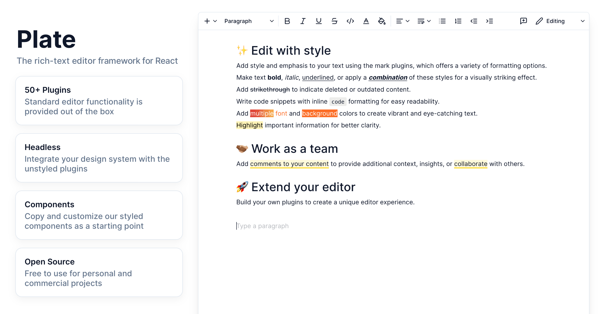

<h1 align="center">
Plate
</h1>

  
  
  
  
  

[//]: # '  '
[//]: # 'Welcome to Plate, a rich-text editor framework designed for simplicity and efficiency. Plate consists of four main parts:'
[//]: #
[//]: # "1. **Core**: This is the heart of Plate. It's a special plugin system just for `slate-react`. We've made sure everything is neat and tidy, so it's easier for you to develop your project."
[//]: # '2. **Plugins**: We give you a big selection of plugin packages. They help make editor behaviors, hooks, serialization, and normalization better, among other things.'
[//]: # '3. **Primitives**: Besides the headless plugins, we also provide primitive hooks and components built on top of [Radix UI](https://www.radix-ui.com/). These are **unstyled** and accessible parts for making great design systems.'
[//]: # '4. **Components**: We know a good-looking start is important. So, we give you components created with Plate CLI and [shadcn/ui](https://ui.shadcn.com/). Use these as a starting point to create your own component library.'

## Documentation

You can learn more about Plate by checking out our [documentation](https://platejs.org/docs).

## Contributing

### Ideas and discussions

[Discussions](https://github.com/udecode/plate/discussions) is the best
place for bringing opinions and contributions. Your feedback and contributions are welcome and will help us ensure that we are heading in the right direction with the project.

### Contributors

We'd love for you to join us! Whether it's through giving us a 🌟 star, making a 📥 pull request, or **sharing your plugins**, your help is always appreciated.

To get started, check out our [contributing guide](CONTRIBUTING.md). Need more help? Join us on [Discord](https://discord.gg/mAZRuBzGM3). We're always here to guide you.
