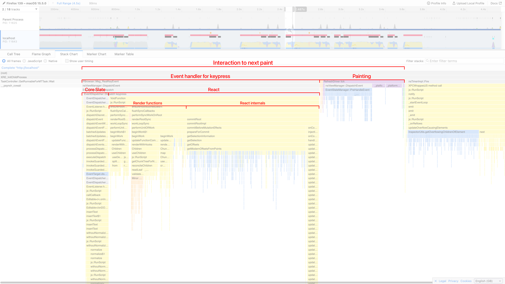

When building a text editor, it's important for user interactions to take place without any noticeable delay. For small and moderately sized documents (less than 1000 blocks), you probably don't need to worry about performance. If your editor needs to support very large documents (10,000+ or 100,000+ blocks), follow this guide to ensure the editor stays responsive.

The [Huge Document](https://slatejs.org/examples/huge-document) example contains an interactive playground where you can explore the effect of various factors on the performance of a very simple Slate editor.

The type of performance this guide is mostly concerned with is the **Interaction to Next Paint** (INP) while typing. If the INP is below roughly 100ms, typing should feel very responsive. The editor will still be usable when the INP duration is longer, but it will feel increasingly sluggish and unpleasant to use.

Other performance metrics to be aware of (but which are not currently covered in this guide) are **time to first paint** and the INP when performing non-typing operations (such as selecting all content or pasting).

INP is easiest to measure in Chrome using the [Performance panel](https://developer.chrome.com/docs/slate/devtools/performance) in DevTools, but there are ways to determine it in Firefox and Safari too. For example, in Firefox, you can use the [Firefox Profiler](https://profiler.firefox.com/) to see a timeline of events.



There are three areas that can be optimized:

- [Improving Performance](#improving-performance)
  - [Optimizing Slate Core](#optimizing-slate-core)
  - [Optimizing React](#optimizing-react)
    - [Reduce Renders](#reduce-renders)
    - [DOM Strategy](#dom-strategy)
  - [Optimizing DOM Painting](#optimizing-dom-painting)

Before you start optimizing, make sure you know which of these areas is most responsible for any slowness you're seeing. The best way of doing this is to use your browser's profiler (see the example for Firefox above), but you can also use these heuristics to guess which area is most at fault:

1. If performance is much better in Firefox than in Chrome or Safari, DOM painting is usually the problem (tested May 2025).
2. If disabling any custom normalization logic improves performance, the normalization logic is the problem.
3. Otherwise, it's likely to be React.

## Optimizing Slate Core

Usually, if the core Slate logic is causing a noticeable delay, it's because of [normalizing](../concepts/11-normalizing). If custom normalization logic is causing slowness in your app, consider whether the logic can be made more efficient.

Understand that `normalizeNode` is called once for every modified node and every ancestor of a modified node. As a result, `normalizeNode` is called for the editor node whenever anything changes in the editor, but for other nodes it is called much less frequently.

Make sure you only normalize the node passed into `normalizeNode` and (occasionally) its direct children, not its children's descendants. Normalization logic should only be applied directly to the editor node when absolutely necessary, such when enforcing that the last block in the document is a paragraph.

## Optimizing React

### Reduce Renders

The `renderElement` prop and any React component it returns will re-render every time the element or any of its descendants changes. This is unavoidable. However, sometimes custom logic can cause React components to re-render more often than this, which can have a detrimental effect on performance.

Prefer stable renderer functions passed through `Editable` props. Define
`renderElement`, `renderLeaf`, `renderText`, and `renderSegment` at module
scope, or memoize them once when they need editor-local data. Avoid creating
renderer functions inside the editor component during render.

If unmodified elements are being re-rendered, check to see if they are subscribing to any contexts or hooks that are causing unnecessary re-renders. You can also apply these techniques to any toolbars or other non-element React components that may be re-rendering in response to changes in the editor.

Hot editor UI should subscribe to the narrowest source it needs. Use
`useEditor()` to access the editor object, `useEditorSelection()` for
selection-aware toolbar UI, and `useEditorSelector()` for derived editor-level
toolbar state. Inside rendered editor content, prefer target-scoped hooks such
as `useElementSelected()`, `useNodeSelector()`, `useTextSelector()`, and
`useDecorationSelector()` so selection or decoration changes dirty only the
affected runtime targets.

If your components depend on custom React contexts containing non-primitive values (such as objects or arrays), ensure that these values are properly memoized so that components only re-render when these values change. In some circumstances, you may instead want to consider passing a ref object or an unchanging getter function to retrieve the latest value.

```tsx
// Provider
const myDataRef = useRef(myData)
myDataRef.current = myData
return <MyContext.Provider value={myDataRef}>{children}</MyContext.Provider>

// Consumer
// Does not re-render when `myData` changes
const myDataRef = useContext(MyContext)

const onClick = () => {
  console.log(myDataRef.current)
}
```

### DOM Strategy

`Editable` keeps large documents DOM-bounded by default. Use
`domStrategy="auto"` for bounded partial-DOM rendering. Slate groups off-DOM
content behind model-backed coverage boundaries and mounts a small active window
inside the opened group, leaving the surrounding range selectable and copyable
through the model until it materializes. Use `domStrategy="staged"` only when a
product needs eventual native DOM coverage for the whole document, or
`domStrategy="full"` to render the full document surface while debugging.

Experimental virtualized rendering is a separate viewport-mounted stress path
for pathological documents. Read
[Experimental Virtualized Rendering](../libraries/slate-react/experimental-virtualized-rendering)
when you need that research lane.

For paginated documents, keep virtualization at the page boundary. See
[Slate Layout](../libraries/slate-layout) for `PagedEditable` and
page mount planning.

Use projection sources for overlays instead of render-time decoration callbacks.
Projection sources let decorations, annotations, widgets, diagnostics, and
search results share the same range projection runtime without forcing
everything through one `decorate` prop.

## Optimizing DOM Painting

In Chrome and Safari, painting large numbers of DOM nodes can be extremely slow, over 100x slower than the core Slate logic and React rendering combined in some cases. In Firefox, the impact of painting on performance is much less significant.

The best way of speeding up painting large documents is to use the [`content-visibility`](https://developer.mozilla.org/en-US/docs/slate/Web/CSS/content-visibility) CSS property. When set to `auto`, this property instructs browsers not to paint content that is off-screen. However, it also comes with a performance overhead proportional to the number of DOM nodes it is applied to, which is especially bad in Safari. When rendering large documents in Safari, applying `content-visibility: auto` to each Slate element individually is often slower than not using it at all.

For aggressive mounting control, use explicit virtualized rendering only when a
pathological document needs a degraded viewport-mounted surface.

Use a CSS rule like this to apply spacing between top-level blocks:

```css
[data-slate-editor] > * + * {
  margin-top: 1em;
}
```

Keep spacing rules attached to the current editor DOM, not to internal runtime structures.

Also bear in mind this warning about `content-visibility: auto` from MDN:

> Since styles for off-screen content are not rendered, elements intentionally hidden with `display: none` or `visibility: hidden` _will still appear in the accessibility tree_. If you don't want an element to appear in the accessibility tree, use `aria-hidden="true"`.
