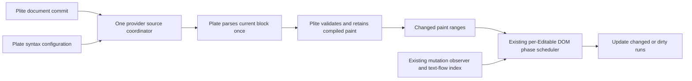

# Native code highlighting: architecture and adoption plan

Delete Plate's second highlight clock and stale-range reconstruction. Keep one Plite source coordinator, retain compiled paint, and make the existing DOM owner identify which runs the browser changed. This removes repeated ownership and work without changing the document model or adding application controls.

**Status:** complete locally on R4. One Plite coordinator replaces the duplicate syntax scheduling; compiled paint and clean DOM runs are retained. Strict package proof, all five browser projects, nine affected www cases, actual Chrome desktop/narrow routes, five final timing cohorts and eight diagnostic packets pass. All 360 timing attempts preserve exact behavior, with no primary operation crossing both frozen baseline-regression limits. Tiptap completion/mount losses, the existing sticky-toolbar caret limit and device/profile proof limits remain explicit. Original and rejected evidence is preserved; no commit, push or PR was requested.

Objective:
Implement the native-highlighting architecture through target acceptance, local adoption and final package/browser/performance proof, preserving the source-backed decisions and frozen gates below.

Flow mode:
agent-led execution through the existing Task plan

Goal plan:
docs/plans/2026-09-06-code-block-plate-plite-tiptap-perf-audit.md

Primary template:
docs/plans/templates/plite-plan.md, continued from the preserved research handoff through accepted production adoption

Applied packs:
- Performance observability: producer work, compilation, dirty DOM, retained runs, input cadence, and full-DOM scaling.

Completion threshold:
- Adopt the user-accepted target through ARCH-01–03 and packets 1–3; resolve conditional ARCH-04 with evidence and keep ARCH-05's parser decision explicitly deferred. Carry every remaining packet 0 correctness cell into production proof.
- Pass packet 5's affected package, native browser, route, closure-matrix and final uninstrumented performance gates on the final production source.
- Every scoped editor concept has a source-backed comparison and disposition; each reference matrix validates.
- Every proposed owner has its current and target shape, deletion scope, adoption sequence, correctness laws, and performance gate.
- Disposable probes retain all raw results and distinguish behavior passes, cost attribution, rejected latency candidates, and missing production proof.
- The plan explains the input-path change uncovered by the faster prototypes and records a concrete first packet to resolve it.
- Source identities, comparison matrices, the Benchmark semantic validator and the root goal-plan checker validate. Historical planning receipts remain distinct from final production proof.

Verification surface:
Pinned local reference source; comparison manifests/matrices; the existing `tiptap-lowlight-react-benchmark.mjs`; exact runtime hashes; focused tests/types and lint; `pnpm check:plite`; `pnpm check:plite:browser-matrix`; affected www specs and actual Chrome routes; final R4 timing/diagnostic receipts; Benchmark and Autogoal validators. The final evidence section links each authority.

Constraints:
- Preserve all text and token DOM in the full-DOM lane. Keep identical explicit-language Lowlight fixtures and exact syntax boundaries for the Tiptap comparison.
- Preserve JSON text, history, selection, clipboard, collaboration, native editing, composition, accessibility, and source failure isolation.
- No public scheduler, performance flag, token store, safety declaration, parser-worker requirement, parallel renderer, or second document representation.
- Do not remove a browser protection because its timer costs latency. Replace its safety condition only with equivalent executable proof.
- Keep original measurements, rejected probes, and corrected-clock evidence. Shared-host variance is inconclusive; it does not justify relaxed budgets or repeated unchanged trials.

Boundaries:
The user's “go all” authorizes local implementation and proof of this full plan. Their September 7 “yes” accepts the measured target and its Tiptap tradeoffs, allowing production adoption to proceed. Commits, pushes, PRs, external messages, releases and another Plate checkout remain outside the request. The current checkout remains `next`; reference source remains read-only.

Blocked condition:
The target decision is resolved. A failed correctness or final production regression gate requires repair before closure. Continue causally distinct, authorized work while useful progress is possible; do not repeat unchanged clock variants or relax the remaining acceptance contract. Unavailable physical-device proof blocks only the corresponding device claim.

## Evidence that changes the design

The earlier [audit checkpoint](artifacts/2026-09-06-code-block-plate-plite-tiptap-perf-audit/benchmark-audit-checkpoint.md) and [report](artifacts/2026-09-06-code-block-plate-plite-tiptap-perf-audit/README.md) preserve the original performance work and retained renderer fix. This plan continues the same work under the latest request: investigate further and make the full architecture plan.

The research-stage **uninstrumented, corrected-clock** 1,000-line packet has 3 warmups and 15 samples per strategy. Plate key paint is 22.3 ms p95 versus Tiptap 39.6 ms; completed key highlighting is 279.9 versus 54.4 ms. Comparable mount is 91.7 versus 67.7 ms, below the existing 50 ms absolute materiality floor. [Raw comparison](artifacts/2026-09-06-code-block-plate-plite-tiptap-perf-audit/aligned-clock-regular-1000.json). The active implementation section records the later event-armed clock and current target cohorts.

For a 10,000-line key, the pre-adoption pipeline produced 30,003 syntax ranges once but compiles 60,005 ranges across two refreshes. It validates roughly 90,000 expected attributes and scans 30,002 decorated child lists while creating only two segment records. ProseMirror matches 60,003 children in memory and calls `updateNextNode` three times. These are named work counters, not total DOM API or total CPU counts.

The pre-adoption refresh sequence was Plite's mapped-slice update, Plite's 120 ms wait, Plate's stale-cache mapping, another 120 ms wait, a full Lowlight parse, compilation, and DOM reconciliation. The intermediate result may compare equal and avoid notifying the DOM, but its compilation work still happens.

A new input-cadence diagnostic exposes another dependency. `selection-controller.ts` arms a **100 ms model-owned text-input guard** after model-command repair. With current slow highlighting, the follow-up key sees guard `0` and commits as `native-text-input`. With the faster candidate it sees guard `1` and commits as `semantic-command`; the decoration manager's non-native branch reads sources synchronously. Waiting 150 ms before the same key makes all three strategies use `native-text-input`. That wait is a causal diagnostic, never part of a performance result. [Input-state/commit evidence](artifacts/2026-09-06-code-block-plate-plite-tiptap-perf-audit/architecture-input-cadence-summary.jsonl).

The relevant owners are [the guard and its expiry](../../packages/plitejs/src/react/editable/selection-controller.ts:640), [beforeinput routing](../../packages/plitejs/src/react/editable/runtime-before-input-events.ts:849), [the guard's repair owner](../../packages/plitejs/src/react/editable/mutation-controller.ts:1085), and [source refresh routing](../../packages/plitejs/src/react/decoration-source.ts:1402). The guard protects selection correctness. Its interaction with highlighting is proved; deleting it is not justified.

## Editor comparison

The source comparison covers native syntax production, transient paint, retained DOM, mutation ownership, scheduling, and the directly relevant lifetime rules. It is not a whole-editor ranking. Lexical and CodeMirror have no comparable latency result in this investigation.

Coverage is **26 expected and 26 reviewed matrix rows**, representing 15 distinct concepts across five repositories. All 48 inventoried source/proof units are mapped; zero rows, prior candidates or routing decisions are unresolved. Each reference manifest names three broader exclusion scopes; these delimit the decision inventory and do not count every excluded editor feature.

| Reference | Useful mechanism | Local decision |
| --- | --- | --- |
| Tiptap CodeBlockLowlight | One decoration result from a full Lowlight parse; transaction mapping when it does not rebuild | Remove the duplicate Plate result/scheduler. Keep local node-key targeting: Tiptap's selected-code path scans/re-highlights code blocks across the document. |
| ProseMirror view | Dirty view descriptions make in-memory equality sufficient for unchanged DOM; composition protects the active browser subtree | Adapt dirty-run ownership and retained matching inside Plite. Keep Plite's JSON model and its native input/selection runtime. |
| Lexical | Token prefix/suffix comparison replaces only the changed middle; dirty subtrees stop reconciliation | Adapt the diff and mutation boundaries. Reject persisted `CodeHighlightNode` tokens: derived syntax must not become Plate document truth. |
| CodeMirror language | Incremental parser fragments, explicit parse budgets, grammar-owned context, cached class decorations | Keep as the parser reference and optional external-text route. A native incremental parser remains a separate, gated decision because Lowlight grammars and output must be preserved in the current comparison. |
| CodeMirror view | Decoration changes and document changes become changed ranges before view reconciliation; DOM mutations dirty a view tile | Adapt the private change propagation. Viewport-only DOM and highlighting cannot satisfy the full-DOM lane. |

[Comparison packet, exact scopes, counts and source manifests](artifacts/2026-09-06-code-block-plate-plite-tiptap-perf-audit/editor-comparison.md). Source commits are pinned separately from the npm versions in the measured Tiptap bundle. Remote freshness is unknown for existing clones; no claim depends on being the latest release. The focused source/test reads do not constitute complete upstream test or issue harvests; those cursors remain null and stale with reasons.

## Disposable target results

Six instrumented packets cover 1,000 and 10,000 lines, each with a frozen baseline, candidate, identical candidate control, and Tiptap: **72 measured attempts plus 24 warmups, all behavior guards passed**. Nine additional attempts isolate input provenance/cadence. All five product owners stayed byte-identical. These short packets deliberately fail the 15-sample latency gate. [Summary and raw packet links](artifacts/2026-09-06-code-block-plate-plite-tiptap-perf-audit/architecture-probe-summary.json).

| Variant | What it establishes | Disposition |
| --- | --- | --- |
| Dirty DOM only | Existing observer records and text-flow bindings can identify browser-modified runs. At 10k, expected-attribute checks fall from 90,042 to 36 and decorated child scans from 30,002 to zero. Reconciliation median is about 31.1 ms versus 48.0 ms; total highlighting changes far less. The formerly failing number-plus-space boundary passes. | Keep as causal design evidence. No production or material end-to-end speed acceptance. |
| Dirty DOM plus synchronous fresh Plate reads, current Plite delay retained | Removes stale mapping and halves compilation to 30,003 ranges. Faster initial settlement exposes the guard and routes the next key through synchronous model input: 10k key-paint medians roughly 201–202 ms versus 67.2 ms baseline. | Reject as an adoption candidate. One remaining timer does not mean every refresh uses it. |
| Dirty DOM plus fresh reads and frame scheduling | Same compilation cut. At 10k the burst causes four parses, with candidate input intervals roughly 238–290 ms instead of the requested 30 ms. Changing the frame schedule alone does not control the model-command path or bound total burst work. | Reject as an adoption candidate. No further clock tuning on this unchanged owner. |

The dirty prototype still performs connectedness/containment checks in `canReuseSegmentRecord`, walks the segment arrays, and rebuilds indexes. Zero measured decorated-child scans is not zero DOM work or O(delta) rendering. It also lacks full composition, paused-host, detached-root and unexpected-DOM certification. Its WeakSets/epochs are disposable evidence, not the chosen production API.

## Maximum-value cut and surviving owners

| Current noun or owner | Strongest counterfactual | Decision and surviving job |
| --- | --- | --- |
| `BaseCodeHighlightPlugin` | Merge highlighting into plain code blocks | Keep the optional feature. Plain code without Lowlight is a tested independent job; syntax configuration and grammar failure belong to this feature. |
| `CodeHighlightRuntime` scheduling machinery | Delete the second scheduling authority rather than tuning its delay | Cut `SYNTAX_REFRESH_DELAY_MS`, `mapCodeBlockDecorations`, pending key sets, `scheduleRehighlight` and timer-driven stale publication. Retain a feature-owned memo of actual parser output and external configuration invalidation. |
| Highlight property-change commit listener | Delete it with the timer | Cut the scheduling listener once generic changed-decoration keys correctly refresh descendant text inputs for language/property changes. Preserve targeted multi-block language changes and cache eviction; they already have tests. |
| Plite decoration manager | Move all decoration state into the document or individual views | Keep one provider-owned transient source/compiled-result owner. JSON, source precedence, cross-node ranges, once-per-source observation, and multiple Editables require this job. |
| Public keyed ranges | Add a code-only offset API, a trusted fast flag, or a public compiled-token store | Keep the present public shape. Same-text ranges already have a fast compiler branch. First eliminate repeat compilation and preserve compiled identity privately; no measured need justifies another public contract. |
| DOM integrity observer and mutation-ownership markers | Add an independent syntax observer or copy ProseMirror's view tree | Reuse the existing observer and node-to-run bindings. Ownership filtering and repair remain authoritative. Record paint dirtiness before canonical/native/composition records are discarded. |
| Retained text-flow renderer | Restore React token children or embed a second editor for native code | Keep one imperative text-flow renderer. Replace full run/DOM work with a private change-driven update; the existing full-DOM contract stays intact. |
| 100 ms input guard | Delete it to restore the benchmark's native path | Preserve its safety job. First make source scheduling independent of this route switch; separately test acknowledgement-based release if it has material value and preserves structural-command repair. |
| Incremental parser or worker | Replace all parsing with Lezer or move arbitrary supplied Lowlight functions to a worker | Defer. Custom grammars/functions, token semantics and configuration lifetime are real current jobs. Parser replacement cannot hide a remaining renderer cost or change the matched comparison. |

## Target pipeline and laws



The coordinator owns **when** a source is refreshed; the feature owns **what** the current source value means. A source read returns actual current syntax or a genuine plaintext/error fallback. It never claims mapped old syntax is a freshly computed value. Plite may retain a safely mapped display while awaiting a new result; that mapping exists once in the compiled presentation owner.

1. **Source revision.** The existing manager tracks the latest document snapshot, source/configuration generation and affected node keys. Coalescing unions keys and keeps the latest snapshot. A result cannot publish after a newer generation, unregister, unmount, destruction or root replacement. External `observe` refreshes enter this same coordinator. Refreshing one source preserves pending document work for every other source and affected input; only work actually satisfied by that refresh may be removed. They may invalidate a source, not start a second timer.
2. **Scheduling.** Initial reads and structural/property changes preserve their required behavior. For text editing, distinguish actual input work from the incidental `native-text-input` versus `semantic-command` route. The input runtime must supply truthful private provenance; applications do not declare safety. The numeric coalescing/deadline policy remains gated by packet 0. It must bound burst work and latest-result latency, and cannot reset its deadline forever.
3. **Parser memo.** Cache actual output by block identity, current text, effective language and observed highlighter configuration. Evict removed blocks. Moving a block cannot leave path-bearing cached ranges attached to its old location. Replacing Lowlight or changing its observed configuration invalidates the memo. Do not pretend an arbitrary external mutation inside a supplied Lowlight object is observable without an existing refresh/configuration signal.
4. **Compiled paint.** Validate incoming keys, ranges and attributes at the current boundary. Retain equal compiled slices and validated immutable attribute values. Extend the existing `DecorationSourceBucketChange` with private change information rather than adding a public delta protocol. Compare final ordered source composition, not just the syntax source: search, annotations and other sources may overlap it.
5. **Changed-range reconciliation.** Derive changed intervals from previous/next compiled paint and the text edit. Include predecessor/successor boundaries, active overlapping wrappers and terminal-newline metadata. Reuse equal prefix/suffix runs in memory. Update DOM order and node bindings only where needed; update path/offset metadata even when DOM is retained. Unknown structural changes take the existing complete repair path. Whole-block parsing still scans the text; this target does not promise O(delta) end-to-end work.
6. **Dirty DOM.** Each mounted Editable's existing observer marks affected retained runs, or the containing host when the target cannot be resolved precisely. Track character data, child lists and decoration-owned attributes. A class/style mutation may be irrelevant to document integrity while still invalidating a paint record. The renderer may skip DOM reads only when content, wrapper identity, attributes, display metadata and the view's dirty/connection epoch agree.
7. **Observation lifetime.** Drain queued browser records before trusting a clean record. Renderer-owned writes are certified after the controlled write; unknown writes remain dirty. Composition/Android ownership prevents overwriting the active native subtree but does not erase its dirty evidence. Pause, reconnect, root replacement and unavailable observation invalidate the affected scope. Detached bindings are released. There is one observer and one retained index per current owning view, with no second editor-global DOM truth.
8. **DOM writes and selection.** Rendering and repair re-enter the existing per-Editable DOM phase scheduler. Paint updates must not arm model-command guards, add history entries, change focus, or repair over explicit navigation scrolling. If a real model command requires the guard, highlighting must remain responsive through that path too. Do not wait for every hidden/unmounted Editable before publishing shared syntax.

The public authoring surface stays source-backed and inferred:

```tsx
import {
  CodeBlockPlugin,
  CodeHighlightPlugin,
  createEditor,
} from 'platejs/react';
import { all, createLowlight } from 'lowlight';

const editor = createEditor({
  plugins: [
    CodeBlockPlugin,
    CodeHighlightPlugin.configure({
      initialState: { lowlight: createLowlight(all) },
    }),
  ],
});
```

Raw Plite continues to accept `<Plite decorations={sources}>`, with each `PliteDecorationSource` exposing `id`, `read`, and optional `observe`. Plate continues to lower `decorate: { read, observe? }` into that contract. These are existing public shapes, not a proposed new API. Best API rejects new public knobs; implementation must reopen that decision if a later packet needs one.

## Work ranked by architectural value

| ID | Priority | Change | Primary owner | Required dependent owner |
| --- | --- | --- | --- | --- |
| ARCH-01 | P1 | Remove duplicated syntax refresh and stale publication; include both input routes in the coordinator contract | Plite Plan: `decoration-source.ts` | Plate Plan: `BaseCodeHighlightPlugin` |
| ARCH-02 | P1 | Let the existing observer/index certify clean runs and preserve dirtiness through native lifetimes | Plite Plan: DOM integrity, text-flow index, retained renderer | Verify Plate: native/IME/selection proof |
| ARCH-03 | P1 | Propagate compiled paint changes and update only affected retained runs/bindings | Plite Plan: compiler and renderer | Plate Plan: syntax, search and overlapping-source adoption |
| ARCH-04 | P2 | Replace time-only input-guard release with actual DOM/selection acknowledgement if the safety proof and materiality gate justify it | Plite Plan: input/selection owner | Regression: structural-command and follow-up-input corpus |
| ARCH-05 | — | Worker or native incremental parser | Deferred to Plate parser ownership after ARCH-01–03 | Best API and Benchmark if later evidence warrants a new capability |

ARCH-01–03 form one target, but the adoption order starts with observation and compiled paint so deleting the upper timer cannot prematurely move all work before text paint. ARCH-04 is conditional and must not become a required unsafe shortcut for ARCH-01.

## Dependency-ordered execution packets

| Packet | Entry | Concrete work and deletion | Exit proof |
| --- | --- | --- | --- |
| 0 — accept the complete target | This planning handoff; no production target accepted | In the existing source-overlay runner, connect one refresh coordinator to retained compiled changes and dirty-run evidence. Cover both input routes and real key cadence. Keep parser implementation and full DOM fixed. Compare the complete path, not just an isolated helper or modified clocks. If guard release is explored, make it a separate controlled intervention. | Matched current/target/control receipts pass the frozen primary-operation contract; all exact behavior guards pass at normal, large, stress and pathological sizes. Resolve scheduling policy with the evidence. Until then, production packets remain gated. |
| 1 — establish view mutation truth | Packet 0 accepts the owner and work reduction | Extend the existing observer/index lifetime; capture canonical/native/composition paint dirtiness before discard. Add conservative host invalidation for unknown targets, paused commits and reconnect. Keep the complete renderer path as the fallback. No second observer. | Focused integrity/index/renderer contracts, queued-record race, external class/text/child mutation, detach/remount, nested editors, composition and two-Editable isolation. Compare dirty-only work counters and mounted correctness with the same baseline. |
| 2 — retain compiled changes and runs | Packet 1 dirty/clean certificate is reliable | Retain equal compiled slices/attributes; derive changed paint ranges from the existing bucket change. Splice affected segment records and update bindings/DOM order without revalidating every clean run. Remove the redundant full index/DOM passes when their replacement is proven. | Cross-source overlap/precedence, equal-looking distinct keys, range move/remove/split, middle/start/end edits, terminal newline, Unicode, long line, multiline syntax; randomized edit/decoration sequences against full reconciliation. No whole-token DOM validation on the unchanged suffix in the numeric-key cohort. |
| 3 — cut duplicate refresh ownership | Packets 1–2 complete; packet 0 chooses a passing scheduling contract | Route document and external invalidation through the existing Plite manager. Delete Plate timer, stale mapper, pending sets and scheduling listener. Retain only actual parser memo/configuration ownership. Preserve initial render, moved blocks, language changes, removed blocks and failure fallbacks. | Exactly one fresh parser call/compile per accepted source revision, no duplicate read caused by the deleted Plate layer, latest snapshot wins, no work after teardown, bounded burst work, correct model-command/native cadence and unchanged input/settlement budgets. |
| 4 — conditional guard repair | Only if ARCH-04 remains material after packet 3 and an acknowledgement can replace the time law | Prove current DOM text/selection ownership before releasing the guard; keep conservative protection for structural commands, partial DOM, composition, stale target ranges and asynchronous repair. Do not clear it globally or key it to syntax completion. | Red-before-green exact structural-command/follow-up cases plus native/model parity; 0/30/60/100/150 ms cadences; continuous typing and undo. Reject this packet if the safety law cannot be made explicit. |
| 5 — adoption and final proof | Accepted implementation from packets 1–3 and any justified packet 4 | Check every current producer and copied UI consumer; regenerate barrels only if exports change and registry output only if registry source changes. Repair teaching that actually changes. Remove disposable product bridges and obsolete tests of deleted behavior. Keep evidence artifacts. | Source-first package types, focused package tests, `pnpm check:plite`, affected www browser cases, actual Chrome docs/default/stress/narrow routes, and final uninstrumented matched comparisons. Run the closure browser matrix before a completed architecture/browser claim. |

No packet adds another plan, lifecycle, global registry, or benchmark inventory. Task supervises this plan; Best API decides a public shape only if one changes; Benchmark owns measurement; Regression owns a failed-fix repair; Verify Plate owns the browser claim. Autoreview is not run on `next`.

## Frozen benchmark and acceptance contract

| Axis | Required cells |
| --- | --- |
| Size | 100 regular lines, 1,000 docs-sized lines, 10,000 stress lines; 10,000 is within the current supported end-to-end fixture domain. |
| Syntax shape | Regular explicit TypeScript, multiline comment/context-changing edits, and long-line input using the existing fixtures. Add start/middle edits to prevent an append-only optimization from standing in for the full job. |
| Input | Existing 28-character insertion, exact numeric key, plain-space endpoint, four-key burst at requested 30 ms; continuous typing, delete/replace and undo/redo for adoption. Record actual delivered intervals. |
| Cadence | Immediate follow-up and 30/60/100/150 ms after the prior action; native and model-command routes must both be represented. Diagnostic waits are separately labeled and never inserted into the normal speed lane. |
| Fan-out | One huge block; many code blocks with one changed block; one editor with two/four Editables; two independent editors; two additional overlapping decoration sources. Count parser calls, observations and changed-view work. |
| Mount | Both clocks begin before identical Lowlight construction; end at exact highlighted full DOM plus the same two frame fences. Navigation/module loading remains separate. |
| Measurement | Instrumented 1 warmup/3-sample probes explain work. Final acceptance uses 3 warmups/15 samples, rotating baseline/candidate/control/Tiptap order, no retries; p50/p75/p95/max, no unsupported p99. |
| Materiality | At least 20% and 16 ms for edit/settlement, 20% and 50 ms for mount, with paired direction outside identical-source variability. No material regression in another primary operation/cohort. A reduced inner stage alone cannot pass. |
| Competitive comparison | The user accepted the repaired prototype's measured Tiptap completion and mount tradeoffs on September 7. Final production proof must retain input responsiveness, full-DOM semantics, the baseline material-regression limits and the accepted target's work reduction. Rerun the matched Tiptap comparison and report every tie, loss or inconclusive result; a universal Tiptap win is no longer an adoption requirement. |
| Work limits | Count source reads, Lowlight calls, compiled ranges, segment visits, attribute checks, child scans, created/moved/removed DOM, binding churn, parser/refresh work per burst, and work after teardown. Expect zero clean-run DOM validation, one fresh result per coalesced revision, and no per-view parser multiplication. Whole-block Lowlight parsing remains O(text). |

Use the existing comparison runner, with the chosen overlay while planning and with no overlay for final production acceptance:

```bash
TIPTAP_REACT_BENCHMARK_LINES=10000 \
TIPTAP_REACT_BENCHMARK_STRATEGIES=baseline,native,control,tiptap \
TIPTAP_REACT_BENCHMARK_PLATE_HOST=minimal \
TIPTAP_REACT_BENCHMARK_BASELINE_SOURCE=docs/plans/artifacts/2026-09-06-code-block-plate-plite-tiptap-perf-audit/full-plan-baseline-source \
TIPTAP_REACT_BENCHMARK_REACT_ENV=production \
bun docs/plans/artifacts/2026-09-04-tiptap-lowlight-huge-code-benchmark/tiptap-lowlight-react-benchmark.mjs
```

Set a fresh `TIPTAP_REACT_BENCHMARK_ARTIFACT` for each run and never overwrite a prior packet. Freeze the full changed owner set for production comparisons; the current five-file baseline is sufficient for the recorded disposable variants, not a future change to selection/input files. Match the lowlight, React, npm lock, workspace graph, fixture, harness and actual serving source. Do not call an instrumented or cadence-modified receipt a final win.

## Adoption and correctness matrix

| Surface | What must survive | Proof owner |
| --- | --- | --- |
| Code feature | Plain code without a highlighter; unknown-language/throwing-grammar fallback; stable Python grammar; language/configuration switch; moved/deleted block; current suffix syntax | `BaseCodeBlockPlugin.spec.tsx`, `CodeBlockPlugin.spec.tsx`; add cases at the feature owner |
| Decoration compiler | Range validation, immutable attributes, duplicate-key/source failure isolation, cross-node ranges, source order, identical-key lifetime and external refresh | `decoration-manager-contract.test.ts`, `decoration-rendering-contract.test.tsx` |
| Retained DOM | Stable connected prefix/suffix; exact number-plus-space boundary; terminal newline wrappers; split/coalesced browser text; text-node/offset indexes | `editable-text-flow.test.ts`, `dom-text-flow-index-contract.test.ts`, mounted rendering contracts and Chromium native code cases |
| Input/selection | Trusted beforeinput, semantic model commands, target-range safety, active composition/Android ownership, post-command guard, expanded/collapsed selection, bidi/emoji/combining input | Existing selection/input/IME contracts; real Chrome interactions; closure Firefox/WebKit/mobile-viewport matrix |
| Lifetime/fan-out | One source observation/producer per provider; separate view dirtiness; unmount/remount; no stale queued work; two independent editors; hidden/offscreen view does not stall visible typing | Source manager, observer, DOM scheduler and multi-Editable contracts |
| History/collaboration | Syntax produces no document/history/Yjs operations; local and remote text/configuration updates repaint once; undo/redo restores text and syntax; block move preserves identity | Existing history/collaboration packages plus focused editor cases; no collaboration-format changes |
| App/UI | `/docs/code-block`, `/blocks/code-block-demo`, `/blocks/code-block-huge-demo`, default/stress state and 390px width: type, copy, select, undo, scroll and follow-up input | Existing www specs plus actual Chrome; registry output from its owner only if source changes |
| Documentation/API | Existing `decorate`/`decorations` authoring stays valid; no new application obligation or callback annotation workaround | Source-backed public examples and source-first types; Best API doctrine repair only if an actual public law changes |

Iteration uses focused Plite/Plate tests and `pnpm check:plite:dev`. Strict handoff uses `pnpm check:plite`; closure uses `pnpm check:plite:browser-matrix` and the actual affected www routes. Physical Appium device evidence is deferred and is not supplied by mobile viewport tests. A future public bug-fix claim additionally needs reporter-valid proof on the final pushed ref; this planning request authorizes no such claim.

## Failure cases and rejection rules

- A space typed at a numeric-token endpoint changes browser DOM while the old model token still equals `1`. An in-memory equality shortcut must see that dirty run and repair its boundary. The previous blind shortcut failed; the observer-backed diagnostic passes the exact case.
- A parser result or queued source read arrives after a later text edit, language change, block move or source teardown. Generation and identity checks must discard it or recompute against the current snapshot; it cannot repaint stale syntax at the old path.
- A faster initial highlight exposes the selection guard, or refresh during a burst blocks the next key. Record input provenance and delivered intervals. A lower highlight number cannot excuse material key-paint regression or four full parses where one coalesced result is sufficient.
- Composition, paused host commits or root replacement produces mutations outside the ordinary callback. Conservatively invalidate the host until the existing owner certifies it. Do not infer cleanliness from the absence of a delivered callback.
- An overlap or multiline grammar edit changes syntax beyond the edited characters. Change-range closure must include semantic/parser changes, active wrappers and display boundaries. Line-local Lowlight reparsing is rejected without a grammar-state proof.

Reject core-model replacement, persisted token nodes, a second mutation observer, a separate token renderer, arbitrary public scheduling options, blind same-text skips, virtualized wins in the full-DOM lane, and custom-function serialization into a worker. Keep CodeMirror external text as its existing distinct user choice.

## Historical planning verification and handoff

Start Gates:
| Gate | Applies | Evidence |
| --- | --- | --- |
| Latest request and planning boundary | yes | Deeper investigation/full plan plus explicit permission to compare editors; active goal follows the user's standing request. |
| Current owner graph and maximum cut | yes | Source links, five owner hashes, deletion table and packet boundaries above. |
| Scale and pre-acceptance probes | yes | Six matched short packets and three input diagnostics; every result is disposed explicitly. |
| Existing proof and history preserved | yes | Prior benchmark checkpoint, raw packets, corrected-clock receipt and unchanged runtime fingerprints. |

Work Checklist:
- [x] Reconstruct the current producer/compiler/renderer/input owner graph and challenge each public owner for deletion.
- [x] Compare the relevant Tiptap, ProseMirror, Lexical and CodeMirror mechanisms using pinned local source.
- [x] Run competing disposable architecture probes and preserve their complete results.
- [x] Explain the newly exposed model-input guard with source and a separate cadence experiment.
- [x] Record concrete target laws, rejected alternatives, deletion/adoption order and frozen proof gates.
- [x] Validate the comparison matrices, source identities, links and final planning handoff.

Completion Gates:
| Gate | Applies | Required action | Evidence |
| --- | --- | --- | --- |
| Research plan | yes | Complete source-backed comparisons, alternatives, executable probe dispositions and adoption/proof contract | This plan and the linked comparison packet. |
| Implementation readiness | future product gate | Pass packet 0 before target acceptance | Not passed: current variants either have small total gains or regress input; no production target is claimed ready. |
| Runtime source preservation | yes | Compare all five owner hashes with the pre-probe snapshot | `full-plan-source-identity.json` and `architecture-probe-summary.json`. |
| Planning artifact checks | yes | Validate each strict matrix and this plan after final evidence | `editor-comparison-validation.log`, `editor-comparison-registry-check.json`, `full-plan-source-link-syntax-check.json` and `full-plan-completion-check.log`. |
| Public doctrine repair | no | No public call-shape/law changed in this planning-only work | Existing `decorate`/`decorations` retained; future actual API changes reopen Best API and affected doctrine owners. |
| Product/browser publication | no | No production adoption or publication claim in this request | Future packet 5 owns those commands; no commit/push/PR. |
| Structured review | no | Follow Task's branch policy | Not run on `next`. |

Phase / pass table:
| Phase | Status | Evidence | Next |
| --- | --- | --- | --- |
| Ground and compare | complete | Live source and comparison packet | Dispose probes |
| Challenge targets | complete | Six architecture packets plus input/cadence diagnostics | Finalize handoff |
| Research handoff | complete | All five matrices validate; source, link, syntax and registry checks pass | Future implementation starts with packet 0 |

Verification evidence:
- The six instrumented packets have 96 total successful attempts; the three provenance/cadence diagnostics add 9 successful attempts. All have stable source fingerprints; short sample counts explicitly prevent final latency acceptance.
- Five product-source hashes match the pre-probe snapshot. Existing retained renderer behavior remains unchanged.
- `architecture-input-cadence-0.json` and `architecture-input-cadence-150.json` expose the guard and corresponding commit tags; the delayed experiment is diagnostic only.
- All five strict matrices pass: 26/26 rows, zero missing/duplicate/unresolved rows or prior candidates, and zero reused canned profiles. [Matrix receipts](artifacts/2026-09-06-code-block-plate-plite-tiptap-perf-audit/editor-comparison-validation.log).
- All 48 source/proof unit hashes and five clean reference commits match; all five runtime owner hashes remain unchanged. The final artifact pass checked 274 local Markdown links and nine JavaScript/Python syntax targets. [Source/link/syntax receipt](artifacts/2026-09-06-code-block-plate-plite-tiptap-perf-audit/full-plan-source-link-syntax-check.json). The registry retains every previous entry and records the new five-reference audit. [Registry receipt](artifacts/2026-09-06-code-block-plate-plite-tiptap-perf-audit/editor-comparison-registry-check.json).
- [Plan completion checker](artifacts/2026-09-06-code-block-plate-plite-tiptap-perf-audit/full-plan-completion-check.log) covers the planning handoff. It does not certify the future production target. Product checks were not rerun for planning-only artifacts; the repo linter excludes `docs/**`, so artifact lint is not claimed.

Reboot status:
The deeper investigation and complete adoption design are delivered with validated comparison and source receipts. A future implementation request starts with packet 0, using this same plan and frozen acceptance contract.

Open risks:
No complete target passes production acceptance yet. The dirty prototype lacks full native/composition/host-lifetime proof; scheduling must cover model-command and native routes; changed-range rendering requires overlap and offset proof; a full Lowlight parse remains expensive at 10k. The competitive target remains unmet. These are explicit implementation gates, not omitted research findings.

## Implementation and proof

Execution authority: the user said “go all” after the full research handoff. This authorizes every accepted local packet and its proof, with the same production acceptance and publication boundaries.

Execution Checklist:
- [x] Read Poteto Mode principles and the relevant domain, boundary and separate-view lifetime leaves; retain the current plan and goal.
- [x] Packet 0 target decision: user accepted the repaired source-coordination, compiled-change and dirty-DOM target after the final three matched cohorts; outstanding correctness and lifetime cells remain required in packets 1–5.
- [x] Packet 1: establish reliable per-view mutation truth and lifetime proof in the existing observer/index; focused contracts and native position replay pass, with final matrix coverage retained in packet 5.
- [x] Packet 2: retain compiled changes and reconcile affected runs and bindings; focused compiler/rendering contracts and native position replay pass, with final production scale gates retained in packet 5.
- [x] Packet 3: delete duplicate Plate refresh ownership and adopt the accepted Plite coordinator; owner tests/types and 1k/10k native replay pass, with final scale/browser gates retained in packet 5.
- [x] Packet 4: retain the existing guard; the acknowledgement intervention showed no material benefit and its conditional replacement is rejected.
- [x] Packet 5: adoption, source-first types, package/native/browser/real-route proof and final matched performance acceptance pass on R4; the final evidence and retained-obligation ledger below contain the complete results and limits.

Throughput checkpoint: first resolve the observed synchronous model-input route and the complete changed-paint path in disposable overlays. Run one 1k/10k diagnostic pair before the full frozen matrix; discard failed candidates with their evidence. Keep benchmark runs serial on the shared host. Reuse the same runner, comparison inventory, decision trail and proof owners.

Data shape: the provider owns one pending source revision with the latest snapshot and affected keys; each Editable owns dirty runs and a connection epoch through its existing text-flow index. Validated compiled paint carries private changed intervals. Model the Domain keeps source scheduling in one pending-state owner; Boundary Discipline keeps attribute validation at compilation; Separate Before Serializing Shared State keeps DOM dirtiness local to each view.

Next action: hand off the completed local adoption and its evidence. No required local implementation or execution-proof item remains. The retained target is the coordinated source and retained-paint architecture with the original inline text-host box; parser replacement stays deferred.

### Packet 0 checkpoint: coordinated compiled changes

The `coordinated-delta` overlay applies one text-only-commit rule across native and model routes, passes a private changed-paint interval to the renderer, preserves binding writes outside the changed suffix, and shares immutable syntax attributes. No product source has changed. Two 1k/10k packets have 32 successful behavior attempts. At 10k, the key compiles 30,003 ranges but visits only two segment ranges, two previous segment records and three next records; it creates two records and performs 36 expected-attribute checks. The 1k completed-key median is 37.0 ms versus Tiptap 54.8; 10k remains slower and the four-key burst still parses four times. Raw packets: `architecture-coordinated-delta-r1-{1000,10000}.json`. The build-only counter-anchor failure preceding these packets is preserved in `architecture-coordinated-delta-1000.log`; it produced no measured attempts.

A separate four-strategy frame diagnostic found that post-keyboard polling mislabeled later parser work as first text-paint latency. Chrome Event Timing reports 56 ms for baseline, candidate and identical control, while the old poll reports candidate 209 ms. Candidate frame callbacks occur at 46.5 and 55.7 ms before parsing starts at 55.9 ms. The runner now arms exact-model/full-DOM sampling during trusted beforeinput and records two consecutive matching animation frames for all compared native editors. Budgets and syntax completion checks are unchanged; old first-paint numbers using the post-keyboard clock are not current acceptance authority.

`architecture-event-armed-paint-10000.json` confirms first-key paint 61.1 ms baseline, 60.4 candidate, 58.4 control and 173.0 Tiptap in one diagnostic attempt each. Completed syntax remains 224.6/216.4 ms candidate/control versus Tiptap 186.5. The serial driver delivers candidate burst inputs 198–304 ms apart despite the requested 30 ms; it parses four times and fails burst acceptance. Both diagnostics have all four behavior guards/strategy attempts passing and stable source. They do not establish final latency acceptance.

Next: isolate serial input delivery from actual queued 30 ms input, preserve every intervention separately, and remove remaining source/DOM work rather than adding another clock. Production adoption stays gated.

### Packet 0 checkpoint: retained syntax and input provenance

The queued-input diagnostic isolates the serial driver's acknowledgement delay: four absolute 30 ms key submissions reach the native target in order, retain exact DOM/model/caret/token boundaries, and coalesce into one parse. The serial driver waits for each key's browser acknowledgement before its next 30 ms delay; source parsing therefore becomes part of its delivered cadence. Both receipts remain preserved. Queued delivery measures the intended burst; serial delivery remains a separate throughput diagnostic and cannot stand in for physical 30 ms input. The final adoption corpus must retain explicit slow and continuous input cases.

The complete overlay now retains actual syntax token keys across equal prefixes and shifted suffixes, shares immutable path/attribute values, caches validated immutable same-text ranges, and updates only the changed DOM-order window. The immutable cache still checks source/input identity, current path, current text bounds and duplicate keys. Mutable source values keep ordinary validation. The instrumented exact-key row reuses 30,002 of 30,003 compiled inputs and reconciles only two old / three new runs.

Input provenance uses the existing update-tag context in the model input owner. Native and model browser text inputs share deferred source refresh; programmatic text edits remain synchronous. This replaces the earlier broad text-only scheduling probe. The seven-file `execution-baseline-source/source-manifest.json` retains all affected runtime owners, including the update context and model input adapter. No product source has changed.

`architecture-provenance-preacceptance-10000.json` is the first 3-warmup / 15-sample uninstrumented execution receipt. All 72 attempts pass behavior guards and source identity is stable. Medians (baseline / target / identical target control / Tiptap): first insertion paint 83.9 / 64.7 / 64.6 / 253.6 ms; complete insertion highlight 352.1 / 217.9 / 217.1 / 272.0 ms; key paint 58.1 / 60.1 / 59.3 / 176.3 ms; complete key highlight 486.6 / 206.6 / 202.7 / 187.9 ms; queued burst completion 658.8 / 370.6 / 369.2 / 674.5 ms. Every native four-key burst parses once. Target mount is 330.0 ms versus baseline 290.9 and Tiptap 234.8. The validity checker passes; the separate competitive key target still fails by 18.7 ms at the median, so packet 0 is not closed.

A current CPU profile places about 19 ms in scroll capture during selection repair. A disposable `display: contents` intervention tests whether the otherwise unstyled text-flow host needs its own layout box; it keeps all DOM nodes and token semantics. Its first short result is promising but is not acceptance evidence. The full matched packet is running. The earlier single-frame scheduling intervention remains rejected for first-insertion paint regression; no clock or materiality threshold is relaxed.

### Packet 0 checkpoint: final stress comparison and acceptance decision

`architecture-bounded-oracle-preacceptance-10000.json` has 72 passing attempts, 15 measured samples per strategy and stable source. Its target/control medians agree closely: complete insertion 205.3 / 203.1 ms, key paint 56.4 / 56.1 ms, complete isolated key 191.5 / 190.5 ms, queued burst completion 349.2 / 347.7 ms. Baseline values are 342.8, 56.1, 482.5 and 649.9 ms; Tiptap values are 255.9, 167.7, 180.1 and 646.7 ms. The target's 304.7 ms mount versus baseline 275.9 is below the frozen material-regression threshold. The isolated-key competitive gap remains 11.4 ms at the median. The 1.4 ms p95 advantage over Tiptap is smaller than identical-source variability and does not establish a win.

The benchmark oracle now resolves the text at the requested token endpoint before testing ancestor token boundaries. This removes full token-list scans during pending syntax checks without weakening the exact range test. All four existing/extended browser oracle tests pass, including nested/split tokens and plain text after a token. The original oracle is preserved as `highlight-oracle-before-bounded-poll.mjs`; CPU evidence records 60.4 ms in baseline polling. The full comparison after this correction leaves the competitive conclusion unchanged.

A separate selection acknowledgement prototype skips redundant collapsed-caret exports only when current DOM endpoints already match. It preserves every behavior guard but provides no material speed improvement in `architecture-selection-ack-diagnostic-10000.json`; it is rejected. The 100 ms input guard is unchanged. Its eight-file frozen source is `acknowledgement-baseline-source`; the current target remains the seven-file `execution-baseline-source` plus the layout-box intervention.

A decision is pending from the user: accept the 11–12 ms isolated-key completion tradeoff alongside the much faster key paint, insertion and burst behavior, or retain the strict competitive gate and explore asynchronous parsing. This is a change to the accepted adoption gate, not a silent budget relaxation. Until the user answers, production packets remain gated. Full 1k/100-line and pathological/provenance proof can proceed independently.

### Packet 0 checkpoint: ordinary sizes and remaining proof

The current regular-cohort matrix is complete at 100, 1,000 and 10,000 lines: three warmups plus 15 measured samples for each of baseline, target, identical target control and Tiptap, totaling 216 behavior-passing attempts. Every receipt has stable source fingerprints. The 100/1k runs reveal smaller competitive losses; the strict gate is not only a stress-size issue. Values below are medians in milliseconds.

| Lines | Complete key: baseline / target / Tiptap | Key paint: baseline / target / Tiptap | Complete burst: baseline / target / Tiptap |
| --- | --- | --- | --- |
| 100 | 269.6 / 37.1 / 31.2 | 11.2 / 11.6 / 14.1 | 356.0 / 130.0 / 122.1 |
| 1,000 | 277.9 / 36.5 / 37.1 | 11.7 / 11.0 / 20.8 | 363.3 / 129.8 / 122.2 |
| 10,000 | 482.5 / 191.5 / 180.1 | 56.1 / 56.4 / 167.7 | 649.9 / 349.2 / 646.7 |

No measured primary operation crosses both frozen material-regression thresholds against baseline in these three regular cohorts. The target performs four short parses per four-key burst at 100 and 1k lines, versus one coalesced parse at 10k. This is the measured scheduling behavior, not a universal one-parse-per-burst claim. Continuous input and a bounded pending-work deadline still need proof.

The existing multiline-comment and 64k-character long-line fixtures add 32 behavior-passing attempts at 1k lines, with stable source. These are one-warmup/three-sample diagnostics, so their checker rejects latency acceptance solely for sample count. They cover endpoint insertion, numeric input, plain-space boundaries and queued bursts after those fixtures; they do not prove edits that change comment context or start/middle syntax.

[Execution checkpoint before position probes](artifacts/2026-09-06-code-block-plate-plite-tiptap-perf-audit/architecture-execution-before-position-probes.json) inventories the first 21 execution packets: 436 measured attempts and 96 warmups, 532 passing behavior attempts in total, including superseded candidates. Two launch/build failures produced no measured attempts and retain their logs. All seven runtime owner hashes still match the execution baseline. Only benchmark tooling and planning/probe artifacts changed during this execution request.

The shared oracle's standalone browser caller also injects its exact-boundary helper. All four browser oracle tests and scoped lint/format checks pass after that correction. Final formatting changed the helper's source bytes after the recorded cohorts; their embedded fingerprints remain the measured-source authority. No fresh performance claim is made for those formatting changes, and packet 5 still requires final-source measurements.

The requested gate decision remains unanswered. Start/middle and context-changing edits, deletion/replacement/undo, continuous input, overlapping sources and view/editor fan-out remain open. Production observer lifetimes, scheduling deadlines, invalidation and overlap correctness still require implementation, followed by package, real-route and browser-matrix proof. Packet 0 and the implementation goal are not complete.

### Packet 0 checkpoint: source refresh cancellation

The next goal continuation made concrete progress by extending the existing source-overlay runner with nine exact start/middle cases. `architecture-position-diagnostic.mjs` compares every rendered syntax run against a fresh whole-document Lowlight parse, plus exact model text, full DOM text and model/native caret offsets in two matching state samples separated by an animation frame. The cases open/delete comments at the start and middle, insert/delete a prefix line, and insert/replace/delete inside a middle numeric token. Selection is setup; insertion uses trusted `beforeinput`, while the editor's Backspace command is proved through trusted `keydown`. The initial beforeinput-only deletion oracle failed on baseline and was corrected before classifying product behavior.

`architecture-position-input-diagnostic-1000.json` passes all nine baseline cases, then falsifies the disposable target on middle replacement. `architecture-position-frozen-diagnostic-1000.json` repeats that assertion on unchanged target bytes: model and both carets are correct, but syntax highlights `8880` instead of `88801` and shifts following syntax left by one character. This is pre-acceptance red evidence for an unadopted target; earlier endpoint-only measurements do not prove this case or complete-target correctness.

The diagnostic does not implicate compiled-range retention. `architecture-position-offset-inspect-1000.json` shows a 43,925-character model with a 43,924-character parser memo and matching stale compiled offsets. `architecture-position-refresh-inspect-1000.json` identifies the exact cancellation: document commit 19 schedules a refresh, then `inactive-selection.ts` invokes its own observer refresh and `startObservation` clears the provider-wide pending work. No parser call occurs for the final text. The baseline's later feature refresh had masked this interaction.

The prototype removes that cross-source cancellation from the existing manager callback. No timer, public control, observer or new queue is added. The pre-repair overlay is preserved as `coordinated-architecture-probe-before-external-refresh.mjs`. `architecture-position-pending-preserved-{1000,10000}.json` each passes 24 fresh strategy attempts (one warmup and five counted runs each), totaling 432 exact edit-case executions across both sizes with stable source. Their latency-validity rejection is intentional: position diagnostics are correctness-only and use fewer than 15 timing samples.

Regression classification: this is the expected pre-adoption RED, with a proof-host repair for the initial deletion-event assumption, not a failed completed product implementation. The existing plan's start/middle gate found the defect before adoption. Durable production coverage belongs beside `maps native insertions immediately and revalidates the source after input settles` in `packages/plitejs/test/react/decoration-manager-contract.test.ts`: queue a native document revision, refresh an independent observed source, and require the original source to publish current values. Production edits, final performance acceptance and the broader adoption matrix remain gated.

The Tiptap call recorder also records `startedAt`, which the burst classifier needs. Earlier Tiptap burst-call arrays lacked that field and cannot prove a call count. `architecture-burst-count-oracle-1000.json` verifies four timestamped Tiptap parses for four inputs, alongside all existing behavior guards and stable source; its single sample is diagnostic only. No earlier timing result is reclassified as a speed win.

The [execution checkpoint](artifacts/2026-09-06-code-block-plate-plite-tiptap-perf-audit/architecture-execution-checkpoint.json) preserves every packet and separates the proof-host failure, repeated pre-repair target failures, successful stability runs and remaining acceptance requirements. All seven product owners remain unchanged. At this checkpoint, performance numbers predate the prototype correction; the final verification below supplies repaired-target measurements. Packet 0 and production adoption remain incomplete.

### Packet 0 checkpoint: repaired target and decision boundary

The final regular cohorts use the repaired `coordinated-contents` overlay and current benchmark helpers. Each has three warmups and 15 measured samples per strategy, totaling 180 measured attempts and 36 warmups. All 216 attempts pass the runner's exact behavior guards; all three receipts pass measurement validity and source stability. This verifies the measured prototype, not the complete adoption matrix or competitive gate. Raw receipts: [100 lines](artifacts/2026-09-06-code-block-plate-plite-tiptap-perf-audit/architecture-repaired-target-regular-100.json), [1,000 lines](artifacts/2026-09-06-code-block-plate-plite-tiptap-perf-audit/architecture-repaired-target-regular-1000.json), [10,000 lines](artifacts/2026-09-06-code-block-plate-plite-tiptap-perf-audit/architecture-repaired-target-regular-10000.json).

Values are p50 / p95 in milliseconds. Control loads the identical prototype in fresh browser contexts.

| Lines | Operation | Baseline | Target | Control | Tiptap |
| --- | --- | --- | --- | --- | --- |
| 100 | Mount | 67.9 / 70.8 | 65.7 / 71.8 | 66.5 / 70.6 | 47.2 / 49.1 |
| 100 | Key paint | 11.9 / 13.1 | 11.7 / 12.7 | 12.1 / 13.0 | 13.8 / 15.5 |
| 100 | Complete key | 269.9 / 271.3 | 37.0 / 38.4 | 37.2 / 38.8 | 31.1 / 32.8 |
| 100 | Complete burst | 355.9 / 357.2 | 130.4 / 131.4 | 130.3 / 131.4 | 115.8 / 122.9 |
| 1,000 | Mount | 88.8 / 90.6 | 91.8 / 94.9 | 93.1 / 96.6 | 64.8 / 67.5 |
| 1,000 | Key paint | 11.7 / 12.1 | 11.1 / 12.1 | 11.4 / 12.2 | 21.3 / 21.8 |
| 1,000 | Complete key | 277.9 / 278.7 | 35.8 / 37.6 | 36.0 / 37.3 | 38.3 / 40.4 |
| 1,000 | Complete burst | 362.4 / 363.7 | 129.9 / 132.4 | 130.2 / 133.1 | 121.7 / 122.8 |
| 10,000 | Mount | 278.0 / 284.4 | 305.5 / 314.7 | 305.4 / 311.9 | 221.3 / 226.7 |
| 10,000 | Key paint | 56.6 / 58.8 | 56.1 / 57.6 | 55.9 / 57.6 | 167.9 / 178.3 |
| 10,000 | Complete key | 484.2 / 491.3 | 191.2 / 194.2 | 190.7 / 194.4 | 180.0 / 197.4 |
| 10,000 | Complete burst | 653.6 / 661.6 | 351.5 / 362.8 | 349.9 / 356.2 | 647.3 / 655.9 |

The prototype's isolated-key completion loses by 5.9 ms at 100 lines and 11.2 ms at 10k at p50. Its 10k p95 is lower, but that mixed result does not establish the required competitive win. Smaller burst completion loses by 14.6 ms at 100 lines and 8.2 ms at 1k. The 10k mount gap against Tiptap is 84.2 ms; it must remain visible alongside the faster input paint, insertion and stress burst. No target or control primary operation crosses both frozen material-regression thresholds against baseline at p50 or p95 in these regular cohorts. The checkpoint includes all seven primary-operation summaries, including first insertion.

Every measured target/control burst parses four times at 100/1k lines and once at 10k; the corrected Tiptap recorder proves four parses at every size. The separate repaired position packets provide 432 exact edit-case executions across all four strategies, including 216 for target and identical control. They establish their bounded start/middle sequence, not continuous input, fan-out, overlap, teardown or production correctness.

All three final runs share the same runner and overlay hashes, and each preserves its full build/source fingerprint. The execution inventory contains 32 packets: 661 measured attempts and 140 warmups, or 801 completed attempts, plus five preserved failed attempts. The failure count includes the initial deletion-oracle error and repeated pre-repair prototype failures. Two earlier launch/build failures produced no browser attempts. All 32 raw packet hashes and seven unchanged production owner hashes verify.

The remaining decision has recurred through three consecutive goal turns without a user answer. The independent position-correctness repair and final matched verification are complete. Further production work requires accepting this measured target; replacing the parser expands ARCH-05, which this plan explicitly defers. The goal is blocked on that decision, not complete. The recommendation is to accept the measured tradeoffs and proceed with production adoption and the full correctness matrix. No performance threshold, parser constraint or package/browser gate has been silently changed.

### Accepted adoption and retained obligations — September 7

The user's “yes” accepts the measured target and authorizes integration. The preceding blocked checkpoint is historical. The same native goal is active; all seven production owners still match the execution baseline at resumption. The Tiptap comparison remains descriptive, with the accepted completion and mount losses reported explicitly. No package, native-behavior, source-lifetime or baseline regression requirement is waived.

This ledger retains the applicable obligations from [Task](../../.agents/rules/task/references/workflow.md), [Autogoal checklist retention](../../.agents/skills/autogoal/references/method.md#checklist-retention), [Plite Plan](../../.agents/skills/plite-plan/SKILL.md), its [template](templates/plite-plan.md), and [Verify Plate](../../.agents/skills/verify-plate/SKILL.md). The detailed packet, failure and correctness tables above own the individual cases; this ledger links their proof without replacing them.

| Obligation | Owning requirement | State and evidence |
| --- | --- | --- |
| Current authority, goal, baseline and target | Task scope; Plite Plan accepted execution | Resolved: local `next`, original goal reused, seven runtime hashes verified, user accepted measured tradeoffs; no publication authority. |
| One source owner and private per-view paint state | Plite Plan ownership; target laws 1, 4, 6–8 | Adopted and proved: packets 1–3 retain public keyed sources, one provider coordinator and the existing per-view observer/index; R4 strict package and final native matrix pass. |
| Mutation and connection lifetime | Packet 1; target laws 6–8 | Focused proof passes: observer/index/rendering contracts cover queued records, external class/text/child writes, controlled writes, paused/reconnected/detached roots, nested editors, composition and two-Editable isolation; packet 1 and SELECTION-01 receipts below. |
| Compiled-range and DOM correctness | Packet 2; compiler and retained-DOM matrix | Passed: packet 2 contracts cover immutable input, duplicate keys, precedence, overlaps, range changes, terminal newline, Unicode and randomized full-render comparison. R4 position receipts pass all 72 exact start/middle edit cases across 1k/10k and four strategies; strict package/native matrix preserves the broader laws. |
| Single refresh coordination and parser memo | Packet 3; target laws 1–3 | Passed: coordinator/feature tests cover both provenance paths, programmatic edits, targeted refresh, language/configuration, moved/deleted blocks and teardown. BATCH-01 adopts a 50 ms quiet window with an independent 250 ms maximum pending age; final R4 counters prove one parser result per coalesced burst. |
| Input and model laws | Input/selection and history/collaboration matrix | Passed within the declared claim class: strict package and browser contracts cover native/semantic input, structural commands, target ranges, composition proxies, history and collaboration. Mounted overlap history and www shared-view remote/composition cases pass; real-route forty-key replacement/undo/redo and actual Chrome follow-up edits pass. Paint stays in the transient source/DOM owners. OS IME and raw-device certification are not claimed. |
| Fan-out and cadence | Frozen benchmark fan-out/cadence/input rows | Passed: mounted fan-out covers twenty blocks, two/four Editables, a hidden view, an independent editor and three overlapping sources. R4 owner/cadence receipts pass all guards at 0/30/60/100/150 ms, including guarded model and native routes; both real-route continuous-input cases pass. |
| Conditional selection guard cut | ARCH-04; packet 4 | Design resolved: retain the 100 ms guard; acknowledgement prototype produced no material benefit. Adoption must preserve its safety and input responsiveness. |
| Parser replacement | ARCH-05; user-accepted target | Deferred by scope: preserve Lowlight/custom grammar semantics; no worker/function serialization or parser substitution. |
| Source-first package proof and lint | AGENTS commands; packet 5; Verify Plate package owner | Passed on R4: focused owner tests/types, scoped lint/format and every strict `pnpm check:plite` stage; `adoption-final-check-plite-r4.log` and `adoption-r4-final-scoped-{lint,format}.log`. The final full-DOM reverse assertion is proof-only and is covered by the closure matrix. |
| Native app/browser proof | Packet 5; Verify Plate native proof | Passed: five-project closure matrix has 2,371 passes and 619 explicit skips across 2,990 applicable rows; nine affected www cases pass. Actual Chrome covers `/docs/code-block`, default/stress block routes at 1280px/390px. Profile clipboard readback and the pre-existing toolbar/caret limit remain explicit below. |
| Final production performance | Plite Plan production scale rerun; frozen benchmark contract | Passed: five no-overlay R4 cohorts cover regular 100/1k/10k and 1k multiline-comment/long-line, with 300 samples plus 60 warmups, exact guards, unchanged control and no primary material-regression crossings. All Tiptap values/losses are retained in `adoption-final-timing-r4.md`. |
| Adoption, exports and teaching | Plite Plan hard cut; AGENTS barrels/API/docs rules | Verified: obsolete-owner sweep has zero live callers; public sources/authoring retain their current shape. No exported files, registry source or durable public law changed, so barrel/registry generation and doctrine repair are inapplicable. All temporary product probes are restored. |
| Evidence, cleanup and final reconciliation | Verify Plate evidence/cleanup; Autogoal closure | Resolved: source/host/command receipts and inspected desktop/narrow screenshots retained; owned server and tab stopped/reset. Original Task, Autogoal, Plite Plan/template, Benchmark and Verify Plate obligations are reconciled below; final source/link and semantic completion receipts are retained with the handoff. |
| Publication, structured review and physical devices | Task authority; AGENTS `next`; Verify Plate claim classes | Not applicable: no publication request; Autoreview prohibited on `next`; raw physical-device certification is outside this local browser claim and remains explicitly deferred. |

Throughput checkpoint: implement and verify one owner at a time, starting with the existing observer/index. Use focused tests during edits and keep heavy managed browser runs and matched benchmarks serial. Preserve the accepted data shape: one provider pending revision and compiled paint owner, one dirty/connection certificate in each existing view index, one feature parser memo. A failed owner proof returns to that owner before wider gates; no compatibility scheduler or second renderer becomes the fallback architecture.

### Packet 1 implementation checkpoint

The existing text-flow index owns paint epochs and dirty segment ranges. The existing integrity observer supplies its live observation lifetime, records paint dirtiness before canonical/composition/Android exclusions, and invalidates observation across unobserved commits, reconnects and destruction. The renderer uses `runOwnedDOMMutation('scheduler', ...)` so its controlled writes retain observation; arbitrary unobserved commits still require validation. A mounted two-Editable test repairs one view's corrupted syntax without reading attributes from the clean token in the other view.

The index also retains the segments that were actually bound, separately from the renderer's mutable record reference. The new replacement test first demonstrated that a removed text node still resolved to a model offset; it passes after releasing the previous bound segments. Pure insertion retains its existing fast path by validating retained segments when observation was interrupted. Unknown wrapper changes use full reconciliation, and runtime DOM moves account for both removal and insertion mutation records.

Focused proof: all 40 tests across the integrity observer, text-flow index, segment compiler and mounted decoration renderer pass (`adoption-packet-1-final-tests.log`). `pnpm turbo typecheck --filter=./packages/plitejs` passes all 11 selected tasks (`adoption-packet-1-final-typecheck.log`). The first final lint exposed formatter changes after lint fixes in two files; those are formatted and the scoped lint rerun is recorded separately. Native browser replay remains the next packet 1 proof before packet 2. No production performance result is claimed yet.

### Packets 1–2 adoption proof

The packet 1 native position replay passes all nine cases in each of baseline, production, identical production control and Tiptap: 36 exact edit-case executions. `adoption-packet-1-native-position-1000.json` preserves stable source and every behavior guard. The diagnostic's latency checker rejects it only because position probes are correctness-only and one timing sample is below the 15-sample requirement. Final packet 1 scoped lint also passes.

Packet 2 retains compiled slices only for validated frozen own-data ranges and attributes. Cache reuse still checks source identity, duplicate keys, current text identity/path/bounds and root values. Mutable paths, inherited fields and frozen getters remain on snapshot validation. Private publication metadata joins the existing mapped-bucket owner and refers to prior bucket identity markers, avoiding retention of every prior array.

The renderer compiles a bounded window with full source-order and overlap context, retains prefix/suffix DOM, and rebinds from the changed segment onward. General overlaps retain the complete boundary sweep's occurrence numbering; they do not claim constant-time source work. The index remembers actual bound nodes when a segment adopts browser text. A bounded DOM reorder uses the next actual sibling, preserving multiple model texts within one host. Unknown observation or structural changes still require complete validation.

New tests compare 64 deterministic range/text changes against both per-character layer precedence and the complete React renderer, including overlapping sources, insertion, deletion, Unicode and terminal newline. They exposed and fixed the existing assumption that an unchanged bucket automatically follows text insertion: fixed absolute ranges must retain their actual endpoint. A 200-token window case proves at most six compiled boundaries and preserves distant nodes without attribute reads once the observation lifetime is established. Initial observer attachment correctly requires validation before that certificate can be used.

All 58 focused tests across five owner files pass (`adoption-packet-2-final-tests.log`), all 11 source-first typecheck tasks pass (`adoption-packet-2-final-typecheck-r2.log`), and scoped lint/format checks pass. The packet 2 native position receipt repeats all 36 exact edit cases with stable production/control source and every behavior guard true; its low-sample latency rejection is intentional. Failed intermediate tests and type/lint results are preserved with their corrections. These are owner adoption proofs; the complete architecture's performance and package/browser gates still await packet 3 and packet 5.

Next: remove the feature's stale-output mapper and refresh timer, make the existing provider coordinator preserve source-specific pending work, and prove bounded input scheduling plus language, move, removal and teardown behavior.

### Packet 3 performance-observability

Scale applies: the parser memo, provider scheduler, range compiler and per-view retained DOM all grow with text, tokens, sources or views. This packet consumes the accepted repaired target receipts at 100/1k/10k lines and their unchanged controls, source identities, exact guards and frozen primary-operation budgets. It retains producer parse/read counts, compiled ranges/reused inputs, visited boundaries, segment reuse/creation, binding and DOM writes, delivered input cadence and source/view fan-out as observables. The final production rerun owns acceptance; the accepted Tiptap tradeoff does not waive baseline regression or behavior limits. Plate Plugin Creator supplies implementation mechanics within the existing Plite/Plate owner plan; no public authoring contract changes.

### Packet 3 implementation checkpoint

The provider coordinator owns a pending snapshot and per-source affected-key sets. Independent observed refreshes consume their source's satisfied work without cancelling other sources. Synchronous programmatic/structural/property changes flush the union of pending keys; property changes expand descendant text inputs. Source and observation generations reject stale reentrant reads and callbacks from replaced/unmounted sources. Remounting after cancellation forces a current read.

Actual native and model-owned browser text commits use the existing update-tag context for private provenance. The coordinator uses the accepted two-frame-plus-task scheduling path and a monotonic 250 ms maximum wait from the first pending revision. Repeated input cannot reset that deadline; teardown invalidates both scheduled work and already captured frame callbacks. This is a scheduling bound when the main thread can execute, not a guarantee against arbitrary blocking parser or host work.

The code-highlight plugin's global runtime lookup, forwarding methods, stale mapper, timer and pending sets are deleted. Its existing plugin closure owns actual parser output, stable token identities, immutable ranges, current-class attributes, observed configuration and removed-block eviction. Attribute interning lives with each current cached parse, so removed classes/blocks do not accumulate in an editor-wide table. The retained text host adopts the accepted `display: contents` layout change; native geometry and real-route proof remain required.

The first two-package source-first check passes all 80 selected tasks. Focused coordinator, rendering, model-command and projected-command tests pass all 82 cases before the final formatter pass; feature tests pass 66 cases, including moved blocks, immediate language results, shared-observer memo lifetime, removed-block eviction, current parser output and replacement highlighters. The feature tests of the deleted timer are replaced by current parser/lifetime behavior, while generic descendant refresh and cancellation are proved at the provider owner. The first lint found one chained assignment; it is split and scoped lint passes. Final owner tests/types, production native replay and packet 5 remain open.

### Packet 3 owner closure and final production work probe

Final focused proof passes 110 Plite tests across seven owner files and 66 feature tests. The final two-package typecheck found only the new parent-property fixture accessing an un-narrowed node property; the fixture checks the property's shape, and the rerun passes all 80 selected tasks. Scoped lint/format passes. The production 1k and 10k native position receipts each pass 36 exact edit cases, all shared behavior guards and source stability. Their latency rejection is intentional: these one-sample position probes are correctness evidence.

The additional mounted fan-out cases cover two/four Editables, a hidden view, two independent editors, 20 blocks and three overlapping sources. Each provider observes each source once. Editing block 10 reads exactly that block once per source, paints every corresponding view, retains the untouched block's DOM and leaves the other editor's source reads and DOM unchanged. Both cases and the existing manager/rendering contracts pass: 38 tests in `adoption-fanout-owner-tests-r2.log`. The first fixture reused a source key across blocks and correctly hit duplicate-key isolation; the corrected fixture supplies distinct current keys. Existing history/overlap tests retain ten undo/redo cycles.

`adoption-owner-work-10000.json` records one warmup plus three samples for baseline, production, identical production control and Tiptap. Every behavior guard and source fingerprint passes; the sample count intentionally prevents latency acceptance. Production and control's isolated key each reuse 30,002 of 30,003 compiled ranges, visit one previous/two next segment records, make 36 expected-attribute reads, release one bound segment and bind two. Baseline makes 90,042 expected-attribute reads, scans 30,002 decorated child lists, and releases/rebinds 60,005 segments. Both production/control perform one parser call in every recorded queued four-key burst; Tiptap performs four. Whole-block parsing, mapped slices and 30,003 ordered source-range checks remain; this is not constant-time end-to-end work. Counter instrumentation supports both frozen and current owner shapes, and all eight source/counter combinations pass transform checks.

Final uninstrumented production cohorts, explicit cadence receipts, strict package/browser proof and the real-route continuous-input/geometry tests remain open. The conditional guard replacement is rejected as planned; its 100 ms safety owner is unchanged. No public decoration authoring shape, registry input or exported barrel changes so far.

### BATCH-01: production burst-paint gate

The first final production matrix contains five valid, source-stable, uninstrumented cohorts: regular 100/1k/10k and 1k multiline-comment/long-line, each with three warmups and 15 samples per strategy. They are preserved as `adoption-production-*.json`. Measurement validity and exact behavior pass; architecture performance acceptance does not. The 1k regular four-key burst paints at 130.2 ms p95 in production and 128.8 in identical control, versus baseline 103.4. Both cross the frozen 20% and 16 ms limits, with a direction larger than control variability. The long-line burst similarly reaches 127.2/132.7 versus 105.2 ms. Completed syntax is much faster, but that cannot waive text-paint regression.

The isolated production/control 10k p95 spikes are different: identical-source variability dominates them, so those tail comparisons remain inconclusive. The 100-line and multiline-comment cohorts have no raw threshold crossings. No unchanged trial will be repeated to select a favorable result.

BATCH-01 is an active timing cause under Benchmark, not a correctness failure or a second Regression corpus. The exact final gate found it before adoption completion; no proof criterion or workflow rule needs weakening. Owner traces show intermediate 1k parser calls during the intended 30 ms burst and delivered intervals reaching 39–43 ms, versus baseline's one delayed parse. This is correlation pending a controlled intervention. The next probe freezes the seven current production owners in `adoption-before-burst-source` and changes only the provider's post-input frame wait from two to three in a disposable overlay. It predicts fewer intermediate parses and lower burst text-paint cost, with a possible extra frame of isolated syntax completion. The existing monotonic deadline, input guard, parser and exact behavior oracles remain fixed. Production edits and later adoption closure wait for this causal result and its explicit tradeoff.

The three-frame intervention is rejected: `adoption-burst-three-frame-causal-1000.json` preserves exact behavior but still parses three times in every measured burst. A frame count does not establish an input quiet period on this host. No production source used that candidate.

The causal quiet-period intervention changes only source scheduling. In `adoption-burst-input-quiet-causal-1000.json`, current production parses three times per burst while target/control parse once; delivered intervals return to approximately 30 ms, and burst text paint is 103.8/104.0 ms p50. All exact behavior and source guards pass. The explicitly measured tradeoff is isolated syntax completion: approximately 78/81 ms versus the predecessor's 35 ms. The source owner waits 50 ms after the latest input while preserving the original 250 ms maximum age and post-paint frame fences. It has one pending-state owner and adds no public control or feature timer.

`adoption-burst-input-quiet-preacceptance-{1000,10000}.json` compares that target with the original execution baseline and unchanged target control: one warmup plus three samples, all behavior/source guards passing, no raw material threshold crossings. These diagnostic counts do not replace final latency acceptance. The new owner test is red on both fast-frame and no-frame runtimes because the predecessor reads four intermediate revisions; the target must read only the final revision after the quiet period, and the existing delayed-frame test still requires fresh output at the 250 ms deadline.

BATCH-01's cause is now conclusive: intermediate source work delayed delivery and paint during the regular/long-line burst. The fix class is `internal-implementation`; the accepted one-provider coordinator, feature parser ownership and private per-view DOM state remain unchanged. Benchmark owns the bounded scheduling correction in `decoration-source.ts` under this Plite Plan. Deleting coordination would reintroduce synchronous parser blocking; a third frame does not establish input quiescence; a second feature clock and public timing policy remain rejected. No API or durable ownership law changes. The exact failed 1k regular and long-line benchmark commands must pass on the final production bytes before this cause is kept. Later packet 5 package/browser closure remains pending.


## Benchmark Source

The original benchmark lane inventory and CODEPERF-001 history remain in the immutable `benchmark-audit-checkpoint.md` receipt. This continuation carries the remaining work in the active root plan. Earlier measured source is historical evidence; the production gates use current source and the original seven-file baseline. Artifact destinations differ on every execution and never change workload or timing inputs.

- invocation: `$benchmark Plate Plite code blocks versus Tiptap`, continued through the accepted architecture adoption
- candidate-identity: fingerprint: `adoption-production-source-identity-r4.json` records all seven current owners; each production receipt includes the complete build/source signature
- plite-identity: fingerprint: the same source-first graph and Plite owners in the production receipts
- plate-main-identity: N/A: external competitor and pre-adoption current-source comparison; no historical main claim
- slate-identity: N/A: ProseMirror through Tiptap is the requested comparator; raw Slate is not this comparison
- final-artifacts: artifact: docs/plans/artifacts/2026-09-06-code-block-plate-plite-tiptap-perf-audit/

## Benchmark Lane Table

| Order | Lane | Applies | Status | Evidence | Next |
| --- | --- | --- | --- | --- | --- |
| 1 | source-and-host-readiness | yes | complete | Frozen baseline and current seven-owner identities; production/native position receipts have stable sources, exact behavior and matching lowlight/React/build signatures | Decomposition |
| 2 | current-vs-main-product-smoke | no | N/A: inapplicable - no historical main regression claim | User requested Tiptap comparison and accepted adoption against the frozen current-source baseline | Decomposition |
| 3 | plate-vs-plite-decomposition | yes | complete | Original minimal product/raw Plite attribution retained in benchmark-audit-checkpoint.md; current owner counters independently identify parser, compiler, source refresh and DOM/index work | Owner correction |
| 4 | owner-microbench-and-trace | yes | complete | Packet 1–3 owner proofs; BATCH-01 intervention and exact final R4 reruns pass; adoption-r4-diagnostic-detail.json confirms the accepted work reduction | Product mount |
| 5 | product-mount-matrix | yes | complete | All five final R4 cohorts are valid and within material limits; actual docs/default/stress routes load and are inspected at desktop/narrow widths | Trusted editing |
| 6 | trusted-editing-matrix | yes | complete | R4 exact key/burst/cadence and 72 position cases pass; www continuous input/history/geometry and actual Chrome follow-up edits pass | Example breadth |
| 7 | plite-vs-pinned-slate | no | N/A: inapplicable - comparator is ProseMirror through Tiptap | No raw Slate or whole-editor superiority claim | Example breadth |
| 8 | example-breadth | yes | complete | Strict package proof, all five browser projects and nine affected www cases pass; code, async decoration, search, mixed views and actual docs/default/stress routes retain canonical proof | Large and stress |
| 9 | large-and-stress | yes | complete | All final R4 100/1k/10k and pathological cohorts pass alongside fan-out, native position, cadence and 10k narrow continuous-input proof | complete |

## Current Cause Checkpoint

- state: none
- cause-id: N/A: BATCH-01 is kept in Cause History; all adoption gates are complete on R4
- lane: N/A: BATCH-01 is kept in Cause History; all adoption gates are complete on R4
- comparable-baseline: N/A: BATCH-01 is kept in Cause History; all adoption gates are complete on R4
- material-delta: N/A: BATCH-01 is kept in Cause History; all adoption gates are complete on R4
- isolated-owner: N/A: BATCH-01 is kept in Cause History; all adoption gates are complete on R4
- causal-intervention: N/A: BATCH-01 is kept in Cause History; all adoption gates are complete on R4
- correctness-guard-result: N/A: BATCH-01 is kept in Cause History; all adoption gates are complete on R4
- fix-class: N/A: BATCH-01 is kept in Cause History; all adoption gates are complete on R4
- long-term-target: N/A: BATCH-01 is kept in Cause History; all adoption gates are complete on R4
- decision-owner: N/A: BATCH-01 is kept in Cause History; all adoption gates are complete on R4
- layer-plan: N/A: BATCH-01 is kept in Cause History; all adoption gates are complete on R4
- compatibility-verdict: N/A: BATCH-01 is kept in Cause History; all adoption gates are complete on R4
- fix-owner: N/A: BATCH-01 is kept in Cause History; all adoption gates are complete on R4
- benchmark-command: N/A: BATCH-01 is kept in Cause History; all adoption gates are complete on R4
- benchmark-rerun: N/A: BATCH-01 is kept in Cause History; all adoption gates are complete on R4
- benchmark-rerun-result: N/A: BATCH-01 is kept in Cause History; all adoption gates are complete on R4
- correctness-command: N/A: BATCH-01 is kept in Cause History; all adoption gates are complete on R4
- correctness-rerun: N/A: BATCH-01 is kept in Cause History; all adoption gates are complete on R4
- correctness-rerun-result: N/A: BATCH-01 is kept in Cause History; all adoption gates are complete on R4
- resume-lane: N/A: BATCH-01 is kept in Cause History; all adoption gates are complete on R4

## Cause History

| Cause ID | Lane | Decision | Fix Class | Long-Term Target | Decision Owner | Layer Plan | Compatibility Verdict | Fix Owner | Causal Evidence | Pre-Fix Correctness | Benchmark Command | Benchmark Result | Correctness Command | Post-Fix Correctness | Evidence |
| --- | --- | --- | --- | --- | --- | --- | --- | --- | --- | --- | --- | --- | --- | --- | --- |
| BATCH-01 | owner-microbench-and-trace | kept | internal-implementation | Keep input paint ahead of source work using one monotonic quiet period and bounded pending age in the existing provider coordinator | benchmark | N/A: private scheduling correction within the accepted Plite owner plan | N/A: no public compatibility or owner change; native input, full DOM and deadline laws remain fixed | packages/plitejs/src/react/decoration-source.ts | One isolated source-time intervention reduces 1k burst parses from three to one; the rejected third-frame control does not | pass: original regular/long-line final cohorts preserve exact model, DOM, caret and token guards despite failing timing | TIPTAP_REACT_BENCHMARK_STRATEGIES=baseline,native,control,tiptap TIPTAP_REACT_BENCHMARK_PLATE_HOST=minimal TIPTAP_REACT_BENCHMARK_ARCHITECTURE_PROBE=none TIPTAP_REACT_BENCHMARK_BASELINE_SOURCE=docs/plans/artifacts/2026-09-06-code-block-plate-plite-tiptap-perf-audit/execution-baseline-source TIPTAP_REACT_BENCHMARK_LINES=1000 TIPTAP_REACT_BENCHMARK_WARMUPS=3 TIPTAP_REACT_BENCHMARK_ITERATIONS=15 TIPTAP_REACT_BENCHMARK_BURST_DELIVERY=queued-diagnostic bun docs/plans/artifacts/2026-09-04-tiptap-lowlight-huge-code-benchmark/tiptap-lowlight-react-benchmark.mjs | pass: adoption-production-r2-regular-1000.json and matching long-line rerun each pass 72 behavior attempts and validity; final R4 regular/long-line receipts also pass the unchanged primary p50/p95 limits in native and identical control | TIPTAP_REACT_BENCHMARK_STRATEGIES=baseline,native,control,tiptap TIPTAP_REACT_BENCHMARK_PLATE_HOST=minimal TIPTAP_REACT_BENCHMARK_ARCHITECTURE_PROBE=none TIPTAP_REACT_BENCHMARK_BASELINE_SOURCE=docs/plans/artifacts/2026-09-06-code-block-plate-plite-tiptap-perf-audit/execution-baseline-source TIPTAP_REACT_BENCHMARK_LINES=1000 TIPTAP_REACT_BENCHMARK_WARMUPS=3 TIPTAP_REACT_BENCHMARK_ITERATIONS=15 TIPTAP_REACT_BENCHMARK_BURST_DELIVERY=queued-diagnostic bun docs/plans/artifacts/2026-09-04-tiptap-lowlight-huge-code-benchmark/tiptap-lowlight-react-benchmark.mjs | pass: integrated exact native behavior guards pass every R2 and final R4 attempt; adoption-burst-quiet-owner-green.log passes all 40 contracts, including fast/no-frame RED-to-GREEN and bounded deadline cases; R4 strict package and five-project browser proof pass | Original failed receipts, causal/target controls, fresh R2 source manifest and exact reruns; long-line uses the identical command with TIPTAP_REACT_BENCHMARK_FIXTURE=long-line |

## Comparison Signature

| Field | Candidate | Baseline | Comparable evidence |
| --- | --- | --- | --- |
| ref / dirty fingerprint | fingerprint: adoption-production-source-identity-r4.json; complete sourceBefore/sourceAfter per packet | execution-baseline-source/source-manifest.json plus identical shared build inputs; Tiptap package/source fingerprint per packet | artifact: R4 production receipts identity and adoption-r4-final-measurement-provenance.json |
| lockfile / package manager | Current pnpm workspace graph and isolated comparator lock | Identical pinned React and Lowlight inputs in source-first bundles | artifact: R4 identity packages and lock hashes |
| build mode / host / port | Production esbuild source-first bundle, no overlay, ephemeral localhost server | Original seven-file source overlay and Tiptap on the same server | artifact: R4 config hostModes and build identity |
| browser / machine / viewport / DPR | Recorded Chromium and host, 1280 by 720 at DPR 1 | Same browser binary and fresh context configuration | artifact: R4 identity machine/browser and config viewport |
| route / fixture / document / plugins | Minimal native Plate code block, all full text/token DOM, explicit TypeScript | Identical fixture and Lowlight; Tiptap official React code-block composition | artifact: R4 config expectedInitialHash, fixtureKind, lineCount and hostModes |
| setup / action / DOM strategy | Trusted insertion, exact numeric key, plain-space endpoint and queued 30 ms four-key burst; exact syntax/caret guards | Same action, input-paint clock, full DOM and guard | artifact: R4 config and correctness |
| warmups / samples / interleave order | Three warmups plus 15 samples per strategy; rotating order; no retries | Identical counts and fences | artifact: R4 config interleave and complete sample arrays |

## Interaction Coverage

- first-interaction: pass: all five R4 cohorts preserve exact trusted insertion and source identity; actual www previews load and accept input
- settled-interaction: pass: final R4 exact numeric key, plain-space boundary, burst, 0/30/60/100/150 ms cadence and 72 start/middle edits; real-route continuous typing, replacement and history pass
- route-scope: pass: strict package/browser proof, five-project closure matrix and nine www cases; actual docs/default/10k routes at 1280px/390px are retained in adoption-chrome/proof.json
- reporter-profile: pass: actual available Chrome profile exercises six desktop/narrow route states with inspected screenshots, syntax/history and follow-up text; profile clipboard readback is unavailable, Dark Reader hydration attributes and existing toolbar occlusion are disclosed; no physical-device or fully visible offscreen-caret claim


### Final production timing matrix — R2

All five `adoption-production-r2-*.json` cohorts pass measurement validity, every exact behavior guard and source stability. Each has three warmups and 15 measured samples for baseline, production, identical production control and Tiptap: 360 total attempts. `adoption-production-r2-assessment.json` checks all seven primary operations at p50/p95; neither production nor control crosses both the frozen relative and absolute materiality limits in any cohort. The earlier failed production series remains intact. R2 is a rerun after the measured BATCH-01 source-scheduling correction, not an unchanged retry.

At 10k, production medians are mount 417.6 ms, insertion paint 117.1, insertion completion 296.6, settled-key paint 74.9, settled-key completion 272.6, four-key burst paint 276.0 and burst completion 469.3. Baseline values are 365.5, 105.6, 427.5, 77.9, 562.4, 302.9 and 588.3. Tiptap values are 288.9, 327.1, 343.6, 230.6, 256.5, 799.0 and 818.0. Mount and isolated completion retain the accepted Tiptap tradeoff; input paint and burst completion improve. Small/cohort timing differences below the frozen materiality floor are not wins.

Final-source owner counters, cadence and position diagnostics are next, followed by strict package/browser and actual-route closure. Their diagnostic sample counts do not replace this latency authority.


### Final-source work and cadence

`adoption-r2-owner-work-10000.json` confirms the accepted reduction on the final source: 30,002 compiled inputs reused, one previous/two next segment visits, 36 attribute reads, zero decorated-child scans, one released/two bound segments and one parser call per queued burst. Baseline retains 90,042 attribute reads, 30,002 child scans and 60,005 released/rebound segments; Tiptap parses four times per burst. Whole-block parsing, 30,002 mapped slices and 30,003 ordered range checks remain. The diagnostic has one warmup/three samples and makes no independent latency claim.

The five `adoption-r2-cadence-{0,30,60,100,150}-1000.json` receipts preserve exact model, DOM, syntax and selection at every recorded cadence. At immediate follow-up, production/control retain guard 1 and commit `dom-text-input` plus `semantic-command`; after the added 30/60/100/150 ms diagnostic waits they use `native-text-input`. Both routes parse once per key and once per queued burst in every measured trial. No wait has been added to the final speed lane. `adoption-r2-diagnostic-assessment.json` records all input tags and owner counts.

The affected www skip scan has six hits: three returned diagnostic values, one geometry helper's null failure sentinel and two Python fixture strings. It contains no project/browser gates or skipped behavior. The 390px continuous-input row is explicitly desktop keyboard proof at a narrow viewport, not raw mobile typing.


Final source position proof also passes: `adoption-r2-native-position-{1000,10000}.json` each executes nine exact position/edit cases in four strategies, 36 cases per size, with every model/DOM/caret/syntax guard and source stability passing. These one-sample correctness diagnostics explicitly reject latency acceptance. Strict `pnpm check:plite` is running next.


Strict package closure first passes source-first types, then stops at one source-inventory assertion in `kernel-authority-audit-contract.ts`: it expects two scheduling call sites in `decoration-source.ts`, while the accepted coordinator has five (deadline, two frame fences and the two alternative task branches). All 1,220 React behavior tests pass. This is stale structural proof, not a failed behavior repair: the named owner is unchanged, and the assertions continue to reject any other scheduling owner. Update the exact owner inventory to five, run its focused contract, then rerun strict proof. No product bytes or performance evidence change. The failed command remains in `adoption-final-check-plite.log`.


The final reference check preserves all five pinned upstream commits and their source hashes. All five strict concept matrices validate again: 26 rows, no missing, duplicate or unresolved rows/candidates. `adoption-source-provenance-check.json` distinguishes the original comparison's local source from the adopted implementation, verifies all seven frozen baseline files and all seven final production hashes, and records the intentionally changed local owners/tests. The matrices retain their historical judgments; they are not silently rewritten into a new whole-editor ranking.

The corrected scheduling-inventory contract passes 17 tests (`adoption-source-timing-inventory-green.log`). The strict rerun passes its source-first typecheck and package-test stages and proceeds through the existing proof contracts and public-artifact type boundary.


### LAYOUT-01: final browser gate rejects box removal

The strict Chromium runner stops in the second huge-document batch: 12 cases pass and four fail. The failures are native downward drag/autoscroll, blank-gap drag selection, repeated typing after manual scroll-away, and clicked refocus. Package types/tests/contracts all pass. The app and browser doctor reports fresh matching builds; failure screenshots and source-bound reports are preserved in `adoption-chromium-first-failure` (the runner snapshot includes historical reports, not an additional current pass count).

The implicated change is the global `display: contents` text-flow host. Changing only CSS back to `inline` makes all four unchanged behavior assertions pass (`adoption-inline-host-causal-browser.log`). An independent inline/contents/restored browser control records the host rectangle as 682.875 by 37 px, zero by zero, then 682.875 by 37 px (`adoption-inline-host-box-controls.json` and its source-bound report). Native DOM hit testing and pointer geometry are hard laws; retaining the original box has an independent current job. No second geometry owner or caller-wide workaround is justified.

Remove that private layout shortcut from the production renderer and restore the original executable specs after the disposable CSS intervention. Keep the parser memo, one source coordinator, quiet period/deadline and compiled/dirty-run/index improvements. This is a first final adoption gate failure, before any completed browser claim; the existing gate detected the missing broad geometry proof. No regression-method criterion is relaxed or replaced. Exact production replay of the four existing assertions is required, followed by the complete browser gates and a fresh final-source performance matrix. R2 timing remains valid for its recorded bytes and is historical rather than final-source closure. `adoption-production-source-identity-r3.json` records the corrected seven-owner source.


The first intended production replay still contained the diagnostic CSS hook because its artifact-copy command expected disk attachments, while the runner embeds JSON attachments in its report. That replay is not production certification; its report is preserved as `adoption-inline-host-duplicate-overlay-report.json`. Extracted the actual embedded control report, preserved the temporary control spec, restored the original huge-document spec byte for byte, and restarted the four exact assertions without any CSS intervention as `adoption-inline-host-production-browser-r2.log`. Product source only removes the layout shortcut.


The corrected production host passes all four original huge-document assertions with no diagnostic style (`adoption-inline-host-production-browser-r2.log`). R3 uninstrumented performance starts with the 10k cohort. The full Plite proof-family scan covers 53 TypeScript files and records 1,269 raw return/skip/browser hits in an artifact; its four possible browser-gated returns are executed input helpers or a poll-return false match, not silent test exits. Declared engine skips remain scoped and must be reported by the final matrix. Shadow DOM's mobile keyboard helper supports a viewport claim only.


The corrected production 10k cohort passes (`adoption-production-r3-regular-10000.json`): all 72 attempts, every exact guard, source stability and measurement validity. Neither production nor identical control has a raw primary p50/p95 materiality crossing. Production medians are mount 403.6 ms, insertion paint 114.8, insertion completion 289.3, settled-key paint 72.4, key completion 267.9, burst paint 271.4 and burst completion 466.1. The baseline values are 352.5, 98.2, 404.2, 69.5, 539.2, 274.9 and 536.1; Tiptap values are 281.2, 301.4, 321.7, 209.8, 227.0, 771.5 and 797.4. The box correction preserves the accepted performance tradeoff. Remaining R3 cohorts and browser closure continue.


### R3 performance and focused native proof complete

`adoption-production-r3-assessment.json` verifies all five final cohorts: 360 attempts, every exact behavior/source/validity guard passing, and zero primary p50/p95 threshold crossings in either production or identical control. The final-source owner/cadence assessment (`adoption-r3-diagnostic-assessment.json`) confirms the accepted counters and both input routes at 0/30/60/100/150 ms. The 1k and 10k position receipts each pass all 36 exact edit cases. The two geometry/burst gate corrections preserve the one source coordinator and existing view owner; no public API or feature clock is added. Strict package and full browser closure resumes with `adoption-final-check-plite-r3.log`.


### SELECTION-01: validation-only native selection export

Strict R3 passes packages and proof contracts, then the full Chromium run fails the existing `keeps staged repeated Shift+ArrowDown aligned with full DOM` case at `huge-document.test.ts:1285`. A standalone current-source replay reproduces it. The frozen original seven-source baseline passes. The initial baseline command enumerated no tests because `+` needed escaping in the regex; it is pre-assertion command evidence only. `adoption-staged-selection-original-baseline-r2.log` is the actual passing baseline, with all seven R3 files restored and hash-verified afterward.

The recorded step arrays show that staged selection is unchanged; the current full-DOM selection drifts horizontally beginning at the seventh ArrowDown. Restoring only the original renderer passes; restoring only its original unobserved mutation wrapper still fails. These are disposable causal probes, not kept production changes. The seven R3 owners remain restored.

`adoption-staged-export-trace.json` and its source-bound report identify 77 noninitial export requests. Every sampled focused full-DOM flow has `rootPaintDirty: true`, one rebuilt private index, zero created/removed segments and unchanged record order. The renderer treats conservative observation invalidation as a DOM selection change, and the forced export resets native vertical navigation's horizontal position. Current code unconditionally requests export after rebuilding an index and after the root-order validation path, even when that path writes nothing. The repair belongs in the existing renderer: distinguish validation from actual text/structure/binding changes while preserving external-DOM repair and all exact native selection guards. No product repair has yet been applied for this case. Final browser closure remains open.


### SELECTION-01 owner correction and inverse proof

The renderer reports whether retained text reconciliation changes or adopts a text node, or repairs its children. Rebuilding a private index or validating already-correct root order no longer requests selection export. Actual root removals, insertions, reorderings and binding changes still request export. The original exact forward parity case passes in `adoption-staged-selection-renderer-green.log`. Three mounted owner cases distinguish validation-only work from corrupt text and child repair; all 45 focused rendering/observer/index tests pass in `adoption-staged-selection-focused-green.log`. The final owner fingerprint is `adoption-production-source-identity-r4.json`.

The added reverse leg exposed an invalid proposed oracle: staged upward line-wrap offsets do not retrace every downward offset exactly. A frozen original-source replay fails with the identical seven one-character differences (`adoption-staged-reverse-original-baseline.log` versus `adoption-staged-selection-reverse-green.log`). This predates the adoption. The retained reverse proof requires exact reverse-path equality for the repaired full-DOM owner. For both strategies, each upward step also shrinks the range with a fixed anchor, model/displayed state agree, and fourteen steps return to the exact original caret. The pre-existing staged one-character wrapped offsets remain explicitly outside the repaired full-DOM claim. Existing exact forward parity and projected-selection assertions remain intact. The stronger rejected oracle and both source-bound failures are preserved. Full browser gates precede final R4 timing to avoid certifying a renderer that native proof may still change.


### R4 strict package and Chromium gate

`adoption-final-check-plite-r4.log` passes every strict stage: source-first types, package tests, runner/benchmark/public-artifact contracts and all 81 Chromium batches (739 passed, 8 explicit skips; 477.4 s total). The Chromium reports are retained in `adoption-r4-strict-chromium/`. The final native matrix also retains the stricter full-DOM reverse-path assertion; it changes proof only, with all seven product owners still matching the R4 manifest. Scoped lint and formatting pass in `adoption-r4-final-scoped-{lint,format}.log`. Firefox, WebKit, mobile viewports, affected www routes and final R4 performance remain open.

The first closure matrix stopped at mobile batch 36 because cached discovery locations referred to transformed JavaScript lines: `contains image` was selected at line 64 although its current TypeScript declaration is line 105. The batch returned two of eight planned results and no failed assertions; the coverage gate correctly rejected it. A fresh full mobile listing reports line 105, and a fresh scoped image/mobile-fixture matrix passes all five projects. The first reports, plans and states are preserved in `adoption-r4-matrix-first-stop/`; the discovery diagnostic is `adoption-r4-full-mobile-fresh-discovery.log`. After archiving and removing only the five derived discovery caches, the existing matrix resumes with unchanged source and per-unit fingerprint validation. Chromium and Firefox reuse 115 matching batches and re-execute four whose selector locations changed. Both finish with exact coverage; the formerly missing mobile batch executes all eight planned cases. This is discovery metadata recovery, not an assertion retry or a product-source change. Remaining matrix progress is recorded in `adoption-final-browser-matrix-r4-resume.log`.

The resumed closure matrix passes with exact coverage of 2,990 applicable project/test rows: Chromium 739 passed/8 skipped, Firefox 632/115, mobile viewport 345/402, WebKit 653/94, and mobile WebKit 2/0. That is 2,371 passes and 619 explicit skips; four separately excluded stress-artifact replay rows require an input artifact. Skips are preserved as skips, never passes. Final summaries and reports are in `adoption-r4-browser-matrix/`, with the denominator in `coverage.json`. Discovery recovery changes 24 locations in one image spec and preserves all 747 test IDs (`adoption-r4-discovery-location-recovery.json`). All seven current runtime owners and pinned reference commits/source verify in `adoption-r4-final-provenance.json`. The affected www tests and actual Chrome drive use current workspace source aliases on port 3297 with their own `.next-plite` output; `adoption-www-host.json` records the owned session, listener, cwd and three successful route responses.

### R4 actual-route evidence and existing UI limit

All nine affected www cases pass in `adoption-www-browser.log` and `adoption-www-report.json`: the 1k docs preview and bounded CodeMirror scrolling, exact default/10k native values and copy, forty trusted consecutive keys with replacement/undo/redo/caret geometry at 1k desktop and 10k narrow width, moved syntax at both widths, bounded hover/adjacent editing, and shared native/CodeMirror text, language and neutral paint. The available Chrome profile also visits the docs/default/10k routes at 1280px and 390px. `adoption-chrome/proof.json`, inspected screenshots and profile logs retain exact native numeric edits, syntax, undo/redo, expanded selection and follow-up text. Individual CUA key calls create two history entries; two undos/redos restore the exact original/edited text. All three routes fit the page width. Dark Reader injects the hydration-mismatch attributes shown in the docs logs; the clean owned browser cases report no runtime errors. The profile's virtual clipboard returns empty data after the page copy control, so exact clipboard readback is established by the passing owned specs, not claimed from that automation bridge.

The direct drive also exposes an existing sticky-toolbar limitation: after scrolling away, key-by-key follow-up input reveals the caret at approximately 3.6px while the toolbar covers the top 40px. Text and selection offsets remain exact. `packages/plitejs/src/react/components/editable.tsx` uses a fixed 4px visibility margin and ignores toolbar occlusion and CSS scroll padding. Its SHA256 `4137306fce8ed8fbf4d01a6744aad15254f008d3a41434281815330059939345` is identical to the frozen original `aligned-clock-regular-1000.json` source input. A temporary 48px scroll-padding intervention leaves the same geometry and is fully removed. This pre-existing scroll-owner policy remains a named UI limitation; highlighting adoption does not claim to repair it or certify that caret state as fully visible. The owned source server is stopped, the Chrome viewport override is reset, and the task-created tab is closed before final timings. No product source changes result from this investigation.

Final R4 timing and diagnostic commands invoke the existing comparison runner through `artifacts/2026-09-06-code-block-plate-plite-tiptap-perf-audit/run-adoption-r4-final-proof.py`. Each fresh receipt is protected against overwrite, checks the seven current source hashes and all exact guards, and stops at unexpected validity or primary materiality crossings. Diagnostics retain their explicit sample-count limits and cannot be reported as latency acceptance.

### Final R4 production evidence

All five final production cohorts pass: regular 100/1k/10k and 1k multiline-comment/long-line. Three warmups and fifteen samples per strategy give 300 measured attempts and 60 warmups. Every exact behavior guard, source-stability check and measurement-validity gate passes. Across seven primary operations, two quantiles, five cohorts and production/control, none of the 140 baseline comparisons crosses both 20% and 16 ms, or 20% and 50 ms for mount. [Full 35-row comparison with every baseline/production/control/Tiptap p50 and p95](artifacts/2026-09-06-code-block-plate-plite-tiptap-perf-audit/adoption-final-timing-r4.md); [gate assessment](artifacts/2026-09-06-code-block-plate-plite-tiptap-perf-audit/adoption-r4-timing-assessment.json).

Selected regular-cohort values are p50 / p95 in milliseconds:

| Lines | Operation | Baseline | Production | Identical control | Tiptap |
| --- | --- | --- | --- | --- | --- |
| 100 | Key paint | 12.1 / 13.6 | 12.2 / 13.0 | 11.9 / 13.1 | 14.2 / 15.0 |
| 100 | Key complete | 263.5 / 270.9 | 71.0 / 80.2 | 71.7 / 78.8 | 31.2 / 32.4 |
| 1,000 | Mount | 87.4 / 91.0 | 93.3 / 95.9 | 93.5 / 96.6 | 65.5 / 67.1 |
| 1,000 | Key paint | 11.8 / 12.7 | 11.8 / 12.5 | 11.6 / 12.6 | 20.9 / 21.8 |
| 1,000 | Key complete | 278.0 / 279.0 | 70.5 / 78.9 | 70.9 / 78.6 | 38.3 / 39.9 |
| 1,000 | Burst complete | 371.3 / 372.2 | 170.9 / 172.1 | 170.9 / 171.9 | 121.8 / 123.9 |
| 10,000 | Mount | 278.1 / 298.9 | 311.9 / 349.7 | 312.8 / 356.8 | 219.5 / 240.4 |
| 10,000 | Key paint | 55.8 / 63.3 | 57.2 / 70.4 | 57.2 / 68.0 | 166.4 / 191.5 |
| 10,000 | Key complete | 481.3 / 509.4 | 227.2 / 249.8 | 227.1 / 248.3 | 180.3 / 202.1 |
| 10,000 | Burst complete | 645.7 / 655.5 | 384.0 / 448.0 | 384.1 / 427.1 | 640.5 / 703.8 |

Completed-key median latency falls 74.6% at 1k and 52.8% at 10k against the frozen baseline. This does not make every operation faster: 10k mount rises 33.8 ms p50 and 50.8 ms p95, or 12.2% and 17.0%, below the combined frozen regression limit. Tiptap completes isolated-key highlighting sooner in every cohort and completes insertion/burst syntax sooner in the four smaller/pathological cohorts. Production mount is also higher in every cohort; the 10k mount and key-completion losses cross the materiality floors. Production's material Tiptap benefits are insertion paint at regular 1k/10k and long-line 1k, plus key paint and burst paint/completion at 10k. Smaller key/burst paint differences and 10k insertion-completion differences fall below a materiality floor; 100-line burst paint has mixed tiny directions. No universal Tiptap win or unsupported p99 is claimed.

All eight final diagnostic receipts pass behavior and source checks. Their one/three timing samples deliberately fail the fifteen-sample latency validator and are used only for correctness and work attribution. The 10k key performs 36 expected-attribute reads versus baseline 90,042, zero decorated-child scans versus 30,002, and reuses 30,002 of 30,003 compiled inputs. It visits one previous/two next retained records and releases one/binds two segments, versus baseline release/rebind work on 60,005 segments. Every measured production/control key and four-key burst parses once; Tiptap parses once per key and four times per burst. Whole-block Lowlight parsing, mapped slices and 30,003 ordered range visits remain; total work is not O(delta).

At 1k, immediate follow-up input has guard 1 and the `dom-text-input`/`semantic-command` tags; the 30/60/100/150 ms diagnostic rows have guard 0 and `native-text-input`. Both routes preserve exact text, DOM, selection and syntax. Nine start/middle insertion/deletion/replacement cases pass for all four strategies at both 1k and 10k: 72 exact edit-case executions. [Diagnostic detail](artifacts/2026-09-06-code-block-plate-plite-tiptap-perf-audit/adoption-r4-diagnostic-detail.json); [expected diagnostic validity limits](artifacts/2026-09-06-code-block-plate-plite-tiptap-perf-audit/adoption-r4-diagnostics-assessment.json).

Final provenance checks verify all seven current runtime owners and 1,088 source/dependency/baseline files on disk. All thirteen final timing/diagnostic receipts have identical before/after source signatures, with no shared-input conflicts. The two generated runner entry files embed each fixture/configuration, so their per-cohort hashes are retained separately. The five pinned upstream commits and their reviewed source remain unchanged. [Measurement provenance](artifacts/2026-09-06-code-block-plate-plite-tiptap-perf-audit/adoption-r4-final-measurement-provenance.json); [reference/runtime provenance](artifacts/2026-09-06-code-block-plate-plite-tiptap-perf-audit/adoption-r4-final-provenance.json).

### Final reconciliation and handoff

ARCH-01–03 and packets 0–3/5 are adopted and proved. ARCH-04 is resolved by retaining the existing guard; ARCH-05 stays deferred under the user-accepted scope. Plate owns the actual parser memo; Plite owns source scheduling, compiled paint and each view's existing observer/index/renderer. The seven changed runtime owners are listed in the R4 source manifest. The public source/authoring API and document format are unchanged, with no compatibility bridge, public scheduler or second renderer. Source/export/caller/teaching sweeps found no adoption debt; no registry or barrel regeneration is required by this change.

Task authority, the Autogoal method, Plite Plan and its template, Benchmark's completion/interaction contract, and Verify Plate's proof/cleanup rules were reread against the retained ledger and original packet/correctness/failure matrices. The 26 reference rows remain resolved; all required execution lanes pass. The strict package command passes 87 typecheck tasks, all selected package-test tasks, runner/benchmark/public-artifact contracts and Chromium proof. The closure matrix covers 2,990 applicable rows with 2,371 passes and 619 explicit skips; four stress-artifact replay rows are separately excluded because they require a supplied replay artifact. The nine www cases pass, with desktop/narrow continuous-input and mixed-view screenshots inspected. These counts are separate proof scopes, not additive claims about distinct tests.

The preserved failed gates explain the final corrections: BATCH-01 establishes input quiescence without adding another source owner; LAYOUT-01 retains the native text-host box; SELECTION-01 prevents validation-only work from resetting native vertical selection. Rejected probes, the compiled-line discovery-cache recovery, the input-clock/oracle corrections and their controls remain available. The frozen materiality contract is unchanged. Historical planning/R2/R3 statements describe their recorded source and do not override this final R4 result.

Residual limits are explicit: Lowlight still parses the whole block; Tiptap retains the completion/mount advantages above; the unchanged sticky-toolbar scroll helper can leave a revealed caret beneath the toolbar; staged reverse line-wrap offsets retain their original one-character differences while the repaired full-DOM path passes exact reversal. Profile clipboard readback is unavailable through the automation bridge, although the clean owned clipboard specs pass. Mobile viewport and synthetic composition evidence do not certify physical Android/iOS or OS IME behavior. These are preserved baseline behavior or scoped claim limits, not waived adoption regressions.

The owned www server is stopped and the task-created Chrome tab is closed after resetting its viewport. Existing runner-owned servers/browsers have exited with their commands; other application sessions are untouched. Current evidence remains readable. No linked child implementation plan exists; the historical benchmark checkpoint and comparison documents are retained receipts under this root plan. Structured Autoreview is not run on `next`; publication remains outside the request.

Final plan/source/link checks are recorded in `adoption-r4-final-artifact-check.json`, `adoption-r4-benchmark-complete.log` and `adoption-r4-plan-complete.log`. The handoff is prepared: local native highlighting adoption complete, baseline latency gates and full declared package/browser proof passed, competitive and existing UI limits disclosed, no publication performed.
