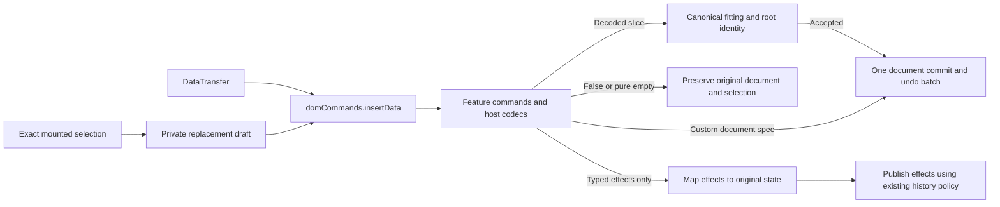

# Unify clipboard transfer and preserve complete slices

Status: Complete. The accepted implementation and every clipboard-owned proof
gate pass; the Plate development server is restored on port 3000.

Objective:
Execute one complete-slice contract and one clipboard policy owner across Plite,
Plate and mounted views, migrate every affected caller, and prove the result.

Completion threshold:
The accepted target is implemented across every listed owner and consumer;
complete slices, command dispatch, exact mounted targeting, retained provenance,
table/static transfer and upload lifetime have matching package and browser
proof. Teaching, generated registries, doctrine, exports and changesets agree.
The frozen production benchmark must pass on an uncontended host before the
ledger can claim fully verified performance. Publication remains outside scope.

Verification surface:
Current source and declared exports, complete-slice and fitting contracts,
authored/Yjs codecs, DOM and projected commands, Plate media/table/static tests,
real Chromium routes, source-first types, generated docs and registries, the
frozen production benchmark, and plan/ledger validators.

Constraints:
- Preserve exact mounted authored selection, complete referenced roots,
  destination schema law, transfer trust boundaries, atomicity and history.
- Keep independent Plate features separate. Inspect table/static/format
  transfer boundaries only where the shared contract requires adoption.
- Reuse the canonical fitter and document transaction owner unless evidence
  overturns the review. Every proposed public noun must earn an independent job.
- Use the current `next` checkout. No commits, PRs or publication.

Boundaries:
- Plite owns ContentSlice, extraction, fitting, transactions, DOM transfer and
  the adapter that resolves exact mounted targets.
- Plate owns product codecs, table placement and copied static preview policy.
- Collaboration remains a consumer of canonical document changes, not a
  clipboard transport or second root-identity owner.

Blocked condition:
None. The quiet-host benchmark passed on 2026-09-14 and the observed
`next dev --port 3000` server was restarted afterward.

Sources:
- [Clipboard review](../research/decisions/clipboard-content-fitting.md)
- [Task workflow](../../.agents/rules/task/references/workflow.md)
- [Complex decisions](../../.agents/rules/task/references/complex-work.md)
- [Best API](../../.agents/skills/best-api/SKILL.md)
- [Plite Plan](../../.agents/skills/plite-plan/SKILL.md)
- [Benchmark pre-acceptance method](../../.agents/skills/benchmark/SKILL.md)

Work Checklist:
- [x] Capture requested outcome, scope, authority and owner constraints.
- [x] Revalidate review evidence and inspect current types, exports and teaching.
- [x] Resolve slice graph, rewrite, pruning and destination identity laws.
- [x] Resolve DOM handler/codec interpretation, exact target atomicity and export.
- [x] Resolve table/static adoption without merging independent feature policy.
- [x] Compare the maximum justified cut and materially different API alternatives.
- [x] Run bounded behavior and pre-acceptance scale probes; record limitations.
- [x] Write normal/custom/advanced proposed calls, inference and error contracts.
- [x] Order implementation slices, docs/doctrine adoption, rollback and proof.
- [x] Reconcile clipboard planning state, pass the plan/local-link checks and
  record the global ledger inventory failure without absorbing another owner.
- [x] Implement complete-slice/root preservation, private fitting and prepared identity.
- [x] Retain authored source roots through checkpoint v5 and operation effect v4.
- [x] Replace clipboard contributions with `domCommands.insertData` and migrate callers.
- [x] Migrate table, static, projected, file and upload paths without merging their policy.
- [x] Repair public teaching, source workflow rules, doctrine, exports, registries and changesets.
- [x] Pass focused package, type, slow table and Chromium behavior proof.
- [x] Accept the frozen absolute production timing budget on an uncontended host.

Current decision:
Replace the separate clipboard-handler pipeline with the existing command
system. Preserve complete slices through rewrites and fit every accepted copy
through the canonical root-aware fitter. Keep mounted target resolution,
product codecs and table geometry with their current owners. Keep assembled
slice export, exact child-bound fitting and grouped table placement private;
none has an independent public caller. Reuse prepared transaction identity for
upload correlation instead of allocating live node keys in detached specs, and
carry exact host objects in commit-bound callback closures rather than cloned
effect values.

Final hard-cut verdict:
The earlier draft was too permissive. It proposed three public slice option
arms for internal callers and a live-key shortcut that contradicted the NodeKey
law. Cut the supplied-slice export arm, the public children target and the
public grouped `placements` arm. Reject the measured live-key-seeding candidate.
Reject putting `File` objects in typed effects, whose construction clones values.
The only new public surface that survives is `domCommands.insertData`, replacing
an existing public contribution system. Everything else repairs semantics or
stays behind the current slice, DOM, Table, static and Placeholder owners.



## Preserve the complete slice contract

Keep `ContentSlice` and its existing JSON envelope. Root constructors stay in
`plitejs`, inherited by identity through `platejs`. Keep `closed(content)` for
fresh known-closed content, `fromJSON(payload)` for untrusted shape validation,
and `withContent(slice, content, { open })` for rewriting existing content.

Change `withContent` so both openness choices preserve the immutable available
root payload. Closing structural edges never implies discarding referenced
content. Snapshot caller-owned replacement nodes; reuse only payload branches
the slice owner has already validated and frozen. A no-op can reuse the existing
trusted slice/variant machinery. Do not introduce another persistent cache.

Implemented public examples:

```ts
import { ContentSlice } from 'platejs';

// Existing slice rewritten without discarding its referenced payload.
const cellSlice = ContentSlice.withContent(incoming, cell.children, {
  open: 'closed',
});

// Intentionally new text has no inherited root graph.
const plainSlice = ContentSlice.closed([{ text: plainText }]);
```

`open: 'preserve'` retains the original depths and rejects impossible depths;
it does not guess or silently clamp them. The insertion-limit owner already
knows how truncation changes edge depths and must construct those exact values
while retaining the available roots. `fromJSON` remains schema-independent.

An intermediate rewrite may retain roots whose owners were removed. Resolve
reachability where the compiled schema is available, once at final export and
inside the existing fitting preparation. Do not add an eager graph pass to
every pure rewrite. Schema declarations decide which `childRoots` slots are
structural. Visit each reachable root once, including nested/shared graphs;
omit unreachable roots from serialized output and from materialized changes.
Never scan the destination document to recover missing payload content.

At insertion, roots referenced by surviving schema-owned nodes must come from
the supplied slice. A same-named destination root is not fallback content.
Unknown nodes follow the destination's existing vocabulary policy; reject a
missing root only when the surviving schema-owned graph requires it. Structural
shape errors remain programmer errors; a well-shaped slice that cannot produce
a valid destination graph returns `false` without publishing.

Allocate copied root identities once per accepted destination insertion, using
the current draft as the collision owner. Preserve shared aliases within one
copied group and give repeated groups independent names. Moves keep the existing
move owner and identities. Apply copy policy to content and roots at its actual
schema owner, once per intended copied occurrence. Do not treat a root remap as
proof that persisted-ID or property copy policy ran correctly.

## Record the slice design experiments

The [behavior/rewriting contract](artifacts/clipboard-design-contract.json) was
frozen before measurement. Its [probe](artifacts/clipboard-design-slices.ts)
proves nested/shared roots, repeated copies, truncation with preserved payload,
export pruning and missing-payload rejection. It intentionally does not prove
actual browser copy or the final fitting implementation.

The extra closure pass failed the rewrite-only stress budget. Six versions
tested read placement, immutable root reuse and direct schema ownership; their
source/result pairs remain under `artifacts/clipboard-design-slices-v*` plus
the final unnumbered pair. Those failures reject closure on every rewrite.

The distinct [complete export contract](artifacts/clipboard-design-export-contract.json)
places closure at publication and measures the same DOM exact-fragment writer
on both sides. Its [source](artifacts/clipboard-design-export.ts) and
[results](artifacts/clipboard-design-export-results.json) preserve full source
fingerprints, interleaved samples and exact payload equality/round-trip checks.
All four cohorts pass, with no new cache, subscription or destination scan.

| Export cohort | Current median | Candidate median | Result |
| --- | ---: | ---: | --- |
| 20 paragraphs, 2 roots | 0.076 ms | 0.090 ms | Pass |
| 1,000 paragraphs, 100 roots | 2.459 ms | 2.836 ms | Pass |
| 5,000 paragraphs, 500 roots | 17.138 ms | 20.666 ms | Pass |
| 20 paragraphs, 2 reachable and 500 discarded roots | 1.284 ms | 0.344 ms | Pass; different payload sizes, no speed ratio claim |

The fixed rule rejects overhead exceeding both 30% and 2 ms, or the absolute
cohort budget. This accepts the headless export placement only. It neither
erases failed rewrite-only results nor accepts table fan-out, DOM selection,
host codecs or production runtime. Those owners retain matching execution gates.

The [rooted children-target prototype](artifacts/clipboard-design-table/README.md)
copies the actual runtime and changes only its slice target adapter. All nine
correctness cases and four frozen cost cohorts pass. Matching two-child inputs
produce identical complete documents; one-child targets are candidate-only
because the current API rejects them. At 64 destinations, medians were
267.02 ms baseline, 266.75 ms candidate with two children and 233.58 ms candidate
with one child. This supports exact child bounds through the existing root
lifecycle, without a new allocator. It does not prove final table geometry,
named-root/key targets or the combined production closure implementation.

The [pure DOM terminal contract](artifacts/clipboard-design-dom/pure-terminal-contract.json)
and [receipt](artifacts/clipboard-design-dom/pure-terminal-overhead-results.json)
measure successful exact-range deletion, rewritten input, codec parsing, pure
replacement, commit and history construction on both arms. Undo/redo and result
assertions run outside the timer. All 21-pair cohorts pass their independently
frozen 1.5× baseline + 2 ms and absolute 16/100/750 ms thresholds, including
their noise rule. These are different operations and budgets from export.

| Document / pasted blocks / ranges | Baseline median | Candidate median |
| --- | ---: | ---: |
| 20 / 1 / 2 | 1.05 ms | 1.19 ms |
| 1,000 / 20 / 20 | 11.30 ms | 15.54 ms |
| 10,000 / 200 / 100 | 365.33 ms | 403.28 ms |

Twelve adversarial correctness cases also pass: false, throw, fitter rejection,
double delegation, empty handler/terminal consumption, forbidden non-document
results and accepted content plus a typed effect. Earlier mutable and boolean
terminal receipts remain historical rejected candidates. The final probe uses
a copied host-codec terminal that preserves `replaceSlice`'s pure result; the
Table empty-result case demonstrated why retaining a boolean bridge was wrong.
Mounted selection extraction, uploaded Files, root closure and production
entrypoints are not covered by these timings.

## Use the canonical command owner for paste

Delete `clipboardHandler`, `DOMClipboardHandler`, `DOMClipboardInsertContext`,
`DOM_CLIPBOARD_HANDLERS`, their special contribution inference, and
`dispatchDOMClipboardHandlers`. Delete projected paste's independent decoding
and fallback pipeline. Ordinary command registration already owns ordered
interception, changed input, linear delegation and immutable transaction results.
The DOM package retains MIME interpretation and a DOM-owned descriptor.

Proposed public syntax:

```ts
import { definePlugin } from 'platejs';
import { domCommands } from 'platejs/dom';

const PastePolicy = definePlugin('pastePolicy', {
  commands: ({ around }) => [
    around(domCommands.insertData, ({ input, state, next }) => {
      if (input.types.includes('application/x-blocked')) {
        return state.transaction(() => {});
      }
      return next(input);
    }),
  ],
});
```

The raw form uses `definePlugin` from `plitejs` and `domCommands` from
`plitejs/dom`. The existing normal call stays
`editor.api.dom.clipboard.insertData(data)`. It invokes the descriptor through
the same exact editor/view command facade as every other semantic operation.
Its public return stays boolean: `true` means an accepted transaction spec was
applied, including intentional empty consumption or an effects-only result;
`false` means the complete chain declined and published nothing. Mounted paste
and data-drop event owners prevent the native fallback only for `true`.
No app setup changes, second clipboard plugin, handler factory, public target
store, attempt object or savepoint API are introduced.

`domCommands.insertData` accepts `DataTransfer` at the DOM boundary and returns
the existing `false | TransactionSpec` command result. Core never imports DOM
types. DOM installation supplies the default interpretation, operating on the
provided state and exact caller context. A feature uses `state.transaction` to
produce a custom insertion. Callback parameters and installed feature updates
must infer from the existing command/descriptor generic; do not annotate them
or add caller generics to make the example compile.

The mounted adapter resolves its private ranges and insertion point, constructs
an unpublished deletion/selection context, and evaluates this command once
against it. The default tries exact fragment, configured eligible host codecs,
then plain text through the canonical replacement command. Each codec keeps its
current query/parse error reporting and decline policy. Destination-sensitive
parsing still sees the draft block, ancestors and marks.

Preserve the existing independent-format fallback: a malformed or unfit exact
envelope may decline to an eligible host/plain-text format, but deletion is
published only with that format's accepted result. Invalid data alone leaves
the target unchanged. A valid empty exact slice consumes without deletion or
fallback; preserve that distinction through the pure terminal.

Inspect the insertion result separately from the deletion prefix. General
`next.after(prefix)` deliberately retains a prefix even when the downstream
spec is empty; clipboard must not treat that composition as proof of insertion.
Reuse the current private spec context/evaluation/application functions to
publish both only after acceptance. Keep transaction and anchor isolation at
the canonical owner; do not emulate rollback through inverse public commands.

| Result | Clipboard behavior |
| --- | --- |
| A handler returns `false` | Canonical command fallthrough, abandoning any unreturned spec. |
| Whole chain returns `false` | Discard the replacement context; no deletion, selection write, history or commit. |
| Pure empty spec | Consume the event without fallback or deletion; preserve projected selection. |
| No document change, with typed effects only | Map effects through the inverse deletion prefix with their existing declared mappers; build a fresh effects-only spec on the original state. Preserve document, anchors and selection; use each effect's existing history policy. |
| Document insertion spec | Publish insertion plus exact selected deletions in one commit/history batch. |
| Throw | Discard unpublished work and propagate through the existing error owner. |
| `next(rewrittenData)` | Evaluate the downstream chain once with that data; obey existing linear continuation rules. |

Do not infer replacement from a truthy result, selection-only update, or host
side effect. A pure empty spec has no document changes, effects, explicit
selection write, annotations, tags or hidden metadata replacement. Use the
canonical spec owner to inspect hidden metadata; do not add a document
serialization pass merely to classify a spec. Arbitrary non-document specs
cannot be applied to the original state by guessing coordinate equivalence.
Selection-, annotation-, tag- and metadata-only outputs reject before publication.
Typed effects have an existing explicit mapping contract: map them through the
prefix's inverse `DocumentChange` using `mapEffect`, drop those whose mapper
returns `undefined`, and emit the remainder from a fresh `state.transaction`
on the original base. Put this in one private spec-owner helper so it also
carries accepted runtime-only `afterCommit` callbacks from the source spec.
Callbacks do not make an otherwise empty spec material and run only after a
document/effect/state commit. Do not apply the stale post-deletion spec or
evaluate a handler twice. Execution proof must include a custom non-identity
mapper whose payload shifts back to the original state, a mapper that returns
`undefined`, and one callback carried exactly once; the default identity mapper
proves only document-independent effects.

This effects-only branch preserves the real file-validation error job. Its
local history-skip error effect publishes once without target deletion or an
undo batch. The original all-effects rejection probe remains evidence for its
narrower candidate. The final implementation must prove mapped effects together
with spec-local callback carry; no existing File-effect receipt proves that
combined contract. No new public result type or effect-rebasing API is added.

Retained/ambiguous selections keep their current protection. A stale or retired
view never redirects an action to another mount.

Capture projected undo metadata only for the new committed paste batch. Empty
consumption must not attach metadata to the previous history entry. Model
selection, authored accepted/proposed coordinates and native DOM selection keep
their existing owners.

## Export the assembled selection once

Keep the public `editor.read.slice.export({ at? })` contract unchanged. An
already assembled projected or static slice is an internal adapter result, not
a second public export job. Add one internal executor at the existing slice
owner that applies installed export middleware and final schema-aware root
closure to a supplied `ContentSlice` without rereading selection. Export it
only through `plitejs/internal` for Plate's static/table adapters. The public
selection/range read calls that executor after extraction; projected and static
adapters call it after their exact assembly. `state.slice.get` remains
extraction without external export policy; `getFragment` keeps its independent
node-array query.

Private owner flow, not a public call:

```ts
const exported = exportContentSlice(editor, visibleSlice);
editor.api.dom.clipboard.writeSlice(data, { slice: exported });
```

Update the private export executor, exact-view forwarding and export middleware
context together. Middleware receives the supplied slice explicitly and must
not consult an unrelated current selection. Do not add a public `{ slice }`
option, overload or second export service until an independent application
caller proves that job.

Keep one shared payload writer. Explicit caller formats supplied to `writeSlice`
are authoritative, including an intentional empty string. Installed serializers
fill only missing MIME formats. Attach exact-fragment metadata to the final HTML
after precedence is resolved, when that HTML is nonempty. Explicit empty HTML
stays empty; the dedicated internal MIME entry still carries the complete slice.
`writeSlice` writes its supplied payload. The ordinary selection writer and
the private exact-view adapters own export policy before calling it. Preserve
recognition of absent, malformed, valid
empty and foreign-key internal envelopes; do not turn malformed claims into
successful deletions. No wire version or persisted document migration is needed
for unchanged `{ content, openStart, openEnd, roots? }` transport.

Assembly must preserve source identity as well as order. The
[authored-root diagnostic](artifacts/clipboard-design-table/authored-root-probe.ts)
proves that retained/current projections can supply different values for the
same root name, and the current spread merge overwrites one. It also proves
that ordinary retained owners can have no attached payload in their fragment
view. Schema-valid shared cycles make the projection-root collision observable;
do not impose a new acyclic graph law to avoid it.

Use one private, call-local root-name map per exact source projection, shared
across its segments. Rewrite declared references and that source's reachable
payload through the pure reference walker factored from the existing slice
root-remapping owner. Distinct source variants get distinct transport names;
same-source aliases remain shared. Validate each source before aggregation so
another segment cannot accidentally satisfy a dangling reference. No destination
root is allocated or materialized during this operation.

Accumulate content and root payload, then create the final immutable slice once.
The current loop snapshots the entire accumulated slice after each segment.
The [assembly contract](artifacts/clipboard-design-assembly-contract.json),
[prototype](artifacts/clipboard-design-assembly.ts) and
[receipt](artifacts/clipboard-design-assembly-results.json) support the single
finalization target. All three frozen cohorts pass, including source variants,
shared aliases, cycles and missing-source rejection. At 100 closed segments,
5,000 paragraphs and 500 roots, baseline/candidate medians were 503.45/19.15 ms.
This compares post-extraction assembly and writing; it is not a full browser
copy speed claim and does not cover open-edge joining or retained provenance.

The [persistence diagnostic](artifacts/clipboard-design-table/authored-provenance-probe.ts)
establishes an additional prerequisite: authored compaction can discard a root
payload while a pending retained owner still needs it. That value is absent
after reload, so replaying only surviving operations or borrowing current roots
cannot recover it. Complete retained payload capture, codec preservation and
private fragment projection must be adopted at the authored owner before this
copy path can claim complete slices. This is a transfer prerequisite, not a full
authored feature redesign. The [settled provenance target](artifacts/clipboard-design-table/authored-provenance-target.md)
and copied-runtime probe establish the following contract:

- Capture the schema-reachable payload from `captureAuthoredStep`'s exact
  before-snapshot into `retained.slice.roots`. Preserve it through retained
  sub-slicing and compaction. Accepted-counterpart content uses roots from the
  same accepted snapshot, not the retained or current document by coincidence.
- Keep the fragment projection for coordinate resolution. Its private slice
  extractor receives the retained payload explicitly, separate from the virtual
  coordinate root. This prevents a named coordinate root from shadowing a
  shared root with the same name. Apply copy policy there, then namespace
  sources during assembly and export once.
- Bump the authored checkpoint codec v4→v5 and the independently transmitted
  operation-effect envelope v3→v4. Retain earlier decoders. Clipboard's own
  slice envelope remains unchanged. New authored records must carry the
  captured graph; incomplete historical records cannot be made complete merely
  by encoding them under a newer version.
- Keep legacy documents readable. Recover a missing retained payload only from
  proven source data still available; otherwise decline that fragment's exact
  export without falling back to current roots. Resaving cannot recreate
  already discarded content. No second history store or replay-on-copy service
  is introduced.

The private event adapter distinguishes no projected selection from a projected
selection whose export was declined. Only the former can use ordinary selection
copy. A boolean that conflates those cases would reintroduce wrong-source copy
and unsafe cut fallback; keep this distinction private to the adapter.

Seven copied-runtime cases pass: attached payload, full self-cycle, distinct
variants, pending retained content after accepted compaction/reload and readable
legacy input with safe export rejection. The representation probe captures the
full available pool only to isolate codec/extraction behavior; that retention
approach is rejected.

The final [reachable-retention receipt](artifacts/clipboard-design-table/authored-retention-scale.md)
passes all frozen timing, work and byte budgets. It measures capture frequency,
actual accepted compaction, checkpoint serialization and reload/deferred decode.
Normal/large/stress cohorts retain 2/20/100 owners and finish the complete
sequences in 19/228/2,767 ms; these are bulk sequences, not per-keystroke latency.
The stress checkpoint is 2.55 MB with 534 KB of retained-root payload. The
32-owner shared-graph case records its repeated 640 root entries and 1.58 MB
of retained-root data rather than hiding duplication behind an unmeasured cache.
Unrelated roots are excluded, aliases/cycles survive, and the rootless baseline
is explicitly lossy rather than an equivalent speed comparison.

## Replace table children through the slice owner

The independent table investigation reproduced that a full cell text-range
replacement rejects a rooted slice when the cell contains one paragraph but
accepts it with two. Clearing children or inserting an empty paragraph first
does not provide the required contract. Detached `fitContent` supplies children
without root materialization or destination identity.

Do not add an exact-children arm to public `tx.slice.replace` or
`state.slice.fit`. Table is the only current caller, while ordinary public
child-array replacement already belongs to `tx.nodes.replaceChildren`. Add an
internal Plite slice-fitter operation and expose it only through the existing
`plitejs/internal` integration subpath used by Plate:

```ts
fitSliceChildren(tx, cellSlice, { at: destinationCellKey });
```

Resolve the parent from the current draft. Replace its structural child interval
while preserving that parent's key, properties and schema identity. Use the
existing fitter's `contentBounds`/`exactBounds`, root remapping, materialization,
limits, document validation and unpublished spec owner. A stale or non-element
parent returns `false`; impossible internal input remains a programmer error.
The private operand is `NodeKey | Path`. A Path is relative to the exact state
view's root; a NodeKey must resolve in that same root. Use the existing
root-bound state/view to target another root. A group cannot span roots. The
private grouped prototype exercises primary and named roots with paths and
keys. Production root binding remains an implementation check.

Keep table geometry in Plate. Preparation retains immutable complete source
slices per source anchor. The planner emits geometry changes and ordered
destination placements. Remove the destination-dependent fitted-node cache
keyed only by source anchor. One source rectangle/tile occurrence is one copy
group: aliases stay shared across its cells, and repeated tiles receive
independent root maps. A one-cell source repeated across destinations therefore
still gets independent copies. This follows the existing duplicated-group law
in `content-root-lifecycle-contract.test.ts`; no law supports splitting aliases
merely because the destination already contains a table.

Keep grouped placement on that internal integration subpath as well. It is one Table integration
operation, not a second public slice language or a public allocator/copy
service:

```ts
fitSlicePlacements(tx, sourceTile, {
  placements: [
    { at: firstCellKey, content: sourceFirstCell.children },
    { at: secondCellKey, content: sourceSecondCell.children },
  ],
});
```

`sourceTile` supplies the complete source root pool. Each placement supplies
known-closed child content and an exact children target. The helper has no
hanging, void-range or mixed single/group mode; public slice calls remain
unchanged. Resolve root-qualified stable parent keys against the current
draft; reject missing/duplicate parents, ancestor/descendant overlap and an empty
placement list without publishing. Recompute child bounds before each fit and
verify parent key, properties and schema identity after canonicalization and
before acceptance. Exact bounds alone do not prove those invariants.
Each placement closes structural edges while retaining the source pool.

Use one call-local root map per tile occurrence and the private child-bounds
fitting path without per-placement remapping. Apply copy policy once to placement
content and once per group root payload. After limits, destination fitting and
copy policy, compute final declared-reference reachability from the actual
fitted outputs against the source pool, preserving remap provenance. Reject
surviving missing references without consulting destination same-name roots.
Remove all unreachable group-created payload, including cycles, before final
document validation. Provisional materialization stays inside the unpublished
group spec. Cell content still fits in its actual destination context. The
group follows the ordered single-fit selection behavior; Table supplies its
final rectangle selection after placement. Repeated tiles call the grouped
operation separately inside the enclosing paste spec.

Reject the entire unpublished table transaction when any placement fails,
including late failures after geometry or earlier tiles. Keep this composition
inside the existing slice-fit transaction owner. It adds no persistent cache;
the root map lasts for one logical copy group only.

The earlier rooted child-bounds probe proves per-placement fitting and atomic
discard. The final [grouped correctness receipt](artifacts/clipboard-design-table/grouped-correctness-2026-09-13T11-09-45-551Z.json)
passes 20 cases, including shared aliases, independent/clipped tiles, final cycle
pruning, destination-borrowing rejection, parent/overlap guards, named roots and
late failure. Counters establish one remap/materialization per group. The
[grouped cost receipt](artifacts/clipboard-design-table/grouped-measure-2026-09-13T11-09-51-471Z.json)
passes all eight frozen absolute/noise checks across 1/8/32/64 destinations.
At 64 destinations, one group takes 189.45 ms and repeated two-cell tiles
187.32 ms against the 500 ms budget. These are not speed ratios against the
semantically different per-cell baseline. The earlier fixture-aborted run is
preserved. The final copied source is fingerprinted and checked after execution;
actual Plate geometry and production integration remain exits.

Rectangular export must not replace already processed cells with live children.
Project exact cells before copy/export policy, or construct the rectangle from
the processed cells. Single-cell unwrapping preserves its complete slice.
The shared planner's cell-drop consumer requires explicit copy versus move
handling; this migration must not turn moves into detached copies.

Retain `fitContent` for its actual detached grammar query, including HTML
construction. Remove its use as a complete transferable result in table paste.
Changing its return type alone would still leave root installation and identity
allocation in Plate, so that alternative loses.

## Copy static selections from their exact model coordinates

Replace static copy's trimmed-text equality and HTML-to-model reconstruction
with a private adapter bound to `event.currentTarget` and its `ownerDocument`.
Extend the existing element path/root attributes to the static text host,
including each string segment's existing start/end offsets, to resolve
partial text, decoration splits, empty sentinels and fully selected void nodes.
Pass the current content-root identity from `Children` to `BaseLeafStatic`;
do not infer it from the primary editor. Reuse the existing render/split pass
and host elements. Include coordinate/editor changes in the existing memo
comparators so a reused render cannot publish stale markers. Path-derived keys
already handle path changes; root/editor replacement still needs explicit
invalidation. No new React store, observer, subscription or second render pass.
Assemble model segments in DOM order, include owned roots once, then run the
same final slice export and writer as mounted copy.

Selected plain text and HTML come from the same captured DOM range, with
explicit-format precedence. Content outside that exact host is not guessed.
Incomplete coordinate resolution declines copy interception instead of writing
an allegedly exact internal payload. Two previews sharing an editor and an
iframe host must resolve against their own documents.

The [static render contract](artifacts/clipboard-design-static/contract.json)
and [receipt](artifacts/clipboard-design-static/results.json) compare complete
renders of the actual static component and a copied marker candidate. All three
frozen cohorts pass: baseline/candidate medians are 1.04/1.14 ms for 20 text
nodes, 40.37/40.98 ms for 1,000 and 365.54/380.61 ms for 10,000. After stripping
only the added attributes, markup is byte-identical. Empty and decorated
segments have exact offsets; added markup stays below the fixed byte limit.
Source remains stable. This supports the existing-render-pass placement, not
browser selection mapping, root swaps or memo invalidation behavior. Those
remain the named browser/component execution checks.

Delete the sole-purpose `ViewPlugin.getSelectedFragment`, `getStaticPlugins`
and tuple plumbing after source consumers migrate. DOMPlugin is already owned
by the core static composition. Do not remove independent preview rendering,
static HTML policy or table behavior as part of this clipboard change.

## Reuse committed upload placeholders

Move BaseImagePlugin's speculative FileReader/upload branch to the existing
placeholder insertion and upload lifetime. A file paste synchronously creates
the exact-target placeholder inside the accepted transaction. Keep the current
`tx.blocks.insertAfter`/`tx.nodes.insert` placement and replace-empty-block
owners. Direct `insertMedia` and DOM ingress both call the same pure
`tx.placeholder.insertMedia` method. Extend their existing fresh-source identity
branch: live updates keep assigning live keys, while detached specs assign
non-live prepared keys from the current private prepared-key mechanism before
`nodeKeyTransfers` copies them into the draft. The method reads each inserted
element with `tx.key` and registers the existing `afterCommit` upload callback
with the original File and prepared target key. Do not route node insertion
through slice replacement.

Make the existing `afterCommit` context spec-safe at the Plite transaction
owner. Store callbacks in a private `WeakMap<TransactionSpec, ...>` beside the
other prepared-spec metadata. Finalization captures them; extension and command
continuation carry them once; application appends them to the live transaction;
rollback, decline, throw, stale application and abandoned-spec collection drop
them without running. The callback remains absent from the public frozen spec,
history, collaboration and serialization. It runs only after an accepted
material commit, when the prepared key has become the live key, and calls
`api.upload`. This preserves the exact input File object required by the current
Placeholder contract. Removal, undo, disposal and a superseding upload keep the
existing abort and late-result guards.

Keep URL embedding in the image feature's command handler. Move file handling
to BasePlaceholderPlugin's command registration and delete its React-only
`on.paste` callback, which currently performs its own canonical-selection
lookup and update. Keep the current file-versus-HTML eligibility policy at that
owner. Drop routing retains its exact pointer-target adapter and current DnD
arbitration; it must not run the file import twice.

Remove Image's `uploadImage` and `disableUploadInsert` options with that file
branch. Configure the existing Placeholder `upload(file, { signal, onProgress })`
transport, which resolves a `MediaUploadResult`. The copied media kit's
`disableUploadInsert: true` workaround becomes unnecessary. An app that needs
to block file paste uses the same command policy as any other MIME rule. If
only Image is installed, URL embedding remains available and file input
declines; Image does not install Placeholder or all media dependencies. An
explicit Placeholder installation keeps its current dependencies. This plan
does not redesign the media package.

Validation is pure. Eligible invalid files produce a local history-skip marker
effect plus an `afterCommit` feedback callback; they do not carry a target key.
The marker gives the callback an accepted material commit while the callback
preserves the original `UploadError` and File objects when updating the existing
store. The effects-only spec rebaser above carries both through projected
deletion rollback. Both `insertMedia` and DOM ingress use that result, preserving
feedback without a speculative store write. File objects never enter effect
payloads, history, collaboration serialization or checkpoints. Redo restores
the existing insertion behavior without restarting an undone upload. The
live-owner control exposes a completion-history defect:
an uploaded image can survive undo of the original insertion. Repair that
boundary by preserving the placeholder's canonical runtime identity when
materializing the completed media. One undo must remove the completed result
and restore the pre-paste selection as well as cancel an unfinished upload.
Reuse the existing schema/media materialization and history owners; do not
add a second upload-specific undo log.

The [completion probe](artifacts/clipboard-design-dom/insert-owner-completion-results.json)
passes with the existing canonical type/property update: placeholder and child
keys survive, placeholder-only metadata is removed, one undo restores the
original document/selection, and redo restores completed media without uploading
again. Preserve that distinction from undoing a still-pending upload.

The first working identity prototype adds ElementIdPlugin and IDs on every
element. Reject it: it widens persistence/startup and its large paste cohort
fails the frozen cost budget. The next candidate pre-seeds runtime keys in
Placeholder. Its coherent source-stable run leaves the large cohort inconclusive;
that receipt remains rejected for acceptance.

The [causal diagnosis](artifacts/clipboard-design-dom/insert-owner-diagnosis.json)
finds that eager seeding makes fresh nodes take the live-key collision path:
20 file placeholders add 20 lookups and a full 2,000-node index build. Its later
timing receipt passes, but the mechanism is still rejected: allocating live keys
while building a detached transaction spec violates the identity law and the
existing discarded-spec contract. Do not remove `isBuildingTransactionSpec`
from `insert-nodes.ts`, pre-seed live keys, or add a public reservation helper,
unsafe flag, live counter, index or queue. Reuse the current private prepared
range allocator.

Reuse the current prepared identity mechanism instead. The
[prepared-key probe](artifacts/clipboard-design-dom/prepared-upload-key-results.json)
proves a detached ContentSlice insertion publishes no live key, exposes a
prepared key, adopts that exact key during commit and rejects stale replay. The
[prepared-key cost receipt](artifacts/clipboard-design-dom/prepared-upload-key-cost-results.json)
passes all frozen normal/large/stress budgets with stable source and 21 measured
pairs per cohort: baseline/candidate medians are 0.814/1.084 ms,
11.454/13.034 ms and 318.640/362.502 ms.

The [prepared-key gap receipt](artifacts/clipboard-design-dom/prepared-upload-key-gap-results.json)
prevents a false current-source claim: prepared slice identity is lost when its
node moves later in the same detached spec. It also confirms that public
`slice.replace(..., { at: [1] })` is node-start replacement when that path
already exists; do not misuse it as an insertion helper. The copied
[spec/callback contract](artifacts/clipboard-design-dom/spec-aftercommit-contract.json),
[three-file candidate patch](artifacts/clipboard-design-dom/spec-aftercommit-candidate.patch)
and [behavior receipt](artifacts/clipboard-design-dom/spec-aftercommit-results.json)
close the required path by assigning prepared keys to fresh node insertion:
the key survives a same-spec move, the exact File reaches one accepted callback,
named-root views and command continuation retain the callback exactly once, and
abandoned, thrown, stale and callback-only specs run none. The matching
[frozen cost contract](artifacts/clipboard-design-dom/spec-aftercommit-cost-contract.json)
and [cost receipt](artifacts/clipboard-design-dom/spec-aftercommit-cost-results.json)
pass 21 measured pairs in every cohort: baseline/candidate medians are
0.875/1.054 ms, 6.004/6.807 ms and 72.312/77.570 ms. The receipt covers complete
fresh-node insertion, spec acceptance, exact File identity, key resolution and
document equality. It excludes projected deletion, mounted targeting, upload
I/O and completion history; the production suites below cover those behaviors. Unit 1 generalizes
the prepared identity law; unit 3 keeps the existing node/block insertion
owners. The existing discarded-spec test remains the hard guard: no live
identity is published and no callback runs until the spec is accepted.

The earlier insert-owner completion, lifecycle, guard and timing receipts remain
useful diagnosis for upload ownership and completion undo, but they do not
accept live-key seeding as the final identity target. The mounted Chromium
upload route and production owner suite pass the unit 3 behavior exits.

## Keep cut tied to the captured transferable selection

Resolve and capture the exact selection once. Complete serialization and the
shared writer before deleting those captured ranges. A writer/serializer throw,
unresolved target, or policy that prevents complete transfer causes no deletion.
Do not fall back from a protected projected target to canonical selection. A
successful cut produces one document/history batch; read-only cut produces no
document change.

Keep any written/declined status private to the event/writer adapter. Existing
public `writeSelection` and `writeSlice` calls need no result object. Browser
`setData` completion proves that the event accepted the synchronous writes,
not that an operating system or external app persisted them. Native clipboard
proof must retain that distinction. Do not add a global clipboard store or a
second selection snapshot lifetime.

## Why these owners and cuts survive comparison

| Candidate | Decision and reason |
| --- | --- |
| Repair only projected fallback | Reject as target. It leaves a second interception system and the table/static root-loss paths. |
| Move all decoding before target resolution | Reject. Host codecs inspect the destination block, ancestors and marks. |
| Keep mutable handlers with a generic rollback/savepoint API | Reject. The probe cannot run `tx.command` inside immutable spec construction, and an empty handled result can retain only deletion. Existing pure commands already provide the needed isolation. |
| One command descriptor in the DOM entrypoint | Choose. `domCommands.insertData` follows the existing descriptor/facade convention, keeps DOM input out of core, and supplies one discoverable interception point for paste and data-based drop. It has no separate registry or lifecycle. |
| Put MIME policy in the core fitter | Reject. The fitter must also accept headless, parsed and authored slices without browser input or product codecs. |
| Replace ContentSlice with node arrays | Reject. Open edges and referenced roots carry independent transfer meaning. Keep the current value and wire shape. |
| Resolve the entire root graph on each rewrite | Reject. Six measured variants failed the frozen stress budget; intermediate rewrites need only retain immutable payload. Final export and fitting already have schema context. |
| New public prepared-transfer object or destination cache | Reject. Immutable slices, transaction specs and current-draft root allocation already own those jobs. |
| Change fitContent to return a slice | Reject for table placement. A detached result still cannot install roots or allocate independent destination identities atomically. Keep its actual grammar-query job. |
| Replace a cell using its full text range | Reject as the structural target. The copied-runtime baseline rejects the one-paragraph case; exact child bounds express the real operation. |
| Add exact-child or grouped-placement arms to public slice APIs | Reject. Table is the only caller and already crosses the `plitejs/internal` integration boundary. Keep both operations off the public root and DOM entrypoints. |
| Add public assembled-slice export input | Reject. Only projected/static adapters need it; route them through the existing private slice owner and keep public range export unchanged. |
| Delete table geometry or move it into Plite | Reject. Merged spans, rectangular tiling, growth and cell-drop behavior are independent table policy. |
| Reparse copied static HTML | Reject for the exact internal payload. DOM text is not an identity, root or schema-copy representation; exact model coordinates are available at the renderer owner. |
| Retain ViewPlugin only for a fragment getter | Cut. Its single clipboard convenience is replaced by exact-host extraction; static composition already owns DOM installation. |
| Invent a clipboard upload queue | Reject. Committed placeholders and their upload lifecycle already exist and have direct aborted-spec/undo/late-completion tests. |
| Put File objects in typed effects | Reject. Effect construction deliberately clones values, which breaks Placeholder's tested exact-File identity and sends host objects toward history/collaboration machinery. Carry existing `afterCommit` callbacks as private spec metadata instead. |
| Make existing `afterCommit` registration spec-safe | Choose. It preserves the current File/UploadError objects, executes only after accepted material publication and is discarded with an abandoned spec. No callback enters the public spec or a persisted channel. |
| Allocate live NodeKeys while building a detached spec | Reject even though the final timing prototype passes. It consumes live identity for work that may be discarded and contradicts the existing spec contract. Reuse prepared transaction identity. |

Rooted insertion and final export must each remain linear in the actual
transferred graph plus their existing destination work. Table repetition has
one independent root map per source tile occurrence. Preparation may
reuse the trusted immutable source, but never a destination-fitted result or
destination identities. No new subscription, persistent cache, document mirror,
codec registry or root allocator is part of this target. Prepared transaction
identity reuses the existing private token/key mechanism; it does not add a
public reservation service or a second identity owner.

The concept ledger links each decision to adoption and proof; numbered units
refer to the execution table below. Collaboration continues to receive ordinary
document changes and existing local/shared effect policy, never clipboard data.

| Surface | Current | Target | Owner | Reason | Adoption | Proof | Risk | Verdict |
| --- | --- | --- | --- | --- | --- | --- | --- | --- |
| Complete slice | Closing/limiting can drop roots | Preserve immutable payload; prune at schema boundary | Plite slice | Structural openness does not decide root ownership | Unit 1; Plate rewrites; clipboard docs | Slice behavior + export cost receipts | Orphan leakage or missing payload | rearchitect |
| Root identity and fitting | One allocator/fitter; table bypasses it | Same canonical owner, required payload closure and independent copies | Plite current draft | Destination identity must have one owner | Units 1/4; ordinary collaboration changes | Root lifecycle + copied-runtime table receipt | Root aliasing or borrowed destination data | keep owner; rearchitect preparation |
| Clipboard contribution system | Separate handler types, point, dispatcher and inference | Existing pure command registrations | Plite command + DOM input | It duplicates interception and continuation | Units 2/3/6; all producers, types, examples and doctrine | Pure terminal behavior/cost + contextual types | Changed precedence or false claims | cut |
| DOM command descriptor | Ingress lacks one canonical descriptor | `domCommands.insertData` in DOM entrypoint, identity re-export in Plate | Existing DOM installation | DOM input needs a typed command without core DOM types | Units 2/3/6; unchanged normal facade | Descriptor type probe; final import identity check | Extra owner disguised as a namespace | move to canonical command owner |
| Exact mounted target | Private projection adapter plus separate interpretation | Keep only exact-view target and atomic composition | Mounted view, canonical spec | Visible selection cannot be replaced by canonical selection | Units 2/5; native/cut/drop callers | Pure composition and actual Chromium projected proof pass | Wrong-view write or deleted rejection | keep adapter; cut duplicate policy |
| Export | Extraction/export differ by path | Assemble exact slice, run one internal export executor, finalize roots; public range export unchanged | Existing slice read + schema | Every external format needs the same selected payload policy | Unit 5; diff/table/static through `plitejs/internal`; current docs | Export receipt; final middleware/format round-trip | Double policy or live-node grafting | rearchitect internally |
| Retained root provenance | Rootless retained records and shadowed coordinate roots | Capture complete source payload; explicit private extraction; checkpoint v5/effect v4 | Existing authored capture/codec | Later compaction cannot recover discarded source content | Unit 1b, then 5; Plate authored/Yjs adapters and release guidance | Seven representation cases plus passing reachable capture/encode/decode cost and byte receipt | Historical missing data or oversized retention | rearchitect |
| Exact child/group target | Text-range surrogate and independent per-cell root maps | Internal exact-child and grouped-placement operations at the existing fitter/spec owner | Existing fitter target/spec owner | Whole child content and shared copy-group identity are distinct laws, but only Table currently needs them | Units 1/4; `plitejs/internal` bridge and table | Twenty grouped correctness cases, eight cost checks and the slow production table suite pass | Parent replacement, mixed-root target or split aliases | rearchitect internally |
| Table geometry | Plate planner and fitted-node cache | Keep geometry; retain source slices; remove fitted cache | Plate Table | Spans/rectangles are product behavior; fitting is not | Unit 4; paste/export/cell-drop docs/tests | Existing table suites plus rooted repeats and move checks | Partial geometry or duplicated IDs | keep geometry; cut cache |
| Static copying | Text heuristic, HTML reparse, ViewPlugin/helper | Exact-host model coordinates and shared export | Static renderer/copy adapter | Native DOM selection supplies position, not model ownership | Unit 5; static callers and docs | Static marker cost, 22 owner cases and real Chromium copy cases pass | Partial text/void/iframe mismatch | rearchitect; cut helper plugin |
| File paste | Image async branch plus React Placeholder bypass | Placeholder pure insertion, prepared keys and spec-safe `afterCommit` preserve exact Files until accepted commit | Media Placeholder + transaction spec + existing block/node insertion | Async work must follow accepted document changes; detached specs cannot publish live identity or clone host objects into effects | Units 1/2/3; media kit and upload docs | Fourteen owner cases plus real Chromium upload, completion and undo cases pass | Abandoned callback, cloned File, lost validation feedback, unstable prepared key or excess spec work | rearchitect |

No compatibility bridge survives the final target. Independent feature design
questions remain in their ledger rows even when a transfer consumer changes here.

## Adopt in complete, verifiable units

The [bounded adoption manifest](artifacts/clipboard-design-adoption-manifest.json)
defined the source, teaching and type/proof consumers used during execution.
Immutable review/doctrine history remains provenance. Each row below records the
dependency order and exit that the implementation followed; no row is an
independently publishable partial API.

| Unit | Change and owners | Exit before the next dependent unit |
| --- | --- | --- |
| 1. Complete slice, structural fit and prepared identity | `content-slice.ts`, `insert-limit.ts`, `public-state.ts`, `insert-nodes.ts`, `node-keys.ts` and the `plitejs/internal` fitter bridge. Preserve payload; add internal exact-child/group placement; assign current prepared-range keys to fresh node forests inserted by detached specs and preserve them through later same-spec transforms. Public slice and node signatures stay unchanged. | Existing slice/fitter/root lifecycle and native-spec tests pass; missing payload cannot borrow destination roots; one-child/two-child, shared groups and named-root targets fit or decline atomically; discarded specs publish no live key or consume live ordinals; queried prepared keys survive continuation/move and become the same live keys only on acceptance. Repeat bounded export/table/prepared-key costs against actual implementation. |
| 1b. Retained source payload | Authored `steps.ts`, `retained.ts`, `markup.ts`, checkpoint/effect codecs and the private slice extractor. Capture reachable roots, preserve them through sub-slicing/compaction and separate coordinate roots from payload roots. | Rooted retained copy survives accepted compaction and reload; same-name variants/cycles survive; legacy documents remain readable with exact-export rejection when provenance is missing. Versioned operation-effect/checkpoint round-trip and cost/retained-byte checks pass. |
| 2. Canonical DOM command and accepted local callbacks | DOM descriptor/default, `with-dom.ts`, `dom-editor.ts`, transaction-spec callback metadata/rebaser, projected command adapter and `mutation-controller.ts`. Keep the normal facade, interpret once, separate insertion acceptance from exact deletion, make existing `afterCommit` registration spec-safe without changing its call shape and migrate Plite-owned producers. | Replacement data, codec context, decline, empty result, throw, accepted insertion, mapped/dropped effects and selection plus one-step undo/redo pass. Spec extension/continuation and effects-only rebasing carry each callback once; abandoned, rejected, stale and rolled-back specs run none; callbacks alone create no commit. The replacement is proven before Plate callers move, but this is not a deliverable checkpoint and the old contribution pipeline is not deleted yet. |
| 3. Plate handler and upload adoption, then old-pipeline deletion | Image URL, CodeBlock, Table classification, InputRules, raw examples, Placeholder base command and React paste callback. Keep existing block/node insertion placement; direct and DOM file insertion call the same pure Placeholder method, use unit 1's prepared keys and unit 2's spec-safe `afterCommit`. Keep `insert-nodes.ts` detached-spec guard. After every Plate producer moves, delete the old contribution types, dispatch, inference and React bypass. | Existing feature-specific precedence and transforms run with inferred installed transaction types. File uploads receive the exact original File only after placeholder commit, at the exact mounted destination, and abort correctly. Validation feedback preserves original UploadError/File identity after acceptance. No fresh-node live lookup/index build; discard, prepared/live-key identity, stale replay, callback carry, mapped marker effect and completion undo guards pass. Repository scans prove zero old producers and no bridge remains. |
| 4. Table placement | `BaseTablePlugin.ts` and `features/table/lib/internal/paste.ts`. Retain complete source slices, group placements per source tile, delete fitted-node reuse, preserve move ownership. | Rectangle growth, merged/spanned cells, cross-cell shared roots, independent repeated/clipped tiles, copy-property policy and late rejection pass through one atomic paste spec. Cell-drop moves retain identities. |
| 5. Export and static capture | Internal assembled-slice export executor at the existing read owner, exported only through `plitejs/internal`; shared DOM writer, projected assembly, diff/table export middleware, static text markers/extractor and EditorPreview. Public `editor.read.slice.export({ at? })` stays unchanged. | Public range export and internal assembled export run the same executor exactly once, strip metadata from content and roots, respect explicit formats, resolve exact host/iframe selections and decline unresolvable static coordinates. Delete ViewPlugin/helper plumbing after callers migrate. |
| 6. Teaching and final proof | Public docs, raw examples, media kit, package barrels/type/import contracts, affected source rules and doctrine version. | Regenerated mirrors and registry are clean; required package/browser/scale gates below pass on the final source. Ledger adoption/proof then reflect actual outcomes. |

Units 2–3 are one caller migration boundary with no intermediate delivery:
prove the new path in unit 2, migrate every remaining producer in unit 3, then
delete the old contribution. Unit 4 needs unit 1;
unit 5 needs units 1/1b and the settled export contract. Source examples and
nearby documentation follow their owner during each unit rather than staying
knowingly wrong until a final cleanup. The final unit reconciles completeness.

Proposed advanced use, retaining inferred transaction capabilities:

```ts
import { BaseImagePlugin } from 'platejs/media';

const CustomImagePaste = BaseImagePlugin.extend(() => ({
  commands: ({ around }) => [
    around(domCommands.insertData, ({ input, next, state }) => {
      const url = input.getData('application/x-image-url');
      if (!url) return next(input);
      return state.transaction(tx => { tx.image.insert({ url }); });
    }),
  ],
}));
```

The [type prototype](artifacts/clipboard-design-types.ts) uses a local descriptor
with the proposed input type and the actual source command/plugin generics.
It checks raw and Plate contextual inference plus rejected wrong inputs and
uninstalled groups, without callback annotations or editor-type arguments.
It proves only the new DOM command contract. Exact-child/group fitting and
assembled-slice export stay private by design, so there are no new public slice
unions to type or document.

## Repair teaching with the API adoption

Update current clipboard, DOM, plugin API, static and media docs under
`content/docs`, including corresponding Chinese references where present.
Use current-state teaching, no migration narrative in reference pages. Release
changesets carry the breaking changes and app-facing adoption examples. The
exact-fragment envelope and main document grammar stay unchanged; authored
checkpoint and operation-effect versions change as specified above. Upgrade
the owning serializers, prior-version decoders, Plate authored adapter and
collaboration transport tests together. An older peer must not silently accept
an unsupported effect version. Roll out capable v5/v4 readers first. Only then
enable v5/v4 writers for a cohort whose minimum reader version is guaranteed,
or roll active collaboration rooms/sessions before those writers join. Do not
emit new records into an unproven mixed-version room. Keep this gate at the
existing collaboration deployment/codec owner; do not add clipboard-specific
wire negotiation.

The teaching cut also changes the source rules that explicitly prescribe
`clipboardHandler`: Best API `authoring-and-inference.md`, Plate Plugin Creator
`capabilities.md`, Plate Docs `references/plugin.md`, Plate Next `review-law.md`,
and `docs/vision/plate.md`'s clipboard authoring law. Use Maintain Workflow for
that execution step; update source rules, append the next Plate Next doctrine
version, regenerate with the owned install flow, and prove mirrors. Preserve
immutable doctrine versions and package attestations. Do not edit generated
SKILL.md files. Repair the smallest Plite Vision owner for the complete
slice/root and command laws and for the prepared-key distinction: detached specs
may expose opaque spec-local prepared keys, but those keys do not resolve through
the live editor, consume live allocation or become live until acceptance. On
acceptance the same key is adopted; on discard it has no live effect. Mirror
that distinction in Best API's schema-and-identity source rule through Maintain
Workflow.

Run `pnpm brl` for export/file changes. On `next`, regenerate the copied registry
with `pnpm --filter www build:registry` after the media kit/example source changes
and include the generated output. Templates remain CI-owned. Public package
import/type receipts must establish that Plate re-exports the exact DOM command
descriptor identity and does not create a second command or expose internals.

Rollback is an execution decision before publication: revert the whole affected
owner/caller unit if its behavior or fixed budget fails, retain the failure
receipt, and resolve the target before proceeding. Do not ship an alias layer,
dual handler pipeline, lossy fallback or feature flag as a permanent rollback
strategy. Clipboard envelopes do not need conversion. Authored v5/effect v4
data requires its capable reader: retain the upgraded decoder if rolling back
other behavior after new records have been written. Do not downgrade and discard
retained roots. Reopen the affected proof gate if any owner changes.

## Verify the actual implementation at each boundary

| Boundary | Named costly regression | Required execution evidence |
| --- | --- | --- |
| Complete slice | Closing/truncating loses a nested root, retained orphan leaks, shared roots become aliased across copies, or missing payload binds existing destination data. | Current content-slice, slice laws/public API, fit-content, slice-fit and content-root-lifecycle suites. Add only missing public-boundary cases; assert document, roots, source immutability and zero commit on rejection. |
| Exact paste | Replacement input is ignored, codecs parse in the wrong block, selected text disappears on decline/empty/throw, or one paste creates multiple undo steps. | DOM clipboard boundary, projected-clipboard and projected-command suites; prove handlers/parsers execute once and paste/undo/redo restore model and projected selection. |
| Export | Policy runs twice or is bypassed; live table cells reintroduce copy/diff metadata; explicit MIME data is overwritten. | DOM writer/clipboard contracts, diff export tests and table clipboard tests, including root-bearing payload round-trip and explicit empty MIME values. |
| Retained provenance | Accepted compaction loses a pending fragment's roots, its coordinate root shadows payload, legacy input borrows a later root value, or a new writer enters a room with an old reader. | Authored capture/compact-codec and checkpoint/operation-effect suites; complete rooted export before/after reload, cycles/variants, prior-version decoder, unsupported-new-version rejection, missing-provenance rejection and reader-first/cohort rollout proof at the collaboration owner. |
| Table | Single-child cells reject, repeated destinations share roots/IDs, or late failure leaves prior cell/geometry changes. | `BaseTablePlugin.paste.spec.tsx`, `BaseTablePlugin.clipboard.spec.tsx`, `internal/paste.spec.ts`, with rooted repeats, spans, growth and copy/move behavior. |
| Static | Partial/decorated text is guessed, root payload is lost, or a second preview/iframe selects from the wrong host. | Static writer, PlateStatic and exact browser clipboard cases using actual EditorPreview markup; empty/void/full/partial selections and explicit HTML/text versus exact payload. |
| Files | Abandoned paste starts an upload, targets canonical rather than mounted selection, clones the input File, changes a prepared key during same-spec composition, loses validation identity, or leaves completed media after paste undo. | Existing BasePlaceholder upload, native-spec and React placeholder suites plus projected file-paste/undo browser cases; assert existing block/node placement semantics, exact File/UploadError identity, prepared-key stability/adoption, callback carry/discard, marker-effect mapping, commit-first upload, live-key completion and one undo both before and after completion. |
| Cut/drop | Serialization failure deletes content; a protected target falls back; copy-drop becomes a move or dispatches twice. | Actual clipboard and cross-editor drag browser routes plus projected contracts, writer failure injection, read-only and unavailable-view cases. |
| Public API | Callback inference widens to any, removed names survive teaching/barrels, DOM types enter core imports, or internal fit/export helpers leak into root/DOM public entrypoints. | Source-first Plite and Plate typechecks, positive/negative fixtures, public import/packed-entrypoint checks where exported artifacts change, negative root/DOM import checks plus the Plate-only `plitejs/internal` import, doctrine/mirror and current-doc scans. |
| Scale | Added graph passes, per-destination preparation or prepared-key maintenance produce an unacceptable complete-operation regression. | Replay the frozen export, assembly, retained capture/codec, private children/group placement, prepared-key, DOM/File and static-render contracts on baseline/final source. Then measure production copy/paste through actual codecs, selection, commit and history on normal/large/stress documents; record source, paired samples, operation counts and unchanged budgets. |

Use Verify Plate's [command recipes](../../.agents/rules/verify-plate/references/commands.md)
to select the narrow affected runner while iterating. Plite React contracts use
their package Vitest wrappers; Plate's existing source tests use their verified
Bun entrypoints. Final Plite handoff requires `pnpm check:plite`; mounted changes
also require `pnpm check:plite:browser-matrix`. Run source-first Plate typechecks
and affected Plate/table/static/upload tests. Match browser routes to their
owned managed runner and record serving-source identity. Do not claim native
clipboard or device behavior from headless DataTransfer doubles.

Planning evidence retained for provenance:
- The operation-level prototype families above preserve fixed contracts,
  raw samples, source identities and behavior guards; none edits product source.
- Source type probe: `pnpm exec tsc --project docs/plans/artifacts/clipboard-design-types.tsconfig.json --pretty false`; the original and [reconciled receipt](artifacts/clipboard-design-types-reconciled.log) pass. An intervening missing internal export was repaired by its owning task. The subsequent core plugin rename is reflected in the current fixture; its [latest replay](artifacts/clipboard-design-types-final.log) reports unrelated Plate migration errors (`DOMExtension`, lifecycle error fields and plugin lookup projections), with no diagnostics in the fixture. This latest invocation is a failure, not a new pass. Preserve the earlier inference evidence and require a coherent source-first typecheck at execution entry.
- Fresh core baseline: `bun test --preload ./config/plite-source-test-setup.ts ./packages/plitejs/test/content-root-lifecycle-contract.test.ts ./packages/plitejs/test/content-slice.test.ts ./packages/plitejs/test/slice-fit-content-contract.test.ts` — 36 passing tests in three files; [log](artifacts/clipboard-design-core-tests.log).
- Existing upload lifetime: `bun test --preload ./config/plite-source-test-setup.ts ./packages/platejs/src/features/media/lib/placeholder/BasePlaceholderPlugin.upload.spec.ts` — 14 passing tests; [log](artifacts/clipboard-design-dom/placeholder-owner-tests.log).
- Current detached-spec identity: `bun test --preload ./config/plite-source-test-setup.ts ./packages/plitejs/test/native-transaction-spec-contract.test.ts` — 5 passing tests. Discarded specs do not consume live key allocation, and rollback/replay behavior remains guarded.
- Prepared upload identity: the [acceptance probe](artifacts/clipboard-design-dom/prepared-upload-key-results.json) and [cost receipt](artifacts/clipboard-design-dom/prepared-upload-key-cost-results.json) pass. The [gap receipt](artifacts/clipboard-design-dom/prepared-upload-key-gap-results.json) deliberately reproduces the unresolved production gap: later same-spec movement loses the prepared key. Its occupied-path case also rejects using public slice replacement as an insertion helper; existing block/node insertion remains the owner. Prepared-key stability is a unit 1 exit, not a passing integration claim. The older insert-owner receipts remain rejected for live-key seeding and for cloning File objects through typed effects; their completion-undo observations remain diagnostic only.
- Current DOM baseline: `bun test --preload ./config/plite-source-test-setup.ts ./packages/plitejs/test/dom/clipboard-boundary.test.ts` — 62 passing tests after the plugin rename; [log](artifacts/clipboard-design-dom-final.log).
- Current projected command baseline, from `packages/plitejs`: `bun run test:react test/react/projected-command-contract.test.ts` — 45 passing tests after the plugin rename; [log](artifacts/clipboard-design-projected-final.log).
- Planning closeout: Autogoal's plan validator passes and all 49 plan links plus
  14 decision links resolve locally. `review-ledger lookup clipboard` confirms
  `reviewed / planned / partial / task` and the expected plan/decision links,
  while also reporting its old working-tree observation as stale. The global
  `review-ledger check` currently exits 1 at an unrelated stale
  `browser/suggestion` inventory fingerprint before it can report a clean global
  result. This task does not refresh that owner or claim a passing global ledger.
- The prior review's 241 tests remain historical baseline context. One recorded
  owner, `public-state.ts`, had changed at intake; current prototype receipts
  fingerprint the actual source rather than relabeling old proof as current.
- [Source reconciliation](artifacts/clipboard-design-source-drift.json)
  records the first concurrent changes after the early probes: JSDoc/name cleanup, DOM
  extension-point/Trusted Types names and the profiler global identifier. No
  measured slice, fitting, spec, root or retention algorithm changed. Headless
  probes did not install that profiler. Preserve the original receipts and
  source hashes; do not rerun unchanged cost paths to obtain newer timestamps.
  Later authored inspection types and descriptor/internal-export adoption are
  recorded separately. The latter temporarily broke mixed Plate/Plite startup;
  the spec/callback cost probe freezes coherent copied source and records its exact
  common startup adaptation. Those unrelated product changes remain with their
  owners. The final core factory/file rename to `definePlugin` is reconciled in
  current examples, the type fixture and ledger discovery pointers; immutable
  prototype source snapshots retain their original names.

Verification evidence:

- Complete-slice, fitting, prepared-spec, authored checkpoint/effect and Yjs
  contracts pass across 270 focused Plite cases. `ContentSlice.withContent`
  retains its available root graph; final export and fitting prune by reachable
  references and allocate destination identities once. Rootless schemas take the
  direct export path.
- DOM clipboard and host/public contracts pass 101 cases. Projected React
  clipboard, command and provider contracts pass 109 cases. The old public
  `clipboardHandler` contribution pipeline is absent; `domCommands.insertData`
  owns typed interception and the default exact-slice/codec/text path.
- Plate media/table integration passes 86 focused cases. Placeholder upload
  completion preserves the prepared/live key, exact `File` and validation error
  identity, skips completion history and restores preinsert/completed states
  through undo/redo without starting a second upload. The slow table suite passes
  all eight cases and 666 assertions.
- Static rendering and exact model-coordinate clipboard ownership pass 22 owner
  cases. The real Chromium static/upload routes pass three cases on the isolated
  port-3999 source server. The direct Plite clipboard/drag browser matrix passes
  296 cases with 16 expected skips across Chromium, Firefox, mobile and WebKit.
- The source-first clipboard fixture passes. Affected Plite core, DOM, React,
  authored, history and Yjs partitions pass; affected Plate core, media, table,
  static, root, React, code-block and proxy partitions plus both package contract
  typechecks pass.
- Barrels and both production/development registry payloads were regenerated
  from source. Current public docs and source rules teach the canonical command,
  complete slices, retained provenance and exact static ownership. Plate Next
  doctrine v190 validates with source fingerprint
  `sha256:3ffc710418f59c2cfab48813ce7f5df008d8acf5eadd42c327cea54cf6fb2803`.
- The ledger maps the three new clipboard source groups and read-only Suggestion
  inventory discovered during closure. `review-ledger check` passes with 804
  features, 3,654 files, 62 scopes and 47 immutable records. Its quote-compatible
  capability parser passes all 23 ledger tests.
- The canonical benchmark contract itself passes four cases. The preserved
  [production receipt](artifacts/clipboard-production-benchmark.json) passes
  correctness and operation-count guards, including one 10,000-line paste
  commit, zero copy-property visits/index builds and the 50,000-block cut budget.
  The authorized quiet-host replay has zero correctness or issue-budget
  failures: 10,000-line paste is 46.73 ms p50 against 60 ms, populated
  full-selection copy is 17.06 ms p50 against 20 ms, populated middle paste is
  57.93 ms p50 against 280 ms, and the 50,000-block cut is 25.27 ms edit-only
  and 28.33 ms with copy. The Plate server was restored on port 3000 after the
  measurement.
- `pnpm check:plite` reaches unrelated generic plugin-variance failures in
  `authored-view.test.tsx` and `range-geometry-contract.test.tsx`; no clipboard
  diagnostics remain. The managed browser matrix passed its heavy-document cases
  before concurrent Suggestion source mutation invalidated the aggregate run.
  These concurrent-owner failures are preserved as aggregate limitations.

Runtime, caller, browser and public-export adoption are complete. The ledger is
`adoption: adopted` and `proofState: verified`: every clipboard-owned package,
browser, type and frozen production-performance gate passes. Concurrent source
still limits unrelated aggregate commands, without invalidating owned proof.

## Design readiness at execution intake

| Gate | Evidence and disposition | Result |
| --- | --- | --- |
| Current job, hard laws and strongest cut | Complete slices, exact targets and atomic history retained; separate contribution pipeline and speculative upload path cut. | Pass |
| One owner per responsibility | Concept ledger resolves core fitting/identity, DOM interpretation, exact mounted targeting and independent Plate geometry/rendering/upload jobs. | Pass |
| Public contract and adoption | Normal/custom/advanced DOM command calls, errors, inference, breaking caller/teaching map and authored codec adoption specified. Internal assembled export and exact/group fitting are explicitly withheld from the public API. Contextual inference passes on the recorded coherent source; the latest unrelated plugin-migration failures are an execution-entry prerequisite. | Pass |
| Scale-sensitive target | Passing fixed-contract export, assembly, retained capture/codec, DOM composition, private child/group placement, prepared-key/spec-callback insertion and static-render receipts. Failed/inconclusive or architecturally rejected predecessors remain historical evidence. | Pass |
| Source and proof limits | Full prototype source identities and concurrent-change reconciliation retained. Current owner baselines pass; browser/native and final production claims are reserved for the exact execution checks above. Clipboard state resolves correctly, but its old source observation and the global ledger inventory are explicitly stale rather than relabeled as passing. | Pass with recorded external freshness failure |
| Executable handoff | Seven dependency-ordered units include package, browser, scale, doctrine, registry and rollback exits; independent feature reviews remain separate. | Pass |
| Open decisions | No unresolved target choice or runnable planning probe remains. Remaining risks are implementation obligations, not provisional design verdicts. | Pass |

The [final verification receipt](artifacts/clipboard-design-final-verification.json)
records the ledger state and freshness, source paths, links, candidate scope and
the final behavior/cost receipts.
Design readiness supplied the accepted target and execution order. This task
still carries no commit, PR or publication authority.

Open risks:
Aggregate Plite test typechecking and the managed browser matrix still depend on
concurrent plugin/Suggestion work settling, although every clipboard-owned
partition and the direct cross-browser clipboard/drag set passes. Raw
native-device clipboard behavior and publication are not claimed.

Next action:
None within the authorized scope. Commit, PR and publication remain separate
actions requiring their own request.
