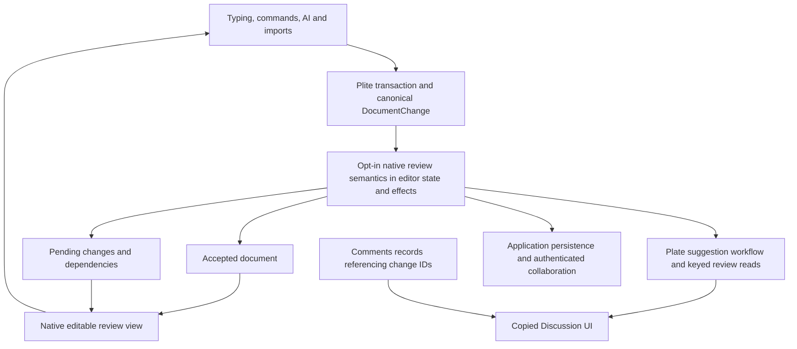

# Suggestions, Discussions and authored revisions

**Pursue native authored-change semantics in Plite. Delete Suggestion's independent mutation engine.** Keep Plate responsible for suggesting mode, review grouping and presentation. Build on `DocumentChange`, `EditorCommit` and the existing state/effect infrastructure. Accepted content and durable pending changes must be logically distinct, with a native editable review view. The physical representation and public API are unselected; both require correctness and a paired scale experiment before acceptance.

This is an architecture assessment dated September 10, 2026. It does not certify a replacement implementation, reproduce every reported destructive interaction, or authorize product changes.

The [skill audit](skill-audit.md) applies the missing owner and proof checks. It narrows the proposed subsystem, records a concurrent shared-field counterexample, adds performance acceptance criteria and keeps implementation readiness explicitly open.

**The Comments lesson**

The [August 31 motivation](../../../plans/2026-08-31-hard-cut-comments-ownership.md) identified wrong ownership, duplicate truth and wrong lifetime: comment bodies, document marks and a document-wide Discussion index were coupled. Preserve that diagnosis. Do not preserve its later-superseded application channel/factory target or transfer its production score to Suggestions.

The [latest package-data plan](../../../plans/2026-09-09-comments-package-data.md) puts serializable records, actions, mapped ranges, subscriptions and disposal in Comments. Applications fetch and save; copied UI presents. The [initialization plan](../../../plans/2026-09-09-comments-initialization.md) preceded that correction. The [September 5 execution](../../../plans/2026-09-05-comments-complete-source-and-api-execution.md) and [September 6 parity review](../../../plans/2026-09-06-comments-discussions-main-parity.md) establish another law worth preserving: replying to a suggestion does not make the reply store the owner of suggestion acceptance, rejection or history.

Comments annotate content that already exists. A suggestion can introduce content that does not exist in the accepted document. A comment-style range record cannot make that content editable, preserve its deleted counterpart, or map edits between those two coordinate spaces.

**Current source and two executable observations**

`BaseSuggestionPlugin.ts` owns serialized suggestion data, identity/grouping, semantic command interception, text and structural mutation, acceptance and rejection. Its review read reconstructs groups from document nodes. `useSuggestionReviews.ts` decides when document changes require those groups to be read again. Copied `suggestion.tsx` adapts them for cards; `discussion.tsx` combines them with Comments records and dispatches the decision back to Suggestion.

The [retained model probe](sources/current-owner-probe.mjs) runs against current Plate source:

```sh
bun docs/plite/research/2026-09-10-authored-changes/sources/current-owner-probe.mjs
```

Its [output](sources/current-owner-probe.log) establishes:

1. With `isSuggesting: true`, applying a canonical `DocumentChange` through `tx.changes.apply` replaces `original` with `replacement` and creates zero suggestion reviews. This is a low-level public mutation route, not proof that ordinary typing bypasses tracking. It proves that suggesting mode is not a complete mutation boundary. The core implementation directly applies the canonical change; the Suggestion owner handles selected semantic commands.
2. Loading one text span with Alice and Bob insertion IDs produces two reviews. Rejecting Alice's ID removes the text and both reviews. The fixture uses the overlapping serialized shape already represented in the package's tests. This proves collateral review removal for that shape, not that two particular typing sequences naturally produce it. A dependency-aware API must either declare the cascade or refuse it; silently treating it as an isolated decision is inadequate.

The source supports the observations: acceptance and rejection clear properties, merge nodes and remove matching nodes; they do not expose a dependency/conflict result. Splitting this file would not change that ownership problem.

Plite already has the important lower building blocks. `EditorCommit` carries before/after snapshots, canonical and inverse `DocumentChange`, versions, annotations and effects. `DocumentChange` supports application, serialization, composition, inversion, position mapping and pairwise transformation. State fields persist through the document's versioned `meta` envelope; effects have codecs, mapping, inversion and history/collaboration policies. History records effects with inverse changes, and Yjs transports shared effects with checkpoint handling. Reuse or repair these owners before creating another store, serializer or transport.

Those facilities do not establish concurrent review semantics. The [follow-up probe](sources/shared-field-probe.mjs) finds divergent active field values after two peers concurrently replace a shared record list, despite identical synchronized Yjs data. The [skill audit](skill-audit.md) records that limit and the 31 passing existing facility tests. A proposal collection needs its own merge and conflict laws; wrapping a whole record map in `defineStateField` does not supply them.

**What the external evidence changes**

| Candidate | Evidence and useful contribution | Limit for this decision |
| --- | --- | --- |
| Google Docs | Public API exposes inline, accepted and rejected suggestion views with different positions. Its developer-preview write API applies suggestion intent to a batch. [API](https://developers.google.com/workspace/docs/api/how-tos/suggestions) | Confirms observable contracts; reveals no proprietary storage design. Preview API availability is separate from established UI behavior. |
| Yjs 14 | Current source, `96c96e1`, package `@y/y` 14.0.0-rc.26: `DiffRenderer` connects base and proposal documents; supports selective and whole-document decisions. Attribution is rendered from a separate dimension. [Source](https://github.com/yjs/yjs/blob/96c96e1fcb1ef6ce866d5264b3f97f7f77b11f64/src/utils/Renderer.js) | Strongest matching runtime prior art; a prerelease and a different API from Plate's current Yjs 13.6.30 integration. No upstream runtime tests were executed here. |
| Current y-prosemirror | Its transformer pipeline renders attribution as marks and strips those marks on the write-back path. [Architecture](https://github.com/yjs/y-prosemirror/blob/20f32ad96cb7f117913bde2469dd29b610bd43b1/ARCHITECTURE.md) | Documents split/merge representation limits, strict-schema failures and review views that can violate ordinary schema constraints. [Caveats](https://github.com/yjs/y-prosemirror/blob/20f32ad96cb7f117913bde2469dd29b610bd43b1/CAVEATS.md) |
| Y/hub | Server source attaches authenticated user attribution to inserted/deleted content IDs; rollback filters by author/time/content and records the rollback's author. Separate retained-history handling. [Worker](https://github.com/yjs/yhub/blob/ca33cf4b3d5efee023a6544cc3d7c66b87f28a61/src/compute-worker.js), [API](https://github.com/yjs/yhub/blob/ca33cf4b3d5efee023a6544cc3d7c66b87f28a61/API.md) | Best direct evidence that per-author history and selective revert are distinct, implementable jobs. AGPL source; extract laws, do not transplant code. |
| Automerge | Current source has causal heads, views, writable forks, retained changes, diffs and separate author-to-actor mapping. [Implementation](https://github.com/automerge/automerge/blob/1618c976ca23fca8282c4a69ebbb0bb0c3f27ab1/javascript/src/implementation.ts) | Strong revision/history reference. Causal history does not decide which dependent edit a reviewer intended to accept. Replacing Plite's storage still requires editor-native proof. |
| Loro | Change metadata records peer identity, dependencies, timestamp and message. Undo maps through remote changes. [Metadata](https://github.com/loro-dev/loro/blob/d5da57dd2a91d735656808cbbe2a3f1c755c2441/crates/loro-internal/src/change_meta.rs) | Its UndoManager explicitly operates from one peer's perspective; it is not an all-authors review engine. [Undo source](https://github.com/loro-dev/loro/blob/d5da57dd2a91d735656808cbbe2a3f1c755c2441/crates/loro-internal/src/undo.rs) |
| Handle with Care | Rewrites ProseMirror transactions into insertion/deletion/modification marks, including dedicated structural-step handling. [Source](https://github.com/handlewithcarecollective/prosemirror-suggest-changes/blob/653fba70ba29ef6ea6af3ad8d60244a58df7281b/src/withSuggestChanges.ts) | Strong mark-based alternative, but retains operation-specific rewriting. Issues expose newline coverage and suggestion-group identity pressure: [11](https://github.com/handlewithcarecollective/prosemirror-suggest-changes/issues/11), [26](https://github.com/handlewithcarecollective/prosemirror-suggest-changes/issues/26). Issue reports were read, not replayed. |
| Manuscripts | Source tracks replacement, replacement-around, formatting and attribute steps, plus structural grouping and selection remapping. [Tracker](https://github.com/Atypon-OpenSource/manuscripts-track-changes-plugin/blob/62f4d19dda4c2d41afa5d9fdecea840fb6bfb0be/src/tracking/trackTransaction.ts) | Demonstrates how much persistent complexity remains in a careful mark/attribute rewriting design. Apache-2.0 headers inspected; no code copied. |
| SuperDoc | Public source separates logical review IDs from representation details, distinguishes tracked/visible positions, guards revisions and exposes multi-ID decisions. [Contract](https://github.com/superdoc/docx-editor/blob/cabf6fae68167efa98eeec13ec11bdb0461fb674/packages/document-api/src/track-changes/track-changes.ts) | Valuable document-review API reference. This read covers the public decision contract and docs, not a complete audit of its mutation kernel. AGPL repository. |
| CKEditor 5 | Suggestions metadata and document data are persisted together; commands are disabled until integrated with tracking. Core retains operation history and deleted nodes. [Integration](https://ckeditor.com/docs/ckeditor5/latest/features/collaboration/track-changes/track-changes-integration.html), [custom features](https://ckeditor.com/docs/ckeditor5/latest/features/collaboration/track-changes/track-changes-custom-features.html) | Useful fail-closed and persistence precedent. Premium track-changes implementation was not inspected. |
| Tiptap | Current official docs label tracked changes a paid alpha and expose programmatic review operations. [Docs](https://tiptap.dev/docs/editor/extensions/functionality/tracked-changes) | Product/API comparison only; no source-level reliability conclusion about the paid extension. |
| Lexical, Quill, Fidus Writer | Lexical history stores editor states; Quill history stores/transforms inverse deltas. Fidus Writer was metadata-screened as an alternative editor. | No stronger reusable proposal primitive established by these bounded reads. This is not a claim that their ecosystems lack tracking implementations. |

The Yjs finding strengthens the direction and supplies its sharpest objection. A merged state can converge while losing content. The current binding explicitly resolves some invalid schemas by deleting invalid nodes; [issue 258](https://github.com/yjs/y-prosemirror/issues/258) confirms the policy. Plite must preserve schema and document intent through review decisions, not inherit that policy as acceptable merely because replicas agree.

Marks can still be a rendering or import/export format. The cut is **marks as the authority for a proposed edit**. Rendering alone cannot provide editable proposed content either: a native review view must participate in selection, input, clipboard, schema validation and position mapping.

**Recommended ownership and state**



The arrows describe ownership, not a prescription to add one class or store for every box. One committed editor state owns document and proposal data. An opt-in review capability owns proposal meaning and decisions; its public entrypoint is unselected. The displayed review document is derived, not another independently saved authority. Do not introduce a hidden second editor, a host-managed provider or an application replay loop. This requires a real Plite model/runtime change: today's Decoration and Annotation layers cannot make absent proposed content editable.

**Plite owns** the canonical edit representation; atomic capture before publication; revision identity; versioned application and rebasing; dependency-aware decisions; mapped positions across accepted/review views; and the integration with history, native input and collaboration. Reuse transaction annotations for typed metadata before inventing a parallel commit protocol. Metadata transport, persistence and defaults still need an explicit contract: an arbitrary annotation does not establish durable authorship.

**Plate owns** the Suggestion product entrypoint, editing/suggesting/viewing policy, grouping defaults, descriptions, shortcuts and review permissions exposed to UI. Remove its per-command mutation replacements, serialized suggestion-property protocol and document scans used to rediscover proposal identity. Keep a plugin only for those independent product jobs; it must not be a second revision engine.

**Comments owns** replies and explicit thread resolution. A suggestion reply references a stable change/review identity. Accept/reject updates the revision's status; it does not delete messages or manufacture a second comment range. Discussion remains the combined presentation and navigation layer. Its local layout state is legitimate; mirrored proposal status and mutation logic are not.

**Applications own** authenticated identity, access control, network/database operations and retention policy. Keep ordinary persistence behind the canonical document envelope and its codec owner when the chosen representation permits it. A separate revision serializer must earn an independent job. A pending change must be saved even though accepted content is unchanged. Document and proposal revisions cannot be persisted independently without a common durable version/commit boundary.

A proposal record needs more than `{ range, text }`: stable identity, author, source/cause, base revision, canonical change payload, review grouping and dependencies. Before-content needed for deletion/rejection must remain recoverable. Runtime `NodeKey` and editor-local anchor handles must not become serialized IDs. The design must choose durable revision-relative positions or stable persisted identities and prove restoration across reload and collaboration.

**Authorship, suggestions and history**

Capture authorship at the committed transaction/change-group boundary, preserving lower edit structure inside `DocumentChange`. One semantic action can produce many text, structure and normalization steps. Attributing independent low-level steps would expose implementation noise and can split an indivisible replacement or table edit.

Capture proposing intent before mutation publication; an after-commit observer cannot protect accepted content. Bind local intent to the originating view/input or explicit programmatic transaction, and preserve remote intent. Authorship metadata should not force an ordinary editor to retain all history or create a review projection. Optional archival history consumes the same identities and changes with its own retention policy.

Keep human author identity separate from a replica/client identity and from the author of a later review decision. One person can have multiple devices; a remote edit must retain its original author. AI edits should retain their source and initiating user without masquerading as ordinary human keystrokes. Current Automerge source explicitly separates authors and actors; Y/hub shows server-authored attribution rather than trusting a UI label.

Four jobs share change mechanics but require different semantics:

| Job | Required behavior |
| --- | --- |
| Local undo/redo | Reverse the user's recent action in the active view while mapping through intervening changes. |
| Pending review | Accept or reject selected proposals, including a query by author. |
| Authored history | Read retained changes and decisions by author/revision; reconstruct or compare retained versions. |
| Revert accepted work | Create a new compensating change after checking present-day dependencies and conflicts. Do not erase historical events. |

`reject({ authorId })` should mean pending proposals by that author. It must not mean reversing every operation that author ever performed. Existing Plite History batches and Yjs/Loro undo stacks do not supply a durable audit log merely by adding `userId`. Full history needs retention, checkpoints, schema/version decoding, authenticated provenance and explicit unavailable-history results after pruning.

The critical example: Alice proposes a paragraph; Bob edits its contents. Rejecting Alice may also remove Bob's work. A correct engine must identify that dependency and either block the isolated decision or return the explicit closure that the reviewer can decide. Likewise, accepting Bob cannot silently accept Alice. A plain author filter cannot solve this. Refuse unsupported structural operations before any document publication; do not run an ordinary edit because tracking does not recognize it.

**Proposed contract; public spelling unselected**

The ownership flow above is the target sketch. It does not approve a `Revisions` namespace, descriptor or separate export pipeline. Best API must test these against the existing change, state, effect and persistence owners before selecting imports or signatures.

| Caller job | Required owned operation |
| --- | --- |
| Make a proposed edit | One native transaction captures authored intent and a supported canonical change before publication. |
| Review changes by author | One semantic read returns pending change identities and their dependency/conflict state. Human author and device identity remain distinct. |
| Accept/reject selected work | One decision selects IDs at a durable revision, validates the entire batch and returns an applied/already-applied or stale/conflict result. Concurrent contradictory decisions require an explicit convergence or authority rule. |
| Save and restore | One coherent document/review checkpoint through the canonical codec owner; proposals survive reload. Accepted-content export is an explicit projection job. |
| Read or revert retained history | An optional retained-history capability queries authored records; reverting creates a new change after dependency checks. |

Repeated decision delivery must preserve the same outcome. A client must not loop over IDs and publish half a batch before a conflict. Plate applications use the Plate-facing capability, with native mechanics owned by Plite. A generic read of displayed content must never be documented as an accepted-content export.

**Alternatives screened**

| Lane | Judgment |
| --- | --- |
| Keep/configure current marks | Loses: no setting establishes complete capture, independent accepted state or authored history. |
| Move tracking from commands to canonical changes but keep authoritative marks | Strongest smaller repair. Improves coverage, yet ordinary document schema must still hold mutually exclusive original/proposed structures. Retains mark reconstruction and proposal persistence coupling. |
| Accepted document plus authored pending changes and native review view | Candidate A for the required logical separation. A change graph and projection hide pending-content coordinates from consumers but retain rebase and projection costs. Native/scale proof is missing. |
| A revision-aware woven document with retained deletions and multiple projections | Candidate B for the same laws. It may lower mapping/rebase costs, but readers must respect visibility and schema must distinguish content from review structure. Neither representation has won the comparison. |
| Replace the substrate with Yjs 14, Automerge or Loro | Unselected. Reuse is justified only if Plite's existing algebra fits the required laws; a replacement can win if it removes permanent complexity and proves schema, native-input and cost requirements. Current evidence does not justify making a CRDT mandatory for every editor. Migration effort alone is not a reason to reject it. |
| One branch per author | No as the normal model: a person has many separately reviewable proposals, and other people can depend on them. A branch can isolate an explicit AI rewrite or alternative version. |
| Plain range sidecar or second editor plus snapshot diff | No as the mutation authority. Ranges cannot address newly proposed content in the accepted value; snapshots lose edit intent and repeated-text attribution. Diff remains useful for display or explicit imports. |
| Per-user UndoManager as Suggestions and permanent history | No: local undo, pending decisions and retained audit history have different lifetimes and dependency semantics. |

This recommendation earns further design work. It does not approve an unmeasured new projection, index or store as the final runtime architecture.

**Decisive proof before accepting the runtime target**

Use the current mark owner as the baseline and a disposable native revision implementation as the candidate. Also compare the woven representation where it materially changes the cost or correctness model. Freeze input documents, operation traces, source hashes and budgets before running them.

The smallest decisive correctness family is an Alice/Bob dependency trace across reload: propose an inserted container, edit inside it as a second author, concurrently edit the accepted base, decide each proposal in both orders, then undo/redo decisions. Preserve both content and decision provenance, or return an explicit conflict before mutation. Add split/merge/list/table and formatting overlaps, accepted/review position roundtrips, and comments attached inside proposed or deleted content.

Native proof must include typing, IME composition, selection/caret across retained deletions, paste, drag/drop, normalization, programmatic changes, AI cancellation and remote changes while suggesting. Markup may be structurally different from both valid document projections; normalization of the review view must never delete accepted content to repair presentation. Unsupported changes must leave accepted state, pending state and selection coherent.

Scale variables are document size, pending change count, retained history and mounted views. Compare 0/100/1,000/10,000 pending changes and small/large documents under localized edits, decisions, loading and export. Record p50/p95 time, retained memory, bytes saved, changes rebased and affected-node/subscriber counts. Do not permit full history replay, full document diff or one store per mounted view on every keystroke. Those are proposed constraints, not measured results.

The [performance review](skill-audit.md) adds explicit cohorts, proposed latency/memory budgets, p99, repeated-unit counters, native behavior and noise rules. These criteria must be frozen before the candidate result; listing measurements alone is not an acceptance contract.

Existing baseline commands include the retained model probe, `bun test packages/platejs/src/features/suggestion/lib/BaseSuggestionPlugin.reviews.spec.tsx`, and the focused Plite document-change/history tests. Candidate and native/browser commands must be selected with Verify Plate after the contract exists; no invented passing command or transferred Comments receipt satisfies them.

**Handoff**

One next invocation:

```text
$best-api design native authored changes over DocumentChange, EditorCommit and existing state/effects: settle durable identity, concurrent per-record operations and dependency-aware decisions before selecting a review entrypoint or serializer; compare accepted-base and woven representations under the same native and scale oracle.
```

An accepted API change will require repairing the current Suggestion/History teaching in the owning Best API, Plate/Plite Plan, Plugin Creator, Plate UI, Verify Plate and public-doc sources, plus the smallest changed Vision law and Plate Next doctrine version. This assessment records that obligation; it does not edit those owners.

Research coverage: 14 registered candidate repositories plus Google Docs; nine repositories received focused deep source reads, four received bounded core/docs screening, and Fidus Writer received metadata screening only. Five issue bodies were read; zero PRs were read. Eight leads are retained, seven supporting occurrences are merged into those leads, six alternative families are rejected, and one design packet is recommended. This is a bounded architecture survey, not exhaustive issue or editor certification. Exact refs, source reads, queries and dispositions are in the six ledgers.

Next search shard: none. The main design lanes have concrete evidence; more general editor discovery would not settle the remaining native projection and dependency questions. No user action is required to understand this review. Only research artifacts and the local probe were added; no product code, publication or implementation plan was changed. Upstream tests, browser tests and scale experiments were not run. The two retained current-owner probes passed their observation assertions.

The follow-up skill audit adds local state/effect source inspection, 31 passing existing contract tests, a fresh replay of both Suggestion observations and the concurrent shared-field limitation. Its evidence extends this assessment; it does not certify either runtime candidate.
