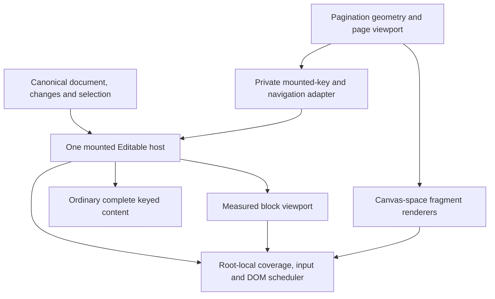

# Explicit DOM omission and large-document rendering

Status: **implementation complete; stable-snapshot closure pending**. The
dedicated entrypoints, mounted-view runtime and pagination-owned page window are
installed in production source. Final cross-browser recording must use one
unchanged checkout snapshot.

The durable target is one explicit omission permission, one native view owner,
and separate spatial owners for ordinary flow and paginated content. The most
valuable cut is to remove pagination's trip through the generic list virtualizer.
Keep its existing canvas coordinates instead of adding an offset-normalizing
public hook and another CSS marker.

The [Task plan](../../plans/2026-09-11-large-documents-api-review.md) owns scope,
readiness and execution order. The [research run](../../plite/research/2026-09-11-large-documents-contract/README.md)
contains source provenance, counterexamples and proof packets. The immutable
`2026-09-11-large-documents-rendering-design` record preserves the preceding
proposal; `2026-09-12-large-documents-deep-contract` records this reassessment.

## User jobs and hard laws

| Job | Required contract | Owning layer |
| --- | --- | --- |
| Edit an ordinary document, including a large one | Document size alone never removes its rendered content from the DOM | Plite React; inherited by Plate |
| Deliberately bound live DOM for a large editor | Explicit permission to omit offscreen content; honest limits for browser services | Editable view |
| Render pages and split layout units | Page layout owns coordinates, extent, visible pages and units | Pagination |
| Collapse an accordion or use an external text engine | Explicit feature boundary; independent of document-size optimization | Existing content boundary / external text owner |
| Edit across a missing range | Canonical selection and changes; target DOM committed before native editing needs it | Root-local input, coverage and scheduler |
| Copy, export, find or print the whole document | The actual service's content and fidelity contract, independent of mounted-count diagnostics | Clipboard, serialization/static rendering, search, browser/product |
| Show multiple views or roots | Coverage, focus and queued work belong to the exact mounted view | Existing Plite runtime/root owners |

No document-format migration is needed. Rendering must not change canonical
changes, persisted data, undo/history, collaboration identity or root selection.
Normal `readOnly` does not imply virtualization. A table fixture tests the
rendering contract; this task does not merge table, math, emoji or other Plate
feature redesigns.

Complete DOM means no **size- or viewport-driven** omission by this renderer.
It does not override an explicitly collapsed feature, external editor or custom
renderer. DOM presence alone does not certify browser Find, assistive technology,
rich HTML clipboard fidelity, native selection or print.

## What the deeper investigation changes

- Full-to-virtual currently replaces the actual Editable host and loses focus.
  Retaining the outer host alone is insufficient: virtual group keys also change
  with the window's endpoints, replacing overlapping child DOM.
- Pagination filters units even under `domStrategy="full"`. In the controlled
  400px package probe, its fragment hook went from 60 table units to one.
  The production example uses those fragments to omit children. All children
  stayed mounted in the probe itself; no native geometry claim follows.
- A mixed `model`/`exclude` selection copies the excluded text through the
  model-backed clipboard branch. The public exclusion promise is not composed
  correctly on that path. No fix is included in this planning work.
- Pagination already supplies visible page items. Bypassing their second
  projection preserved root keys and canvas extent in a disposable comparison
  at 100/1,000/10,000 pages. At 10,000 pages, the current repeated projection
  read page properties 20,014 times; the direct projection read two. This
  excludes page discovery, rendered geometry and native behavior.
- The actual build keeps TanStack as an external import of ordinary React.
  With that optional peer withheld, root import succeeds and React import
  fails. Ordinary React currently requires the dependency.
- Node server rendering at 10,000 short blocks emits 10,000 text nodes for full,
  32 for auto and 16 for a virtual request using staged fallback. Complete DOM
  has a real cold cost; the previous 100-block browser packet cannot settle it.

These observations replace the earlier public-coordinate rewrite, root marker,
root-only lifetime fix, unconditional shell/error decisions and broad assertion
that the existing copy policies were already sufficient.

## Accepted public calls

Ordinary rendering and virtualized rendering have distinct import and component
boundaries. This keeps the optional virtualizer out of ordinary React consumers
while retaining the same editor, root and renderer contracts.

```tsx
import { Editable, Plite } from 'plitejs/react';
import { VirtualizedEditable } from 'plitejs/react/virtualized';

<Plite editor={editor}>
  <Editable />
</Plite>;

<Plite editor={editor}>
  <VirtualizedEditable
    style={{ height: 480, overflowY: 'auto' }}
    renderElement={({ attributes, children }) => (
      <p {...attributes}>{children}</p>
    )}
  />
</Plite>;

<VirtualizedEditable estimatedBlockSize={48} overscan={4} />;
```

The final standalone line assumes the same surrounding Plite provider. Existing
refs, event callbacks, custom renderers and named-root inference retain their
current owners; the omission option does not supply a second editor generic.

```ts
export type VirtualizedEditableProps = EditableProps & {
  estimatedBlockSize?: number;
  overscan?: number;
};
```

- `Editable` prohibits renderer-owned size or viewport omission.
- Mounting `VirtualizedEditable` grants viewport omission for that exact view.
  The component choice is a lifetime boundary, not a mode to toggle on a
  mounted host. Viewport, measurement and retained-selection updates preserve
  the host and keyed active descendants.
- `estimatedBlockSize` is a positive finite CSS-pixel estimate for an unmeasured
  top-level block. It is not page height, a maximum block size or a correctness
  assertion. Omitted values are implementation estimates, not public constants.
- `overscan` is a nonnegative integer count of extra ordinary top-level blocks.
  Mandatory active/selection retention may exceed it. Zero cannot evict active
  composition or a focused external control.
- Reject invalid numeric configuration at the input boundary. A detached,
  hidden or temporarily zero-size scroll host is a lifecycle condition, not
  malformed application input.
- Delete the public document-size threshold. No public option may silently
  restore auto omission to the ordinary path.

Plate applications keep Plate imports:

```tsx
import { Plate } from 'platejs/react';
import { VirtualizedPlateContent } from 'platejs/react/virtualized';

<Plate editor={editor}>
  <VirtualizedPlateContent style={{ height: 480, overflowY: 'auto' }} />
</Plate>;
```

Pagination exposes the same permission as a boolean:

```tsx
import { PagedEditable } from 'platejs/pagination/react';

<PagedEditable layout={layout} virtualize />;
```

Raw pagination imports the same owner from `plitejs/pagination/react`. Existing
providers and renderers still surround this expression. Do not overload the
ordinary block-count `overscan` or block-size estimate with page/spread units.
Page window tuning stays private until measurement establishes an independent
caller job. The earlier proposed public pagination options object is withdrawn.

`PagedEditable` keeps a boolean because pagination owns its page window and does
not load the generic virtualizer. Omitted or false renders every page surface,
fragment and unit; true permits pagination to omit all three together.

## Responsibility and maximum-cut ledger

| Concept | Disposition | Surviving job and adoption proof |
| --- | --- | --- |
| Strategy enum, `auto`, `full`, `staged`, object `type`, public threshold | Cut | Ordinary view plus explicit omission permission; migrate every fixture/demo/benchmark spelling |
| Automatic segments, preview windows and ever-visited staged groups | Cut | No independent promised warmup job exists; preserve selection/copy through the shared coverage owner |
| Range-dependent virtual parent groups | Cut this identity scheme | Every retained native descendant needs a stable keyed parent; actual editor scroll/composition proof is mandatory |
| Generic measured block viewport | Retain behind the virtualized entrypoint | Unknown-height unpaginated flow uses TanStack measurement without loading it in ordinary React consumers |
| Pagination in generic TanStack plan | Cut | Pagination mounts its own visible and required page surfaces in the existing canvas coordinate frame |
| Public `DOMStrategyVirtualizedLayout` and page/top-level layout arrays | Cut exports | Private pagination-to-view adapter, with a single existing canvas coordinate frame |
| `useDOMStrategyVirtualOffset` | Cut with duplicate translation | Ordinary content does not need it; pagination keeps canvas rectangles |
| Proposed coordinate redefinition and `data-plite-virtualized` marker | Reject | They compensate for the duplicate projection; no independent current job remains in the preferred target |
| Public metrics callback and five mode/cohort/degradation types | Cut | Diagnostic fixtures use existing private proof handles; pagination behavior belongs to its layout owner |
| `nativeSurfaceComplete` as a browser capability certificate | Reject | Scope any private diagnostic to observable coverage facts; capability proof stays service-specific |
| `findPolicy` / find-policy type | Cut | Search belongs to actual model-search/native-browser owners, not rendering metadata |
| Copy policies | Retain `model` and `exclude` | Model-backed copying composes exclusions across mixed boundaries; no summary or renderer-specific copy mode survives |
| Selection policies and content boundaries | Retain jobs | Semantic hiding and external text remain independent current users with root-local registration and cleanup |
| `Plite`, `Editable`, `PlateContent`, named-root binding | Retain authority | Ordinary views remain complete; dedicated virtualized components reuse the same editor and named-root owners |
| `PagedEditable` and fragment reader | Retain independent job | Measured pages, split units and page coordinates cannot be replaced by a generic list alone |
| TanStack dependency | Isolate behind `plitejs/react/virtualized` and `platejs/react/virtualized` | Frozen P0/P4 bundle comparison measured 9,011 gzip bytes and 2.96% over the ordinary consumer, failing both 5 KiB and 2% limits |
| Async backend factory, public height/window store, virtualizer config passthrough | Reject | No current independent caller job offsets loading state, extra ownership or implementation leakage |
| Existing page scan and geometry caches | Defer optimization judgment | Measure surviving work after removing duplication; historical E20/E23 are not acceptance receipts |

The [reconciled manifest](../../plans/artifacts/large-documents-deep/owner-manifest.json)
accounts for 126 bounded rows: 100 declarations and 26 explicit shared blocks.
It has no missing dedicated declarations; 61 deletion rows and the complete
survivor/move/gate list are recorded there. These dispositions are not runtime
acceptance. The earlier manifest's virtual grouping and pagination normalization
choices are superseded. The [83-path census](../../plans/artifacts/large-documents-deep/consumer-paths.json)
contains 41 product, 32 proof, nine teaching and one generated match. This is a
bounded lexical adoption census, not an assertion that every match is public or
that external consumers were enumerated.

## Target ownership



This does not create a generic public renderer strategy. The private adapter
carries only facts needed by the existing host: mounted root keys/ranges,
materialization and owned navigation. It does not carry model truth, a second
selection, public page arrays or an independent global store.

Ordinary flow measurement belongs to the generic viewport backend. Page layout,
page/unit visibility, canvas extent and page navigation belong to pagination.
The common root owns native events, exact focus, composition, committed coverage
and the order of DOM work. Plate inherits these mechanics and keeps product UI.

## View lifetime and transitions

The host and every active descendant retain identity while the same view
survives. Stable keyed top-level rows avoid the former range-dependent parent
groups. Focus, composition, selection retention and requested materialization
can expand the mounted set without changing the view owner.

The private lifecycle distinguishes unattached, attached/complete, attached/
windowed, composing-with-deferred-change and disposed states. These are
implementation responsibilities, not five new public modes.

1. Canonical selection and structure choose required node identities. Retain
   composition and focused native descendants independently of the latest model
   selection. Remap identities through current canonical changes, not saved
   positional indexes alone.
2. Read layout through the owning DOM phase. Compute candidate mounted content
   without replacing the live input owner during render.
3. Commit children, refs and coverage together. An accepted materialization
   request becomes usable only after DOM resolution succeeds for that exact
   view and current target.
4. Export native selection and repair through the existing scheduler. Explicit
   navigation is the final scroll write; restoration cannot override it.
5. Cleanup retires observers, handlers, queued selection/scroll work and old
   coverage registrations. Disposing one view cannot clear a sibling view.

Within `PagedEditable`, a false/true `virtualize` transition cannot replace the
host, active text, composition, selection direction or scroll owner. During
composition defer structural changes through the native input owner's actual
completion boundary, including late mutations; `compositionend` alone is not
proof of committed text. After a remote deletion or root replacement, cancel
obsolete materialization and use existing canonical selection policy. Do not
retain an unbounded visited set.

## Initial render, suspended layout and failure

Default server/client rendering is complete. Explicit virtualization renders a
deterministic initial set: the leading eight top-level blocks plus selected and
requested roots. The same private planner supplies server and pre-measurement
client output, so hydration does not depend on viewport timing. The staged
engine is not retained as an SSR fallback.

Hidden, detached and temporarily zero-size hosts retain that bounded useful
surface until measurement is available. Selection and explicit materialization
can add deep targets immediately. An unbounded visible surface may legitimately
require all content; no permanent staged mode or public fallback taxonomy is
introduced.

A renderer exception uses the existing React error boundary. A stale or deleted
navigation target is cancelled by the owning runtime. No success boolean may
claim that missing DOM is available. Required composition content takes priority
over overscan and DOM-count targets.

## Native-service contract

| Service | Complete renderer | Explicit omission |
| --- | --- | --- |
| Native caret/input in mounted content | Existing native path; verify retained identity and follow-up input | Same requirement; omission never permits text loss |
| Expanded selection | Canonical model plus native projection | Canonical range may cross gaps; projected native selection is partial |
| Copy/paste/cut/drag | Existing serializer and DOM behavior | Model slices include selected content while mixed `exclude` boundaries remain excluded; plain text, HTML, fragment and follow-up editing have explicit oracles |
| Browser Find / accessibility traversal | DOM presence permits browser access, subject to feature hiding and platform behavior | No whole-document native guarantee; product chooses complete DOM or its actual alternative |
| Model search and navigation | Existing search and navigation owner | Resolve/materialize the result in the exact view before focus/scroll |
| Print / export | Existing static/serialization owner and actual browser print proof | Never export mounted `innerHTML` as the document; no automatic print parity claim |
| Huge single paragraph, giant table, external editor | Cost follows the real node/feature, not root count alone | Top-level virtualization does not solve an enormous mounted block |

Raw device IME/selection claims need real device receipts. Browser viewport
emulation, synthetic composition events, CodeMirror source and WPT crash tests
cannot provide them. Desktop clipboard tests must assert all applicable MIME
formats, direction, exact model range and subsequent editing.

## Alternatives that could change the choice

| Alternative | Judgment and strongest objection to the preferred target |
| --- | --- |
| Keep current modes/configure every application to full | Reject: caller discipline does not repair an unsafe default or duplicate ownership |
| Reduced full/virtual enum | Reject: retains a taxonomy without another user job |
| Dedicated virtual component or virtual subpath | Accept: makes dependency and mounted-view lifetime boundaries explicit; the package probe rejected the single-entrypoint cost |
| One Editable with async optional backend loading | Reject absent evidence: adds loading/error/hydration ownership to keep an optional dependency label |
| DOM-present containment only | Retain as a separate experiment for ordinary rendering, not a proven substitute for bounded DOM or universal CSS policy |
| Delete viewport rendering altogether | Reject as current target: explicit large-document stress and paginated window jobs exist. Native/service gaps keep those paths degraded until proved |
| Reuse generic virtual rows for pagination, normalize public coordinates | Reject in favor of direct canvas ownership: creates a second coordinate system and pushes compensation into custom renderers |
| Model-global virtualization extension/store | Reject: two simultaneous views can have different DOM coverage and scroll positions |

The frozen package comparison rejected the single-input design: the virtualizer
added 9,011 gzip bytes and 2.96% to the same minimal ordinary consumer. The
dedicated entrypoint is therefore the truthful package and lifetime boundary.

## Adoption and readiness

P0–P4 selected the dedicated package boundary, stable rows, direct page canvas
and deterministic initial window. S1–S6 install those decisions across Plite,
Plate, pagination, examples, browser recipes, benchmark targets, package
metadata, public teaching and immutable Plate Next doctrine history. The legacy
automatic/staged comparator remains only in exact transplant history.

S7 requires the final source-first, packed-package, benchmark and managed-browser
commands to finish against one unchanged snapshot. Raw physical-device IME and
selection, native Find UI, assistive-technology traversal and print remain
separate service claims; DOM presence and viewport emulation do not certify
them. Historical research, published review records and old evidence stay
immutable.
