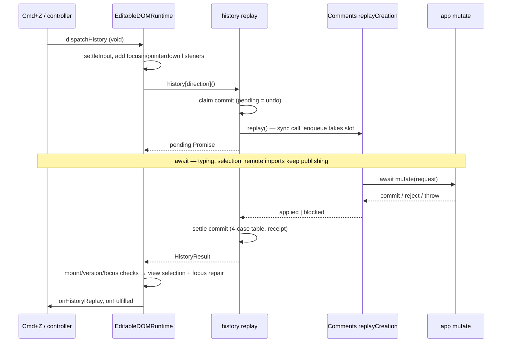

## Plite history replay: from `undo()` to Comments `mutate`

### Overview

`editor.api.history.undo()` and `redo()` both return `Promise<HistoryResult>`, but they run on two timelines. A **document batch** is applied inside the call, and the Promise is already resolved when it comes back. A **session batch** holds one effect-only `history: { replay }` effect, such as a Comments creation. For that batch, the call publishes a *claim* (pending state), hands the work to the effect's owner, and returns. When the owner finishes, a *settlement* commit places the entry using a four-case table.

Mounted UI never sees these Promises directly. Cmd+Z, `beforeinput` `historyUndo`, `useEditorHistory`, external text and the browser handle all call `EditableDOMRuntime.dispatchHistory`. That method consumes the Promise and repairs selection and focus only if nothing changed while the replay was in flight.

### Key concepts

- **Claim**: an annotation-only commit (`history.replay-claim`) that sets `pendingReplay` (`history-state.ts:608-635`). The claimed entry `S` stays at the branch head until settlement.
- **`PENDING_HISTORY_REPLAY_CLAIMS` / `PREPARED_HISTORY_REPLAYS`** (`history-plugin.ts:243-244`): side maps keyed by request number. Annotations are structured-cloned, so object identities can't travel inside them.
- **Edited flag / detach**: a commit that history records during the pending window marks the claim edited. For a redo, it also detaches `S` before the edit clears the redo branch (`history-state.ts:686-723`). It forces a new batch boundary (`history-plugin.ts:732,772`).
- **Receipt**: `{group, version}`, attached privately to the result object (`public-state.ts:763-772`). The mounted runtime uses it for focus repair.
- **`HISTORY_ACTIVATION`**: identifies the current activation. If history retires mid-replay, settlement into it is skipped (`history-plugin.ts:999-1003`).

### How it works

`replay` (`history-plugin.ts:1039-1060`) is **not** `async`:
- It throws if called inside a transaction (1042-1046).
- It returns `Promise.resolve(BUSY)` if a claim is pending (1047).
- Otherwise it peeks at the head entry. With no session effect it returns `Promise.resolve(applyReplay(direction))` (1057). With one it calls the `async replayNow` (1059).

`applyReplay` (871-923) runs a single `editor.update` (`applyHistoryAction` → `consumeHistoryBatch`). The transaction guard (1133-1171) reduces history, moves the entry and records the receipt. An authored conflict comes back as `blocked`.

`replayNow` (924-1037) runs synchronously up to its first `await`:
1. It registers the claim (963), commits the claim annotation (974-976), and the guard calls `beginHistoryReplay` (606-614).
2. It calls `sessionHistory.replay(editor, value)` (983).
3. After the `await`, depending on the owner's result, it does one of three things:
   - **Retired activation:** returns the owner's outcome and touches no history.
   - **Blocked:** commits a blocked settlement (1005-1012), which only clears pending.
   - **Applied:** commits the replayed effect under `runHistoricUpdate` plus an applied settlement (1015-1027). `settlePendingHistoryReplay` (`history-state.ts:725-847`) applies the table and maps the effects through remote journals queued during the wait (657-684, 770-780).

The Comments owner is `commentCreationHistoryEffect` (`BaseCommentsPlugin.ts:83-105`). It looks up `replayCreation` in a per-runtime registry (74-81, 985), or returns `blocked: comments-owner-unavailable`. `replayCreation` (816-917) does three things:
- It calls `enqueue(thread.id, …)` (726-748), which **synchronously** takes the per-thread queue slot (740).
- Inside the queued run, it checks the thread against `transition.previous` and `messageId`, then restores the anchor on redo.
- It calls `commitMutation` (749-811). That snapshots `previous` and the generation, runs `await store.get('mutate')(request)` (760), re-checks for staleness (774-781), validates the decision, then calls `setThread`.

Every failure, including a `mutate` throw, becomes a typed `blocked` result (902-911). So Comments never rejects history's Promise.

`replayHistory` (`editable-dom-runtime.ts:1016-1119`) runs in this order:
1. Flushes pending composition, Android and native text input through `settleInput` (993-1014), so the undo targets the right batch.
2. Records the current version and adds capture listeners.
3. Runs the replay, wrapped in `withUpdateTagContext` for `preserve`.
4. Reads `pending()` to learn whether a claim was published.
5. Awaits the result, then checks the receipt before calling `writePliteViewSelection` and `historyFocusHandler` (`runtime-root-engine.ts:229-248`).

`dispatchHistory` (1121-1151) forwards fulfilled results to `onHistoryReplay` and `onFulfilled`. Rejections go to `reportError`, or to a microtask rethrow if `reportError` is missing.

### Where things live

| Concern | File |
| --- | --- |
| API, claim, settle, guard | `packages/plitejs/src/history/history-plugin.ts` |
| Pending record, table | `packages/plitejs/src/history/history-state.ts` |
| `{ replay }` validation | `packages/plitejs/src/core/transaction-values.ts:23-30,87-98,151-155` |
| Mounted dispatcher | `packages/plitejs/src/react/editable/editable-dom-runtime.ts` |
| Initiators | `keyboard-input-strategy.ts:484-495,614-626,882-892`; `mutation-history.ts:8-61`; `use-plite-history.ts:155-210`; `external-text-runtime.ts:898-915`; `browser-handle.ts:748-756,902-910` |
| Comments owner | `packages/platejs/src/features/comments/BaseCommentsPlugin.ts` |
| Rationale | `docs/plans/2026-09-23-history-replay-lifecycle-revised.md` (F1-F10, rows 1-15), `docs/research/decisions/history-ownership.md:20-93` |

### Gotchas

These come from reading the source; I didn't run anything.

- **Stuck pending.** Only the owner's `await` has a try/catch (982-997). If `createEditorEffect` (structured clone of the owner's value) or either settle `editor.update` (1006, 1019) throws, `pendingReplay` is never cleared. `replaceHistoryState` keeps it (`history-state.ts:1121-1139`), so every later replay returns `busy` until history deactivates.
- **Listener leak.** The listeners are added at 1057-1062, but the `try/finally` that removes them starts at 1081. A synchronous throw from `history[direction]()` skips the removal.
- **The owner is called synchronously and still settles late.** A synchronous owner result still goes through the `await`, so a session replay is always two commits with settlement in a microtask.
- **The `preserve` tag context doesn't cover the settle commit.** `withUpdateTagContext` (`public-state.ts:2099-2120`) only wraps the synchronous call. Settlement is covered anyway, because `runHistoricUpdate` adds the same tags to effect-only batches (283-295), and the session batch must be effect-only (714-721).
- **`busy` refuses document undos too.** While a claim is pending, Cmd+Z returns `busy` even when the head is text typed during the wait.
- **`read.history.hasUndo()` stays true while pending**, because `S` remains at the head. The controller folds pending into `canUndo`; raw readers such as `document-state.tsx:137` don't.
- **Dead branches.** `replayNow`'s checks at 929-934 and 946-954 are unreachable, because `replay` already performs them synchronously.
- **Doc snippet.** `docs/plite/reference/public-docs/libraries/plite-history/history-plugin-setup.mdx:50` calls `undo()` without `await`.

---

**1. Document-only batch.** Yes, the document is mutated before `undo()` returns: `applyReplay` commits synchronously (`history-plugin.ts:887-896`, 1057). The Promise adds no timing guarantee. It gives one signature for both batch kinds (row 1), carries the `applied`/`empty`/`blocked` status, and defers the caller's continuation by one microtask.

**2. Session batch.** Before the first `await`:
- The claim commit publishes `pending()`; `S` stays at the head (974-976, 606-614).
- The claim map entry is deleted (978).
- The owner's `replay` is called (983). Comments takes its per-thread queue slot synchronously (`BaseCommentsPlugin.ts:740`).

After the `await`:
- The queued Comments run calls `await mutate` and `setThread`.
- History checks the activation, then commits a blocked or applied settlement.
- The table places `S`, remote mappings are applied to its effects, and the receipt is attached.

**3. Synchronous throws vs. rejections.** Thrown synchronously from `undo()`:
- the in-transaction guard (1042-1046);
- any document-path `applyReplay` error, apart from authored conflicts (897-908, 914-916);
- the guard's reduce errors inside that update (673-675, 688-690).

Rejected Promise: everything in `replayNow`. That covers a failed claim (608-610, 620-622), an owner throw (after the blocked settlement, 987-997), and failed settlement (737-747, or a clone or update failure at 1015-1027). Inside `replayHistory`, a synchronous throw also turns into a rejection, which `dispatchHistory` reports.

**4. Mounted work that exists only because of the `await`:**
- the focusin/pointerdown capture listeners and their removal (1049-1062, 1083-1094);
- the `pending` read after the call (1072-1078) and `expectedVersion = version + 1|2` (1099);
- the `connected` and root re-checks (1103-1104);
- `receipt.version === expectedVersion`, which rejects any commit made between claim and settlement (1106);
- `lastCommit === receipt.version`, which rejects any commit after settlement (1107-1108);
- the `.then/.catch`, `reportError` and microtask rethrow in `dispatchHistory` (1126-1150);
- the deferred browser-handle `forceRender` and refocus (`browser-handle.ts:749-756`).

For a document batch these are nearly redundant: only microtasks can run in that gap.

**5. What the guards protect.** `busy` enforces one replay at a time. A second request would claim the same head `S` again (a double `mutate`), or reach past it out of order. `beginHistoryReplay` has one slot and throws (620-622). A queued request would also outlive its call and lose its tag context (F4).

The table makes the final branches match "replayed at call time with the owner's eventual outcome" (checked over 1,684,893 sequences):
- **Undo applied after an edit:** `S` is dropped instead of reviving a redo the edit cleared.
- **Redo applied after an edit:** `S` is spliced above the claim-time undo head and below the edit (790-837). Pushing it on top would make the next Cmd+Z remove the comment instead of the typed text.
- **Blocked:** `S` stays as the next target under TaskHub-22, unless an edit already cleared it from redo.

**6. Non-test callers of `undo`/`redo`:**

| Call site | What it does with the Promise |
| --- | --- |
| `editable-dom-runtime.ts:1055` (the single mounted funnel; all initiators above reach it through `dispatchHistory`, which voids its own Promise) | awaits (1082) |
| `apps/www/src/registry/examples/collaboration-demo.tsx:794,810` | voids |
| `apps/www/src/app/(app)/examples/plite/_examples/yjs-collaboration.tsx:1168,1189` | voids, then reads state synchronously, relying on the document path |
| `.../_examples/yjs-hocuspocus.tsx:981,989` | voids, same reliance |
| `.../_examples/document-state.tsx:149,151,214,223` (`historyPortal.api`, which is `editor.plugin(HistoryPlugin)` at 97) | voids |
| `.../_examples/authored-changes.tsx:356,365` | returns it to `onClick`, so a rejection goes unhandled |