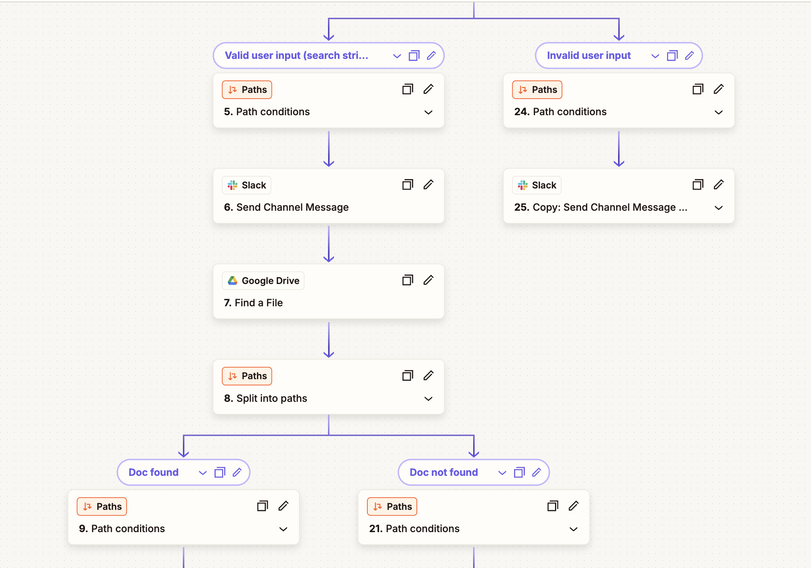

# Agentic Slack Redlining

Insert suggestions into a DOCX with SuperDoc + Slack + Zapier 

## Setup Instructions

1. Import `zap.json` into your Zapier account
2. Deploy the `cloud-function` directory to Google Cloud Platform with the required environment variables
3. **Configure the imported Zap** - After importing, you'll need to authenticate connections and configure trigger settings in Zapier

The Zap requires additional configuration after import to function properly.