# Plate Architecture Diagram

```mermaid
graph TB
    subgraph "Plate Rich Text Editor Framework"
        subgraph "Core Architecture"
            CORE["@platejs/core<br/>Plugin System & State Management"]
            SLATE["@platejs/slate<br/>Slate Extensions"]
            UTILS["@platejs/utils<br/>Shared Utilities"]
            TEST["@platejs/test-utils<br/>Testing Helpers"]
        end

        subgraph "Foundation Layer"
            SLATE_JS["Slate.js<br/>Base Editor Engine"]
            REACT["React 19.2.0<br/>UI Framework"]
            TYPESCRIPT["TypeScript 5.8.3<br/>Type Safety"]
        end

        subgraph "Plugin Ecosystem"
            subgraph "Basic Features"
                BASIC_NODES["@platejs/basic-nodes<br/>Paragraph, Headings"]
                BASIC_STYLES["@platejs/basic-styles<br/>Bold, Italic, Underline"]
                AUTOFORMAT["@platejs/autoformat<br/>Markdown Shortcuts"]
            end

            subgraph "Rich Content"
                LIST["@platejs/list<br/>Ordered/Unordered Lists"]
                TABLE["@platejs/table<br/>Tables with Operations"]
                CODE_BLOCK["@platejs/code-block<br/>Syntax Highlighting"]
                MEDIA["@platejs/media<br/>Images, Videos, Audio"]
                LINK["@platejs/link<br/>Link Management"]
                MENTION["@platejs/mention<br/>User Mentions"]
            end

            subgraph "Advanced Features"
                AI["@platejs/ai<br/>AI Integration"]
                COMMENT["@platejs/comment<br/>Comments System"]
                SUGGESTION["@platejs/suggestion<br/>Track Changes"]
                YJS["@platejs/yjs<br/>Real-time Collaboration"]
                MARKDOWN["@platejs/markdown<br/>Markdown Support"]
                DOCX["@platejs/docx<br/>Word Document Support"]
            end

            subgraph "UI & UX"
                FLOATING["@platejs/floating<br/>Floating UI"]
                COMBOBOX["@platejs/combobox<br/>Command Palette"]
                SLASH_COMMAND["@platejs/slash-command<br/>Slash Commands"]
                DND["@platejs/dnd<br/>Drag & Drop"]
                SELECTION["@platejs/selection<br/>Selection Management"]
            end

            subgraph "Developer Tools"
                CURSOR["@platejs/cursor<br/>Cursor Management"]
                DIFF["@platejs/diff<br/>Document Diffing"]
                PLAYWRIGHT["@platejs/playwright<br/>E2E Testing"]
            end
        end

        subgraph "Applications"
            WWW["apps/www<br/>Documentation Site"]
            PLAYGROUND["templates/plate-playground-template<br/>Full Featured Demo"]
            MINIMAL["templates/plate-template<br/>Minimal Setup"]
        end

        subgraph "Build & Development"
            TURBO["Turbo<br/>Monorepo Build System"]
            JEST["Jest<br/>Testing Framework"]
            ESLINT["ESLint<br/>Code Quality"]
            PRETTIER["Prettier<br/>Code Formatting"]
        end

        subgraph "External Integrations"
            SHADCN["shadcn/ui<br/>Component Library"]
            TAILWIND["Tailwind CSS<br/>Styling"]
            RADIX["Radix UI<br/>Headless Components"]
            OPENAI["OpenAI API<br/>AI Services"]
        end
    end

    %% Core Dependencies
    SLATE_JS --> SLATE
    REACT --> CORE
    TYPESCRIPT --> CORE
    SLATE --> CORE
    UTILS --> CORE
    TEST --> CORE

    %% Plugin Dependencies
    CORE --> BASIC_NODES
    CORE --> BASIC_STYLES
    CORE --> AUTOFORMAT
    CORE --> LIST
    CORE --> TABLE
    CORE --> CODE_BLOCK
    CORE --> MEDIA
    CORE --> LINK
    CORE --> MENTION
    CORE --> AI
    CORE --> COMMENT
    CORE --> SUGGESTION
    CORE --> YJS
    CORE --> MARKDOWN
    CORE --> DOCX
    CORE --> FLOATING
    CORE --> COMBOBOX
    CORE --> SLASH_COMMAND
    CORE --> DND
    CORE --> SELECTION
    CORE --> CURSOR
    CORE --> DIFF
    CORE --> PLAYWRIGHT

    %% Application Dependencies
    CORE --> WWW
    CORE --> PLAYGROUND
    CORE --> MINIMAL

    %% External Integrations
    SHADCN --> WWW
    SHADCN --> PLAYGROUND
    SHADCN --> MINIMAL
    TAILWIND --> WWW
    TAILWIND --> PLAYGROUND
    RADIX --> CORE
    OPENAI --> AI

    %% Build System
    TURBO --> CORE
    TURBO --> WWW
    TURBO --> PLAYGROUND
    TURBO --> MINIMAL
    JEST --> TEST
    ESLINT --> CORE
    PRETTIER --> CORE

    %% Styling
    classDef corePackage fill:#e1f5fe,stroke:#01579b,stroke-width:3px
    classDef pluginPackage fill:#f3e5f5,stroke:#4a148c,stroke-width:2px
    classDef appPackage fill:#e8f5e8,stroke:#1b5e20,stroke-width:2px
    classDef externalPackage fill:#fff3e0,stroke:#e65100,stroke-width:2px
    classDef buildPackage fill:#fce4ec,stroke:#880e4f,stroke-width:2px

    class CORE,SLATE,UTILS,TEST corePackage
    class BASIC_NODES,BASIC_STYLES,AUTOFORMAT,LIST,TABLE,CODE_BLOCK,MEDIA,LINK,MENTION,AI,COMMENT,SUGGESTION,YJS,MARKDOWN,DOCX,FLOATING,COMBOBOX,SLASH_COMMAND,DND,SELECTION,CURSOR,DIFF,PLAYWRIGHT pluginPackage
    class WWW,PLAYGROUND,MINIMAL appPackage
    class SHADCN,TAILWIND,RADIX,OPENAI externalPackage
    class TURBO,JEST,ESLINT,PRETTIER buildPackage
```

## Key Architecture Components

### Core Layer
- **@platejs/core**: The heart of Plate - plugin system, state management, and editor orchestration
- **@platejs/slate**: Extensions and utilities built on top of Slate.js
- **@platejs/utils**: Shared utilities and helper functions
- **@platejs/test-utils**: Testing utilities and helpers

### Plugin Ecosystem
The framework includes 30+ specialized plugins organized into categories:

**Basic Features**: Essential editing capabilities like text formatting and markdown shortcuts
**Rich Content**: Advanced content types like tables, media, and code blocks
**Advanced Features**: AI integration, collaboration, and document processing
**UI & UX**: User interface components and interaction patterns
**Developer Tools**: Testing, debugging, and development utilities

### Applications
- **Documentation Site**: Full-featured documentation with live examples
- **Playground Template**: Complete demo showcasing all features
- **Minimal Template**: Simple starting point for new projects

### Build System
- **Turbo**: Monorepo build orchestration
- **Jest**: Comprehensive testing framework
- **ESLint/Prettier**: Code quality and formatting
- **TypeScript**: Full type safety across the entire codebase

### External Integrations
- **shadcn/ui**: Modern component library integration
- **Tailwind CSS**: Utility-first styling
- **Radix UI**: Accessible headless components
- **OpenAI API**: AI-powered features

## Architecture Principles

1. **Plugin-First**: Everything is a plugin, enabling maximum flexibility
2. **Composable**: Mix and match plugins to build exactly what you need
3. **Type-Safe**: Full TypeScript support with excellent developer experience
4. **Modern**: Built on React 19, Slate.js, and modern web standards
5. **Extensible**: Easy to create custom plugins and integrations
6. **Performance**: Optimized for large documents and real-time collaboration
